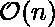

# 将中缀转换为前缀符号

> 原文:[https://www . geesforgeks . org/convert-infix-前缀-符号/](https://www.geeksforgeeks.org/convert-infix-prefix-notation/)

当我们在日常生活中使用中缀表达时。计算机很难理解这种格式，因为它们需要记住操作符优先和括号的规则。前缀和后缀表达式对计算机来说更容易理解和评估。
给定两个操作数和以及一个运算符，中缀符号意味着 O 将被置于 a 和 b 之间，即。当运算符放在两个操作数之后，即，称为后缀表示法。当运算符放在操作数之前时，即，前缀符号中的表达式。
给定任意中缀表达式，我们可以得到等价的前缀和后缀格式。

**示例:**

```
Input : A * B + C / D
Output : + * A B/ C D 

Input : (A - B/C) * (A/K-L)
Output : *-A/BC-/AKL
```

要将中缀转换为后缀表达式，请参考本文[堆栈|集合 2(中缀转换为后缀)](https://www.geeksforgeeks.org/stack-set-2-infix-to-postfix/)。我们用同样的方法把中缀转换成前缀。

*   第一步:反转中缀表达式，即 A+B*C 将变成 C*B+A。注意，反转时每个“(‘将变成’)”和每个“)”都变成“(”。
*   第二步:获得修饰表达式的“近”后缀表达式，即 CB*A+。
*   第三步:反转后缀表达式。因此，在我们的例子中，前缀是+A*BC。

请注意，对于步骤 2，我们不使用后缀算法。算法有一点小变化。根据[https://www.geeksforgeeks.org/stack-set-2-infix-to-postfix/](https://www.geeksforgeeks.org/stack-set-2-infix-to-postfix/)，我们必须从堆栈中弹出所有大于或等于的操作符，优先于扫描的操作符。但是在这里，我们必须从堆栈中弹出优先于扫描运算符的所有运算符**。仅在“^”运算符的情况下，我们从堆栈中弹出优先于或等于的运算符。**

**下面是算法的 C++实现。**

## **C++**

```
// CPP program to convert infix to prefix
#include <bits/stdc++.h>
using namespace std;

bool isOperator(char c)
{
    return (!isalpha(c) && !isdigit(c));
}

int getPriority(char C)
{
    if (C == '-' || C == '+')
        return 1;
    else if (C == '*' || C == '/')
        return 2;
    else if (C == '^')
        return 3;
    return 0;
}

string infixToPostfix(string infix)
{
    infix = '(' + infix + ')';
    int l = infix.size();
    stack<char> char_stack;
    string output;

    for (int i = 0; i < l; i++) {

        // If the scanned character is an
        // operand, add it to output.
        if (isalpha(infix[i]) || isdigit(infix[i]))
            output += infix[i];

        // If the scanned character is an
        // ‘(‘, push it to the stack.
        else if (infix[i] == '(')
            char_stack.push('(');

        // If the scanned character is an
        // ‘)’, pop and output from the stack
        // until an ‘(‘ is encountered.
        else if (infix[i] == ')') {
            while (char_stack.top() != '(') {
                output += char_stack.top();
                char_stack.pop();
            }

            // Remove '(' from the stack
            char_stack.pop();
        }

        // Operator found
        else
        {
            if (isOperator(char_stack.top()))
            {
                if(infix[i] == '^')
                {
                      while (getPriority(infix[i]) <= getPriority(char_stack.top()))
                       {
                         output += char_stack.top();
                         char_stack.pop();
                       }

                }
                else
                {
                    while (getPriority(infix[i]) < getPriority(char_stack.top()))
                       {
                         output += char_stack.top();
                         char_stack.pop();
                       }

                }

                // Push current Operator on stack
                char_stack.push(infix[i]);
            }
        }
    }
      while(!char_stack.empty()){
          output += char_stack.top();
        char_stack.pop();
    }
    return output;
}

string infixToPrefix(string infix)
{
    /* Reverse String
     * Replace ( with ) and vice versa
     * Get Postfix
     * Reverse Postfix  *  */
    int l = infix.size();

    // Reverse infix
    reverse(infix.begin(), infix.end());

    // Replace ( with ) and vice versa
    for (int i = 0; i < l; i++) {

        if (infix[i] == '(') {
            infix[i] = ')';
            i++;
        }
        else if (infix[i] == ')') {
            infix[i] = '(';
            i++;
        }
    }

    string prefix = infixToPostfix(infix);

    // Reverse postfix
    reverse(prefix.begin(), prefix.end());

    return prefix;
}

// Driver code
int main()
{
    string s = ("x+y*z/w+u");
    cout << infixToPrefix(s) << std::endl;
    return 0;
}
```

## **Java 语言(一种计算机语言，尤用于创建网站)**

```
// JAVA program to convert infix to prefix
import java.util.*;

class GFG
{
  static boolean isalpha(char c)
  {
    if (c >= 'a' && c <= 'z' || c >= 'A' && c <= 'Z')
    {
      return true;
    }
    return false;
  }

  static boolean isdigit(char c)
  {
    if (c >= '0' && c <= '9')
    {
      return true;
    }
    return false;
  }

  static boolean isOperator(char c)
  {
    return (!isalpha(c) && !isdigit(c));
  }

  static int getPriority(char C)
  {
    if (C == '-' || C == '+')
      return 1;
    else if (C == '*' || C == '/')
      return 2;
    else if (C == '^')
      return 3;

    return 0;
  }

  // Reverse the letters of the word
  static String reverse(char str[], int start, int end)
  {

    // Temporary variable to store character
    char temp;
    while (start < end)
    {

      // Swapping the first and last character
      temp = str[start];
      str[start] = str[end];
      str[end] = temp;
      start++;
      end--;
    }
    return String.valueOf(str);
  }

  static String infixToPostfix(char[] infix1)
  {
    System.out.println(infix1);
    String infix = '(' + String.valueOf(infix1) + ')';

    int l = infix.length();
    Stack<Character> char_stack = new Stack<>();
    String output="";

    for (int i = 0; i < l; i++)
    {

      // If the scanned character is an
      // operand, add it to output.
      if (isalpha(infix.charAt(i)) || isdigit(infix.charAt(i)))
        output += infix.charAt(i);

      // If the scanned character is an
      // ‘(‘, push it to the stack.
      else if (infix.charAt(i) == '(')
        char_stack.add('(');

      // If the scanned character is an
      // ‘)’, pop and output from the stack
      // until an ‘(‘ is encountered.
      else if (infix.charAt(i) == ')')
      {
        while (char_stack.peek() != '(')
        {
          output += char_stack.peek();
          char_stack.pop();
        }

        // Remove '(' from the stack
        char_stack.pop();
      }

      // Operator found
      else {
        if (isOperator(char_stack.peek()))
        {
          while ((getPriority(infix.charAt(i)) <
                  getPriority(char_stack.peek()))
                 || (getPriority(infix.charAt(i)) <=
                     getPriority(char_stack.peek())
                     && infix.charAt(i) == '^'))
          {
            output += char_stack.peek();
            char_stack.pop();
          }

          // Push current Operator on stack
          char_stack.add(infix.charAt(i));
        }
      }
    }
    while(!char_stack.empty()){
          output += char_stack.pop();
    }
    return output;
  }

  static String infixToPrefix(char[] infix)
  {
    /*
         * Reverse String Replace ( with ) and vice versa Get Postfix Reverse Postfix *
         */
    int l = infix.length;

    // Reverse infix
    String infix1 = reverse(infix, 0, l - 1);
    infix = infix1.toCharArray();

    // Replace ( with ) and vice versa
    for (int i = 0; i < l; i++)
    {

      if (infix[i] == '(')
      {
        infix[i] = ')';
        i++;
      }
      else if (infix[i] == ')')
      {
        infix[i] = '(';
        i++;
      }
    }

    String prefix = infixToPostfix(infix);

    // Reverse postfix
    prefix = reverse(prefix.toCharArray(), 0, l-1);

    return prefix;
  }

  // Driver code
  public static void main(String[] args)
  {
    String s = ("x+y*z/w+u");
    System.out.print(infixToPrefix(s.toCharArray()));
  }
}

// This code is contributed by Rajput-Ji
```

## **C#**

```
// C# program to convert infix to prefix
using System;
using System.Collections.Generic;

public class GFG {
  static bool isalpha(char c) {
    if (c >= 'a' && c <= 'z' || c >= 'A' && c <= 'Z') {
      return true;
    }
    return false;
  }

  static bool isdigit(char c) {
    if (c >= '0' && c <= '9') {
      return true;
    }
    return false;
  }

  static bool isOperator(char c) {
    return (!isalpha(c) && !isdigit(c));
  }

  static int getPriority(char C) {
    if (C == '-' || C == '+')
      return 1;
    else if (C == '*' || C == '/')
      return 2;
    else if (C == '^')
      return 3;

    return 0;
  }

  // Reverse the letters of the word
  static String reverse(char []str, int start, int end) {

    // Temporary variable to store character
    char temp;
    while (start < end) {

      // Swapping the first and last character
      temp = str[start];
      str[start] = str[end];
      str[end] = temp;
      start++;
      end--;
    }
    return String.Join("",str);
  }

  static String infixToPostfix(char[] infix1) {
    String infix = '(' + String.Join("",infix1) + ')';

    int l = infix.Length;
    Stack<char> char_stack = new Stack<char>();
    String output = "";

    for (int i = 0; i < l; i++) {

      // If the scanned character is an
      // operand, add it to output.
      if (isalpha(infix[i]) || isdigit(infix[i]))
        output += infix[i];

      // If the scanned character is an
      // ‘(‘, push it to the stack.
      else if (infix[i] == '(')
        char_stack.Push('(');

      // If the scanned character is an
      // ‘)’, pop and output from the stack
      // until an ‘(‘ is encountered.
      else if (infix[i] == ')') {
        while (char_stack.Peek() != '(') {
          output += char_stack.Peek();
          char_stack.Pop();
        }

        // Remove '(' from the stack
        char_stack.Pop();
      }

      // Operator found
      else {
        if (isOperator(char_stack.Peek())) {
          while ((getPriority(infix[i]) < getPriority(char_stack.Peek()))
                 || (getPriority(infix[i]) <= getPriority(char_stack.Peek())
                     && infix[i] == '^')) {
            output += char_stack.Peek();
            char_stack.Pop();
          }

          // Push current Operator on stack
          char_stack.Push(infix[i]);
        }
      }
    }
    while (char_stack.Count!=0) {
      output += char_stack.Pop();
    }
    return output;
  }

  static String infixToPrefix(char[] infix) {
    /*
         * Reverse String Replace ( with ) and
         // vice versa Get Postfix Reverse Postfix *
         */
    int l = infix.Length;

    // Reverse infix
    String infix1 = reverse(infix, 0, l - 1);
    infix = infix1.ToCharArray();

    // Replace ( with ) and vice versa
    for (int i = 0; i < l; i++) {

      if (infix[i] == '(') {
        infix[i] = ')';
        i++;
      } else if (infix[i] == ')') {
        infix[i] = '(';
        i++;
      }
    }

    String prefix = infixToPostfix(infix);

    // Reverse postfix
    prefix = reverse(prefix.ToCharArray(), 0, l - 1);

    return prefix;
  }

  // Driver code
  public static void Main(String[] args) {
    String s = ("x+y*z/w+u");
    Console.Write(infixToPrefix(s.ToCharArray()));
  }
}

// This code is contributed by gauravrajput1
```

****Output**

```
++x/*yzwu
```** 

*****时间复杂度:***
push()和 pop()等堆叠操作都是在恒定时间内执行的。因为一旦复杂度在时间上是线性的，即，我们就扫描表达式中的所有字符。**