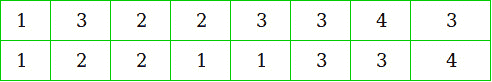
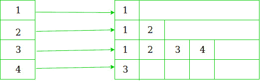
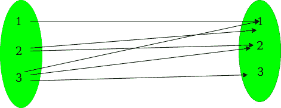
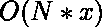

# 将多对多映射转换为最大一对一映射数

> 原文:[https://www . geeksforgeeks . org/convert-multi-to-multi-mappings-to-maximum-no-of-one-to-mappings/](https://www.geeksforgeeks.org/convert-many-to-many-mappings-to-maximum-no-of-one-to-one-mappings/)

给定一个包含来自 **1 的整数的数组 **arr1** ..N** 和另一个数组 **arr2** 包含来自 **1 的整数..M** 。 **arr1** 的每个元素映射到 **arr2** 中的多个元素。任务是最大化两个数组之间一对一映射的数量。

这里一对一映射意味着 **arr1** 的唯一元素必须映射到 **arr2** 的唯一元素。
映射以向量对的形式给出 **V** 其中 **V.first()** 表示 **arr1** 的元素， **V.second()** 表示 **arr2** 的元素。

**示例:**

```
Input:  N = 3, M = 3
        arr1[] = {1, 2, 3}
        arr2[] = {1, 2, 3}
        V = { {1, 1}, {2, 1}, {2, 2},
              {3, 1}, {3, 2}, {3, 3} }
Output: 3
Explanation: 
If we carefully see here mappings are 
              1 -------->  {1}
              2 -------->  {1, 2}
              3 -------->  {1, 2, 3}
so, maximum number of unique pairings
can be done as
              1 -------->  {1}
              2 -------->  {2}
              3 -------->  {3}

Input: N = 3, M = 1
        V = { {1, 1}, {2, 1}, {3, 1} };
Output: 1
Explanation: 
Either 1 can be mapped or 2 or 3.
so maximum one mapping is possible.

```

**进场:**这里使用的**进场**是[贪婪](https://www.geeksforgeeks.org/greedy-algorithms/)。
**预处理步骤**
我们被给定一个向量对，其以未排序的方式包含 eg-的映射信息

[](https://media.geeksforgeeks.org/wp-content/uploads/20190527204324/vector-of-pairs-mapping.jpg)

所以，我们把这个映射信息转换成集合的向量**映射**。
例如:
[](https://media.geeksforgeeks.org/wp-content/uploads/20190527222345/vector-of-sets-showing-mappings.jpg)

这是以一对多的映射形式表示信息。
这可以通过下图很容易理解

[](https://media.geeksforgeeks.org/wp-content/uploads/20190527202246/image-showing-one-to-one-mapings.jpg)

**步骤**:

1.  找到 arr1[]中与 arr2[]元素的映射数最少的元素。
2.  将此元素映射到其对应集合的第一个元素。
3.  删除此元素的所有映射。
4.  同时从 arr2[]中删除所有包含元素的映射，这些映射已经被映射。
5.  对 arr1[]的所有元素重复这四个步骤。

以下是上述方法的实现:

```
// C++ Program to convert many to many mapping
// to maximum no of one to one mappings

#include <bits/stdc++.h>
using namespace std;

// Returns the maximum number
// of one to one mappings between two arrays
int FindMax(vector<pair<int, int> >& V, int N, int M)
{
    int ans = 0;

    // Stores whether an element
    // from the first array is used in mapping
    bool* is_paired = new bool[N];

    // Contains mapping in sorted form
    vector<set<int> > mapping(N + 1);

    // Initialize all the elements
    // of first array unused
    memset(is_paired, sizeof(is_paired), false);

    // Insert mappings in sorted form
    for (int i = 0; i < V.size(); i++) {
        mapping[V[i].first].insert(V[i].second);
    }

    // While there is always at least one element
    // which can be mapped to a unique element
    while (true) {
        int lowest = -1;

        // Finds element to be mapped
        for (int i = 1; i <= N; i++) {

            // There is mapping possible
            if (mapping[i].size() > 0) {
                if (lowest == -1)
                    lowest = i;
                else if (mapping[i].size()
                         < mapping[lowest].size())
                    lowest = i;
            }
        }

        if (lowest == -1)
            break;

        // Element used in the mapping
        is_paired[lowest] = true;

        int remove = *mapping[lowest].begin();

        // Delete all the mappings of used element
        for (int i = 1; i <= N; i++) {

            mapping[i].erase(remove);
            if (i == lowest) {
                mapping[i].clear();
            }
        }
        ans++;
    }
    return ans;
}

// Main Function
int main()
{
    int N = 3;
    int M = 3;
    int arr1[] = { 1, 2, 3 };
    int arr2[] = { 1, 2, 3 };

    vector<pair<int, int> >
        V{ { 1, 1 }, { 2, 1 }, { 2, 2 }, { 3, 1 }, { 3, 2 }, { 3, 3 } };

    cout << FindMax(V, N, M) << endl;

    return 0;
}
```

**Output:**

```
3

```

**时间复杂度:** 其中 x 是最大值没有一对一映射。