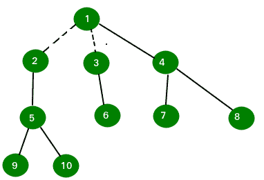

# 将一棵树转化为偶数节点的森林

> 原文:[https://www . geesforgeks . org/convert-tree-forest-even-nodes/](https://www.geeksforgeeks.org/convert-tree-forest-even-nodes/)

给定一个偶数节点的树。任务是找到要从给定树中移除的最大边数，以获得具有偶数个节点的树的森林。这个问题总是可以解决的，因为给定的图有偶数个节点。
**例:**

```
Input : n = 10
Edge 1: 1 3
Edge 2: 1 6
Edge 3: 1 2
Edge 4: 3 4
Edge 5: 6 8
Edge 6: 2 7
Edge 7: 2 5
Edge 8: 4 9
Edge 9: 4 10

Output : 2

By removing 2 edges we can obtain the forest with even node tree.
```



```
Dotted line shows removed edges. Any further removal of edge will not satisfy 
the even nodes condition.
```

找到一个节点数为偶数的子树，并通过移除连接它的边将其从树的其余部分中移除。移除后，我们只剩下偶数节点的树，因为最初我们在树中有偶数个节点，并且移除的子树也有偶数个节点。重复同样的过程，直到我们留下不能以这种方式进一步分解的树。
要做到这一点，思路是使用[深度优先搜索](https://www.geeksforgeeks.org/depth-first-traversal-for-a-graph/)遍历树。以这样的方式实现 DFS 函数，它将返回子树中的节点数，子树的根是执行 DFS 的节点。如果节点数为偶数，则移除边，否则忽略。
以下是本办法的实施情况:

## C++

```
// C++ program to find maximum number to be removed
// to convert a tree into forest containing trees of
// even number of nodes
#include<bits/stdc++.h>
#define N 12
using namespace std;

// Return the number of nodes of subtree having
// node as a root.
int dfs(vector<int> tree[N], int visit[N],
                      int *ans, int node)
{
    int num = 0, temp = 0;

    // Mark node as visited.
    visit[node] = 1;

    // Traverse the adjacency list to find non-
    // visited node.
    for (int i = 0; i < tree[node].size(); i++)
    {
        if (visit[tree[node][i]] == 0)
        {
            // Finding number of nodes of the subtree
            // of a subtree.
            temp = dfs(tree, visit, ans, tree[node][i]);

            // If nodes are even, increment number of
            // edges to removed.
            // Else leave the node as child of subtree.
            (temp%2)?(num += temp):((*ans)++);
        }
    }

    return num+1;
}

// Return the maximum number of edge to remove
// to make forest.
int minEdge(vector<int> tree[N], int n)
{
    int visit[n+2];
    int ans = 0;
    memset(visit, 0, sizeof visit);

    dfs(tree, visit, &ans, 1);

    return ans;
}

// Driven Program
int main()
{
    int n = 10;

    vector<int> tree[n+2];
    tree[1].push_back(3);
    tree[3].push_back(1);

    tree[1].push_back(6);
    tree[6].push_back(1);

    tree[1].push_back(2);
    tree[2].push_back(1);

    tree[3].push_back(4);
    tree[4].push_back(3);

    tree[6].push_back(8);
    tree[8].push_back(6);

    tree[2].push_back(7);
    tree[7].push_back(2);

    tree[2].push_back(5);
    tree[5].push_back(2);

    tree[4].push_back(9);
    tree[9].push_back(4);

    tree[4].push_back(10);
    tree[10].push_back(4);

    cout << minEdge(tree, n) << endl;
    return 0;
}
```

## Java 语言(一种计算机语言，尤用于创建网站)

```
// Java program to find maximum number to be removed
// to convert a tree into forest containing trees of
// even number of nodes
import java.util.*;

class GFG
{
    static int N = 12,ans;

    static Vector<Vector<Integer>> tree=new Vector<Vector<Integer>>();

    // Return the number of nodes of subtree having
    // node as a root.
    static int dfs( int visit[], int node)
    {
        int num = 0, temp = 0;

        // Mark node as visited.
        visit[node] = 1;

        // Traverse the adjacency list to find non-
        // visited node.
        for (int i = 0; i < tree.get(node).size(); i++)
        {
            if (visit[tree.get(node).get(i)] == 0)
            {
                // Finding number of nodes of the subtree
                // of a subtree.
                temp = dfs( visit, tree.get(node).get(i));

                // If nodes are even, increment number of
                // edges to removed.
                // Else leave the node as child of subtree.
                if(temp%2!=0)
                num += temp;
                else
                ans++;
            }
        }

        return num+1;
    }

    // Return the maximum number of edge to remove
    // to make forest.
    static int minEdge( int n)
    {
        int visit[] = new int[n+2];
        ans = 0;

        dfs( visit, 1);

        return ans;
    }

    // Driven Program
    public static void main(String args[])
    {
        int n = 10;

        //set the size of vector
        for(int i = 0; i < n + 2;i++)
        tree.add(new Vector<Integer>());

        tree.get(1).add(3);
        tree.get(3).add(1);

        tree.get(1).add(6);
        tree.get(6).add(1);

        tree.get(1).add(2);
        tree.get(2).add(1);

        tree.get(3).add(4);
        tree.get(4).add(3);

        tree.get(6).add(8);
        tree.get(8).add(6);

        tree.get(2).add(7);
        tree.get(7).add(2);

        tree.get(2).add(5);
        tree.get(5).add(2);

        tree.get(4).add(9);
        tree.get(9).add(4);

        tree.get(4).add(10);
        tree.get(10).add(4);

        System.out.println( minEdge( n));
    }
}

// This code is contributed by Arnab Kundu
```

## 蟒蛇 3

```
# Python3 program to find maximum
# number to be removed to convert
# a tree into forest containing trees
# of even number of nodes

# Return the number of nodes of 
# subtree having node as a root.
def dfs(tree, visit, ans, node):
    num = 0
    temp = 0

    # Mark node as visited.
    visit[node] = 1

    # Traverse the adjacency list 
    # to find non-visited node.
    for i in range(len(tree[node])):
        if (visit[tree[node][i]] == 0):

            # Finding number of nodes of
            # the subtree of a subtree.
            temp = dfs(tree, visit, ans,
                          tree[node][i])

            # If nodes are even, increment
            # number of edges to removed.
            # Else leave the node as child
            # of subtree.
            if(temp % 2):
                num += temp
            else:
                ans[0] += 1

    return num + 1

# Return the maximum number of
# edge to remove to make forest.
def minEdge(tree, n):
    visit = [0] * (n + 2)
    ans = [0]
    dfs(tree, visit, ans, 1)

    return ans[0]

# Driver Code
N = 12
n = 10

tree = [[] for i in range(n + 2)]
tree[1].append(3)
tree[3].append(1)

tree[1].append(6)
tree[6].append(1)

tree[1].append(2)
tree[2].append(1)

tree[3].append(4)
tree[4].append(3)

tree[6].append(8)
tree[8].append(6)

tree[2].append(7)
tree[7].append(2)

tree[2].append(5)
tree[5].append(2)

tree[4].append(9)
tree[9].append(4)

tree[4].append(10)
tree[10].append(4)

print(minEdge(tree, n))

# This code is contributed by pranchalK
```

## C#

```
// C# program to find maximum number
// to be removed to convert a tree into
// forest containing trees of even number of nodes
using System;
using System.Collections.Generic;

class GFG
{
    static int N = 12, ans;

    static List<List<int>> tree = new List<List<int>>();

    // Return the number of nodes of
    // subtree having node as a root.
    static int dfs(int []visit, int node)
    {
        int num = 0, temp = 0;

        // Mark node as visited.
        visit[node] = 1;

        // Traverse the adjacency list to
        // find non-visited node.
        for (int i = 0; i < tree[node].Count; i++)
        {
            if (visit[tree[node][i]] == 0)
            {
                // Finding number of nodes of the
                // subtree of a subtree.
                temp = dfs(visit, tree[node][i]);

                // If nodes are even, increment number of
                // edges to removed.
                // Else leave the node as child of subtree.
                if(temp % 2 != 0)
                    num += temp;
                else
                    ans++;
            }
        }
        return num + 1;
    }

    // Return the maximum number of edge
    // to remove to make forest.
    static int minEdge(int n)
    {
        int []visit = new int[n + 2];
        ans = 0;

        dfs(visit, 1);

        return ans;
    }

    // Driver Code
    public static void Main(String []args)
    {
        int n = 10;

        //set the size of vector
        for(int i = 0; i < n + 2;i++)
        tree.Add(new List<int>());

        tree[1].Add(3);
        tree[3].Add(1);

        tree[1].Add(6);
        tree[6].Add(1);

        tree[1].Add(2);
        tree[2].Add(1);

        tree[3].Add(4);
        tree[4].Add(3);

        tree[6].Add(8);
        tree[8].Add(6);

        tree[2].Add(7);
        tree[7].Add(2);

        tree[2].Add(5);
        tree[5].Add(2);

        tree[4].Add(9);
        tree[9].Add(4);

        tree[4].Add(10);
        tree[10].Add(4);

        Console.WriteLine(minEdge(n));
    }
}

// This code is contributed by Rajput-Ji
```

## java 描述语言

```
<script>

// JavaScript program to find maximum number
// to be removed to convert a tree into
// forest containing trees of even number of nodes
var N = 12, ans;

var tree = Array();

// Return the number of nodes of
// subtree having node as a root.
function dfs(visit, node)
{
    var num = 0, temp = 0;

    // Mark node as visited.
    visit[node] = 1;

    // Traverse the adjacency list to
    // find non-visited node.
    for (var i = 0; i < tree[node].length; i++)
    {
        if (visit[tree[node][i]] == 0)
        {
            // Finding number of nodes of the
            // subtree of a subtree.
            temp = dfs(visit, tree[node][i]);

            // If nodes are even, increment number of
            // edges to removed.
            // Else leave the node as child of subtree.
            if(temp % 2 != 0)
                num += temp;
            else
                ans++;
        }
    }
    return num + 1;
}

// Return the maximum number of edge
// to remove to make forest.
function minEdge(n)
{
    var visit = Array(n+2).fill(0);
    ans = 0;

    dfs(visit, 1);

    return ans;
}

// Driver Code
var n = 10;

//set the size of vector
for(var i = 0; i < n + 2;i++)
    tree.push(new Array());
tree[1].push(3);
tree[3].push(1);
tree[1].push(6);
tree[6].push(1);
tree[1].push(2);
tree[2].push(1);
tree[3].push(4);
tree[4].push(3);
tree[6].push(8);
tree[8].push(6);
tree[2].push(7);
tree[7].push(2);
tree[2].push(5);
tree[5].push(2);
tree[4].push(9);
tree[9].push(4);
tree[4].push(10);
tree[10].push(4);
document.write(minEdge(n));

</script>
```

**输出:**

```
2
```

**时间复杂度:** O(n)。
**参考:**
[http://stackoverflow . com/questions/12043252/获得偶数节点的树外森林](http://stackoverflow.com/questions/12043252/obtain-forest-out-of-tree-with-even-number-of-nodes)
本文由  供稿。如果你喜欢 GeeksforGeeks 并想投稿，你也可以使用[write.geeksforgeeks.org](https://write.geeksforgeeks.org)写一篇文章或者把你的文章邮寄到 review-team@geeksforgeeks.org。看到你的文章出现在极客博客主页上，帮助其他极客。
如果发现有不正确的地方，或者想分享更多关于上述话题的信息，请写评论。