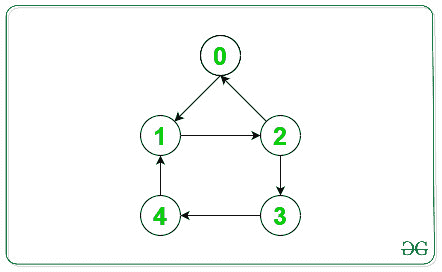

# 将无向连通图转换为强连通有向图

> 原文:[https://www . geesforgeks . org/convert-无向连通图-强连通图-有向图/](https://www.geeksforgeeks.org/convert-undirected-connected-graph-to-strongly-connected-directed-graph/)

给定一个由 **N** 个顶点和 **M** 条边组成的[无向图](https://www.geeksforgeeks.org/graph-data-structure-and-algorithms/)，任务是为给定的 M 条边指定方向，使该图成为[强连通分量](https://www.geeksforgeeks.org/strongly-connected-components/)。如果图形不能转换为强连接组件，则打印**-1”**。

**示例:**

> **输入:** N = 5，边[][] = { { 0，1 }，{ 0，2 }，{ 1，2 }，{ 1，4 }，{ 2，3 }，{ 3，4 } }
> **输出:**T5】0->1
> 2->0
> 4->1
> 3->4
> 2->3
> 1->2>
> 
> 
> 
> **输入:** N = 5，边[][] = { { 0，1 }，{ 0，2 }，{ 1，3 }，{ 2，3 }，{ 3，4 } }
> **输出:** -1
> **解释:**
> 下图为以上信息:
> 
> 
> 
> 因为在上面的无向图中存在一个桥。因此，此图无法转换为 SCCs。

**方法:**我们知道，在任何有向图中，如果图的所有顶点都是某个循环的一部分，则称其处于**强连通分支(SCCs)** 中。当且仅当[图中包含任何桥](https://www.geeksforgeeks.org/bridge-in-a-graph/)时，给定的无向图不形成 SCC。以下是步骤:

*   我们将使用数组**标记[]** 来存储 DFS 遍历期间的访问节点，**顺序[]** 来存储访问节点的索引号， **bridge_detect[]** 来存储给定图中存在的任何桥。
*   从顶点 **1** 开始 [DFS 遍历](https://www.geeksforgeeks.org/depth-first-search-or-dfs-for-a-graph/)。
*   遍历当前节点的[邻接表](https://www.geeksforgeeks.org/convert-adjacency-matrix-to-adjacency-list-representation-of-graph/)，并执行以下操作:
    *   如果在任何 DFS 调用时再次遍历任何边，则忽略这些边。
    *   如果子节点(**节点 u** )的顺序大于父节点(**节点 v** 的顺序，则忽略当前边，因为**边(v，u)** 已经被处理。
    *   如果找到任何后边缘，则将当前父节点(**节点 v** )的桥边缘更新为:

```
 bridge_detect[v] = min(order[u], bridge_detect[v]);
```

*   否则，对当前子节点执行 DFS 遍历，并对当前节点重复步骤 3。
*   将当前节点的 DFS 调用后检测到的网桥更新为:

```
bridge_detect[v] = min(bridge_detect[u], bridge_detect[v])
```

*   将当前的一对**边(v，u)** 存储为成对数组中从节点 v 到节点 u 的定向边(比如 **arr[][]** )。
*   如果给定图形中存在任何桥，则打印**-1”**。
*   否则打印存储在 **arr[][]** 中的定向边。

下面是上述方法的实现:

## C++

```
// C++ program for the above approach

#include <bits/stdc++.h>
using namespace std;

// To store the assigned Edges
vector<pair<int, int> > ans;

// Flag variable to check Bridges
int flag = 1;

// Function to implement DFS Traversal
int dfs(vector<int> adj[],
        int* order, int* bridge_detect,
        bool* mark, int v, int l)
{

    // Mark the current node as visited
    mark[v] = 1;

    // Update the order of node v
    order[v] = order[l] + 1;

    // Update the bridge_detect for node v
    bridge_detect[v] = order[v];

    // Traverse the adjacency list of
    // Node v
    for (int i = 0; i < adj[v].size(); i++) {
        int u = adj[v][i];

        // Ignores if same edge is traversed
        if (u == l) {
            continue;
        }

        // Ignores the edge u --> v as
        // v --> u is already processed
        if (order[v] < order[u]) {
            continue;
        }

        // Finds a back Edges, cycle present
        if (mark[u]) {

            // Update the bridge_detect[v]
            bridge_detect[v]
                = min(order[u],
                      bridge_detect[v]);
        }

        // Else DFS traversal for current
        // node in the adjacency list
        else {

            dfs(adj, order, bridge_detect,
                mark, u, v);
        }

        // Update the bridge_detect[v]
        bridge_detect[v]
            = min(bridge_detect[u],
                  bridge_detect[v]);

        // Store the current directed Edge
        ans.push_back(make_pair(v, u));
    }

    // Condition for Bridges
    if (bridge_detect[v] == order[v]
        && l != 0) {
        flag = 0;
    }

    // Return flag
    return flag;
}

// Function to print the direction
// of edges to make graph SCCs
void convert(vector<int> adj[], int n)
{

    // Arrays to store the visited,
    // bridge_detect and order of
    // Nodes
    int order[n] = { 0 };
    int bridge_detect[n] = { 0 };
    bool mark[n];

    // Initialise marks[] as false
    memset(mark, false, sizeof(mark));

    // DFS Traversal from vertex 1
    int flag = dfs(adj, order,
                   bridge_detect,
                   mark, 1, 0);

    // If flag is zero, then Bridge
    // is present in the graph
    if (flag == 0) {
        cout << "-1";
    }

    // Else print the direction of
    // Edges assigned
    else {
        for (auto& it : ans) {
            cout << it.first << "->"
                 << it.second << '\n';
        }
    }
}

// Function to create graph
void createGraph(int Edges[][2],
                 vector<int> adj[],
                 int M)
{

    // Traverse the Edges
    for (int i = 0; i < M; i++) {

        int u = Edges[i][0];
        int v = Edges[i][1];

        // Push the edges in an
        // adjacency list
        adj[u].push_back(v);
        adj[v].push_back(u);
    }
}

// Driver Code
int main()
{
    // N vertices and M Edges
    int N = 5, M = 6;
    int Edges[M][2]
        = { { 0, 1 }, { 0, 2 },
            { 1, 2 }, { 1, 4 },
            { 2, 3 }, { 3, 4 } };

    // To create Adjacency List
    vector<int> adj[N];

    // Create an undirected graph
    createGraph(Edges, adj, M);

    // Function Call
    convert(adj, N);
    return 0;
}
```

## Java 语言(一种计算机语言，尤用于创建网站)

```
// Java program for the above approach
import java.util.*;
import java.lang.*;

class GFG{

// To store the assigned Edges
static ArrayList<int[]> ans;

// Flag variable to check Bridges
static int flag = 1;

// Function to implement DFS Traversal
static int dfs(ArrayList<ArrayList<Integer>> adj,
               int[] order, int[] bridge_detect,
               boolean[] mark, int v, int l)
{

    // Mark the current node as visited
    mark[v] = true;

    // Update the order of node v
    order[v] = order[l] + 1;

    // Update the bridge_detect for node v
    bridge_detect[v] = order[v];

    // Traverse the adjacency list of
    // Node v
    for(int i = 0; i < adj.get(v).size(); i++)
    {
        int u = adj.get(v).get(i);

        // Ignores if same edge is traversed
        if (u == l)
        {
            continue;
        }

        // Ignores the edge u --> v as
        // v --> u is already processed
        if (order[v] < order[u])
        {
            continue;
        }

        // Finds a back Edges, cycle present
        if (mark[u])
        {

            // Update the bridge_detect[v]
            bridge_detect[v] = Math.min(order[u],
                                bridge_detect[v]);
        }

        // Else DFS traversal for current
        // node in the adjacency list
        else
        {
            dfs(adj, order, bridge_detect,
                mark, u, v);
        }

        // Update the bridge_detect[v]
        bridge_detect[v] = Math.min(bridge_detect[u],
                                    bridge_detect[v]);

        // Store the current directed Edge
        ans.add(new int[]{v, u});
    }

    // Condition for Bridges
    if (bridge_detect[v] == order[v] && l != 0)
    {
        flag = 0;
    }

    // Return flag
    return flag;
}

// Function to print the direction
// of edges to make graph SCCs
static void convert(ArrayList<ArrayList<Integer>> adj,
                    int n)
{

    // Arrays to store the visited,
    // bridge_detect and order of
    // Nodes
    int[] order = new int[n];
    int[] bridge_detect = new int[n];
    boolean mark[] = new boolean[n];

    // DFS Traversal from vertex 1
    int flag = dfs(adj, order,
                   bridge_detect,
                   mark, 1, 0);

    // If flag is zero, then Bridge
    // is present in the graph
    if (flag == 0)
    {
        System.out.print("-1");
    }

    // Else print the direction of
    // Edges assigned
    else
    {
        for(int[] it : ans)
        {
            System.out.println(it[0] + "->" +
                               it[1]);
        }
    }
}

// Function to create graph
static void createGraph(int Edges[][],
                        ArrayList<ArrayList<Integer>> adj,
                        int M)
{

    // Traverse the Edges
    for(int i = 0; i < M; i++)
    {
        int u = Edges[i][0];
        int v = Edges[i][1];

        // Push the edges in an
        // adjacency list
        adj.get(u).add(v);
        adj.get(v).add(u);
    }
}

// Driver code
public static void main(String[] args)
{

    // N vertices and M Edges
    int N = 5, M = 6;

    int Edges[][] = { { 0, 1 }, { 0, 2 },
                      { 1, 2 }, { 1, 4 },
                      { 2, 3 }, { 3, 4 } };

    // To create Adjacency List
    ArrayList<ArrayList<Integer>> adj = new ArrayList<>();
    ans = new ArrayList<>();

    for(int i = 0; i < N; i++)
        adj.add(new ArrayList<>());

    // Create an undirected graph
    createGraph(Edges, adj, M);

    // Function Call
    convert(adj, N);
}
}

// This code is contributed by offbeat
```

## 蟒蛇 3

```
# Python3 program for
# the above approach

# To store the assigned
# Edges
ans = []

# Flag variable to
# check Bridges
flag = 1;

# Function to implement
# DFS Traversal
def dfs(adj, order,
        bridge_detect,
        mark, v, l):

    global flag

    # Mark the current
    # node as visited
    mark[v] = 1;

    # Update the order of
    # node v
    order[v] = order[l] + 1;

    # Update the bridge_detect
    # for node v
    bridge_detect[v] = order[v];

    # Traverse the adjacency list of
    # Node v
    for i in range(len(adj[v])):       
        u = adj[v][i];

        # Ignores if same edge
        # is traversed
        if (u == l):
            continue;      

        # Ignores the edge u --> v as
        # v --> u is already processed
        if (order[v] < order[u]):
            continue;       

        # Finds a back Edges,
        # cycle present
        if (mark[u]):

            # Update the bridge_detect[v]
            bridge_detect[v] = min(order[u],
                                  bridge_detect[v]);

        # Else DFS traversal for current
        # node in the adjacency list
        else:

            dfs(adj, order,
                bridge_detect,
                mark, u, v);       

        # Update the bridge_detect[v]
        bridge_detect[v] = min(bridge_detect[u],
                              bridge_detect[v]);

        # Store the current
        # directed Edge
        ans.append([v, u]);

    # Condition for Bridges
    if (bridge_detect[v] ==
        order[v] and l != 0):
        flag = 0;

    # Return flag
    return flag;

# Function to print the
# direction of edges to
# make graph SCCs
def convert(adj, n):

    # Arrays to store the visited,
    # bridge_detect and order of
    # Nodes
    order = [0 for i in range(n)]
    bridge_detect = [0 for i in range(n)]
    mark = [False for i in range(n)]

    # DFS Traversal from
    # vertex 1
    flag = dfs(adj, order,
               bridge_detect,
               mark, 1, 0);

    # If flag is zero, then Bridge
    # is present in the graph
    if (flag == 0):
        print(-1)

    # Else print the direction
    # of Edges assigned
    else:
        for it in ans:
            print("{} -> {}".format(it[0],
                                    it[1]))

# Function to create graph
def createGraph(Edges,adj, M):

    # Traverse the Edges
    for i in range(M):

        u = Edges[i][0];
        v = Edges[i][1];

        # Push the edges in an
        # adjacency list
        adj[u].append(v);
        adj[v].append(u);

# Driver code
if __name__ == "__main__":

    # N vertices and M Edges
    N = 5
    M = 6;
    Edges = [[0, 1], [0, 2],
            [1, 2], [1, 4],
            [2, 3], [3, 4]];

    # To create Adjacency List
    adj = [[] for i in range(N)]

    # Create an undirected graph
    createGraph(Edges, adj, M);

    # Function Call
    convert(adj, N);

# This code is contributed by rutvik_56
```

## C#

```
// C# program for the above approach
using System;
using System.Collections;
using System.Collections.Generic;

class GFG{

// To store the assigned Edges
static ArrayList ans;

// Flag variable to check Bridges
static int flag = 1;

// Function to implement DFS Traversal
static int dfs(ArrayList adj,
               int[] order, int[] bridge_detect,
               bool[] mark, int v, int l)
{

    // Mark the current node as visited
    mark[v] = true;

    // Update the order of node v
    order[v] = order[l] + 1;

    // Update the bridge_detect for node v
    bridge_detect[v] = order[v];

    // Traverse the adjacency list of
    // Node v
    for(int i = 0;
            i < ((ArrayList)adj[v]).Count;
            i++)
    {
        int u = (int)((ArrayList)adj[v])[i];

        // Ignores if same edge is traversed
        if (u == l)
        {
            continue;
        }

        // Ignores the edge u --> v as
        // v --> u is already processed
        if (order[v] < order[u])
        {
            continue;
        }

        // Finds a back Edges, cycle present
        if (mark[u])
        {

            // Update the bridge_detect[v]
            bridge_detect[v] = Math.Min(order[u],
                                bridge_detect[v]);
        }

        // Else DFS traversal for current
        // node in the adjacency list
        else
        {
            dfs(adj, order, bridge_detect,
                mark, u, v);
        }

        // Update the bridge_detect[v]
        bridge_detect[v] = Math.Min(bridge_detect[u],
                                    bridge_detect[v]);

        // Store the current directed Edge
        ans.Add(new int[]{v, u});
    }

    // Condition for Bridges
    if (bridge_detect[v] == order[v] && l != 0)
    {
        flag = 0;
    }

    // Return flag
    return flag;
}

// Function to print the direction
// of edges to make graph SCCs
static void convert(ArrayList adj,
                    int n)
{

    // Arrays to store the visited,
    // bridge_detect and order of
    // Nodes
    int[] order = new int[n];
    int[] bridge_detect = new int[n];
    bool []mark = new bool[n];

    // DFS Traversal from vertex 1
    int flag = dfs(adj, order,
                   bridge_detect,
                   mark, 1, 0);

    // If flag is zero, then Bridge
    // is present in the graph
    if (flag == 0)
    {
        Console.Write("-1");
    }

    // Else print the direction of
    // Edges assigned
    else
    {
        foreach(int[] it in ans)
        {
            Console.WriteLine(it[0] + "->" +
                              it[1]);
        }
    }
}

// Function to create graph
static void createGraph(int [,]Edges,
                        ArrayList adj,
                        int M)
{

    // Traverse the Edges
    for(int i = 0; i < M; i++)
    {
        int u = Edges[i, 0];
        int v = Edges[i, 1];

        // Push the edges in an
        // adjacency list
        ((ArrayList)adj[u]).Add(v);
        ((ArrayList)adj[v]).Add(u);
    }
}

// Driver code
public static void Main(string[] args)
{

    // N vertices and M Edges
    int N = 5, M = 6;

    int [,]Edges = { { 0, 1 }, { 0, 2 },
                     { 1, 2 }, { 1, 4 },
                     { 2, 3 }, { 3, 4 } };

    // To create Adjacency List
    ArrayList adj = new ArrayList();
    ans = new ArrayList();

    for(int i = 0; i < N; i++)
        adj.Add(new ArrayList());

    // Create an undirected graph
    createGraph(Edges, adj, M);

    // Function Call
    convert(adj, N);
}
}

// This code is contributed by pratham76
```

## java 描述语言

```
<script>
    // Javascript program for the above approach

    // To store the assigned Edges
    let ans;

    // Flag variable to check Bridges
    let flag = 1;

    // Function to implement DFS Traversal
    function dfs(adj, order, bridge_detect, mark, v, l)
    {

        // Mark the current node as visited
        mark[v] = true;

        // Update the order of node v
        order[v] = order[l] + 1;

        // Update the bridge_detect for node v
        bridge_detect[v] = order[v];

        // Traverse the adjacency list of
        // Node v
        for(let i = 0; i < adj[v].length; i++)
        {
            let u = adj[v][i];

            // Ignores if same edge is traversed
            if (u == l)
            {
                continue;
            }

            // Ignores the edge u --> v as
            // v --> u is already processed
            if (order[v] < order[u])
            {
                continue;
            }

            // Finds a back Edges, cycle present
            if (mark[u])
            {

                // Update the bridge_detect[v]
                bridge_detect[v] = Math.min(order[u],
                                    bridge_detect[v]);
            }

            // Else DFS traversal for current
            // node in the adjacency list
            else
            {
                dfs(adj, order, bridge_detect, mark, u, v);
            }

            // Update the bridge_detect[v]
            bridge_detect[v] = Math.min(bridge_detect[u], bridge_detect[v]);

            // Store the current directed Edge
            ans.push([v, u]);
        }

        // Condition for Bridges
        if (bridge_detect[v] == order[v] && l != 0)
        {
            flag = 0;
        }

        // Return flag
        return flag;
    }

    // Function to print the direction
    // of edges to make graph SCCs
    function convert(adj, n)
    {

        // Arrays to store the visited,
        // bridge_detect and order of
        // Nodes
        let order = new Array(n);
        let bridge_detect = new Array(n);
        let mark = new Array(n);

        // DFS Traversal from vertex 1
        let flag = dfs(adj, order, bridge_detect, mark, 1, 0);

        // If flag is zero, then Bridge
        // is present in the graph
        if (flag == 0)
        {
            document.write("-1");
        }

        // Else print the direction of
        // Edges assigned
        else
        {
            for(let it = 0; it < ans.length - 1; it++)
            {
                document.write(ans[it][0] + "->" + ans[it][1] + "</br>");
            }
        }
    }

    // Function to create graph
    function createGraph(Edges, adj, M)
    {

        // Traverse the Edges
        for(let i = 0; i < M; i++)
        {
            let u = Edges[i][0];
            let v = Edges[i][1];

            // Push the edges in an
            // adjacency list
            adj[u].push(v);
            adj[v].push(u);
        }
    }

    // N vertices and M Edges
    let N = 5, M = 6;

    let Edges = [ [ 0, 1 ], [ 0, 2 ],
                     [ 1, 2 ], [ 1, 4 ],
                     [ 2, 3 ], [ 3, 4 ] ];

    // To create Adjacency List
    let adj = [];
    ans = [];

    for(let i = 0; i < N; i++)
        adj.push([]);

    // Create an undirected graph
    createGraph(Edges, adj, M);

    // Function Call
    convert(adj, N);

// This code is contributed by suresh07.
</script>
```

**Output:** 

```
0->1
2->0
4->1
3->4
2->3
1->2
```

**时间复杂度:**O(N)
T3】辅助空间: O(N)