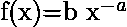
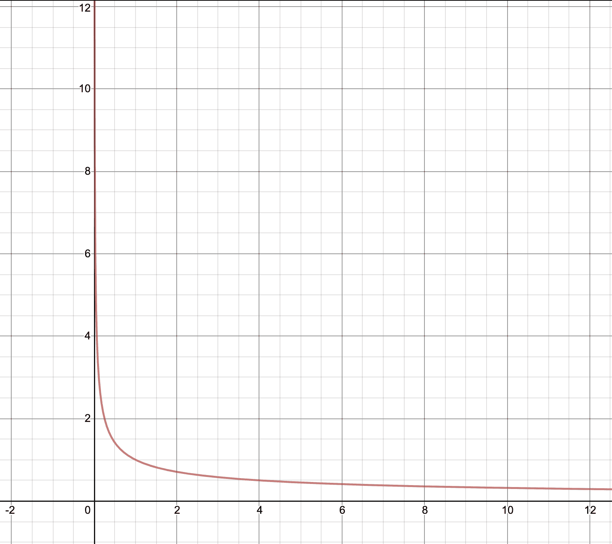
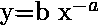
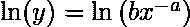
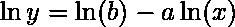
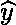
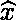
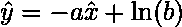
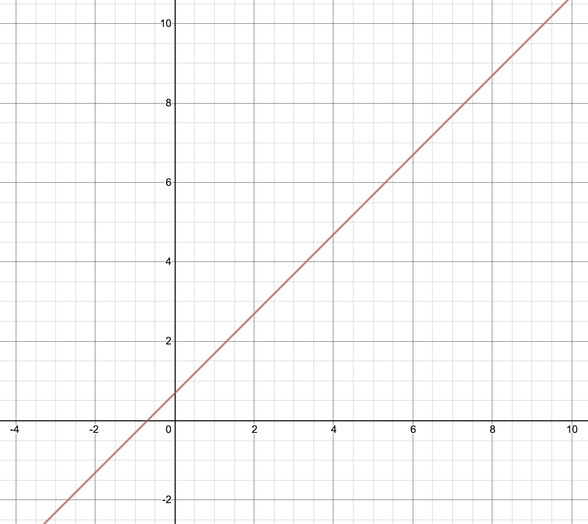

# 将幂律分布转换为线性图

> 原文:[https://www . geesforgeks . org/converting-power-law-distribution-to-a-linear-graph/](https://www.geeksforgeeks.org/converting-power-law-distribution-to-a-linear-graph/)

每当我们在 ML 项目上工作时，我们都必须处理数据集的高维度。这里有一个非常特殊的术语，即*维度诅咒*。虽然有很多方法可以解决这个问题，其中一个解决办法就是改变坐标系。从数据科学家的角度来看，这个解决方案有些有趣和新颖。
在进行模型训练时，我们试图消除假设的线性，以提高模型的准确性。但在本文中，我们试图理解如何轻松地可视化数据，并借助简单而创新的数学来理解它。

下面给出的是假设:

Power Law is a very important concept in statistics and gives information about two variables. And these two variables are relatively proportional to each other which means that the change in quantity of one variable will reflect the change in the quantity of other variables. One quantity varies as a power of another.
Now lets’s solve this equation with the help of natural logarithm (ln).

幂律图

使用对数属性

Now, lets assume ln(y) to be  and ln(x) to be . Substituting the values in the the equation above and then we have the equation.

幂律图中的线性图

So now, it is very evident that the hypothesis is now been converted to a linear equation. And this will make our task easy to analyse how the parameters are affecting each other.