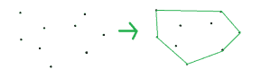

# 凸包|单调链算法

> 原文:[https://www . geesforgeks . org/凸包-单调-链-算法/](https://www.geeksforgeeks.org/convex-hull-monotone-chain-algorithm/)

给定一组点，任务是找到给定点的凸包。凸包是包含所有点的最小凸多边形。
请先查看这篇文章:[凸包|集合 1(贾维斯算法或包装)](https://www.geeksforgeeks.org/convex-hull-set-1-jarviss-algorithm-or-wrapping/)T3】



**示例:**

> **输入:**点[] = {{0，3}，{2，2}，{1，1}，{2，1}，{3，0}，{0，0}，{3，3}}
> **输出:**
> (0，0)
> (3，0)
> (3，3)
> (0，3)

**逼近:** [单调链算法](https://en.wikibooks.org/wiki/Algorithm_Implementation/Geometry/Convex_hull/Monotone_chain)在 **O(n * log(n))** 时间构造凸包。我们必须先对点进行排序，然后在 **O(n)** 时间内计算上下船体。这些点将根据 x 坐标进行排序(在 x 坐标相同的情况下，根据 y 坐标)，然后我们将找到最左边的点，然后尝试顺时针旋转并找到下一个点，然后重复该步骤，直到我们到达最右边的点，然后再次顺时针旋转并找到下船体。
以下是上述方法的实施:

## 卡片打印处理机（Card Print Processor 的缩写）

```
// C++ implementation of the approach
#include <bits/stdc++.h>
#define llu long long int
using namespace std;

struct Point {

    llu x, y;

    bool operator<(Point p)
    {
        return x < p.x || (x == p.x && y < p.y);
    }
};

// Cross product of two vectors OA and OB
// returns positive for counter clockwise
// turn and negative for clockwise turn
llu cross_product(Point O, Point A, Point B)
{
    return (A.x - O.x) * (B.y - O.y)
           - (A.y - O.y) * (B.x - O.x);
}

// Returns a list of points on the convex hull
// in counter-clockwise order
vector<Point> convex_hull(vector<Point> A)
{
    int n = A.size(), k = 0;

    if (n <= 3)
        return A;

    vector<Point> ans(2 * n);

    // Sort points lexicographically
    sort(A.begin(), A.end());

    // Build lower hull
    for (int i = 0; i < n; ++i) {

        // If the point at K-1 position is not a part
        // of hull as vector from ans[k-2] to ans[k-1] 
        // and ans[k-2] to A[i] has a clockwise turn
        while (k >= 2 && cross_product(ans[k - 2], 
                          ans[k - 1], A[i]) <= 0)
            k--;
        ans[k++] = A[i];
    }

    // Build upper hull
    for (size_t i = n - 1, t = k + 1; i > 0; --i) {

        // If the point at K-1 position is not a part
        // of hull as vector from ans[k-2] to ans[k-1] 
        // and ans[k-2] to A[i] has a clockwise turn
        while (k >= t && cross_product(ans[k - 2],
                           ans[k - 1], A[i - 1]) <= 0)
            k--;
        ans[k++] = A[i - 1];
    }

    // Resize the array to desired size
    ans.resize(k - 1);

    return ans;
}

// Driver code
int main()
{
    vector<Point> points;

    // Add points
    points.push_back({ 0, 3 });
    points.push_back({ 2, 2 });
    points.push_back({ 1, 1 });
    points.push_back({ 2, 1 });
    points.push_back({ 3, 0 });
    points.push_back({ 0, 0 });
    points.push_back({ 3, 3 });

    // Find the convex hull
    vector<Point> ans = convex_hull(points);

    // Print the convex hull
    for (int i = 0; i < ans.size(); i++)
        cout << "(" << ans[i].x << ", " 
             << ans[i].y << ")" << endl;

    return 0;
}
```

**Output:** 

```
(0, 0)
(3, 0)
(3, 3)
(0, 3)
```