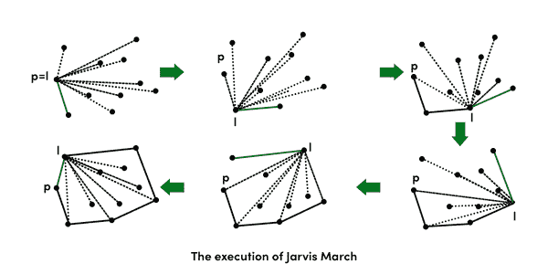

# 凸包|集合 1(贾维斯算法或包装)

> 原文:[https://www . geesforgeks . org/凸包-集合-1-jarviss-算法-或-包装/](https://www.geeksforgeeks.org/convex-hull-set-1-jarviss-algorithm-or-wrapping/)

给定平面上的一组点。集合的凸包是包含其所有点的最小凸多边形。


我们强烈建议先看看下面的帖子。
[如何检查给定的两条线段是否相交？](https://www.geeksforgeeks.org/check-if-two-given-line-segments-intersect/)
贾维斯算法的思想很简单，我们从最左边的点(或者 x 坐标值最小的点)开始，一直逆时针方向缠绕点。最大的问题是，给定一个点 p 作为当前点，如何在输出中找到下一个点？这里的思路是使用[方位()](https://www.geeksforgeeks.org/orientation-3-ordered-points/)。选择下一点作为逆时针方向上击败所有其他点的点，即下一点是 q 如果对于任何其他点 r，我们有“方向(p，q，r) =逆时针”。下面是详细的算法。
**1)** 将 p 初始化为最左侧点。
**2)** 当我们没有回到第一个(或最左边的)点时，做下面的事情。
….. **a)** 下一个点 q 是这样一个点，使得三元组(p，q，r)对于任何其他点 r 都是逆时针的。为了找到这一点，我们简单地将 q 初始化为下一个点，然后我们遍历所有的点。对于任意点 I，如果 I 更逆时针，即方向(p，I，q)是逆时针，那么我们将 q 更新为 I，我们的 q 的最终值将是最逆时针的点。
….. **b)** next[p] = q(将 q 作为 p 的下一个存储在输出凸包中)。
….. **c)** p = q(将 p 设置为 q 进行下一次迭代)。



下面是上述算法的实现。

## C++

```
// A C++ program to find convex hull of a set of points. Refer
// https://www.geeksforgeeks.org/orientation-3-ordered-points/
// for explanation of orientation()
#include <bits/stdc++.h>
using namespace std;

struct Point
{
    int x, y;
};

// To find orientation of ordered triplet (p, q, r).
// The function returns following values
// 0 --> p, q and r are collinear
// 1 --> Clockwise
// 2 --> Counterclockwise
int orientation(Point p, Point q, Point r)
{
    int val = (q.y - p.y) * (r.x - q.x) -
              (q.x - p.x) * (r.y - q.y);

    if (val == 0) return 0;  // collinear
    return (val > 0)? 1: 2; // clock or counterclock wise
}

// Prints convex hull of a set of n points.
void convexHull(Point points[], int n)
{
    // There must be at least 3 points
    if (n < 3) return;

    // Initialize Result
    vector<Point> hull;

    // Find the leftmost point
    int l = 0;
    for (int i = 1; i < n; i++)
        if (points[i].x < points[l].x)
            l = i;

    // Start from leftmost point, keep moving counterclockwise
    // until reach the start point again.  This loop runs O(h)
    // times where h is number of points in result or output.
    int p = l, q;
    do
    {
        // Add current point to result
        hull.push_back(points[p]);

        // Search for a point 'q' such that orientation(p, q,
        // x) is counterclockwise for all points 'x'. The idea
        // is to keep track of last visited most counterclock-
        // wise point in q. If any point 'i' is more counterclock-
        // wise than q, then update q.
        q = (p+1)%n;
        for (int i = 0; i < n; i++)
        {
           // If i is more counterclockwise than current q, then
           // update q
           if (orientation(points[p], points[i], points[q]) == 2)
               q = i;
        }

        // Now q is the most counterclockwise with respect to p
        // Set p as q for next iteration, so that q is added to
        // result 'hull'
        p = q;

    } while (p != l);  // While we don't come to first point

    // Print Result
    for (int i = 0; i < hull.size(); i++)
        cout << "(" << hull[i].x << ", "
              << hull[i].y << ")\n";
}

// Driver program to test above functions
int main()
{
    Point points[] = {{0, 3}, {2, 2}, {1, 1}, {2, 1},
                      {3, 0}, {0, 0}, {3, 3}};
    int n = sizeof(points)/sizeof(points[0]);
    convexHull(points, n);
    return 0;
}
```

## Java 语言(一种计算机语言，尤用于创建网站)

```
// Java program to find convex hull of a set of points. Refer
// https://www.geeksforgeeks.org/orientation-3-ordered-points/
// for explanation of orientation()
import java.util.*;

class Point
{
    int x, y;
    Point(int x, int y){
        this.x=x;
        this.y=y;
    }
}

class GFG {

    // To find orientation of ordered triplet (p, q, r).
    // The function returns following values
    // 0 --> p, q and r are collinear
    // 1 --> Clockwise
    // 2 --> Counterclockwise
    public static int orientation(Point p, Point q, Point r)
    {
        int val = (q.y - p.y) * (r.x - q.x) -
                  (q.x - p.x) * (r.y - q.y);

        if (val == 0) return 0;  // collinear
        return (val > 0)? 1: 2; // clock or counterclock wise
    }

    // Prints convex hull of a set of n points.
    public static void convexHull(Point points[], int n)
    {
        // There must be at least 3 points
        if (n < 3) return;

        // Initialize Result
        Vector<Point> hull = new Vector<Point>();

        // Find the leftmost point
        int l = 0;
        for (int i = 1; i < n; i++)
            if (points[i].x < points[l].x)
                l = i;

        // Start from leftmost point, keep moving
        // counterclockwise until reach the start point
        // again. This loop runs O(h) times where h is
        // number of points in result or output.
        int p = l, q;
        do
        {
            // Add current point to result
            hull.add(points[p]);

            // Search for a point 'q' such that
            // orientation(p, q, x) is counterclockwise
            // for all points 'x'. The idea is to keep
            // track of last visited most counterclock-
            // wise point in q. If any point 'i' is more
            // counterclock-wise than q, then update q.
            q = (p + 1) % n;

            for (int i = 0; i < n; i++)
            {
               // If i is more counterclockwise than
               // current q, then update q
               if (orientation(points[p], points[i], points[q])
                                                   == 2)
                   q = i;
            }

            // Now q is the most counterclockwise with
            // respect to p. Set p as q for next iteration,
            // so that q is added to result 'hull'
            p = q;

        } while (p != l);  // While we don't come to first
                           // point

        // Print Result
        for (Point temp : hull)
            System.out.println("(" + temp.x + ", " +
                                temp.y + ")");
    }

    /* Driver program to test above function */
    public static void main(String[] args)
    {

        Point points[] = new Point[7];
        points[0]=new Point(0, 3);
        points[1]=new Point(2, 3);
        points[2]=new Point(1, 1);
        points[3]=new Point(2, 1);
        points[4]=new Point(3, 0);
        points[5]=new Point(0, 0);
        points[6]=new Point(3, 3);

        int n = points.length;
        convexHull(points, n);

    }
}

// This code is contributed by Arnav Kr. Mandal.
```

## 蟒蛇 3

```
# C# program to find convex hull of a set of points. Refer
# https://www.geeksforgeeks.org/orientation-3-ordered-points/
# for explanation of orientation()

# point class with x, y as point
class Point:
    def __init__(self, x, y):
        self.x = x
        self.y = y

def Left_index(points):

    '''
    Finding the left most point
    '''
    minn = 0
    for i in range(1,len(points)):
        if points[i].x < points[minn].x:
            minn = i
        elif points[i].x == points[minn].x:
            if points[i].y > points[minn].y:
                minn = i
    return minn

def orientation(p, q, r):
    '''
    To find orientation of ordered triplet (p, q, r).
    The function returns following values
    0 --> p, q and r are collinear
    1 --> Clockwise
    2 --> Counterclockwise
    '''
    val = (q.y - p.y) * (r.x - q.x) - \
          (q.x - p.x) * (r.y - q.y)

    if val == 0:
        return 0
    elif val > 0:
        return 1
    else:
        return 2

def convexHull(points, n):

    # There must be at least 3 points
    if n < 3:
        return

    # Find the leftmost point
    l = Left_index(points)

    hull = []

    '''
    Start from leftmost point, keep moving counterclockwise
    until reach the start point again. This loop runs O(h)
    times where h is number of points in result or output.
    '''
    p = l
    q = 0
    while(True):

        # Add current point to result
        hull.append(p)

        '''
        Search for a point 'q' such that orientation(p, q,
        x) is counterclockwise for all points 'x'. The idea
        is to keep track of last visited most counterclock-
        wise point in q. If any point 'i' is more counterclock-
        wise than q, then update q.
        '''
        q = (p + 1) % n

        for i in range(n):

            # If i is more counterclockwise
            # than current q, then update q
            if(orientation(points[p],
                           points[i], points[q]) == 2):
                q = i

        '''
        Now q is the most counterclockwise with respect to p
        Set p as q for next iteration, so that q is added to
        result 'hull'
        '''
        p = q

        # While we don't come to first point
        if(p == l):
            break

    # Print Result
    for each in hull:
        print(points[each].x, points[each].y)

# Driver Code
points = []
points.append(Point(0, 3))
points.append(Point(2, 2))
points.append(Point(1, 1))
points.append(Point(2, 1))
points.append(Point(3, 0))
points.append(Point(0, 0))
points.append(Point(3, 3))

convexHull(points, len(points))

# This code is contributed by
# Akarsh Somani, IIIT Kalyani
```

## C#

```
// C# program to find convex hull of a set of points. Refer
// https://www.geeksforgeeks.org/orientation-3-ordered-points/
// for explanation of orientation()
using System;
using System.Collections.Generic;

public class Point
{
    public int x, y;
    public Point(int x, int y)
    {
        this.x = x;
        this.y = y;
    }
}

public class GFG
{

    // To find orientation of ordered triplet (p, q, r).
    // The function returns following values
    // 0 --> p, q and r are collinear
    // 1 --> Clockwise
    // 2 --> Counterclockwise
    public static int orientation(Point p, Point q, Point r)
    {
        int val = (q.y - p.y) * (r.x - q.x) -
                (q.x - p.x) * (r.y - q.y);

        if (val == 0) return 0; // collinear
        return (val > 0)? 1: 2; // clock or counterclock wise
    }

    // Prints convex hull of a set of n points.
    public static void convexHull(Point []points, int n)
    {
        // There must be at least 3 points
        if (n < 3) return;

        // Initialize Result
        List<Point> hull = new List<Point>();

        // Find the leftmost point
        int l = 0;
        for (int i = 1; i < n; i++)
            if (points[i].x < points[l].x)
                l = i;

        // Start from leftmost point, keep moving
        // counterclockwise until reach the start point
        // again. This loop runs O(h) times where h is
        // number of points in result or output.
        int p = l, q;
        do
        {
            // Add current point to result
            hull.Add(points[p]);

            // Search for a point 'q' such that
            // orientation(p, q, x) is counterclockwise
            // for all points 'x'. The idea is to keep
            // track of last visited most counterclock-
            // wise point in q. If any point 'i' is more
            // counterclock-wise than q, then update q.
            q = (p + 1) % n;

            for (int i = 0; i < n; i++)
            {
            // If i is more counterclockwise than
            // current q, then update q
            if (orientation(points[p], points[i], points[q])
                                                == 2)
                q = i;
            }

            // Now q is the most counterclockwise with
            // respect to p. Set p as q for next iteration,
            // so that q is added to result 'hull'
            p = q;

        } while (p != l); // While we don't come to first
                        // point

        // Print Result
        foreach (Point temp in hull)
            Console.WriteLine("(" + temp.x + ", " +
                                temp.y + ")");
    }

    /* Driver code */
    public static void Main(String[] args)
    {

        Point []points = new Point[7];
        points[0]=new Point(0, 3);
        points[1]=new Point(2, 3);
        points[2]=new Point(1, 1);
        points[3]=new Point(2, 1);
        points[4]=new Point(3, 0);
        points[5]=new Point(0, 0);
        points[6]=new Point(3, 3);

        int n = points.Length;
        convexHull(points, n);

    }
}

// This code is contributed by Princi Singh
```

## java 描述语言

```
<script>
// Javascript program to find convex hull of a set of points. Refer
// https://www.geeksforgeeks.org/orientation-3-ordered-points/
// for explanation of orientation()

class Point
{
    constructor(x, y)
    {
        this.x = x;
        this.y = y;
    }
}

// To find orientation of ordered triplet (p, q, r).
    // The function returns following values
    // 0 --> p, q and r are collinear
    // 1 --> Clockwise
    // 2 --> Counterclockwise
function orientation(p, q, r)
{
    let val = (q.y - p.y) * (r.x - q.x) -
                  (q.x - p.x) * (r.y - q.y);

        if (val == 0) return 0;  // collinear
        return (val > 0)? 1: 2; // clock or counterclock wise
}

// Prints convex hull of a set of n points.
function convexHull(points, n)
{
    // There must be at least 3 points
        if (n < 3) return;

        // Initialize Result
        let hull = [];

        // Find the leftmost point
        let l = 0;
        for (let i = 1; i < n; i++)
            if (points[i].x < points[l].x)
                l = i;

        // Start from leftmost point, keep moving
        // counterclockwise until reach the start point
        // again. This loop runs O(h) times where h is
        // number of points in result or output.
        let p = l, q;
        do
        {

            // Add current point to result
            hull.push(points[p]);

            // Search for a point 'q' such that
            // orientation(p, q, x) is counterclockwise
            // for all points 'x'. The idea is to keep
            // track of last visited most counterclock-
            // wise point in q. If any point 'i' is more
            // counterclock-wise than q, then update q.
            q = (p + 1) % n;

            for (let i = 0; i < n; i++)
            {
               // If i is more counterclockwise than
               // current q, then update q
               if (orientation(points[p], points[i], points[q])
                                                   == 2)
                   q = i;
            }

            // Now q is the most counterclockwise with
            // respect to p. Set p as q for next iteration,
            // so that q is added to result 'hull'
            p = q;

        } while (p != l);  // While we don't come to first
                           // point

        // Print Result
        for (let temp of hull.values())
            document.write("(" + temp.x + ", " +
                                temp.y + ")<br>");
}

/* Driver program to test above function */
let points = new Array(7);
points[0] = new Point(0, 3);
points[1] = new Point(2, 3);
points[2] = new Point(1, 1);
points[3] = new Point(2, 1);
points[4] = new Point(3, 0);
points[5] = new Point(0, 0);
points[6] = new Point(3, 3);

let n = points.length;
convexHull(points, n);

// This code is contributed by avanitrachhadiya2155
</script>
```

**输出:**输出是凸包的点。

```
(0, 3)
(0, 0)
(3, 0)
(3, 3)
```

**注**:当凸包中存在共线点时，上述代码对于不同顺序的输入可能会产生不同的结果。例如，对于输入(0，3)，(0，0)，(3，0)，(0，0)，(0，1)，(3，0)，(3，3)它产生输出为(0，3) (0，1) (0，0) (3，0) (3，0) (3，0) (3，3)对于输入为(0，3)，(0，1)，(0，0)，(3，0)，(3，3)，我们一般在共线的情况下需要最远的下一点，在共线的情况下我们可以通过多加一个 if 条件得到想要的结果。请参考[本](https://ide.geeksforgeeks.org/DJv3OTRcgJ)修改代码。
**时间复杂度:**对于船体上的每个点，我们检查所有其他点来确定下一个点。时间复杂度是？(m * n)其中 n 为输入点数，m 为输出或船体点数(m < = n)。最坏的情况下，时间复杂度为 O(n <sup>2</sup> )。最糟糕的情况发生在所有的点都在船体上的时候(m = n)
[Set 2-凸包(Graham Scan)](https://www.geeksforgeeks.org/convex-hull-set-2-graham-scan/)
**来源:**
[http://www . cs . uiuc . edu/~ jeffe/teaching/373/notes/x05-凸包. pdf](http://www.cs.uiuc.edu/~jeffe/teaching/373/notes/x05-convexhull.pdf)
[http://www.dcs.gla.ac.uk/~pat/52233/slides/Hull1x1.pdf](http://www.dcs.gla.ac.uk/~pat/52233/slides/Hull1x1.pdf)
如果发现有不正确的地方，或者想分享更多的话题信息，请写评论