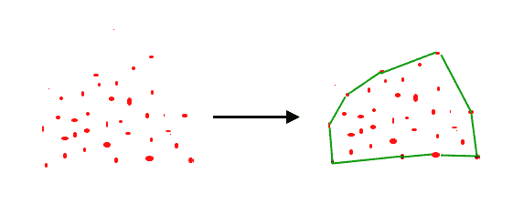

# 凸包|第 2 集(格雷厄姆扫描)

> 原文:[https://www . geesforgeks . org/凸包-set-2-graham-scan/](https://www.geeksforgeeks.org/convex-hull-set-2-graham-scan/)

给定平面上的一组点。集合的凸包是包含其所有点的最小凸多边形。



我们强烈建议先看看下面的帖子。
[如何检查给定的两条线段是否相交？](https://www.geeksforgeeks.org/check-if-two-given-line-segments-intersect/)
我们已经讨论了[贾维斯的凸包算法](https://www.geeksforgeeks.org/convex-hull-set-1-jarviss-algorithm-or-wrapping/)。贾维斯算法最差的时间复杂度是 O(n^2).利用格雷厄姆的扫描算法，我们可以在 O(nLogn)时间内找到凸包。以下是格雷厄姆的算法
让点数【0..n-1]是输入数组。
**1)** 通过比较所有点的 y 坐标找到最底部的点。如果有两个点具有相同的 y 值，则考虑 x 坐标值较小的点。设最底点为 P0。将 P0 放在输出外壳的第一个位置。
**2)** 考虑剩余的 n-1 个点，围绕点[0]按极角逆时针排序。如果两点的极角相同，那么先放最近的点。
**3** 排序后，检查两个或两个以上的点是否有相同的角度。如果两个以上的点具有相同的角度，则移除除离 P0 最远的点之外的所有相同角度的点。让新数组的大小为 m.
**4)** 如果 m 小于 3，则返回(凸包不可能)
**5)** 创建一个空堆栈‘S’并将点[0]、点[1]和点[2]推送给 S.
**6)** 逐个处理剩余的 m-3 个点。对每一个点'点[i]'
**4.1)** 继续从堆栈中移除点，同时以下三个点的[方向](https://www.geeksforgeeks.org/orientation-3-ordered-points/)不是逆时针方向(或者它们不左转)。
a)堆栈中紧挨着顶部的点
b)堆栈顶部的点
c)点【I】
**4.2)**将点【I】推送到 S
**5)** 打印 S
的内容上述算法可以分为两个阶段。
**第一阶段(排序点):**我们首先找到最底部的点。这个想法是对点进行预处理，根据最底部的点对它们进行排序。一旦点被排序，它们就形成了一个简单的闭合路径(见下图)。


排序标准应该是什么？实际角度的计算将是低效的，因为三角函数的计算并不简单。想法是使用方向来比较角度，而不实际计算它们(参见下面的 compare()函数)
**阶段 2(接受或拒绝点):**一旦我们有了闭合路径，下一步是遍历路径并移除该路径上的凹点。如何决定去掉哪个点，保留哪个点？同样，[定位](https://www.geeksforgeeks.org/orientation-3-ordered-points/)在这里有所帮助。排序数组中的前两点总是凸包的一部分。对于剩余的点，我们跟踪最近的三个点，并找到它们形成的角度。让这三个点分别是 prev(p)、curr(c)和 next(n)。如果这些点的方向(按同样的顺序考虑)不是逆时针方向，我们丢弃 c，否则我们保留它。下图显示了该阶段的分步过程。


下面是上述算法的 C++实现。

## 卡片打印处理机（Card Print Processor 的缩写）

```
// A C++ program to find convex hull of a set of points. Refer
// https://www.geeksforgeeks.org/orientation-3-ordered-points/
// for explanation of orientation()
#include <iostream>
#include <stack>
#include <stdlib.h>
using namespace std;

struct Point
{
    int x, y;
};

// A global point needed for  sorting points with reference
// to  the first point Used in compare function of qsort()
Point p0;

// A utility function to find next to top in a stack
Point nextToTop(stack<Point> &S)
{
    Point p = S.top();
    S.pop();
    Point res = S.top();
    S.push(p);
    return res;
}

// A utility function to swap two points
void swap(Point &p1, Point &p2)
{
    Point temp = p1;
    p1 = p2;
    p2 = temp;
}

// A utility function to return square of distance
// between p1 and p2
int distSq(Point p1, Point p2)
{
    return (p1.x - p2.x)*(p1.x - p2.x) +
          (p1.y - p2.y)*(p1.y - p2.y);
}

// To find orientation of ordered triplet (p, q, r).
// The function returns following values
// 0 --> p, q and r are collinear
// 1 --> Clockwise
// 2 --> Counterclockwise
int orientation(Point p, Point q, Point r)
{
    int val = (q.y - p.y) * (r.x - q.x) -
              (q.x - p.x) * (r.y - q.y);

    if (val == 0) return 0;  // collinear
    return (val > 0)? 1: 2; // clock or counterclock wise
}

// A function used by library function qsort() to sort an array of
// points with respect to the first point
int compare(const void *vp1, const void *vp2)
{
   Point *p1 = (Point *)vp1;
   Point *p2 = (Point *)vp2;

   // Find orientation
   int o = orientation(p0, *p1, *p2);
   if (o == 0)
     return (distSq(p0, *p2) >= distSq(p0, *p1))? -1 : 1;

   return (o == 2)? -1: 1;
}

// Prints convex hull of a set of n points.
void convexHull(Point points[], int n)
{
   // Find the bottommost point
   int ymin = points[0].y, min = 0;
   for (int i = 1; i < n; i++)
   {
     int y = points[i].y;

     // Pick the bottom-most or chose the left
     // most point in case of tie
     if ((y < ymin) || (ymin == y &&
         points[i].x < points[min].x))
        ymin = points[i].y, min = i;
   }

   // Place the bottom-most point at first position
   swap(points[0], points[min]);

   // Sort n-1 points with respect to the first point.
   // A point p1 comes before p2 in sorted output if p2
   // has larger polar angle (in counterclockwise
   // direction) than p1
   p0 = points[0];
   qsort(&points[1], n-1, sizeof(Point), compare);

   // If two or more points make same angle with p0,
   // Remove all but the one that is farthest from p0
   // Remember that, in above sorting, our criteria was
   // to keep the farthest point at the end when more than
   // one points have same angle.
   int m = 1; // Initialize size of modified array
   for (int i=1; i<n; i++)
   {
       // Keep removing i while angle of i and i+1 is same
       // with respect to p0
       while (i < n-1 && orientation(p0, points[i],
                                    points[i+1]) == 0)
          i++;

       points[m] = points[i];
       m++;  // Update size of modified array
   }

   // If modified array of points has less than 3 points,
   // convex hull is not possible
   if (m < 3) return;

   // Create an empty stack and push first three points
   // to it.
   stack<Point> S;
   S.push(points[0]);
   S.push(points[1]);
   S.push(points[2]);

   // Process remaining n-3 points
   for (int i = 3; i < m; i++)
   {
      // Keep removing top while the angle formed by
      // points next-to-top, top, and points[i] makes
      // a non-left turn
      while (S.size()>1 && orientation(nextToTop(S), S.top(), points[i]) != 2)
         S.pop();
      S.push(points[i]);
   }

   // Now stack has the output points, print contents of stack
   while (!S.empty())
   {
       Point p = S.top();
       cout << "(" << p.x << ", " << p.y <<")" << endl;
       S.pop();
   }
}

// Driver program to test above functions
int main()
{
    Point points[] = {{0, 3}, {1, 1}, {2, 2}, {4, 4},
                      {0, 0}, {1, 2}, {3, 1}, {3, 3}};
    int n = sizeof(points)/sizeof(points[0]);
    convexHull(points, n);
    return 0;
}
```

## 蟒蛇 3

```
# A Python3 program to find convex hull of a set of points. Refer
# https://www.geeksforgeeks.org/orientation-3-ordered-points/
# for explanation of orientation()

from functools import cmp_to_key

# A class used to store the x and y coordinates of points
class Point:
    def __init__(self, x = None, y = None):
        self.x = x
        self.y = y

# A global point needed for sorting points with reference
# to the first point
p0 = Point(0, 0)

# A utility function to find next to top in a stack
def nextToTop(S):
    return S[-2]

# A utility function to return square of distance
# between p1 and p2
def distSq(p1, p2):
    return ((p1.x - p2.x) * (p1.x - p2.x) +
            (p1.y - p2.y) * (p1.y - p2.y))

# To find orientation of ordered triplet (p, q, r).
# The function returns following values
# 0 --> p, q and r are collinear
# 1 --> Clockwise
# 2 --> Counterclockwise
def orientation(p, q, r):
    val = ((q.y - p.y) * (r.x - q.x) -
           (q.x - p.x) * (r.y - q.y))
    if val == 0:
        return 0  # collinear
    elif val > 0:
        return 1  # clock wise
    else:
        return 2  # counterclock wise

# A function used by cmp_to_key function to sort an array of
# points with respect to the first point
def compare(p1, p2):

    # Find orientation
    o = orientation(p0, p1, p2)
    if o == 0:
        if distSq(p0, p2) >= distSq(p0, p1):
            return -1
        else:
            return 1
    else:
        if o == 2:
            return -1
        else:
            return 1

# Prints convex hull of a set of n points.
def convexHull(points, n):

    # Find the bottommost point
    ymin = points[0].y
    min = 0
    for i in range(1, n):
        y = points[i].y

        # Pick the bottom-most or chose the left
        # most point in case of tie
        if ((y < ymin) or
            (ymin == y and points[i].x < points[min].x)):
            ymin = points[i].y
            min = i

    # Place the bottom-most point at first position
    points[0], points[min] = points[min], points[0]

    # Sort n-1 points with respect to the first point.
    # A point p1 comes before p2 in sorted output if p2
    # has larger polar angle (in counterclockwise
    # direction) than p1
    p0 = points[0]
    points = sorted(points, key=cmp_to_key(compare))

    # If two or more points make same angle with p0,
    # Remove all but the one that is farthest from p0
    # Remember that, in above sorting, our criteria was
    # to keep the farthest point at the end when more than
    # one points have same angle.
    m = 1  # Initialize size of modified array
    for i in range(1, n):

        # Keep removing i while angle of i and i+1 is same
        # with respect to p0
        while ((i < n - 1) and
        (orientation(p0, points[i], points[i + 1]) == 0)):
            i += 1

        points[m] = points[i]
        m += 1  # Update size of modified array

    # If modified array of points has less than 3 points,
    # convex hull is not possible
    if m < 3:
        return

    # Create an empty stack and push first three points
    # to it.
    S = []
    S.append(points[0])
    S.append(points[1])
    S.append(points[2])

    # Process remaining n-3 points
    for i in range(3, m):

        # Keep removing top while the angle formed by
        # points next-to-top, top, and points[i] makes
        # a non-left turn
        while ((len(S) > 1) and
        (orientation(nextToTop(S), S[-1], points[i]) != 2)):
            S.pop()
        S.append(points[i])

    # Now stack has the output points,
    # print contents of stack
    while S:
        p = S[-1]
        print("(" + str(p.x) + ", " + str(p.y) + ")")
        S.pop()

# Driver Code
input_points = [(0, 3), (1, 1), (2, 2), (4, 4),
                (0, 0), (1, 2), (3, 1), (3, 3)]
points = []
for point in input_points:
    points.append(Point(point[0], point[1]))
n = len(points)
convexHull(points, n)

# This code is contributed by Kevin Joshi
```

**输出:**

```
(0, 3)
(4, 4)
(3, 1)
(0, 0) 
```

**时间复杂度:**设 n 为输入点数。如果我们使用 O(nLogn)排序算法，该算法需要 O(nLogn)时间。
第一步(找到最底部的点)需要 O(n)个时间。第二步(排序点)需要 O(nLogn)时间。第三步需要 O(n)个时间。第三步，每个元素最多推送弹出一次。所以第六步逐个处理点需要 O(n)个时间，假设堆栈操作需要 O(1)个时间。整体复杂度为 O(n) + O(nLogn) + O(n) + O(n)，也就是 O(nLogn)。

**参考文献:**
[Clifford Stein、Thomas H. Cormen、Charles E. Leiserson、罗纳德·L·李维斯特《算法导论》第三版](http://www.flipkart.com/introduction-algorithms-3/p/itmczynzhyhxv2gs?pid=9788120340077&affid=sandeepgfg)
[【http://www.dcs.gla.ac.uk/~pat/52233/slides/Hull1x1.pdf】](http://www.dcs.gla.ac.uk/~pat/52233/slides/Hull1x1.pdf)
如发现任何不正确的地方，或想分享更多关于上述话题的信息，请写评论。