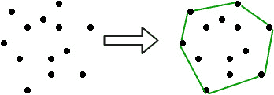
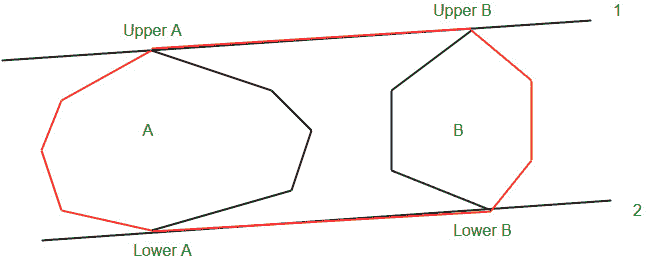
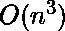

# 使用分治算法的凸包

> 原文:[https://www . geesforgeks . org/凸包-使用分治算法/](https://www.geeksforgeeks.org/convex-hull-using-divide-and-conquer-algorithm/)

凸包是包含所有给定点的最小凸多边形。

[](https://media.geeksforgeeks.org/wp-content/uploads/Convex_hull_1.jpg)

输入是由 x 和 y 坐标指定的点的数组。输出是这组点的凸包。

示例:

```
Input : points[] = {(0, 0), (0, 4), (-4, 0), (5, 0), 
                   (0, -6), (1, 0)};
Output : (-4, 0), (5, 0), (0, -6), (0, 4)

```

**先决条件:**
[两个凸多边形之间的切线](https://www.geeksforgeeks.org/tangents-two-convex-polygons/)

**算法:**
给定我们必须找到凸包的点集。假设我们知道左半点和右半点的凸包，那么现在的问题是合并这两个凸包，确定完备集的凸包。
这可以通过求左右凸包的上下切线来实现。这里说明了两个凸多边形之间的[切线](https://www.geeksforgeeks.org/tangents-two-convex-polygons/)

设左凸包为 a，右凸包为 b，然后上下切线分别命名为 1 和 2，如图。
然后红色轮廓显示最终的凸包。

现在问题依然存在，如何找到左右两半的凸包。现在递归就出现了，我们把点集划分到集合中的点数很少，比如说 5 个，我们可以通过蛮力算法找到这些点的凸包。这两半的合并将导致整个点集的凸包。

**注:**
我们使用了蛮力算法来寻找少量点的凸包，其时间复杂度为。但也有人建议如下，凸包为 3 个或更少的点就是完整的点集。这是正确的，但问题来了，当我们试图合并一个 2 点的左凸包和 3 点的右凸包，然后程序在一些特殊情况下陷入无限循环。所以，为了解决这个问题，我通过算法直接找到了 5 个点或更少点的凸包，这个值稍微大一点，但不影响算法的整体复杂度。

```
// A divide and conquer program to find convex
// hull of a given set of points.
#include<bits/stdc++.h>
using namespace std;

// stores the centre of polygon (It is made
// global because it is used in compare function)
pair<int, int> mid;

// determines the quadrant of a point
// (used in compare())
int quad(pair<int, int> p)
{
    if (p.first >= 0 && p.second >= 0)
        return 1;
    if (p.first <= 0 && p.second >= 0)
        return 2;
    if (p.first <= 0 && p.second <= 0)
        return 3;
    return 4;
}

// Checks whether the line is crossing the polygon
int orientation(pair<int, int> a, pair<int, int> b,
                pair<int, int> c)
{
    int res = (b.second-a.second)*(c.first-b.first) -
              (c.second-b.second)*(b.first-a.first);

    if (res == 0)
        return 0;
    if (res > 0)
        return 1;
    return -1;
}

// compare function for sorting
bool compare(pair<int, int> p1, pair<int, int> q1)
{
    pair<int, int> p = make_pair(p1.first - mid.first,
                                 p1.second - mid.second);
    pair<int, int> q = make_pair(q1.first - mid.first,
                                 q1.second - mid.second);

    int one = quad(p);
    int two = quad(q);

    if (one != two)
        return (one < two);
    return (p.second*q.first < q.second*p.first);
}

// Finds upper tangent of two polygons 'a' and 'b'
// represented as two vectors.
vector<pair<int, int>> merger(vector<pair<int, int> > a,
                              vector<pair<int, int> > b)
{
    // n1 -> number of points in polygon a
    // n2 -> number of points in polygon b
    int n1 = a.size(), n2 = b.size();

    int ia = 0, ib = 0;
    for (int i=1; i<n1; i++)
        if (a[i].first > a[ia].first)
            ia = i;

    // ib -> leftmost point of b
    for (int i=1; i<n2; i++)
        if (b[i].first < b[ib].first)
            ib=i;

    // finding the upper tangent
    int inda = ia, indb = ib;
    bool done = 0;
    while (!done)
    {
        done = 1;
        while (orientation(b[indb], a[inda], a[(inda+1)%n1]) >=0)
            inda = (inda + 1) % n1;

        while (orientation(a[inda], b[indb], b[(n2+indb-1)%n2]) <=0)
        {
            indb = (n2+indb-1)%n2;
            done = 0;
        }
    }

    int uppera = inda, upperb = indb;
    inda = ia, indb=ib;
    done = 0;
    int g = 0;
    while (!done)//finding the lower tangent
    {
        done = 1;
        while (orientation(a[inda], b[indb], b[(indb+1)%n2])>=0)
            indb=(indb+1)%n2;

        while (orientation(b[indb], a[inda], a[(n1+inda-1)%n1])<=0)
        {
            inda=(n1+inda-1)%n1;
            done=0;
        }
    }

    int lowera = inda, lowerb = indb;
    vector<pair<int, int>> ret;

    //ret contains the convex hull after merging the two convex hulls
    //with the points sorted in anti-clockwise order
    int ind = uppera;
    ret.push_back(a[uppera]);
    while (ind != lowera)
    {
        ind = (ind+1)%n1;
        ret.push_back(a[ind]);
    }

    ind = lowerb;
    ret.push_back(b[lowerb]);
    while (ind != upperb)
    {
        ind = (ind+1)%n2;
        ret.push_back(b[ind]);
    }
    return ret;

}

// Brute force algorithm to find convex hull for a set
// of less than 6 points
vector<pair<int, int>> bruteHull(vector<pair<int, int>> a)
{
    // Take any pair of points from the set and check
    // whether it is the edge of the convex hull or not.
    // if all the remaining points are on the same side
    // of the line then the line is the edge of convex
    // hull otherwise not
    set<pair<int, int> >s;

    for (int i=0; i<a.size(); i++)
    {
        for (int j=i+1; j<a.size(); j++)
        {
            int x1 = a[i].first, x2 = a[j].first;
            int y1 = a[i].second, y2 = a[j].second;

            int a1 = y1-y2;
            int b1 = x2-x1;
            int c1 = x1*y2-y1*x2;
            int pos = 0, neg = 0;
            for (int k=0; k<a.size(); k++)
            {
                if (a1*a[k].first+b1*a[k].second+c1 <= 0)
                    neg++;
                if (a1*a[k].first+b1*a[k].second+c1 >= 0)
                    pos++;
            }
            if (pos == a.size() || neg == a.size())
            {
                s.insert(a[i]);
                s.insert(a[j]);
            }
        }
    }

    vector<pair<int, int>>ret;
    for (auto e:s)
        ret.push_back(e);

    // Sorting the points in the anti-clockwise order
    mid = {0, 0};
    int n = ret.size();
    for (int i=0; i<n; i++)
    {
        mid.first += ret[i].first;
        mid.second += ret[i].second;
        ret[i].first *= n;
        ret[i].second *= n;
    }
    sort(ret.begin(), ret.end(), compare);
    for (int i=0; i<n; i++)
        ret[i] = make_pair(ret[i].first/n, ret[i].second/n);

    return ret;
}

// Returns the convex hull for the given set of points
vector<pair<int, int>> divide(vector<pair<int, int>> a)
{
    // If the number of points is less than 6 then the
    // function uses the brute algorithm to find the
    // convex hull
    if (a.size() <= 5)
        return bruteHull(a);

    // left contains the left half points
    // right contains the right half points
    vector<pair<int, int>>left, right;
    for (int i=0; i<a.size()/2; i++)
        left.push_back(a[i]);
    for (int i=a.size()/2; i<a.size(); i++)
        right.push_back(a[i]);

    // convex hull for the left and right sets
    vector<pair<int, int>>left_hull = divide(left);
    vector<pair<int, int>>right_hull = divide(right);

    // merging the convex hulls
    return merger(left_hull, right_hull);
}

// Driver code
int main()
{
    vector<pair<int, int> > a;
    a.push_back(make_pair(0, 0));
    a.push_back(make_pair(1, -4));
    a.push_back(make_pair(-1, -5));
    a.push_back(make_pair(-5, -3));
    a.push_back(make_pair(-3, -1));
    a.push_back(make_pair(-1, -3));
    a.push_back(make_pair(-2, -2));
    a.push_back(make_pair(-1, -1));
    a.push_back(make_pair(-2, -1));
    a.push_back(make_pair(-1, 1));

    int n = a.size();

    // sorting the set of points according
    // to the x-coordinate
    sort(a.begin(), a.end());
    vector<pair<int, int> >ans = divide(a);

    cout << "convex hull:\n";
    for (auto e:ans)
       cout << e.first << " "
            << e.second << endl;

    return 0;
}
```

输出:

```
Convex Hull:
-5 -3
-1 -5
1 -4
0 0
-1 1

```

**时间复杂度:**左右凸包的合并需要 O(n)个时间，由于我们是把点分成两个相等的部分，所以上面算法的时间复杂度是 O(n * log n)。

**相关文章:**

*   [凸包|集合 1(贾维斯算法或包装)](https://www.geeksforgeeks.org/convex-hull-set-1-jarviss-algorithm-or-wrapping/)
*   [凸包|第 2 集(格雷厄姆扫描)](https://www.geeksforgeeks.org/convex-hull-set-2-graham-scan/)
*   [凸包的快速壳算法](https://www.geeksforgeeks.org/quickhull-algorithm-convex-hull/)

本文由[阿姆利则瓦格米](https://www.facebook.com/amritya.vagmi)投稿，想要投稿，也可以使用[contribute.geeksforgeeks.org](http://contribute.geeksforgeeks.org)写一篇，或者将文章邮寄到 contribute@geeksforgeeks.org。看到你的文章出现在极客博客主页上，帮助其他极客。

如果你发现任何不正确的地方，或者你想分享更多关于上面讨论的话题的信息，请写评论。