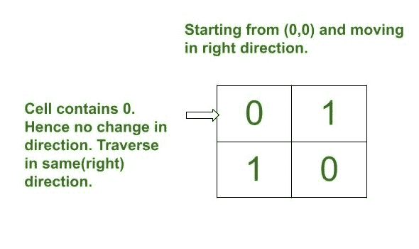
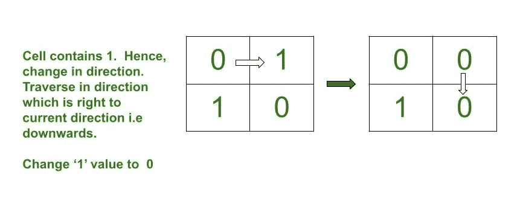
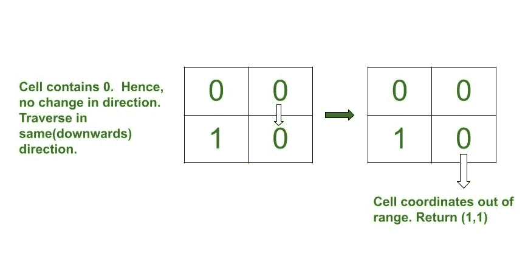

# 矩阵中最后一个单元格的坐标，在该单元格上执行给定操作从矩阵中退出

> 原文:[https://www . geeksforgeeks . org/执行给定操作的矩阵中最后一个单元的坐标-从矩阵中退出/](https://www.geeksforgeeks.org/coordinates-of-the-last-cell-in-a-matrix-on-which-performing-given-operations-exits-from-the-matrix/)

给定维度为 **N * M** 的二进制[矩阵](https://www.geeksforgeeks.org/matrix/)，任务是找到矩阵的索引，使得从单元 **(0，0)** 到矩阵外部的给定矩阵的[遍历符合以下条件:](https://www.geeksforgeeks.org/traverse-a-given-matrix-using-recursion/)

*   如果 **arr[i][j]** 的值为 **0** ，则沿同一方向遍历并检查下一个值。
*   如果 **arr[i][j]** 的值为 **1** ，则将 **arr[i][j]** 更新为 **0** ，将当前方向从**向上**、**向右**、**向下**或**向左**改变为方向**向右**、**向下**、**向左**

**示例:**

> **输入:** arr[] = {{0，1}，{1，0}}
> **输出:** (1，1)
> **解释:**
> 下图为模拟示意图:
> 
> [](https://media.geeksforgeeks.org/wp-content/uploads/20210131121512/endpoint1.jpg)[](https://media.geeksforgeeks.org/wp-content/uploads/20210131121651/endpoint2.jpg)[](https://media.geeksforgeeks.org/wp-content/uploads/20210131121913/endpoint3.jpg)
> 
> **输入:** arr[] = {{0，1，1，1，0}，{1，0，1，0，1}，{1，1，1，0，0}}
> **输出:** (2，0)

**方法:**按照以下步骤解决问题:

## C++

```
// CPP program for the above approach
#include<bits/stdc++.h>
using namespace std;

// Function to check if the indices (i, j)
// are valid indices in a Matrix or not
bool issafe(int m, int n, int i, int j)
{

  // Cases for invalid cells
  if (i < 0)
    return false;
  if (j < 0)
    return false;
  if (i >= m)
    return false;
  if (j >= n)
    return false;

  // Return true if valid
  return true;
}

// Function to find indices of cells
// of a matrix from which traversal
// leads to out of the matrix
pair<int,int> endpoints(vector<vector<int>> arr, int m, int n){

  // Starting from cell (0, 0),
  // traverse in right direction
  int i = 0;
  int j = 0;
  int current_i = 0;
  int current_j = 0;

  char current_d = 'r';

  // Stores direction changes
  map<char,char> rcd = {{'l', 'u'},{'u', 'r'},
                        {'r', 'd'},
                        {'d', 'l'}};

  // Iterate until the current cell
  // exceeds beyond the matrix
  while (issafe(m, n, i, j)){

    // Current index
    current_i = i;
    current_j = j;

    // If the current cell is 1
    if (arr[i][j] == 1){

      char move_in = rcd[current_d];

      // Update arr[i][j] = 0
      arr[i][j] = 0;

      // Update indices according
      // to the direction
      if (move_in == 'u')
        i -= 1;
      else if(move_in == 'd')
        i += 1;
      else if(move_in == 'l')
        j -= 1;
      else if(move_in == 'r')
        j += 1;

      current_d = move_in;

    }

    // Otherwise
    else{
      // Update indices according
      // to the direction
      if (current_d == 'u')
        i -= 1;
      else if(current_d == 'd')
        i += 1;
      else if(current_d == 'l')
        j -= 1;
      else if(current_d == 'r')
        j += 1;
    }
  }

  // The exit coordinates
  return {current_i, current_j};

}

// Driver Code
int main()
{

  // Number of rows
  int M = 3;

  // Number of columns
  int N = 5;

  // Given matrix arr[][]
  vector<vector<int>> arr{{0, 1, 1, 1, 0},
                          {1, 0, 1, 0, 1},
                          {1, 1, 1, 0, 0}};
  pair<int,int> p = endpoints(arr, M, N);

  cout << "(" << p.first << ", " << p.second << ")" << endl;

}

// This code is contributed by ipg2016107.
```

## Java 语言(一种计算机语言，尤用于创建网站)

```
// JAVA program for the above approach
import java.util.HashMap;
import java.util.Map;

class GFG
{

// Function to check if the indices (i, j)
// are valid indices in a Matrix or not
static boolean issafe(int m, int n, int i, int j)
{

  // Cases for invalid cells
  if (i < 0)
    return false;
  if (j < 0)
    return false;
  if (i >= m)
    return false;
  if (j >= n)
    return false;

  // Return true if valid
  return true;
}

// Function to find indices of cells
// of a matrix from which traversal
// leads to out of the matrix
static int [] endpoints(int [][]arr, int m, int n){

  // Starting from cell (0, 0),
  // traverse in right direction
  int i = 0;
  int j = 0;
  int current_i = 0;
  int current_j = 0;

  char current_d = 'r';

  // Stores direction changes
  Map<Character,Character> rcd = new HashMap<>();
  rcd.put('l', 'u');
  rcd.put('u', 'r');
  rcd.put('r', 'd');
  rcd.put('d', 'l');

  // Iterate until the current cell
  // exceeds beyond the matrix
  while (issafe(m, n, i, j)){

    // Current index
    current_i = i;
    current_j = j;

    // If the current cell is 1
    if (arr[i][j] == 1){

      char move_in = rcd.get(current_d);

      // Update arr[i][j] = 0
      arr[i][j] = 0;

      // Update indices according
      // to the direction
      if (move_in == 'u')
        i -= 1;
      else if(move_in == 'd')
        i += 1;
      else if(move_in == 'l')
        j -= 1;
      else if(move_in == 'r')
        j += 1;

      current_d = move_in;

    }

    // Otherwise
    else{
      // Update indices according
      // to the direction
      if (current_d == 'u')
        i -= 1;
      else if(current_d == 'd')
        i += 1;
      else if(current_d == 'l')
        j -= 1;
      else if(current_d == 'r')
        j += 1;
    }
  }

  // The exit coordinates
  return new int[]{current_i, current_j};

}

// Driver Code
public static void main(String[] args)
{

  // Number of rows
  int M = 3;

  // Number of columns
  int N = 5;

  // Given matrix arr[][]
  int [][]arr = {{0, 1, 1, 1, 0},
                          {1, 0, 1, 0, 1},
                          {1, 1, 1, 0, 0}};
  int []p = endpoints(arr, M, N);

  System.out.print("(" +  p[0]+ ", " +  p[1]+ ")" +"\n");
}
}

// This code is contributed by shikhasingrajput
```

## 蟒蛇 3

```
# Python program for the above approach

# Function to check if the indices (i, j)
# are valid indices in a Matrix or not
def issafe(m, n, i, j):

    # Cases for invalid cells
    if i < 0:
        return False
    if j < 0:
        return False
    if i >= m:
        return False
    if j >= n:
        return False

    # Return true if valid
    return True

# Function to find indices of cells
# of a matrix from which traversal
# leads to out of the matrix
def endpoints(arr, m, n):

    # Starting from cell (0, 0),
    # traverse in right direction
    i = 0
    j = 0

    current_d = 'r'

    # Stores direction changes
    rcd = {'l': 'u',
           'u': 'r',
           'r': 'd',
           'd': 'l'}

    # Iterate until the current cell
    # exceeds beyond the matrix
    while issafe(m, n, i, j):

        # Current index
        current_i = i
        current_j = j

        # If the current cell is 1
        if arr[i][j] == 1:

            move_in = rcd[current_d]

            # Update arr[i][j] = 0
            arr[i][j] = 0

            # Update indices according
            # to the direction
            if move_in == 'u':
                i -= 1
            elif move_in == 'd':
                i += 1
            elif move_in == 'l':
                j -= 1
            elif move_in == 'r':
                j += 1

            current_d = move_in

        # Otherwise
        else:

            # Update indices according
            # to the direction
            if current_d == 'u':
                i -= 1
            elif current_d == 'd':
                i += 1
            elif current_d == 'l':
                j -= 1
            elif current_d == 'r':
                j += 1

    # The exit coordinates
    return (current_i, current_j)

# Driver Code

# Number of rows
M = 3

# Number of columns
N = 5

# Given matrix arr[][]
arr = [[0, 1, 1, 1, 0],
       [1, 0, 1, 0, 1],
       [1, 1, 1, 0, 0],
       ]

print(endpoints(arr, M, N))
```

## C#

```
// C# program for the above approach
using System;
using System.Collections.Generic;
class GFG {

  // Function to check if the indices (i, j)
  // are valid indices in a Matrix or not
  static bool issafe(int m, int n, int i, int j)
  {

    // Cases for invalid cells
    if (i < 0)
      return false;
    if (j < 0)
      return false;
    if (i >= m)
      return false;
    if (j >= n)
      return false;

    // Return true if valid
    return true;
  }

  // Function to find indices of cells
  // of a matrix from which traversal
  // leads to out of the matrix
  static int[] endpoints(int[, ] arr, int m, int n)
  {

    // Starting from cell (0, 0),
    // traverse in right direction
    int i = 0;
    int j = 0;
    int current_i = 0;
    int current_j = 0;

    char current_d = 'r';

    // Stores direction changes
    Dictionary<char, char> rcd
      = new Dictionary<char, char>();
    rcd['l'] = 'u';
    rcd['u'] = 'r';
    rcd['r'] = 'd';
    rcd['d'] = 'l';

    // Iterate until the current cell
    // exceeds beyond the matrix
    while (issafe(m, n, i, j)) {

      // Current index
      current_i = i;
      current_j = j;

      // If the current cell is 1
      if (arr[i, j] == 1) {

        char move_in = rcd[current_d];

        // Update arr[i][j] = 0
        arr[i, j] = 0;

        // Update indices according
        // to the direction
        if (move_in == 'u')
          i -= 1;
        else if (move_in == 'd')
          i += 1;
        else if (move_in == 'l')
          j -= 1;
        else if (move_in == 'r')
          j += 1;

        current_d = move_in;
      }

      // Otherwise
      else {
        // Update indices according
        // to the direction
        if (current_d == 'u')
          i -= 1;
        else if (current_d == 'd')
          i += 1;
        else if (current_d == 'l')
          j -= 1;
        else if (current_d == 'r')
          j += 1;
      }
    }

    // The exit coordinates
    return new int[] { current_i, current_j };
  }

  // Driver Code
  public static void Main(string[] args)
  {

    // Number of rows
    int M = 3;

    // Number of columns
    int N = 5;

    // Given matrix arr[][]
    int[, ] arr = { { 0, 1, 1, 1, 0 },
                   { 1, 0, 1, 0, 1 },
                   { 1, 1, 1, 0, 0 } };
    int[] p = endpoints(arr, M, N);

    Console.WriteLine("(" + p[0] + ", " + p[1] + ")"
                      + "\n");
  }
}

// This code is contributed by ukasp.
```

## java 描述语言

```
<script>

// JavaScript program for the above approach

// Function to check if the indices (i, j)
// are valid indices in a Matrix or not
function issafe(m,n,i,j)
{
    // Cases for invalid cells
  if (i < 0)
    return false;
  if (j < 0)
    return false;
  if (i >= m)
    return false;
  if (j >= n)
    return false;

  // Return true if valid
  return true;
}

// Function to find indices of cells
// of a matrix from which traversal
// leads to out of the matrix
function endpoints(arr,m,n)
{
    // Starting from cell (0, 0),
  // traverse in right direction
  let i = 0;
  let j = 0;
  let current_i = 0;
  let current_j = 0;

  let current_d = 'r';

  // Stores direction changes
  let rcd = new Map();
  rcd.set('l', 'u');
  rcd.set('u', 'r');
  rcd.set('r', 'd');
  rcd.set('d', 'l');

  // Iterate until the current cell
  // exceeds beyond the matrix
  while (issafe(m, n, i, j)){

    // Current index
    current_i = i;
    current_j = j;

    // If the current cell is 1
    if (arr[i][j] == 1){

      let move_in = rcd.get(current_d);

      // Update arr[i][j] = 0
      arr[i][j] = 0;

      // Update indices according
      // to the direction
      if (move_in == 'u')
        i -= 1;
      else if(move_in == 'd')
        i += 1;
      else if(move_in == 'l')
        j -= 1;
      else if(move_in == 'r')
        j += 1;

      current_d = move_in;

    }

    // Otherwise
    else{
      // Update indices according
      // to the direction
      if (current_d == 'u')
        i -= 1;
      else if(current_d == 'd')
        i += 1;
      else if(current_d == 'l')
        j -= 1;
      else if(current_d == 'r')
        j += 1;
    }
  }

  // The exit coordinates
  return [current_i, current_j];
}

// Driver Code
// Number of rows
let M = 3;

// Number of columns
let N = 5;

// Given matrix arr[][]
let arr = [[0, 1, 1, 1, 0],
[1, 0, 1, 0, 1],
[1, 1, 1, 0, 0]];
let p = endpoints(arr, M, N);

document.write("(" +  p[0]+ ", " +  p[1]+ ")" +"\n");

// This code is contributed by avanitrachhadiya2155

</script>
```

**Output**

```
(2, 0)
```