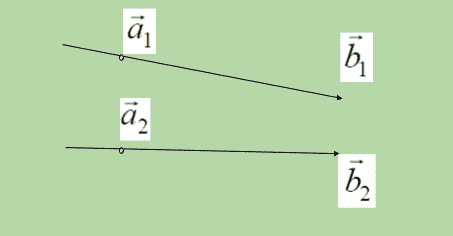
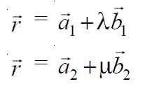
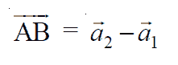
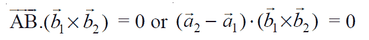
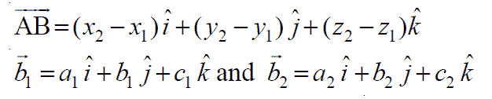
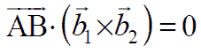
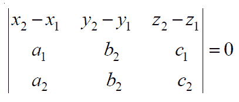

# 三维几何中两条线的共面性

> 原文:[https://www . geeksforgeeks . org/3d 几何中双线共面性/](https://www.geeksforgeeks.org/coplanarity-of-two-lines-in-3d-geometry/)

给定两条直线 **L1** 和 **L2** ，每条直线都经过一个点，该点的位置向量为 **(X，Y，Z)** ，并且与[方向比](https://en.wikipedia.org/wiki/Direction_cosine)为 **(a，b，c)** 的直线平行，任务是检查直线 **L1** 和 **L2** 是否共面。

> **共面:**如果两条线在同一个**平面**上，那么线可以称为共面。

**示例:**

> **输入:**
> **L1:** (x1，y1，z1) = (-3，1，5)和(a1，b1，c1) = (-3，1，5)
> **L2:** (x1，y1，z1) = (-1，2，5)和(a1，b1，c1) = (-1，2，5)
> **输出:**线路共面
> 
> **输入:**
> **L1:** (x1，y1，z1) = (1，2，3)和(a1，b1，c1) = (2，4，6)
> **L2:** (x1，y1，z1) = (-1，2，-3)和(a1，b1，c1) = (3，4，5)
> **输出:**线路不共面

**进场:**



有两种方法可以在三维空间中表示一条线:

**<u>向量形式:</u>**
两条直线的方程，其**共面度**以**向量**形式确定。



在上面的直线方程中，矢量是**三维平面**中的一个点，给定的直线从该点穿过，称为位置矢量 **a** 和 **b** 矢量是三维平面中的矢量线，我们的给定直线与该点平行**。所以可以说线(1)通过点，说 **A** ，位置向量 **a1** 平行于向量**B1**；线(2)通过点，说 **B** 位置向量 **a2** 平行于向量 **b2** 。因此:**

****

**当且仅当 **AB** 矢量垂直于矢量 **b1** 和 **b2** 的叉积时，给定的直线为**共面**，即，**

****

**这里向量 **b1** 和 **b2** 的叉积将给出另一条向量线，该向量线将**垂直于 **b1** 和 **b2** 向量线。 **AB** 是连接两条给定直线的位置向量 **a1** 和 **a2** 的直线向量。现在，通过确定上面的点积是否为**零**来检查两条线是否**共面**。**** 

****<u>笛卡尔形式:</u>**
让 **(x1，y1，z1)** 和 **(x2，y2，z2)** 分别为点 **A** 和 **B** 的坐标。
设 **a1、b1、c1** 和 **a2、b2、c2** 分别为向量 **b1** 和 **b2** 的方向比。然后** 

****

**给定的线是**共面的**当且仅当:**

****

**在笛卡尔形式中，它可以表示为:**

****

**因此，对于这两种类型的表单，都需要输入位置向量 **a1** 和 **a2** 分别作为 **(x1，y1，z1)** 和 **(x2，y2，z2)** ，向量 **b1** 和 **b2** 的方向比分别作为 **(a1，b1，c1)** 和 **(a2，b2，c2)** 。
按照以下步骤解决问题:**

*   **初始化一个 3×3 矩阵来存储上面显示的[行列式](https://en.wikipedia.org/wiki/Determinant#:~:text=In%20linear%20algebra%2C%20the%20determinant, A%2C%20or%20%7CA%7C.)的元素。**
*   **计算 **b2** 和 **b1** 的叉积和**的点积(a2–a1)**。**
*   **如果行列式的值为 0，则直线共面。否则，它们不共面。**

**下面是上述方法的实现:**

## **C++**

```
// C++ program implement
// the above approach
#include <iostream>
using namespace std;

// Function to generate determinant
int det(int d[][3])
{
    int Sum = d[0][0] * ((d[1][1] * d[2][2]) - (d[2][1] * d[1][2]));
    Sum -= d[0][1] * ((d[1][0] * d[2][2]) -  (d[1][2] * d[2][0]));
    Sum += d[0][2] * ((d[0][1] * d[1][2]) -(d[0][2] * d[1][1]));

    // Return the sum
    return Sum;
}

// Driver Code
int main()
{
    // Position vector of first line
    int x1 = -3, y1 = 1, z1 = 5; 

    // Direction ratios of line to
    // which first line is parallel
    int a1 = -3, b1 = 1, c1 = 5;

    // Position vectors of second line
    int x2 = -1, y2 = 2, z2 = 5; 

    // Direction ratios of line to
    // which second line is parallel
    int a2 = -1, b2 = 2, c2 = 5;

    // Determinant to check coplanarity
    int det_list[3][3] = { {x2 - x1, y2 - y1, z2 - z1}, 
                          {a1, b1, c1}, {a2, b2, c2}};

     // If determinant is zero
    if(det(det_list) == 0)
    {
        cout << "Lines are coplanar" << endl;
    }

    // Otherwise
    else
    {
        cout << "Lines are non coplanar" << endl;
    }
   return 0;
}

// This code is contributed by avanitrachhadiya2155
```

## **Java 语言(一种计算机语言，尤用于创建网站)**

```
// Java program implement
// the above approach
import java.io.*;

class GFG{

// Function to generate determinant
static int det(int[][] d)
{
    int Sum = d[0][0] * ((d[1][1] * d[2][2]) -
                         (d[2][1] * d[1][2]));
    Sum -= d[0][1] * ((d[1][0] * d[2][2]) -
                      (d[1][2] * d[2][0]));
    Sum += d[0][2] * ((d[0][1] * d[1][2]) -
                      (d[0][2] * d[1][1]));

    // Return the sum
    return Sum;
}

// Driver Code
public static void main (String[] args)
{

    // Position vector of first line
    int x1 = -3, y1 = 1, z1 = 5;

    // Direction ratios of line to
    // which first line is parallel
    int a1 = -3, b1 = 1, c1 = 5;

    // Position vectors of second line
    int x2 = -1, y2 = 2, z2 = 5;

    // Direction ratios of line to
    // which second line is parallel
    int a2 = -1, b2 = 2, c2 = 5;

    // Determinant to check coplanarity
    int[][] det_list = { {x2 - x1, y2 - y1, z2 - z1},
                         {a1, b1, c1}, {a2, b2, c2}};

    // If determinant is zero
    if(det(det_list) == 0)
        System.out.print("Lines are coplanar");

    // Otherwise
    else
        System.out.print("Lines are non coplanar");
}
}

// This code is contributed by offbeat
```

## **蟒蛇 3**

```
# Python Program implement
# the above approach

# Function to generate determinant
def det(d):
    Sum = d[0][0] * ((d[1][1] * d[2][2])
                    - (d[2][1] * d[1][2]))
    Sum -= d[0][1] * ((d[1][0] * d[2][2])
                    - (d[1][2] * d[2][0]))
    Sum += d[0][2] * ((d[0][1] * d[1][2])
                    - (d[0][2] * d[1][1]))

    # Return the sum
    return Sum

# Driver Code
if __name__ == '__main__':

    # Position vector of first line
    x1, y1, z1 = -3, 1, 5

    # Direction ratios of line to
    # which first line is parallel
    a1, b1, c1 = -3, 1, 5

    # Position vectors of second line
    x2, y2, z2 = -1, 2, 5

    # Direction ratios of line to
    # which second line is parallel
    a2, b2, c2 = -1, 2, 5

    # Determinant to check coplanarity
    det_list = [[x2-x1, y2-y1, z2-z1],
                [a1, b1, c1], [a2, b2, c2]]

    # If determinant is zero
    if(det(det_list) == 0):
        print("Lines are coplanar")

    # Otherwise
    else:
        print("Lines are non coplanar")
```

## **C#**

```
// C# program implement
// the above approach
using System;

class GFG{

// Function to generate determinant
static int det(int[,] d)
{
    int Sum = d[0, 0] * ((d[1, 1] * d[2, 2]) -
                         (d[2, 1] * d[1, 2]));
    Sum -= d[0, 1] * ((d[1, 0] * d[2, 2]) -
                      (d[1, 2] * d[2, 0]));
    Sum += d[0, 2] * ((d[0, 1] * d[1, 2]) -
                      (d[0, 2] * d[1, 1]));

    // Return the sum
    return Sum;
}

// Driver Code
public static void Main()
{

    // Position vector of first line
    int x1 = -3, y1 = 1, z1 = 5;

    // Direction ratios of line to
    // which first line is parallel
    int a1 = -3, b1 = 1, c1 = 5;

    // Position vectors of second line
    int x2 = -1, y2 = 2, z2 = 5;

    // Direction ratios of line to
    // which second line is parallel
    int a2 = -1, b2 = 2, c2 = 5;

    // Determinant to check coplanarity
    int[,] det_list = { {x2 - x1, y2 - y1, z2 - z1},
                        {a1, b1, c1}, {a2, b2, c2}};

    // If determinant is zero
    if (det(det_list) == 0)
        Console.Write("Lines are coplanar");

    // Otherwise
    else
        Console.Write("Lines are non coplanar");
}
}

// This code is contributed by sanjoy_62
```

## **java 描述语言**

```
<script>
// JavaScript program for the above approach

// Function to generate determinant
function det(d)
{
    let Sum = d[0][0] * ((d[1][1] * d[2][2]) -
                         (d[2][1] * d[1][2]));
    Sum -= d[0][1] * ((d[1][0] * d[2][2]) -
                      (d[1][2] * d[2][0]));
    Sum += d[0][2] * ((d[0][1] * d[1][2]) -
                      (d[0][2] * d[1][1]));

    // Return the sum
    return Sum;
}

// Driver Code

     // Position vector of first line
    let x1 = -3, y1 = 1, z1 = 5;

    // Direction ratios of line to
    // which first line is parallel
    let a1 = -3, b1 = 1, c1 = 5;

    // Position vectors of second line
    let x2 = -1, y2 = 2, z2 = 5;

    // Direction ratios of line to
    // which second line is parallel
    let a2 = -1, b2 = 2, c2 = 5;

    // Determinant to check coplanarity
    let det_list = [[x2 - x1, y2 - y1, z2 - z1],
                         [a1, b1, c1], [a2, b2, c2]];

    // If determinant is zero
    if(det(det_list) == 0)
        document.write("Lines are coplanar");

    // Otherwise
    else
        document.write("Lines are non coplanar");

</script>
```

****Output:** 

```
Lines are coplanar
```** 

*****时间复杂度:** O(1)*
***辅助空间:** O(1)***