# 二项式定理的推论

> 原文:[https://www.geeksforgeeks.org/corollaries-binomial-theorem/](https://www.geeksforgeeks.org/corollaries-binomial-theorem/)

表达式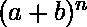表示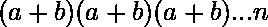次。
这可以被评估为涉及 k = 0 到 n 的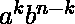项的总和，其中第一项可以从 n 个位置中选择，第二项可以从(n-1)个位置中选择，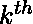项可以从(n-(k-1)个位置中选择，等等。这表示为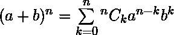。
使用组合符号的二项式展开是

> 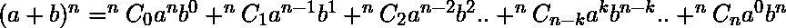

*   上述二项式展开式中各项 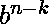的度数为 n 阶
*   展开式中的项数是 n+1。
*   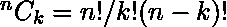
    同理
    由此可以得出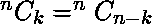。

在二项式展开式中代入 a = 1，b = x，对于任意正整数 n，我们得到
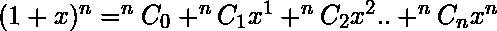。

**推论 1:**

> 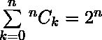

对于任何非负整数 n。

将上述二项式展开式中的 x 替换为 1，我们得到
。

**推论 2:**

> 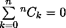

对于任何正整数 n。

用-1 代替上述二项式展开式中的 x，我们得到
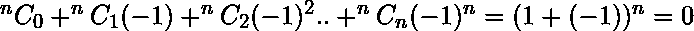。

**推论 3:**

将上述二项式展开式中的 x 替换为 2，得到
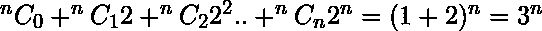

总的来说，可以说

> 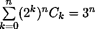

此外，可以将推论 1 和推论 2 结合起来得到另一个结果，

偶数项系数之和=奇数项系数之和。

从开始，

2( 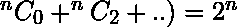

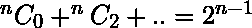

> 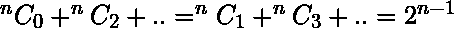

**计数**
展开中的项的系数对应于第 n 行帕斯卡三角形的项

| 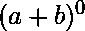 | one | one |
| 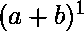 | 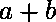 | 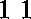 |
| 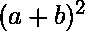 | 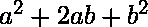 | 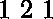 |
| 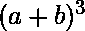 | 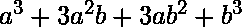 | 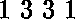 |