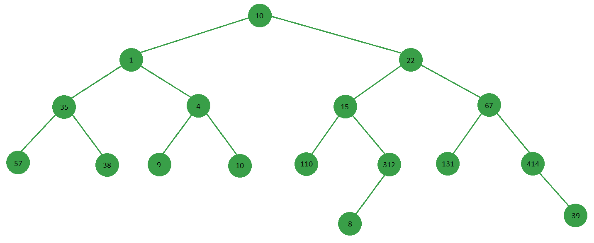

# 计算二叉树中总和大于 X 的所有祖父母-父母-子女三元组

> 原文:[https://www . geesforgeks . org/count-all-祖父母-父母-子女-二叉树中的三元组-其和大于-x/](https://www.geeksforgeeks.org/count-all-grandparent-parent-child-triplets-in-a-binary-tree-whose-sum-is-greater-than-x/)

给定一个整数 **X** 和一个二叉树，任务是计算节点的三元组三元组的数量，使得它们的和大于 **X** ，并且它们具有祖父母- >父母- >子女关系。



**例:**

```
Input: X = 100

               10
         /           \
       1              22
    /    \          /    \
  35      4       15       67
 /  \    /  \    /  \     /  \
57  38  9   10  110 312  131 414
                    /          \
                   8            39
Output: 6
The triplets are:
22 -> 15 -> 110
22 -> 15 -> 312
15 -> 312 -> 8
22 -> 67 -> 131
22 -> 67 -> 414
67 -> 414 -> 39
```

**方法:**该问题可以使用滚动求和方法来解决，滚动周期为 3(祖父母- >父母- >子女)

1.  按前序或后序遍历树(无序不起作用)
2.  维护一个堆栈，其中我们维护滚动周期为 3 的滚动总和
3.  每当我们在堆栈中有 3 个以上的元素，并且如果最顶端的值大于 X，我们就将结果增加 1。
4.  当我们向上移动递归树时，我们在堆栈上执行 POP 操作，以便从堆栈中移除所有较低级别的滚动和。

以下是上述方法的实现:

## 蟒蛇 3

```
# Python3 implementation of the approach

# Class to store node information
class Node:
    def __init__(self, val = None, left = None, right = None):
        self.val = val
        self.left = left
        self.right = right

# Stack to perform stack operations
class Stack:
    def __init__(self):
        self.stack = []

    @property
    def size(self):
        return len(self.stack)

    def top(self):
        return self.stack[self.size - 1] if self.size > 0 else 0

    def push(self, val):
        self.stack.append(val)

    def pop(self):
        if self.size >= 1:
            self.stack.pop(self.size - 1)
        else:
            self.stack = []

    # Period is 3 to satisfy grandparent-parent-child relationship
    def rolling_push(self, val, period = 3):

        # Find the index of element to remove
        to_remove_idx = self.size - period

        # If index is out of bounds then we remove nothing, i.e, 0
        to_remove = 0 if to_remove_idx < 0 else self.stack[to_remove_idx]

        # For rolling sum what we want is that at each index i,
        # we remove out-of-period elements, but since we are not
        # maintaining a separate list of actual elements,
        # we can get the actual element by taking diff between current
        # and previous element. So every time we remove an element,
        # we also add the element just before it, which is
        # equivalent to removing the actual value and not the rolling sum.

        # If index is out of bounds or 0 then we add nothing
        # i.e, 0, because there is no previous element
        to_add = 0 if to_remove_idx <= 0 else self.stack[to_remove_idx - 1]

        # If stack is empty then just push the value
        # Else add last element to current value to get rolling sum
        # then subtract out-of-period elements,
        # then finally add the element just before out-of-period element
        self.push(val if self.size <= 0 else val + self.stack[self.size - 1]
            - to_remove + to_add)

    def show(self):
        for item in self.stack:
            print(item)

# Global variables used by count_with_greater_sum()
count = 0
s = Stack()

def count_with_greater_sum(root_node, x):
    global s, count

    if not root_node:
        return 0

    s.rolling_push(root_node.val)

    if s.size >= 3 and s.top() > x:
        count += 1

    count_with_greater_sum(root_node.left, x)
    count_with_greater_sum(root_node.right, x)

    # Moving up the tree so pop the last element
    s.pop()

if __name__ == '__main__':
    root = Node(10)

    root.left = Node(1)
    root.right = Node(22)

    root.left.left = Node(35)
    root.left.right = Node(4)

    root.right.left = Node(15)
    root.right.right = Node(67)

    root.left.left.left = Node(57)
    root.left.left.right = Node(38)

    root.left.right.left = Node(9)
    root.left.right.right = Node(10)

    root.right.left.left = Node(110)
    root.right.left.right = Node(312)

    root.right.right.left = Node(131)
    root.right.right.right = Node(414)

    root.right.left.right.left = Node(8)

    root.right.right.right.right = Node(39)

    count_with_greater_sum(root, 100)

    print(count)
```

**Output:**

```
6
```

**高效方法:**这个问题可以通过维护 3 个名为祖父母、父母和孩子的变量来解决。它可以在不使用其他数据结构的情况下在常数空间中完成。

1.  按顺序遍历树
2.  维护 3 个名为祖父母、父母和子女的变量
3.  每当我们的总和超过目标时，我们就可以增加计数或打印三份。

下面是上述方法的实现:

## C++

```
// CPP implementation to print
// the nodes having a single child
#include <bits/stdc++.h>
using namespace std;

// Class of the Binary Tree node
struct Node
{
  int data;
  Node *left, *right;

  Node(int x)
  {
    data = x;
    left = right = NULL;
  }
};

// global variable
int cont = 0;

void preorder(Node* grandParent,
              Node* parent,
              Node* child,
              int sum)
{
  if(grandParent != NULL &&
     parent != NULL &&
     child != NULL &&
     (grandParent -> data +
      parent -> data +
      child->data) > sum)
  {
    cont++;
    //uncomment below lines if you
    // want to print triplets
    /*System->out->print(grandParent
      ->data+"-->"+parent->data+"-->
      "+child->data);
      System->out->println();*/
  }
  if(child == NULL)
    return;

  preorder(parent, child,
           child -> left, sum);
  preorder(parent, child,
           child -> right, sum);
}

//Driver code
int main()
{
  Node *r10 = new Node(10);
  Node *r1 = new Node(1);
  Node *r22 = new Node(22);
  Node *r35 = new Node(35);
  Node *r4 = new Node(4);
  Node *r15 = new Node(15);
  Node *r67 = new Node(67);
  Node *r57 = new Node(57);
  Node *r38 = new Node(38);
  Node *r9 = new Node(9);
  Node *r10_2 = new Node(10);
  Node *r110 = new Node(110);
  Node *r312 = new Node(312);
  Node *r131 = new Node(131);
  Node *r414 = new Node(414);
  Node *r8 = new Node(8);
  Node *r39 = new Node(39);

  r10 -> left = r1;
  r10 -> right = r22;
  r1 -> left = r35;
  r1 -> right = r4;
  r22 -> left = r15;
  r22 -> right = r67;
  r35 -> left = r57;
  r35 -> right = r38;
  r4 -> left = r9;
  r4 -> right = r10_2;
  r15 -> left = r110;
  r15 -> right = r312;
  r67 -> left = r131;
  r67 -> right = r414;
  r312 -> left = r8;
  r414 -> right = r39;

  preorder(NULL, NULL,
           r10, 100);
  cout << cont;
}

// This code is contributed by Mohit Kumar 29
```

## Java 语言(一种计算机语言，尤用于创建网站)

```
class Node{
    int data;
    Node left;
    Node right;
    public Node(int data)
    {
        this.data=data;
    }
}
 class TreeTriplet {
    static int count=0; // global variable
    public void preorder(Node grandParent,Node parent,Node child,int sum)
    {
        if(grandParent!=null && parent!=null && child!=null && (grandParent.data+parent.data+child.data) > sum)
        {
            count++;
            //uncomment below lines if you want to print triplets
            /*System.out.print(grandParent.data+"-->"+parent.data+"-->"+child.data);
            System.out.println();*/           
        }
        if(child==null)
          return;       
        preorder(parent,child,child.left,sum);
        preorder(parent,child,child.right,sum);       
    }
    public static void main(String args[])
    {       
        Node r10 = new Node(10);
        Node r1 = new Node(1);
        Node r22 = new Node(22);
        Node r35 = new Node(35);
        Node r4 = new Node(4);
        Node r15 = new Node(15);
        Node r67 = new Node(67);
        Node r57 = new Node(57);
        Node r38 = new Node(38);
        Node r9 = new Node(9);
        Node r10_2 = new Node(10);
        Node r110 = new Node(110);
        Node r312 = new Node(312);
        Node r131 = new Node(131);
        Node r414 = new Node(414);
        Node r8 = new Node(8);
        Node r39 = new Node(39);

        r10.left=r1;
        r10.right=r22;
        r1.left=r35;
        r1.right=r4;
        r22.left=r15;
        r22.right=r67;
        r35.left=r57;
        r35.right=r38;
        r4.left=r9;
        r4.right=r10_2;
        r15.left=r110;
        r15.right=r312;
        r67.left=r131;
        r67.right=r414;
        r312.left=r8;
        r414.right=r39;   

        TreeTriplet p = new TreeTriplet();
        p.preorder(null, null, r10,100);
        System.out.println(count);
}

}
 // This code is contributed by Akshay Siddhpura
```

## 蟒蛇 3

```
# Python3 program to implement
# the above approach
class Node:

    def __init__(self,
                 data):

        self.left = None
        self.right = None
        self.data = data       

# global variable
count = 0

def preorder(grandParent, parent,
             child, sum):

    global count

    if(grandParent != None and
       parent != None and
       child != None and
       (grandParent.data +
        parent.data +
        child.data) > sum):    
        count += 1

        # uncomment below lines if
        # you want to print triplets 
        # System.out.print(grandParent.
        # data+"-->"+parent.data+"-->
        # "+child.data); System.out.println();          
    if(child == None):
        return;

    preorder(parent, child,
             child.left, sum);
    preorder(parent, child,
             child.right, sum); 

# Driver code
if __name__ == "__main__":

    r10 = Node(10);
    r1 = Node(1);
    r22 = Node(22);
    r35 = Node(35);
    r4 = Node(4);
    r15 = Node(15);
    r67 = Node(67);
    r57 = Node(57);
    r38 = Node(38);
    r9 = Node(9);
    r10_2 = Node(10);
    r110 = Node(110);
    r312 = Node(312);
    r131 = Node(131);
    r414 = Node(414);
    r8 = Node(8);
    r39 = Node(39);

    r10.left = r1;
    r10.right = r22;
    r1.left = r35;
    r1.right = r4;
    r22.left = r15;
    r22.right = r67;
    r35.left = r57;
    r35.right = r38;
    r4.left = r9;
    r4.right = r10_2;
    r15.left = r110;
    r15.right = r312;
    r67.left = r131;
    r67.right = r414;
    r312.left = r8;
    r414.right = r39;    

    preorder(None, None,
             r10, 100)
    print(count);

# This code is contributed by Rutvik_56
```

## C#

```
// C# program to find an index which has
// same number of even elements on left and
// right, Or same number of odd elements on
// left and right.
using System;

public class Node
{
    public int data;
    public Node left;
    public Node right;
    public Node(int data)
    {
        this.data = data;
    }
}

class GFG
{
    static int count = 0; // global variable
    public void preorder(Node grandParent,
                         Node parent,
                         Node child, int sum)
    {
        if(grandParent != null && parent != null &&
                 child != null && (grandParent.data +
                     parent.data + child.data) > sum)
        {
            count++;

            // uncomment below lines if you want to print triplets
            /*System.out.print(grandParent.data+"-->"+parent.data+"-->"+child.data);
            System.out.println();*/       
        }
        if(child == null)
            return;    
        preorder(parent,child,child.left,sum);
        preorder(parent,child,child.right,sum);    
    }

    // Driver Code
    public static void Main(String []args)
    {    
        Node r10 = new Node(10);
        Node r1 = new Node(1);
        Node r22 = new Node(22);
        Node r35 = new Node(35);
        Node r4 = new Node(4);
        Node r15 = new Node(15);
        Node r67 = new Node(67);
        Node r57 = new Node(57);
        Node r38 = new Node(38);
        Node r9 = new Node(9);
        Node r10_2 = new Node(10);
        Node r110 = new Node(110);
        Node r312 = new Node(312);
        Node r131 = new Node(131);
        Node r414 = new Node(414);
        Node r8 = new Node(8);
        Node r39 = new Node(39);

        r10.left = r1;
        r10.right = r22;
        r1.left = r35;
        r1.right = r4;
        r22.left = r15;
        r22.right = r67;
        r35.left = r57;
        r35.right = r38;
        r4.left = r9;
        r4.right = r10_2;
        r15.left = r110;
        r15.right = r312;
        r67.left = r131;
        r67.right = r414;
        r312.left = r8;
        r414.right = r39;

        GFG p = new GFG();
        p.preorder(null, null, r10,100);
        Console.WriteLine(count);
}
}

// This code is contributed by 29AjayKumar
```

## java 描述语言

```
<script>

class Node
{
    constructor(data)
    {
        this.data = data;
        this.left = this.right = null;
    }
}

let count = 0; // global variable

function preorder(grandParent, parent, child, sum)
{
    if(grandParent != null && parent != null && child != null && (grandParent.data+parent.data+child.data) > sum)
        {
            count++;
            // uncomment below lines if you want to print triplets
            /* System.out.print(grandParent.data+"-->"+parent.data+"-->"+child.data);
            System.out.println();*/          
        }
        if(child == null)
          return;      
        preorder(parent, child, child.left, sum);
        preorder(parent, child, child.right, sum); 
}

let r10 = new Node(10);
let r1 = new Node(1);
let r22 = new Node(22);
let r35 = new Node(35);
let r4 = new Node(4);
let r15 = new Node(15);
let r67 = new Node(67);
let r57 = new Node(57);
let r38 = new Node(38);
let r9 = new Node(9);
let r10_2 = new Node(10);
let r110 = new Node(110);
let r312 = new Node(312);
let r131 = new Node(131);
let r414 = new Node(414);
let r8 = new Node(8);
let r39 = new Node(39);

r10.left = r1;
r10.right = r22;
r1.left = r35;
r1.right = r4;
r22.left = r15;
r22.right = r67;
r35.left = r57;
r35.right = r38;
r4.left = r9;
r4.right = r10_2;
r15.left = r110;
r15.right = r312;
r67.left = r131;
r67.right = r414;
r312.left = r8;
r414.right = r39;  

preorder(null, null, r10,100);
document.write(count);

// This code is contributed by unknown2108
</script>
```

**Output:**

```
6
```

**时间复杂度:** O(n)