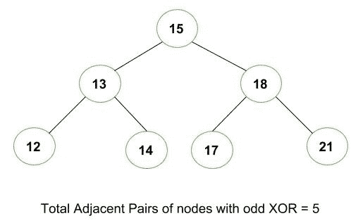

# 计算异或为奇数的所有相邻节点对

> 原文:[https://www . geeksforgeeks . org/count-所有相邻节点对-其-xor-是奇数/](https://www.geeksforgeeks.org/count-all-pairs-of-adjacent-nodes-whose-xor-is-an-odd-number/)

给定如下所示的二叉树。任务是计算异或为奇数的所有相邻节点对。



**说明**:

```
Initially, root will be 0, start traversing the tree.
XOR of 15 and 13 will be  2 (Even)
XOR of 13 and 12 will be 1 (Odd)
XOR of 13 and 14 will be 5 (Even)
XOR of 15 and 18 will be 13 (Odd)
XOR of 18 and 17 will be 3 (Odd)
XOR of 18 and 21 will be 7 (Odd)

Therefore, total adjacent pairs with odd XOR = 5
```

**接近**:

1.  开始从上到下移动树。
2.  每次对当前节点数据及其相邻数据进行异或运算。
3.  如果两个节点的异或是奇数，则增加计数。

下面是上述方法的实现:

## C++

```
// C++ program to find number of adjacent pair
// in Binary Tree with odd xor

#include <iostream>
using namespace std;

// Tree Node
struct Node {
    int data;
    struct Node *left, *right;
};

// Function to find number of adjacent pair
// in Binary Tree with odd xor
int countOddXor(Node* root, Node *parent=NULL)
{
    // If Node is empty
    if (root == NULL)
        return 0;

    // check pair of XOR is odd or not
    int res = 0;
    if (parent != NULL && (parent->data ^ root->data) % 2)
        res++;

    return res + countOddXor(root->left, root) +
                 countOddXor(root->right, root);
}

// Utility function to create a new tree node
Node* newNode(int data)
{
    Node* temp = new Node;
    temp->data = data;
    temp->left = NULL;
    temp->right = NULL;
    return temp;
}

// Driver code
int main()
{
    struct Node* root = NULL;

    root = newNode(15);
    root->left = newNode(13);
    root->left->left = newNode(12);
    root->left->right = newNode(14);
    root->right = newNode(18);
    root->right->left = newNode(17);
    root->right->right = newNode(21);

    printf("%d ", countOddXor(root));

    return 0;
}
```

## Java 语言(一种计算机语言，尤用于创建网站)

```
// Java program to find number of adjacent pair
// in Binary Tree with odd xor
class GFG
{

// Tree Node
static class Node
{
    int data;
    Node left, right;
};

// Function to find number of adjacent pair
// in Binary Tree with odd xor
static int countOddXor(Node root, Node parent)
{
    // If Node is empty
    if (root == null)
        return 0;

    // check pair of XOR is odd or not
    int res = 0;
    if (parent != null &&
       (parent.data ^ root.data) % 2 == 1)
        res++;

    return res + countOddXor(root.left, root) +
                 countOddXor(root.right, root);
}

// Utility function to create a new tree node
static Node newNode(int data)
{
    Node temp = new Node();
    temp.data = data;
    temp.left = null;
    temp.right = null;
    return temp;
}

// Driver code
public static void main(String[] args)
{
    Node root = null;

    root = newNode(15);
    root.left = newNode(13);
    root.left.left = newNode(12);
    root.left.right = newNode(14);
    root.right = newNode(18);
    root.right.left = newNode(17);
    root.right.right = newNode(21);

    System.out.printf("%d ", countOddXor(root, null));
}
}

// This code is contributed by PrinciRaj1992
```

## 蟒蛇 3

```
# Python3 program to find number of adjacent pair
# in Binary Tree with odd xor

# Tree Node
class Node:

    def __init__(self, data):

        self.data = data
        self.left = None
        self.right = None

# Function to find number of adjacent pair
# in Binary Tree with odd xor
def countOddXor(root, parent = None):

    # If Node is empty
    if (root == None):
        return 0;

    # check pair of XOR is odd or not
    res = 0;

    if (parent != None and (parent.data ^ root.data) % 2):
        res += 1

    return res + countOddXor(root.left, root) + countOddXor(root.right, root);

# Utility function to create a new tree node
def newNode(data):

    temp = Node(data)
    return temp

# Driver code
if __name__=='__main__':

    root = None;
    root = newNode(15);
    root.left = newNode(13);
    root.left.left = newNode(12);
    root.left.right = newNode(14);
    root.right = newNode(18);
    root.right.left = newNode(17);
    root.right.right = newNode(21);

    print(countOddXor(root));

# This code is contributed by rutvik_56
```

## C#

```
// C# program to find number of adjacent pair
// in Binary Tree with odd xor
using System;

class GFG
{

// Tree Node
public class Node
{
    public int data;
    public Node left, right;
};

// Function to find number of adjacent pair
// in Binary Tree with odd xor
static int countOddXor(Node root,
                       Node parent)
{
    // If Node is empty
    if (root == null)
        return 0;

    // check pair of XOR is odd or not
    int res = 0;
    if (parent != null &&
       (parent.data ^ root.data) % 2 == 1)
        res++;

    return res + countOddXor(root.left, root) +
                 countOddXor(root.right, root);
}

// Utility function to create a new tree node
static Node newNode(int data)
{
    Node temp = new Node();
    temp.data = data;
    temp.left = null;
    temp.right = null;
    return temp;
}

// Driver code
public static void Main(String[] args)
{
    Node root = null;

    root = newNode(15);
    root.left = newNode(13);
    root.left.left = newNode(12);
    root.left.right = newNode(14);
    root.right = newNode(18);
    root.right.left = newNode(17);
    root.right.right = newNode(21);

    Console.WriteLine("{0} ",
          countOddXor(root, null));
}
}

// This code is contributed by 29AjayKumar
```

## java 描述语言

```
<script>

// Javascript program to find number of
// adjacent pair in Binary Tree with odd xor

// Tree Node
class Node
{
    constructor()
    {
        this.data = 0;
        this.left = null;
        this.right = null;
    }
};

// Function to find number of adjacent pair
// in Binary Tree with odd xor
function countOddXor(root, parent)
{

    // If Node is empty
    if (root == null)
        return 0;

    // Check pair of XOR is odd or not
    var res = 0;
    if (parent != null &&
       (parent.data ^ root.data) % 2 == 1)
        res++;

    return res + countOddXor(root.left, root) +
                 countOddXor(root.right, root);
}

// Utility function to create a new tree node
function newNode( data)
{
    var temp = new Node();
    temp.data = data;
    temp.left = null;
    temp.right = null;
    return temp;
}

// Driver code
var root = null;
root = newNode(15);
root.left = newNode(13);
root.left.left = newNode(12);
root.left.right = newNode(14);
root.right = newNode(18);
root.right.left = newNode(17);
root.right.right = newNode(21);

document.write(countOddXor(root, null) + " ");

// This code is contributed by noob2000

</script>
```

**Output:** 

```
5
```