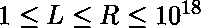
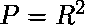
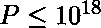
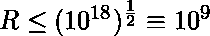
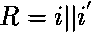
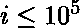

# 计算所有回文的平方

> 原文:[https://www . geesforgeks . org/count-all-回文-哪是回文的平方/](https://www.geeksforgeeks.org/count-all-palindrome-which-is-square-of-a-palindrome/)

给定两个正整数 L 和 R(表示为字符串)，其中。任务是找到包含范围内的超级回文总数【total，R】。
回文如果是回文，并且也是回文的平方，就叫超回文。
**示例:**

```
Input: L = "4", R = "1000"
Output: 4
Explanation: 4, 9, 121, and 484 are super-palindromes.

Input : L = "100000", R = "10000000000"
Output : 11

```

**进场:**
假设是一个**超级回文**。
现在既然 **R** 是回文， **R** 的前半部分数字可以用来确定 **R** 最多两种可能。让 **i** 为 **R** 中数字的前半部分。例如，如果 **i = 123** ，则 **R = 12321** 或 **R = 123321** 。因此我们可以迭代所有这些数字。每个可能性在 **R** 中也可以有奇数或偶数个数字。
因此我们迭代每个 **i** 直到 **10 <sup>5</sup>** 并创建关联回文 **R** ，并检查 **R <sup>2</sup> 是否为回文**。
同样我们会单独处理奇数和偶数回文，每当出回文超出 **R** 的时候就中断。
既然、、(在拼接上)，i <sup>'</sup> 是 I 的反义词(双向)，那么我们的 LIMIT 就不会大于。
**以下是以上办法的实施:**

## C++

```
// C++ implementation of the 
// above approach
#include <bits/stdc++.h> 
using namespace std;

// check if a number is a palindrome
bool ispalindrome(int x)
{
    int ans = 0;
    int temp = x;
    while (temp > 0)
    {
        ans = 10 * ans + temp % 10;
        temp = temp / 10;
    }
    return ans == x;
}

// Function to return required count 
// of palindromes
int SuperPalindromes(int L, int R)
{
    // Range [L, R]

    // Upper limit
    int LIMIT = 100000;

    int ans = 0;

    // count odd length palindromes
    for (int i = 0 ;i < LIMIT; i++)
    {
        string s = to_string(i); // if s = '1234'

        string rs = s.substr(0, s.size() - 1);
        reverse(rs.begin(), rs.end());

        // then, t = '1234321'
        string p = s + rs; 
        int p_sq     = pow(stoi(p), 2);
        if (p_sq > R)
            break;
        if (p_sq >= L and ispalindrome(p_sq))
            ans = ans + 1;
    }

    // count even length palindromes
    for (int i = 0 ;i < LIMIT; i++)
    {
        string s = to_string(i); // if s = '1234'

        string rs = s;
        reverse(rs.begin(), rs.end());
        string p = s + rs; // then, t = '12344321'
        int p_sq = pow(stoi(p), 2);
        if (p_sq > R)
            break;
        if (p_sq >= L and ispalindrome(p_sq))
            ans = ans + 1;
    }

    // Return count of super-palindromes
    return ans;
}

// Driver Code
int main()
{
    string L = "4";
    string R = "1000";

    // function call to get required answer
    printf("%d\n", SuperPalindromes(stoi(L), 
                                  stoi(R)));
    return 0;
} 

// This code is contributed 
// by Harshit Saini
```

## Java 语言(一种计算机语言，尤用于创建网站)

```
// Java implementation of the
// above approach
import java.lang.*;

class GFG
{

// check if a number is a palindrome
public static boolean ispalindrome(int x)
{
    int ans = 0;
    int temp = x;
    while (temp > 0)
    {
        ans = 10 * ans + temp % 10;
        temp = temp / 10;
    }
    return ans == x;
}

// Function to return required 
// count of palindromes
public static int SuperPalindromes(int L, 
                                   int R)
{
    // Range [L, R]

    // Upper limit
    int LIMIT = 100000;

    int ans = 0;

    // count odd length palindromes
    for (int i = 0 ;i < LIMIT; i++)
    {

        // if s = '1234'
        String s = Integer.toString(i);

        StringBuilder rs = new StringBuilder();
        rs.append(s.substring(0,
                     Math.max(1, s.length() - 1)));
        String srs = rs.reverse().toString();

        // then, t = '1234321'
        String p = s + srs;
        int p_sq = (int)(Math.pow(
                         Integer.parseInt(p), 2));
        if (p_sq > R)
        {
            break;
        }
        if (p_sq >= L && ispalindrome(p_sq))
        {
            ans = ans + 1;
        }
    }

    // count even length palindromes
    for (int i = 0 ;i < LIMIT; i++)
    {

        // if s = '1234'
        String s = Integer.toString(i); 

        StringBuilder rs = new StringBuilder();
        rs.append(s);
        rs = rs.reverse();

        String p = s + rs; // then, t = '12344321'
        int p_sq = (int)(Math.pow(
                         Integer.parseInt(p), 2));
        if (p_sq > R)
        {
            break;
        }
        if (p_sq >= L && ispalindrome(p_sq))
        {
            ans = ans + 1;
        }
    }

    // Return count of super-palindromes
    return ans;
}

// Driver program
public static void main(String [] args)
{
    String L = "4";
    String R = "1000";

    // function call to get required answer
    System.out.println(SuperPalindromes(
       Integer.parseInt(L), Integer.parseInt(R)));
}
}

// This code is contributed 
// by Harshit Saini 
```

## 蟒蛇 3

```
# Python implementation of the above approach

# check if a number is a palindrome
def ispalindrome(x):
    ans, temp = 0, x
    while temp > 0:
        ans = 10 * ans + temp % 10
        temp = temp // 10
    return ans == x

# Function to return required count of palindromes
def SuperPalindromes(L, R):
    # Range [L, R]
    L, R = int(L), int(R)

    # Upper limit
    LIMIT = 100000

    ans = 0

    # count odd length palindromes
    for i in range(LIMIT):
        s = str(i)  # if s = '1234'
        p = s + s[-2::-1]  # then, t = '1234321'
        p_sq = int(p) ** 2
        if p_sq > R:
            break
        if p_sq >= L and ispalindrome(p_sq):
            ans = ans + 1

    # count even length palindromes
    for i in range(LIMIT):
        s = str(i)  # if s = '1234'
        p = s + s[::-1]  # then, t = '12344321'
        p_sq = int(p) ** 2
        if p_sq > R:
            break
        if p_sq >= L and ispalindrome(p_sq):
            ans = ans + 1

    # Return count of super-palindromes
    return ans

# Driver program
L = "4"
R = "1000"

# function call to get required answer
print(SuperPalindromes(L, R))

# This code is written by
# Sanjit_Prasad
```

## C#

```
// C# implementation of the 
// above approach
using System;

class GFG
{

// check if a number is a palindrome
static bool ispalindrome(int x)
{
    int ans = 0;
    int temp = x;
    while (temp > 0)
    {
        ans = 10 * ans + temp % 10;
        temp = temp / 10;
    }
    return ans == x;
}

// utility function used for 
// reversing a string
static string Reverse( string s )
{
    char[] charArray = s.ToCharArray();
    Array.Reverse( charArray );
    return new string( charArray );
}

// Function to return required 
// count of palindromes
static int SuperPalindromes(int L, int R)
{
    // Range [L, R]

    // Upper limit
    int LIMIT = 100000;

    int ans = 0;

    // count odd length palindromes
    for (int i = 0 ;i < LIMIT; i++)
    {

        // if s = '1234'
        string s = i.ToString();

        string rs = s.Substring(0,
                       Math.Max(1, s.Length - 1));
        rs = Reverse(rs);

        // then, t = '1234321'
        string p = s + rs;
        int p_sq = (int)(Math.Pow(
                            Int32.Parse(p), 2));
        if (p_sq > R)
        {
            break;
        }
        if (p_sq >= L && ispalindrome(p_sq))
        {
            ans = ans + 1;
        }
    }

    // count even length palindromes
    for (int i = 0 ;i < LIMIT; i++)
    {

        // if s = '1234'
        string s = i.ToString();

        string rs = Reverse(s);

        string p = s + rs; // then, t = '12344321'
        int p_sq = (int)(Math.Pow(
                            Int32.Parse(p), 2));
        if (p_sq > R)
        {
            break;
        }
        if (p_sq >= L && ispalindrome(p_sq))
        {
            ans = ans + 1;
        }
    }

    // Return count of super-palindromes
    return ans;
}

// Driver Code
public static void Main()
{
    string L = "4";
    String R = "1000";

    // function call to get required answer
    Console.WriteLine(SuperPalindromes(
            Int32.Parse(L), Int32.Parse(R)));
}
}

// This code is contributed 
// by Harshit Saini 
```

## 服务器端编程语言（Professional Hypertext Preprocessor 的缩写）

```
<?php 
// PHP implementation of the 
// above approach

// check if a number is a palindrome
function ispalindrome($x)
{
    $ans = 0;
    $temp = $x;

    while($temp > 0)
    {     
        $ans = (10 * $ans) +
               ($temp % 10);
        $temp = (int)($temp / 10);
    }

    return $ans == $x;
}

// Function to return required
// count of palindromes
function SuperPalindromes($L, $R)
{
    // Range [L, R]
    $L = (int)$L;
    $R = (int)$R;

    // Upper limit
    $LIMIT = 100000;

    $ans = 0;

    // count odd length palindromes
    for($i = 0 ;$i < $LIMIT; $i++)
    {

        $s = (string)$i; // if s = '1234'
        $rs = substr($s, 0, strlen($s) - 1);
        $p = $s.strrev($rs); // then, t = '1234321'
        $p_sq = (int)$p ** 2;
        if ($p_sq > $R)
        {
            break;
        }
        if ($p_sq >= $L and ispalindrome($p_sq))
        {
            $ans = $ans + 1;
        }
    } 

    // count even length palindromes
    for($i = 0 ;$i < $LIMIT; $i++)
    {
        $s = (string)$i; // if s = '1234'
        $p = $s.strrev($s); // then, t = '12344321'

        $p_sq = (int)$p ** 2;

        if ($p_sq > $R)
        {
            break;
        }
        if ($p_sq >= $L and ispalindrome($p_sq))
        {
            $ans = $ans + 1;
        }
    }

    // Return count of super-palindromes
    return $ans;
}

// Driver Code
$L = "4";
$R = "1000";

// function call to get required answer
echo SuperPalindromes($L, $R);

// This code is contributed 
// by Harshit Saini 
?>
```

**Output:**

```
4
```

**时间复杂度:** O(N*log(N))，其中 N 为上限，log(N)项来源于检查候选项是否为回文。