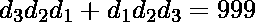
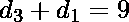
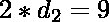
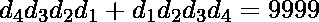
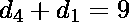
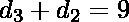

# 计算满足给定条件的所有可能的 N 位数

> 原文:[https://www . geesforgeks . org/count-所有可能的 n 位数-满足给定条件的数字/](https://www.geeksforgeeks.org/count-all-possible-n-digit-numbers-that-satisfy-the-given-condition/)

给定一个整数 **N** ，任务是计算所有可能的 **N 位数**，使得 **A +反向(A)= 10<sup>N</sup>–1**，其中 **A** 是一个 N 位数，反向(A)是 A 的反向。 **A** 不应该有任何前导 0。
**示例:**

> **输入:** N = 2
> **输出:** 9
> 所有可能的 2 位数为 90、81、72、63、54、45、36、27 和 18。
> **输入:** N = 4
> **输出:** 90

**方法:**首先我们必须得出结论，如果 N 是奇数，那么没有满足给定条件的数，让我们为 **N = 3** ，
证明它

> 、
> 所以和。
> 这是不可能的，因为它是一个浮点数。

现在找到 **N 为偶数**的答案。例如，N=4，

> 
> 和现在如果 **x + y = 9** 那么满足这个条件的对的数量是 10。
> (0，9)、(1，8)、(2，7)、(3，6)、(4，5)、(5，4)、(6，3)、(7，2)、(8，1)、(9，0)
> 现在，第 1 个和第 N 个<sup>数字不能有对(0，9)，因为 A 中不应该有任何前导 0，但是对于所有剩余的 N/2-1 对，可以有 10 对。
> 所以答案是，因为 N 很大，所以我们会打印 9 后跟 N/2-1 个 0。</sup>

以下是上述方法的实现:

## C++

```
// C++ implementation of above approach
#include <bits/stdc++.h>
using namespace std;

// Function to return the count of required numbers
string getCount(int N)
{

    // If N is odd then return 0
    if (N % 2 == 1)
        return 0;

    string result = "9";

    for (int i = 1; i <= N / 2 - 1; i++)
        result += "0";

    return result;
}

// Driver Code
int main()
{

    int N = 4;
    cout << getCount(N);

    return 0;
}
```

## Java 语言(一种计算机语言，尤用于创建网站)

```
// Java implementation of above approach
class GFG
{
    // Function to return the count of required numbers
    static String getCount(int N)
    {

        // If N is odd then return 0
        if (N % 2 == 1)
            return "0";

        String result = "9";
        for (int i = 1; i <= N / 2 - 1; i++)
            result += "0";
        return result;
    }

    // Driver Code
    public static void main(String []args)
    {

        int N = 4;
        System.out.println(getCount(N));
    }
}

// This code is contributed by ihritik
```

## 蟒蛇 3

```
# Python3 implementation of above approach

# Function to return the count of required numbers
def getCount(N):

    # If N is odd then return 0
    if (N % 2 == 1):
        return "0"

    result = "9"

    for i in range (1, N // 2 ):
        result = result + "0"

    return result

# Driver Code
N = 4
print(getCount(N))

# This code is contributed by ihritik
```

## C#

```
// C# implementation of above approach
using System;

class GFG
{
    // Function to return the count of required numbers
    static string getCount(int N)
    {

        // If N is odd then return 0
        if (N % 2 == 1)
            return "0";
        string result = "9";
        for (int i = 1; i <= N / 2 - 1; i++)
            result += "0";
        return result;
    }

    // Driver Code
    public static void Main()
    {

        int N = 4;
        Console.WriteLine(getCount(N));
    }
}

// This code is contributed by ihritik
```

## 服务器端编程语言（Professional Hypertext Preprocessor 的缩写）

```
<?php
// PHP implementation of above approach

// Function to return the count of
// required numbers
function getCount($N)
{

    // If N is odd then return 0
    if ($N % 2 == 1)
        return 0;

    $result = "9";

    for ($i = 1; $i <= $N / 2 - 1; $i++)
        $result .= "0";

    return $result;
}

// Driver Code
$N = 4;
echo getCount($N);

// This code is contributed by Ryuga
?>
```

## java 描述语言

```
<script>

// Javascript implementation of the approach

    // Function to return the count of required numbers
    function getCount(N)
    {

        // If N is odd then return 0
        if (N % 2 == 1)
            return "0";

        let result = "9";
        for (let i = 1; i <= N / 2 - 1; i++)
            result += "0";
        return result;
    }

// Driver code

    let N = 4;
    document.write(getCount(N));

</script>
```

**Output:** 

```
90
```

**时间复杂度:** O(N)