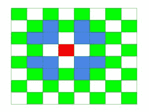
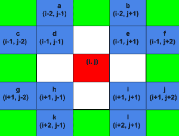

# 统计修改骑士

可以到达的所有可能位置

> 原文:[https://www . geesforgeks . org/count-所有可能的位置-修改后的骑士可以到达的位置/](https://www.geeksforgeeks.org/count-all-possible-position-that-can-be-reached-by-modified-knight/)

给定一个 8×8 大小的棋盘和 Mirandote 的当前位置。这一盘棋的所有规则都是一样的，只是骑士被修改了。我们称新骑士为“米兰多”。在下图中，Mirandote 的移动由蓝色给出，其当前位置由红色表示:



任务是找出棋盘中有多少个可能的位置，米兰多可以准确地用 S 步到达。

示例:

> 输入:row = 4，col = 4，steps = 1
> 输出:12
> 以下图像用蓝色表示的所有 12 个移动:
> 
> 
> 
> 输入:行= 4，列= 4，步数= 2
> 输出:55

**解:**
我们可以观察到，相对于当前位置所有可能的位置都可以写成行和列的形式。下图说明了这一点:



我们可以为每个可能的位置递归调用一个函数，并计算所有可能的位置。

以下是查找职位所需的实施:

## C++

```
// C++ implementation to find the
// possible positions
#include <bits/stdc++.h>
using namespace std;

// Function to find the positions
void findSteps(int current_row, int current_column,
               int curr, int board_size, int steps,
               int* visited)
{
    // Bound checking
    if (current_row >= board_size || current_row < 0
        || current_column >= board_size || current_column < 0
        || curr > steps) {
        return;
    }

    // If steps is equal to current steps,
    // that means current position is reached by Mirandote
    if (curr == steps) {
        *((visited + (current_row)*board_size) + current_column) = 1;
        return;
    }

    // Recursive calls for each possible position.
    // Position of a, b, c, ..., l given in above image.
    /* a = */ findSteps(current_row - 2, current_column - 1,
                        curr + 1, board_size, steps, visited);

    /* b = */ findSteps(current_row - 2, current_column + 1,
                        curr + 1, board_size, steps, visited);

    /* c = */ findSteps(current_row - 1, current_column - 2,
                        curr + 1, board_size, steps, visited);

    /* d = */ findSteps(current_row - 1, current_column - 1,
                        curr + 1, board_size, steps, visited);

    /* e = */ findSteps(current_row - 1, current_column + 1,
                        curr + 1, board_size, steps, visited);

    /* f = */ findSteps(current_row - 1, current_column + 2,
                        curr + 1, board_size, steps, visited);

    /* g = */ findSteps(current_row + 1, current_column - 2,
                        curr + 1, board_size, steps, visited);

    /* h = */ findSteps(current_row + 1, current_column - 1,
                        curr + 1, board_size, steps, visited);

    /* i = */ findSteps(current_row + 1, current_column + 1,
                        curr + 1, board_size, steps, visited);

    /* j = */ findSteps(current_row + 1, current_column + 2,
                        curr + 1, board_size, steps, visited);

    /* k = */ findSteps(current_row + 2, current_column - 1,
                        curr + 1, board_size, steps, visited);

    /* l = */ findSteps(current_row + 2, current_column + 1,
                        curr + 1, board_size, steps, visited);

    return;
}

int countSteps(int current_row, int current_column,
               int board_size, int steps)
{

    // Visited array
    int visited[board_size][board_size];

    // Initialize visited array to zero
    for (int i = 0; i < board_size; i++) {
        for (int j = 0; j < board_size; j++) {
            visited[i][j] = 0;
        }
    }

    int answer = 0;

    // Function call where initial step count is 0
    findSteps(current_row, current_column, 0,
              board_size, steps, (int*)visited);

    for (int i = 0; i < board_size; i++) {
        for (int j = 0; j < board_size; j++) {

            // If value of element is 1, that implies,
            // the position can be reached by Mirandote.
            if (visited[i][j] == 1) {
                answer++;
            }
        }
    }

    return answer;
}

// Driver code
int main()
{
    int board_size = 8, steps = 1;
    int current_row = 4, current_column = 4;

    cout << countSteps(current_row, current_column,
                       board_size, steps);
    return 0;
}
```

## Java 语言(一种计算机语言，尤用于创建网站)

```
// Java implementation to find the
// possible positions
import java.util.*;

class GFG{

static int [][] visited = new int [500][500];

// Function to find the positions
static void findSteps(int current_row,
                      int current_column,
                      int curr, int board_size,
                      int steps)
{

    // Bound checking
    if (current_row >= board_size ||
        current_row < 0 ||
        current_column >= board_size ||
        current_column < 0 || curr > steps)
    {
        return;
    }

    // If steps is equal to current steps,
    // that means current position is
    // reached by Mirandote
    if (curr == steps)
    {
        visited[current_row][current_column] = 1;
        return;
    }

    // Recursive calls for each possible position.
    // Position of a, b, c, ..., l given in
    // above image.
    /* a = */ findSteps(current_row - 2,
                     current_column - 1,
                               curr + 1,
                     board_size, steps);

    /* b = */ findSteps(current_row - 2,
                     current_column + 1,
                               curr + 1,
                     board_size, steps);

    /* c = */ findSteps(current_row - 1,
                     current_column - 2,
                               curr + 1,
                     board_size, steps);

    /* d = */ findSteps(current_row - 1,
                     current_column - 1,
                               curr + 1,
                     board_size, steps);

    /* e = */ findSteps(current_row - 1,
                     current_column + 1,
                               curr + 1,
                     board_size, steps);

    /* f = */ findSteps(current_row - 1,
                     current_column + 2,
                               curr + 1,
                     board_size, steps);

    /* g = */ findSteps(current_row + 1,
                     current_column - 2,
                               curr + 1,
                     board_size, steps);

    /* h = */ findSteps(current_row + 1,
                     current_column - 1,
                               curr + 1,
                     board_size, steps);

    /* i = */ findSteps(current_row + 1,
                     current_column + 1,
                               curr + 1,
                     board_size, steps);

    /* j = */ findSteps(current_row + 1,
                     current_column + 2,
                               curr + 1,
                     board_size, steps);

    /* k = */ findSteps(current_row + 2,
                     current_column - 1,
                               curr + 1,
                     board_size, steps);

    /* l = */ findSteps(current_row + 2,
                     current_column + 1,
                               curr + 1,
                     board_size, steps);
}

static int countSteps(int current_row,
                      int current_column,
                      int board_size, int steps)
{

    // Initialize visited array to zero
    for(int i = 0; i < board_size; i++)
    {
        for(int j = 0; j < board_size; j++)
        {
            visited[i][j] = 0;
        }
    }

    int answer = 0;

    // Function call where initial step count is 0
    findSteps(current_row, current_column, 0,
              board_size,steps);

    for(int i = 0; i < board_size; i++)
    {
        for(int j = 0; j < board_size; j++)
        {

            // If value of element is 1, that implies,
            // the position can be reached by Mirandote.
            if (visited[i][j] == 1)
            {
                answer++;
            }
        }
    }
    return answer;
}

// Driver code
public static void main(String[] args)
{
    int board_size = 8, steps = 1;
    int current_row = 4, current_column = 4;

    System.out.print(countSteps(current_row,
                                current_column,
                                board_size, steps));
}
}

// This code is contributed by Stream_Cipher
```

## 蟒蛇 3

```
# Python3 implementation to find the possible positions
visited = [[0 for i in range(500)] for j in range(500)]

# Function to find the positions
def findSteps(current_row, current_column, curr, board_size, steps):
    global visited
    # Bound checking
    if current_row >= board_size or current_row < 0 or current_column >= board_size or current_column < 0 or curr > steps:
        return

    # If steps is equal to current steps,
    # that means current position is
    # reached by Mirandote
    if curr == steps:
        visited[current_row][current_column] = 1
        return

    # Recursive calls for each possible position.
    # Position of a, b, c, ..., l given in
    # above image.
    """ a = """
    findSteps(current_row - 2, current_column - 1, curr + 1, board_size, steps)

    """ b = """
    findSteps(current_row - 2, current_column + 1, curr + 1, board_size, steps)

    """ c = """
    findSteps(current_row - 1, current_column - 2, curr + 1, board_size, steps)

    """ d = """
    findSteps(current_row - 1, current_column - 1, curr + 1, board_size, steps)

    """ e = """
    findSteps(current_row - 1, current_column + 1, curr + 1, board_size, steps)

    """ f = """
    findSteps(current_row - 1, current_column + 2, curr + 1, board_size, steps)

    """ g = """
    findSteps(current_row + 1, current_column - 2, curr + 1, board_size, steps)

    """ h = """
    findSteps(current_row + 1, current_column - 1, curr + 1, board_size, steps)

    """ i = """
    findSteps(current_row + 1, current_column + 1, curr + 1, board_size, steps)

    """ j = """
    findSteps(current_row + 1, current_column + 2, curr + 1, board_size, steps)

    """ k = """
    findSteps(current_row + 2, current_column - 1, curr + 1, board_size, steps)

    """ l = """
    findSteps(current_row + 2, current_column + 1, curr + 1, board_size, steps)

def countSteps(current_row, current_column, board_size, steps):

    # Initialize visited array to zero
    for i in range(board_size):
        for j in range(board_size):
            visited[i][j] = 0

    answer = 0

    # Function call where initial step count is 0
    findSteps(current_row, current_column, 0, board_size,steps)

    for i in range(board_size):
        for j in range(board_size):
            # If value of element is 1, that implies,
            # the position can be reached by Mirandote.
            if visited[i][j] == 1:
                answer+=1
    return answer

board_size, steps = 8, 1
current_row, current_column = 4, 4

print(countSteps(current_row, current_column, board_size, steps))

# This code is contributed by rameshtravel07.
```

## C#

```
// C# implementation to find the
// possible positions
using System.Collections.Generic;
using System;

class GFG{

static int [,] visited = new int[500, 500];

// Function to find the positions
static void findSteps(int current_row,
                      int current_column,
                      int curr, int board_size,
                      int steps)
{

    // Bound checking
    if (current_row >= board_size ||
        current_row < 0  ||
        current_column >= board_size ||
        current_column < 0 || curr > steps)
    {
        return;
    }

    // If steps is equal to current steps,
    // that means current position is
    // reached by Mirandote
    if (curr == steps)
    {
        visited[current_row, current_column] = 1;
        return;
    }

    // Recursive calls for each possible position.
    // Position of a, b, c, ..., l given in above image.
    /* a = */ findSteps(current_row - 2,
                     current_column - 1,
                               curr + 1,
                     board_size, steps);

    /* b = */ findSteps(current_row - 2,
                     current_column + 1,
                               curr + 1,
                     board_size, steps);

    /* c = */ findSteps(current_row - 1,
                     current_column - 2,
                               curr + 1,
                     board_size, steps);

    /* d = */ findSteps(current_row - 1,
                     current_column - 1,
                               curr + 1,
                     board_size, steps);

    /* e = */ findSteps(current_row - 1,
                     current_column + 1,
                               curr + 1,
                     board_size, steps);

    /* f = */ findSteps(current_row - 1,
                     current_column + 2,
                               curr + 1,
                     board_size, steps);

    /* g = */ findSteps(current_row + 1,
                     current_column - 2,
                               curr + 1,
                     board_size, steps);

    /* h = */ findSteps(current_row + 1,
                     current_column - 1,
                               curr + 1,
                     board_size, steps);

    /* i = */ findSteps(current_row + 1,
                     current_column + 1,
                               curr + 1,
                     board_size, steps);

    /* j = */ findSteps(current_row + 1,
                     current_column + 2,
                               curr + 1,
                     board_size, steps);

    /* k = */ findSteps(current_row + 2,
                     current_column - 1,
                               curr + 1,
                     board_size, steps);

    /* l = */ findSteps(current_row + 2,
                     current_column + 1,
                               curr + 1,
                     board_size, steps);
}

static int countSteps(int current_row,
                      int current_column,
                      int board_size, int steps)
{

    // Initialize visited array to zero
    for(int i = 0; i < board_size; i++)
    {
        for(int j = 0; j < board_size; j++)
        {
            visited[i, j] = 0;
        }
    }

    int answer = 0;

    // Function call where initial step count is 0
    findSteps(current_row, current_column, 0,
              board_size,steps);

    for(int i = 0; i < board_size; i++)
    {
        for(int j = 0; j < board_size; j++)
        {

            // If value of element is 1,
            // that implies, the position
            // can be reached by Mirandote.
            if (visited[i, j] == 1)
            {
                answer++;
            }
        }
    }
    return answer;
}

// Driver code
public static void Main()
{
    int board_size = 8, steps = 1;
    int current_row = 4, current_column = 4;

    Console.WriteLine(countSteps(current_row,
                                 current_column,
                                 board_size, steps));
}
}

// This code is contributed by Stream_Cipher
```

## java 描述语言

```
<script>
    // Javascript implementation to find the
    // possible positions

    let visited = new Array(500);

    // Function to find the positions
    function findSteps(current_row, current_column, curr, board_size, steps)
    {

        // Bound checking
        if (current_row >= board_size ||
            current_row < 0 ||
            current_column >= board_size ||
            current_column < 0 || curr > steps)
        {
            return;
        }

        // If steps is equal to current steps,
        // that means current position is
        // reached by Mirandote
        if (curr == steps)
        {
            visited[current_row][current_column] = 1;
            return;
        }

        // Recursive calls for each possible position.
        // Position of a, b, c, ..., l given in
        // above image.
        /* a = */ findSteps(current_row - 2,
                         current_column - 1,
                                   curr + 1,
                         board_size, steps);

        /* b = */ findSteps(current_row - 2,
                         current_column + 1,
                                   curr + 1,
                         board_size, steps);

        /* c = */ findSteps(current_row - 1,
                         current_column - 2,
                                   curr + 1,
                         board_size, steps);

        /* d = */ findSteps(current_row - 1,
                         current_column - 1,
                                   curr + 1,
                         board_size, steps);

        /* e = */ findSteps(current_row - 1,
                         current_column + 1,
                                   curr + 1,
                         board_size, steps);

        /* f = */ findSteps(current_row - 1,
                         current_column + 2,
                                   curr + 1,
                         board_size, steps);

        /* g = */ findSteps(current_row + 1,
                         current_column - 2,
                                   curr + 1,
                         board_size, steps);

        /* h = */ findSteps(current_row + 1,
                         current_column - 1,
                                   curr + 1,
                         board_size, steps);

        /* i = */ findSteps(current_row + 1,
                         current_column + 1,
                                   curr + 1,
                         board_size, steps);

        /* j = */ findSteps(current_row + 1,
                         current_column + 2,
                                   curr + 1,
                         board_size, steps);

        /* k = */ findSteps(current_row + 2,
                         current_column - 1,
                                   curr + 1,
                         board_size, steps);

        /* l = */ findSteps(current_row + 2,
                         current_column + 1,
                                   curr + 1,
                         board_size, steps);
    }

    function countSteps(current_row, current_column, board_size, steps)
    {

        // Initialize visited array to zero
        for(let i = 0; i < board_size; i++)
        {
            visited[i] = new Array(board_size);
            for(let j = 0; j < board_size; j++)
            {
                visited[i][j] = 0;
            }
        }

        let answer = 0;

        // Function call where initial step count is 0
        findSteps(current_row, current_column, 0,
                  board_size,steps);

        for(let i = 0; i < board_size; i++)
        {
            for(let j = 0; j < board_size; j++)
            {

                // If value of element is 1, that implies,
                // the position can be reached by Mirandote.
                if (visited[i][j] == 1)
                {
                    answer++;
                }
            }
        }
        return answer;
    }

    let board_size = 8, steps = 1;
    let current_row = 4, current_column = 4;

    document.write(countSteps(current_row,
                                current_column,
                                board_size, steps));

</script>
```

**Output:** 

```
12
```

**上述算法的时间复杂度**为 O(12 <sup>S</sup> ，其中 S 为步数。