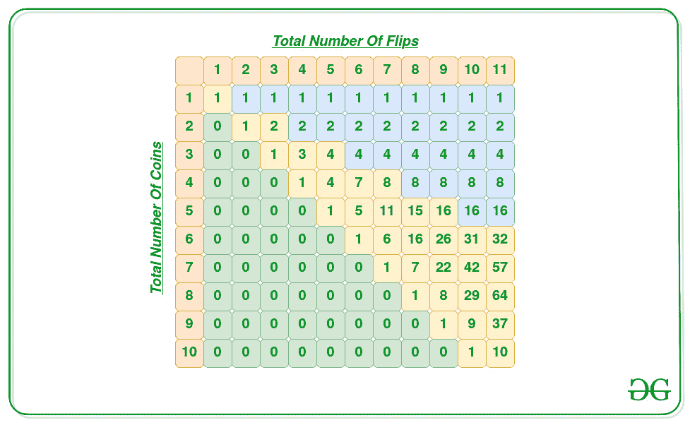

# 通过对 N 枚硬币进行 S 翻转来计算所有可能的独特结果

> 原文:[https://www . geeksforgeeks . org/count-all-unique-outcomes-通过在 n 个硬币上执行 s-flips 来实现可能的结果/](https://www.geeksforgeeks.org/count-all-unique-outcomes-possible-by-performing-s-flips-on-n-coins/)

给定两个正整数 **N** 和 **S** ，任务是计算在 **N** 硬币上执行 S 翻转操作时可能出现的独特结果的数量。

**示例:**

> **输入:** N = 3，S = 4
> **输出:** 3
> **说明:**考虑到硬币初始配置为“HHH”，那么 4 次空翻的可能组合为:
> 
> 1.  翻转 1 <sup>st</sup> 和 2 <sup>nd</sup> 硬币一次，第三枚硬币两次，将配置修改为“TTH”。
> 2.  翻转 1 <sup>st</sup> 和 3 <sup>rd</sup> 硬币一次，2 <sup>nd</sup> 硬币两次，将配置修改为“THT”。
> 3.  翻转 2 <sup>nd</sup> 和 3 <sup>rd</sup> 硬币一次，1 <sup>st</sup> 硬币两次，将配置修改为“HTT”。
> 
> 以上三种组合是独一无二的。因此，总数为 3。
> 
> **输入:** N = 3，S = 6
> T3】输出: 4

**天真方法:**给定的问题可以通过使用[递归](https://www.geeksforgeeks.org/recursion/)来解决，其递归状态定义为:

*   考虑 **F(N，S)** 代表投掷 **N 枚硬币**时独特结果的数量，翻转总数等于 **S** 。
*   那么 **F(N，S)** 也可以表示为 1 次翻转或 2 次翻转的所有组合之和，即，

> F(N，S)= F(N–1，S–1)+F(N–1，S–2)

*   此递归关系的基本情况是 **F(K，K)** ，其值为所有 **(K > 1)** 的 **1** 。
*   下表显示了 **F(N，S)= F(N–1，S–1)+F(N–1，S–2)**的分布，其中 **F(K，K) = 1** 。

[](https://media.geeksforgeeks.org/wp-content/uploads/20210316175352/564572.jpg)

按照以下步骤解决问题:

*   声明一个函数，比如**numberofuniqueouts(N，S)** 分别以允许的硬币数和翻转数为参数，执行以下步骤:
    *   如果 **S** 的值小于 **N** ，则从功能中返回 **0** 。
    *   如果 **N** 的值为 **S** 或 **1** ，则从函数中返回 **1** ，因为这是唯一的组合之一。
    *   [递归](https://www.geeksforgeeks.org/recursion/)返回两个递归状态的总和，如下所示:

> 返回**numberof uniqueouts(N–1，S–1)+numberof uniqueouts(N–1，S–2)**

*   完成上述步骤后，打印函数**numberofuniqueouts(N，S)** 返回的值作为结果数。

下面是上述方法的实现:

## C++

```
// C++ program for the above approach
#include <bits/stdc++.h>
using namespace std;

// Function to recursively count the
// number of unique outcomes possible
// S flips are performed on N coins
int numberOfUniqueOutcomes(int N, int S)
{
    // Base Cases
    if (S < N)
        return 0;
    if (N == 1 || N == S)
        return 1;

    // Recursive Calls
    return (numberOfUniqueOutcomes(N - 1, S - 1)
            + numberOfUniqueOutcomes(N - 1, S - 2));
}

// Driver Code
int main()
{
    int N = 3, S = 4;

    cout << numberOfUniqueOutcomes(N, S);

    return 0;
}
```

## Java 语言(一种计算机语言，尤用于创建网站)

```
// Java program for the above approach
import java.io.*;
class GFG
{

  // Function to recursively count the
  // number of unique outcomes possible
  // S flips are performed on N coins
  static int numberOfUniqueOutcomes(int N, int S)
  {

    // Base Cases
    if (S < N)
      return 0;
    if (N == 1 || N == S)
      return 1;

    // Recursive Calls
    return (numberOfUniqueOutcomes(N - 1, S - 1)
            + numberOfUniqueOutcomes(N - 1, S - 2));
  }

  // Driver Code
  public static void main (String[] args)
  {
    int N = 3, S = 4;
    System.out.println(numberOfUniqueOutcomes(N, S));
  }
}

//  This code is contributed by avanitrachhadiya2155
```

## 蟒蛇 3

```
# Python3 program for the above approach

# Function to recursively count the
# number of unique outcomes possible
# S flips are performed on N coins
def numberOfUniqueOutcomes(N, S):

    # Base Cases
    if (S < N):
        return 0
    if (N == 1 or N == S):
        return 1

    # Recursive Calls
    return (numberOfUniqueOutcomes(N - 1, S - 1) +
            numberOfUniqueOutcomes(N - 1, S - 2))

# Driver Code
if __name__ == '__main__':

    N, S = 3, 4

    print (numberOfUniqueOutcomes(N, S))

# This code is contributed by mohit kumar 29
```

## C#

```
// C# program for the above approach
using System;

class GFG{

// Function to recursively count the
// number of unique outcomes possible
// S flips are performed on N coins
static int numberOfUniqueOutcomes(int N, int S)
{

    // Base Cases
    if (S < N)
        return 0;
    if (N == 1 || N == S)
        return 1;

    // Recursive Calls
    return (numberOfUniqueOutcomes(N - 1, S - 1) +
            numberOfUniqueOutcomes(N - 1, S - 2));
}

// Driver Code
static public void Main()
{
    int N = 3, S = 4;

    Console.WriteLine(numberOfUniqueOutcomes(N, S));
}
}

// This code is contributed by sanjoy_62
```

## java 描述语言

```
<script>
        // Javascript program for the above approach

        // Function to recursively count the
        // number of unique outcomes possible
        // S flips are performed on N coins
        function numberOfUniqueOutcomes(N, S) {
            // Base Cases
            if (S < N)
                return 0;
            if (N == 1 || N == S)
                return 1;

            // Recursive Calls
            return (numberOfUniqueOutcomes(N - 1, S - 1)
                + numberOfUniqueOutcomes(N - 1, S - 2));
        }

        // Driver Code

        let N = 3, S = 4;

        document.write(numberOfUniqueOutcomes(N, S))

        // This code is contributed by Hritik
    </script>
```

**Output:** 

```
3
```

***时间复杂度:**O(2<sup>N</sup>)*
***辅助空间:** O(N)*

**有效方法:**上述方法也可以通过存储递归状态进行优化，因为它包含[重叠子问题](https://www.geeksforgeeks.org/overlapping-subproblems-property-in-dynamic-programming-dp-1/)。因此，想法是使用[记忆](https://www.geeksforgeeks.org/tabulation-vs-memoization/)来存储重复的状态。按照以下步骤解决问题:

*   初始化一个 2D [数组](https://www.geeksforgeeks.org/introduction-to-arrays/)，比如说 **dp[][]** 的维度 **N*M** ，这样 **dp[i][j]** 使用 **i** 硬币和 **j** 翻转次数来存储可能结果的数量。
*   声明一个函数，比如**numberofuniqueouts(N，S)** ，分别以允许的硬币数和翻转数为参数，执行以下步骤:
    *   如果 **S** 的值小于 **N** ，则将**DP【N】【S】**的值更新为 **0** ，并从函数中返回该值。
    *   如果 **N** 的值为 **S** 或 **1** ，则将**DP【N】【S】**的值更新为 **1** ，并从函数中返回该值，因为这是唯一的组合之一。
    *   如果已经计算出 **dp[N][S]** 的值，则从函数中返回值 **dp[N][S]** 。
    *   [递归](https://www.geeksforgeeks.org/recursion/)更新如下所示的两个递归状态的**DP【N】【S】**之和的值，并从函数中返回该值。

> **DP[N][S]= numberof niqueouts(N–1，S–1)+numberof niqueouts(N–1，S–2)**

*   完成上述步骤后，打印函数**numberofuniqueouts(N，S)** 返回的值作为结果数。

下面是上述方法的实现:

## C++

```
// C++ program for the above approach

#include <bits/stdc++.h>
using namespace std;

// Dimensions of the DP table
#define size 1001

// Stores the dp states
int ans[size][size] = { 0 };

// Function to recursively count the
// number of unique outcomes possible
// by performing S flips on N coins
int numberOfUniqueOutcomes(int n, int s)
{
    // Base Case
    if (s < n)
        ans[n][s] = 0;

    else if (n == 1 || n == s)
        ans[n][s] = 1;

    // If the count for the current
    // state is not calculated, then
    // calculate it recursively
    else if (!ans[n][s]) {
        ans[n][s] = numberOfUniqueOutcomes(n - 1,
                                           s - 1)
                    + numberOfUniqueOutcomes(n - 1,
                                             s - 2);
    }

    // Otherwise return the
    // already calculated value
    return ans[n][s];
}

// Driver Code
int main()
{
    int N = 5, S = 8;

    cout << numberOfUniqueOutcomes(N, S);

    return 0;
}
```

## Java 语言(一种计算机语言，尤用于创建网站)

```
// Java program for the above approach

import java.util.*;

class GFG{

 // Dimensions of the DP table
static int size = 100;
static int [][]ans = new int[size][size];

static void initialize()
{

  // Stores the dp states
  for(int i = 0; i < size; i++)
  {
    for(int j = 0; j < size; j++)
    {
        ans[i][j] = 0;
    }
}
}

// Function to recursively count the
// number of unique outcomes possible
// by performing S flips on N coins
static int numberOfUniqueOutcomes(int n, int s)
{
    // Base Case
    if (s < n)
        ans[n][s] = 0;

    else if (n == 1 || n == s)
        ans[n][s] = 1;

    // If the count for the current
    // state is not calculated, then
    // calculate it recursively
    else if (ans[n][s] == 0) {
        ans[n][s] = numberOfUniqueOutcomes(n - 1,
                                           s - 1)
                    + numberOfUniqueOutcomes(n - 1,
                                             s - 2);
    }

    // Otherwise return the
    // already calculated value
    return ans[n][s];
}

// Driver Code
public static void main(String args[])
{
    initialize();
    int N = 5, S = 8;
    System.out.println(numberOfUniqueOutcomes(N, S));
}
}

// This code is contributed by SURENDRA_GANGWAR.
```

## 蟒蛇 3

```
# Python3 program for the above approach

# Dimensions of the DP table
size = 100

# Stores the dp states
ans = [[0 for i in range(size)]
          for j in range(size)]

# Function to recursively count the
# number of unique outcomes possible
# by performing S flips on N coins
def numberOfUniqueOutcomes(n, s):

    # Base Case
    if (s < n):
        ans[n][s] = 0;

    elif (n == 1 or n == s):
        ans[n][s] = 1;

    # If the count for the current
    # state is not calculated, then
    # calculate it recursively
    elif(ans[n][s] == 0):
        ans[n][s] = (numberOfUniqueOutcomes(n - 1, s - 1) +
                     numberOfUniqueOutcomes(n - 1, s - 2))

    # Otherwise return the
    # already calculated value
    return ans[n][s];

# Driver Code
N = 5
S = 8

print(numberOfUniqueOutcomes(N, S))

# This code is contributed by rag2127
```

## C#

```
// C# program for the above approach
using System;

class GFG{

// Dimensions of the DP table
static int size = 100;
static int [,]ans = new int[size, size];

static void initialize()
{

    // Stores the dp states
    for(int i = 0; i < size; i++)
    {
        for(int j = 0; j < size; j++)
        {
            ans[i, j] = 0;
        }
    }
}

// Function to recursively count the
// number of unique outcomes possible
// by performing S flips on N coins
static int numberOfUniqueOutcomes(int n, int s)
{

    // Base Case
    if (s < n)
        ans[n, s] = 0;

    else if (n == 1 || n == s)
        ans[n, s] = 1;

    // If the count for the current
    // state is not calculated, then
    // calculate it recursively
    else if (ans[n, s] == 0)
    {
        ans[n, s] = numberOfUniqueOutcomes(n - 1,
                                           s - 1) +
                    numberOfUniqueOutcomes(n - 1,
                                           s - 2);
    }

    // Otherwise return the
    // already calculated value
    return ans[n,s];
}

// Driver Code
public static void Main(string []args)
{
    initialize();
    int N = 5, S = 8;

    Console.WriteLine(numberOfUniqueOutcomes(N, S));
}
}

// This code is contributed by AnkThon
```

## java 描述语言

```
<script>

    // JavaScript program for the above approach

    // Dimensions of the DP table
    let size = 100;
    let ans = new Array(size);

    function initialize()
    {

      // Stores the dp states
      for(let i = 0; i < size; i++)
      {
          ans[i] = new Array(size);
        for(let j = 0; j < size; j++)
        {
            ans[i][j] = 0;
        }
      }
    }

    // Function to recursively count the
    // number of unique outcomes possible
    // by performing S flips on N coins
    function numberOfUniqueOutcomes(n, s)
    {
        // Base Case
        if (s < n)
            ans[n][s] = 0;

        else if (n == 1 || n == s)
            ans[n][s] = 1;

        // If the count for the current
        // state is not calculated, then
        // calculate it recursively
        else if (ans[n][s] == 0) {
            ans[n][s] = numberOfUniqueOutcomes(n - 1,
                                               s - 1)
                        + numberOfUniqueOutcomes(n - 1,
                                                 s - 2);
        }

        // Otherwise return the
        // already calculated value
        return ans[n][s];
    }

    initialize();
    let N = 5, S = 8;
    document.write(numberOfUniqueOutcomes(N, S));

</script>
```

**Output:** 

```
15
```

***时间复杂度:** O(N*S)*
***辅助空间:** O(N*S)*