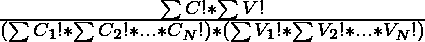

# 将第一个字符为辅音且没有相邻的一对辅音或元音的字谜计数

> 原文:[https://www . geeksforgeeks . org/count-anagrams-有第一个字符作为辅音和无辅音或元音对-相邻放置/](https://www.geeksforgeeks.org/count-anagrams-having-first-character-as-a-consonant-and-no-pair-of-consonants-or-vowels-placed-adjacently/)

给定一个长度为 **N** 的[串](https://www.geeksforgeeks.org/string-data-structure/) **S** ，任务是统计第一个字符为辅音且没有一对辅音或元音相邻的 **S** 的[字谜的数量。](https://www.geeksforgeeks.org/check-whether-two-strings-are-anagram-of-each-other/)

**示例:**

> **输入:**S =【GADO】
> **输出:** 4
> **说明:**
> 满足给定条件的字符串 S 的字谜是 GADO、GODA、DOGA、DAGO。
> 所以这样的字谜总数是 4 个。
> 
> **输入:**S =“AABCY”
> T3】输出: 6
> **说明:**
> 满足给定条件的字符串 S 的字谜是 BACAY、BAYAC、CABAY、CAYAB、YABAC、YACAB。
> 因此，这样的字谜总数为 6 个。

**天真方法:**最简单的方法是[生成给定字符串](https://www.geeksforgeeks.org/write-a-c-program-to-print-all-permutations-of-a-given-string/)的所有可能的字谜，并对那些满足给定条件的字谜进行计数。最后，打印获得的**计数**。
***时间复杂度:** O(N！*N)*
***辅助空间:** O(1)*

**高效方法:**上述方法也可以基于以下观察进行优化:

*   辅音和元音数量相等的字符串满足给定条件。
*   辅音多于元音的字符串也满足给定条件。
*   除了这两个条件，可能的字谜计数永远是 **0** 。
*   现在，这个问题可以通过使用组合公式来解决。假设有 **C <sub>1</sub> 、C<sub>2</sub>……、C <sub>N</sub>** 辅音和 **V <sub>1</sub> 、V<sub>2</sub>……、V <sub>N</sub>** 字符串中的元音分别为 **S** 和和\sum C 表示辅音和元音的总数，那么答案应该是:

> 
> 
> 其中，
> C <sub>i</sub> 是 i <sup>第</sup>辅音的个数。
> <sub>Vi</sub> 是 i <sup>第</sup>个元音的计数。

按照以下步骤解决问题:

*   初始化一个变量，说**回答**，存储字谜总数。
*   将字符串 **S** 每个字符的[频率存储在](https://www.geeksforgeeks.org/frequency-of-each-character-in-a-string-using-unordered_map-in-c/)[哈希表](https://www.geeksforgeeks.org/unordered_map-in-cpp-stl/) **计数**中。
*   将**S**T3【中】的元音和辅音的[个数分别存储在变量 **V** 和 **C** 中。](https://www.geeksforgeeks.org/program-count-vowels-consonant-digits-special-characters-string/)
*   如果 **V** 的值不等于 **C** 或 **C** 不等于 **(V + 1)** ，则打印 **0** 。否则，执行以下步骤:
    *   将**分母**初始化为 **1** 。
    *   [使用变量 **i** 遍历字符串](https://www.geeksforgeeks.org/iterate-over-characters-of-a-string-in-c/) **S** ，并将**分母**更新为**分母*(计数【S[i]】)！)**。
    *   将**分子**初始化为 **V！*C！**，将**答案**的值更新为**分子/分母**。
*   完成以上步骤后，打印**答案**的值作为结果。

下面是上述方法的实现:

## C++

```
// C++ program for the above approach
#include <bits/stdc++.h>

#define ll long long
#define mod 1000000007
#define N 1000001
using namespace std;

// Function to compute factorials till N
void Precomputefact(unordered_map<ll, ll>& fac)
{
    ll ans = 1;

    // Iterate in the range [1, N]
    for (ll i = 1; i <= N; i++) {

        // Update ans to ans*i
        ans = (ans * i) % mod;

        // Store the value of ans
        // in fac[i]
        fac[i] = ans;
    }
    return;
}

// Function to check whether the
// current character is a vowel or not
bool isVowel(char a)
{
    if (a == 'A' || a == 'E' || a == 'I' || a == 'O'
        || a == 'U')
        return true;
    else
        return false;
}

// Function to count the number of
// anagrams of S satisfying the
// given condition
void countAnagrams(string s, int n)
{
    // Store the factorials upto N
    unordered_map<ll, ll> fac;

    // Function Call to generate
    // all factorials upto n
    Precomputefact(fac);

    // Create a hashmap to store
    // frequencies of all characters
    unordered_map<char, ll> count;

    // Store the count of
    // vowels and consonants
    int vo = 0, co = 0;

    // Iterate through all
    // characters in the string
    for (int i = 0; i < n; i++) {

        // Update the frequency
        // of current character
        count[s[i]]++;

        // Check if the character
        // is vowel or consonant
        if (isVowel(s[i]))
            vo++;
        else
            co++;
    }

    // Check if ΣC==ΣV+1 or ΣC==ΣV
    if ((co == vo + 1) || (co == vo)) {

        // Store the denominator
        ll deno = 1;

        // Calculate the denominator
        // of the expression
        for (auto c : count) {

            // Multiply denominator by factorial
            // of counts of all letters
            deno = (deno * fac[c.second]) % mod;
        }

        // Store the numerator
        ll nume = fac[co] % mod;
        nume = (nume * fac[vo]) % mod;

        // Store the answer by dividing
        // numerator by denominator
        ll ans = nume / deno;

        // Print the answer
        cout << ans;
    }

    // Otherwise, print 0
    else {
        cout << 0;
    }
}

// Driver Code
int main()
{
    string S = "GADO";
    int l = S.size();
    countAnagrams(S, l);

    return 0;
}
```

## 蟒蛇 3

```
# Python 3 program for the above approach
#include <bits/stdc++.h>

mod = 1000000007
N = 1000001

fac = {}

# Function to compute factorials till N
def Precomputefact():
    global fac
    ans = 1

    # Iterate in the range [1, N]
    for i in range(1,N+1,1):
        # Update ans to ans*i
        ans = (ans * i) % mod

        # Store the value of ans
        # in fac[i]
        fac[i] = ans

    return

# Function to check whether the
# current character is a vowel or not
def isVowel(a):
    if (a == 'A' or a == 'E' or a == 'I' or a == 'O' or a == 'U'):
        return True
    else:
        return False

# Function to count the number of
# anagrams of S satisfying the
# given condition
def countAnagrams(s,n):
    # Store the factorials upto N
    global fac

    # Function Call to generate
    # all factorials upto n
    Precomputefact()

    # Create a hashmap to store
    # frequencies of all characters
    count = {}

    # Store the count of
    # vowels and consonants
    vo = 0
    co = 0

    # Iterate through all
    # characters in the string
    for i in range(n):
        # Update the frequency
        # of current character
        if s[i] in count:
            count[s[i]] += 1
        else:
            count[s[i]] = 1

        # Check if the character
        # is vowel or consonant
        if (isVowel(s[i])):
            vo += 1
        else:
            co += 1

    # Check if ΣC==ΣV+1 or ΣC==ΣV
    if ((co == vo + 1) or (co == vo)):
        # Store the denominator
        deno = 1

        # Calculate the denominator
        # of the expression
        for key,value in count.items():
            # Multiply denominator by factorial
            # of counts of all letters
            deno = (deno * fac[value]) % mod

        # Store the numerator
        nume = fac[co] % mod
        nume = (nume * fac[vo]) % mod

        # Store the answer by dividing
        # numerator by denominator
        ans = nume // deno

        # Print the answer
        print(ans)

    # Otherwise, print 0
    else:
        print(0)

# Driver Code
if __name__ == '__main__':
    S = "GADO"
    l = len(S)
    countAnagrams(S, l)

    # This code is contributed by ipg2016107.
```

**Output:** 

```
4
```

***时间复杂度:**O(N)*
T5**辅助空间:** O(N)