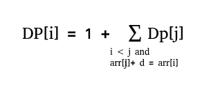

# 数组中 AP(算术级数)子序列的计数

> 原文:[https://www . geesforgeks . org/count-算术-级数-子序列-数组/](https://www.geeksforgeeks.org/count-arithmetic-progression-subsequences-array/)

给定一组 **n 个**正整数。任务是计算数组中算术级数子序列的数量。注意:空序列或单元素序列是算术级数。1 < = arr[i] < = 1000000。
示例:

```
Input : arr[] = { 1, 2, 3 }
Output : 8
Arithmetic Progression subsequence from the 
given array are: {}, { 1 }, { 2 }, { 3 }, { 1, 2 },
{ 2, 3 }, { 1, 3 }, { 1, 2, 3 }.

Input : arr[] = { 10, 20, 30, 45 }
Output : 12

Input : arr[] = { 1, 2, 3, 4, 5 }
Output : 23
```

由于空序列和单元素序列也是等差数列，所以我们用 n(数组中的元素个数)+ 1 初始化答案。
现在，我们需要找到长度大于等于 2 的算术级数子序列。设数组的最小值和最大值分别为 minarr 和 maxarr。注意，在所有算术级数子序列中，公共差的范围将从(minar–max arr)到(max arr–minar)。现在，对于每个常见的差异，比如 d，使用动态编程计算长度大于或等于 2 的子序列。
设 dp[i]是以 arr[i]结尾的子序列的数目，并且具有 d 的公共差。所以，



长度大于或等于 2 且具有公共差 d 的子序列的数目是 DP[I]–1，0 的和<= i = 2 with difference d. To speed up, store the sum of dp[j] with arr[j] + d = arr[i] and j < i.
以下是上述思想的实现:

## C++

```
// C++ program to find number of AP
// subsequences in the given array
#include<bits/stdc++.h>
#define MAX 1000001
using namespace std;

int numofAP(int a[], int n)
{
    // initializing the minimum value and
    // maximum value of the array.
    int minarr = INT_MAX, maxarr = INT_MIN;

    // Finding the minimum and maximum
    // value of the array.
    for (int i = 0; i < n; i++)
    {
        minarr = min(minarr, a[i]);
        maxarr = max(maxarr, a[i]);
    }

    // dp[i] is going to store count of APs ending
    // with arr[i].
    // sum[j] is going to store sun of all dp[]'s
    // with j as an AP element.
    int dp[n], sum[MAX];

    // Initialize answer with n + 1 as single elements
    // and empty array are also DP.
    int ans = n + 1;

    // Traversing with all common difference.
    for (int d=(minarr-maxarr); d<=(maxarr-minarr); d++)
    {
        memset(sum, 0, sizeof sum);

        // Traversing all the element of the array.
        for (int i = 0; i < n; i++)
        {
            // Initialize dp[i] = 1.
            dp[i] = 1;

            // Adding counts of APs with given differences
            // and a[i] is last element. 
            // We consider all APs where an array element
            // is previous element of AP with a particular
            // difference
            if (a[i] - d >= 1 && a[i] - d <= 1000000)
                dp[i] += sum[a[i] - d];

            ans += dp[i] - 1;
            sum[a[i]] += dp[i];
        }
    }

    return ans;
}

// Driver code
int main()
{
    int arr[] = { 1, 2, 3 };
    int n = sizeof(arr)/sizeof(arr[0]);
    cout << numofAP(arr, n) << endl;
    return 0;
}
```

## Java 语言(一种计算机语言，尤用于创建网站)

```
// Java program to find number of AP
// subsequences in the given array
import java.util.Arrays;

class GFG {

    static final int MAX = 1000001;

    static int numofAP(int a[], int n)
    {

        // initializing the minimum value and
        // maximum value of the array.
        int minarr = +2147483647;
        int maxarr = -2147483648;

        // Finding the minimum and maximum
        // value of the array.
        for (int i = 0; i < n; i++) {
            minarr = Math.min(minarr, a[i]);
            maxarr = Math.max(maxarr, a[i]);
        }

        // dp[i] is going to store count of
        // APs ending with arr[i].
        // sum[j] is going to store sun of
        // all dp[]'s with j as an AP element.
        int dp[] = new int[n];
        int sum[] = new int[MAX];

        // Initialize answer with n + 1 as
        // single elements and empty array
        // are also DP.
        int ans = n + 1;

        // Traversing with all common
        // difference.
        for (int d = (minarr - maxarr);
                d <= (maxarr - minarr); d++)
        {
            Arrays.fill(sum, 0);

            // Traversing all the element
            // of the array.
            for (int i = 0; i < n; i++) {

                // Initialize dp[i] = 1.
                dp[i] = 1;

                // Adding counts of APs with
                // given differences and a[i]
                // is last element.
                // We consider all APs where
                // an array element is previous
                // element of AP with a particular
                // difference
                if (a[i] - d >= 1 &&
                             a[i] - d <= 1000000)
                    dp[i] += sum[a[i] - d];

                ans += dp[i] - 1;
                sum[a[i]] += dp[i];
            }
        }

        return ans;
    }

    // Driver code
    public static void main(String[] args)
    {
        int arr[] = { 1, 2, 3 };
        int n = arr.length;

        System.out.println(numofAP(arr, n));
    }
}

// This code is contributed by Anant Agarwal.
```

## 蟒蛇 3

```
# Python program to find number of AP
# subsequences in the given array

MAX = 1000001

def numofAP(a, n):

    # initializing the minimum value and
    # maximum value of the array.
    minarr = +2147483647
    maxarr = -2147483648

    # Finding the minimum and
    # maximum value of the array.
    for i in range(n):
        minarr = min(minarr, a[i])
        maxarr = max(maxarr, a[i])

    # dp[i] is going to store count of APs ending
    # with arr[i].
    # sum[j] is going to store sun of all dp[]'s
    # with j as an AP element.
    dp = [0 for i in range(n + 1)]

    # Initialize answer with n + 1 as single
    # elements and empty array are also DP.
    ans = n + 1

    # Traversing with all common difference.
    for d in range((minarr - maxarr), (maxarr - minarr) + 1):
        sum = [0 for i in range(MAX + 1)]

        # Traversing all the element of the array.
        for i in range(n):

            # Initialize dp[i] = 1.
            dp[i] = 1

            # Adding counts of APs with given differences
            # and a[i] is last element.
            # We consider all APs where an array element
            # is previous element of AP with a particular
            # difference
            if (a[i] - d >= 1 and a[i] - d <= 1000000):
                dp[i] += sum[a[i] - d]

            ans += dp[i] - 1
            sum[a[i]] += dp[i]

    return ans

# Driver code
arr = [ 1, 2, 3 ]
n = len(arr)

print(numofAP(arr, n))

# This code is contributed by Anant Agarwal.
```

## C#

```
// C# program to find number of AP
// subsequences in the given array
using System;

class GFG {

    static int MAX = 1000001;

    // Function to find number of AP
    // subsequences in the given array
    static int numofAP(int []a, int n)
    {

        // initializing the minimum value and
        // maximum value of the array.
        int minarr = +2147483647;
        int maxarr = -2147483648;
        int i;

        // Finding the minimum and maximum
        // value of the array.
        for (i = 0; i < n; i++)
        {
            minarr = Math.Min(minarr, a[i]);
            maxarr = Math.Max(maxarr, a[i]);
        }

        // dp[i] is going to store count of
        // APs ending with arr[i].
        // sum[j] is going to store sun of
        // all dp[]'s with j as an AP element.
        int []dp = new int[n];
        int []sum = new int[MAX];

        // Initialize answer with n + 1 as
        // single elements and empty array
        // are also DP.
        int ans = n + 1;

        // Traversing with all common
        // difference.
        for (int d = (minarr - maxarr);
                 d <= (maxarr - minarr); d++)
        {

            for(i = 0; i < MAX; i++)
            sum[i]= 0;

            // Traversing all the element
            // of the array.
            for ( i = 0; i < n; i++)
            {

                // Initialize dp[i] = 1.
                dp[i] = 1;

                // Adding counts of APs with
                // given differences and a[i]
                // is last element.
                // We consider all APs where
                // an array element is previous
                // element of AP with a particular
                // difference
                if (a[i] - d >= 1 &&
                    a[i] - d <= 1000000)
                    dp[i] += sum[a[i] - d];

                ans += dp[i] - 1;
                sum[a[i]] += dp[i];
            }
        }

        return ans;
    }

    // Driver code
    public static void Main()
    {
        int []arr = {1, 2, 3};
        int n = arr.Length;

        Console.WriteLine(numofAP(arr, n));
    }
}

// This code is contributed by vt_m.
```

## java 描述语言

```
<script>
    // Javascript program to find number of AP
    // subsequences in the given array

    let MAX = 1000001;

    function numofAP(a, n)
    {

        // initializing the minimum value and
        // maximum value of the array.
        let minarr = +2147483647;
        let maxarr = -2147483648;

        // Finding the minimum and maximum
        // value of the array.
        for (let i = 0; i < n; i++) {
            minarr = Math.min(minarr, a[i]);
            maxarr = Math.max(maxarr, a[i]);
        }

        // dp[i] is going to store count of
        // APs ending with arr[i].
        // sum[j] is going to store sun of
        // all dp[]'s with j as an AP element.
        let dp = new Array(n);
        let sum = new Array(MAX);

        // Initialize answer with n + 1 as
        // single elements and empty array
        // are also DP.
        let ans = n + 1;

        // Traversing with all common
        // difference.
        for (let d = (minarr - maxarr);
                d <= (maxarr - minarr); d++)
        {
            sum.fill(0);

            // Traversing all the element
            // of the array.
            for (let i = 0; i < n; i++) {

                // Initialize dp[i] = 1.
                dp[i] = 1;

                // Adding counts of APs with
                // given differences and a[i]
                // is last element.
                // We consider all APs where
                // an array element is previous
                // element of AP with a particular
                // difference
                if (a[i] - d >= 1 &&
                             a[i] - d <= 1000000)
                    dp[i] += sum[a[i] - d];

                ans += dp[i] - 1;
                sum[a[i]] += dp[i];
            }
        }

        return ans;
    }

    let arr = [ 1, 2, 3 ];
    let n = arr.length;

    document.write(numofAP(arr, n));

</script>
```

输出:

```
8
```

本文由 [**Anuj Chauhan**](https://www.facebook.com/anuj0503) 供稿。如果你喜欢 GeeksforGeeks 并想投稿，你也可以使用[write.geeksforgeeks.org](https://write.geeksforgeeks.org)写一篇文章或者把你的文章邮寄到 contribute@geeksforgeeks.org。看到你的文章出现在极客博客主页上，帮助其他极客。
如果发现有不正确的地方，或者想分享更多关于上述话题的信息，请写评论。