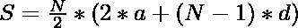
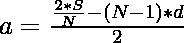

# 计算和为 S 且公共差等于 D 的算术级数

> 原文:[https://www . geesforgeks . org/count-算术-progressions-having-sum-s-and-common-difference-equal-to-d/](https://www.geeksforgeeks.org/count-arithmetic-progressions-having-sum-s-and-common-difference-equal-to-d/)

给定两个整数 **S** 和 **D** ，任务是用和 **S** 和公差 **D** 计算[算术级数](https://www.geeksforgeeks.org/arithmetic-progression/)的可能个数。

**示例:**

> **输入:** S = 12，D = 1
> **输出:** 4
> **说明:**以下 4 种算术级数有可能和 12 及公差 1:
> 
> 1.  {1, 2}
> 2.  {3, 4, 5}
> 3.  {-2, -1, 0, 1, 2, 3, 4, 5}
> 4.  {-11, -10, -9, …, 10, 11, 12}
> 
> **输入:** S = 1，D = 1
> T3】输出: 2

**方法:**给定的问题可以基于以下观察来解决:

*   AP 系列的[和由下式给出:](https://www.geeksforgeeks.org/program-sum-arithmetic-series/)

> 
> 
> 其中，
> **S** 是 AP 系列的和，
> **a** 是该系列的首项，
> **N** 是该系列中的项数，
> **d** 是共同的区别

*   重新排列以上表达式后:

> = > 2 * S = N *(2 * a+(N–1)* d)……(1)
> 
> = >……(2)

*   从上面两个表达式来看:
    *   思路是综合考虑 **2*S** 的所有因素，检查是否存在 **F** 这样的因素使得 **F** 和**(2 * a+(F–1)* d)**的乘积等于 **2 * S** 。如果发现为真，则计算具有给定总和 **S** 的一个可能的 **AP** 的因子。
    *   如果存在任何因子 **F** ，使得**(D * F –( 2 * S/F)+D)**可被 **2** 整除，则计算具有给定和 **S** 的可能的 **AP** 之一的因子。

按照以下步骤解决问题:

*   初始化一个变量，说**回答**，用和 **S** 和公差 **D** 存储 **AP** s 的计数。
*   [迭代范围](https://www.geeksforgeeks.org/range-based-loop-c/)**【1，√2 * S】**并检查 **2 * S** 是否被 **i** 整除，然后执行以下步骤:
    *   如果**((2 * S/I)+1–I * D)**的值可被 **2** 整除，则用 **1** 递增**答案**。
    *   如果**(I * D–S/I+1)**的值可被 **2** 整除，则用 **1** 递增**答案**。
*   完成以上步骤后，打印**答案**的值作为 **AP** s 的结果计数

下面是上述方法的实现:

## C++

```
// C++ program for the above approach

#include <bits/stdc++.h>
using namespace std;

// Function to count the number of APs
// with sum S and common difference D
int countAPs(int S, int D)
{
    // Multiply S by 2
    S = S * 2;

    // Stores the count of APs
    int answer = 0;

    // Iterate over the factors of 2*S
    for (int i = 1; i <= sqrt(S); i++) {

        // Check if i is the factor
        // or not
        if (S % i == 0) {

            // Conditions to check if AP
            // can be formed using factor F
            if (((S / i) - D * i + D) % 2 == 0)
                answer++;

            if ((D * i - (S / i) + D) % 2 == 0)
                answer++;
        }
    }

    // Return the total count of APs
    return answer;
}

// Driver Code
int main()
{
    int S = 12, D = 1;
    cout << countAPs(S, D);

    return 0;
}
```

## Java 语言(一种计算机语言，尤用于创建网站)

```
// Java program for above approach
/*package whatever //do not write package name here */
import java.io.*;
class GFG
{

// Function to count the number of APs
// with sum S and common difference D
static int countAPs(int S, int D)
{

    // Multiply S by 2
    S = S * 2;

    // Stores the count of APs
    int answer = 0;

    // Iterate over the factors of 2*S
    for (int i = 1; i <= Math.sqrt(S); i++) {

        // Check if i is the factor
        // or not
        if (S % i == 0) {

            // Conditions to check if AP
            // can be formed using factor F
            if (((S / i) - D * i + D) % 2 == 0)
                answer++;

            if ((D * i - (S / i) + D) % 2 == 0)
                answer++;
        }
    }

    // Return the total count of APs
    return answer;
}

// Driver code
public static void main(String[] args)
{
    int S = 12, D = 1;
    System.out.println(countAPs(S, D));
}
}

// This code is contributed by susmitakundugoaldanga.
```

## 蟒蛇 3

```
# Python3 program for the above approach

# Function to count the number of APs
# with sum S and common difference D
def countAPs(S, D):

    # Multiply S by 2
    S = S * 2

    # Stores the count of APs
    answer = 0

    # Iterate over the factors of 2*S
    for i in range(1, S):

        if i * i > S:
            break

        # Check if i is the factor
        # or not
        if (S % i == 0):

            # Conditions to check if AP
            # can be formed using factor F
            if (((S // i) - D * i + D) % 2 == 0):
                answer += 1

            if ((D * i - (S // i) + D) % 2 == 0):
                answer += 1

    # Return the total count of APs
    return answer

# Driver Code
if __name__ == '__main__':
    S, D = 12, 1
    print(countAPs(S, D));

    # This code is contributed by mohit kumar 29.
```

## C#

```
// C# program for the above approach
using System;

class GFG{

  // Function to count the number of APs
  // with sum S and common difference D
  static int countAPs(int S, int D)
  {

    // Multiply S by 2
    S = S * 2;

    // Stores the count of APs
    int answer = 0;

    // Iterate over the factors of 2*S
    for (int i = 1; i <= Math.Sqrt(S); i++) {

      // Check if i is the factor
      // or not
      if (S % i == 0) {

        // Conditions to check if AP
        // can be formed using factor F
        if (((S / i) - D * i + D) % 2 == 0)
          answer++;

        if ((D * i - (S / i) + D) % 2 == 0)
          answer++;
      }
    }

    // Return the total count of APs
    return answer;
  }

  // Driver code
  static void Main()
  {
    int S = 12, D = 1;
    Console.Write(countAPs(S, D));
  }
}

// This code is contributed by sanjoy_62.
```

## java 描述语言

```
<script>

// Javascript program for the above approach

// Function to count the number of APs
// with sum S and common difference D
function countAPs(S, D)
{

    // Multiply S by 2
    S = S * 2;

    // Stores the count of APs
    let answer = 0;

    // Iterate over the factors of 2*S
    for (let i = 1; i <= Math.sqrt(S); i++) {

        // Check if i is the factor
        // or not
        if (S % i == 0) {

            // Conditions to check if AP
            // can be formed using factor F
            if (((S / i) - D * i + D) % 2 == 0)
                answer++;

            if ((D * i - (S / i) + D) % 2 == 0)
                answer++;
        }
    }

    // Return the total count of APs
    return answer;
}

// Driver code

    let S = 12, D = 1;
    document.write(countAPs(S, D));

</script>
```

**Output:** 

```
4
```

***时间复杂度:** O(√S)*
***辅助空间:** O(1)*