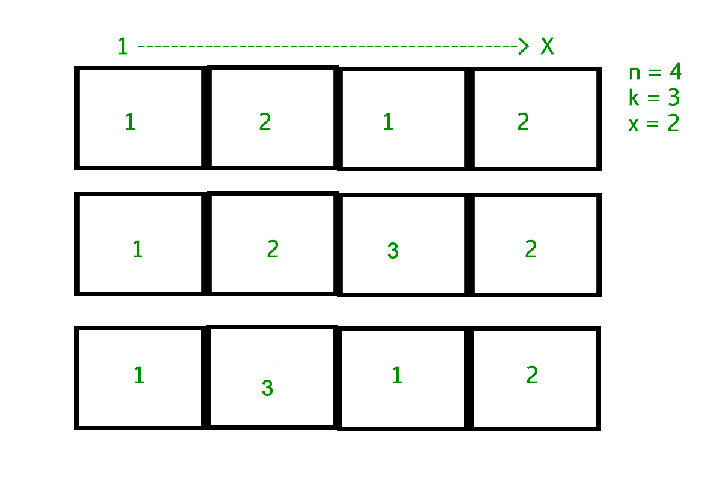

# 具有不同值的连续元素的数组计数

> 原文:[https://www . geeksforgeeks . org/count-arrays-continuous-element-differential-values/](https://www.geeksforgeeks.org/count-arrays-consecutive-element-different-values/)

给定三个正整数 **n** 、 **k** 和 **x** 。任务是计算大小为 n 的不同数组的数量，使得每个元素在 1 到 k 之间，并且两个连续的元素不同。另外，每个数组的第一个和最后一个元素应该分别是 1 和 x。

**示例:**

```
Input : n = 4, k = 3, x = 2
Output : 3
```



这个想法是用动态规划和组合学来解决这个问题。
首先注意，从 2 到 k 的所有 x，答案都是一样的，很容易证明。这在以后会很有用。
让状态 f(i)表示填充数组 A 的范围[1，i]的方式数，使得 A <sub>1</sub> = 1，A<sub>I</sub>1。
因此，如果 x ≠ 1，那么问题的答案就是 f(n)/(k–1)，因为 f(n)是 A <sub>n</sub> 填充 2 到 k 的数字的方式数，对于所有这样的值 A <sub>n</sub> 答案都是相等的，所以单个值的答案就是 f(n)/(k–1)。
否则，如果 x = 1，答案就是 f(n–1)，因为 A<sub>n–1</sub>1，而我们唯一能填入 A <sub>n</sub> 的数字就是 x = 1。

现在，主要的问题是如何计算 f(i)。考虑 A<sub>I–1</sub>可以是的所有数字。我们知道它一定在[1，k]中。

*   如果 A<sub>I–1</sub>≠1，那么有(k–2)f(I–1)种方式来填充数组的剩余部分，因为 A <sub>i</sub> 不能是 1 或者 A<sub>I–1</sub>(所以我们乘以(k–2))，对于范围[1，I–1]，递归地有 f(I–1)种方式。
*   如果 A<sub>I–1</sub>= 1，那么有(k–1)f(I–2)种方式来填充数组的剩余部分，因为 A<sub>I–1</sub>= 1 表示 A<sub>I–2</sub>≠1，这意味着有 f(I–2)种方式来填充范围[1，I–2]，并且 A <sub>i</sub> 唯一不能为 1 的值，所以我们有 A<sub>I</sub>的(k–1)种选择

通过结合以上内容，我们得到

```
f(i) = (k - 1) * f(i - 2) + (k - 2) * f(i - 1)
```

这将帮助我们使用 f(i)来使用动态编程。

下面是该方法的实现:

## C++

```
// CPP Program to find count of arrays.
#include <bits/stdc++.h>
#define MAXN 109
using namespace std;

// Return the number of arrays with given constartints.
int countarray(int n, int k, int x)
{
    int dp[MAXN] = { 0 };

    // Initialising dp[0] and dp[1].
    dp[0] = 0;
    dp[1] = 1;

    // Computing f(i) for each 2 <= i <= n.
    for (int i = 2; i < n; i++)
        dp[i] = (k - 2) * dp[i - 1] +
                (k - 1) * dp[i - 2];

    return (x == 1 ? (k - 1) * dp[n - 2] : dp[n - 1]);
}

// Driven Program
int main()
{
    int n = 4, k = 3, x = 2;
    cout << countarray(n, k, x) << endl;
    return 0;
}
```

## Java 语言(一种计算机语言，尤用于创建网站)

```
// Java program to find count of arrays.
import java.util.*;

class Counting
{
    static int MAXN = 109;

    public static int countarray(int n, int k,
                                       int x)
    {
        int[] dp = new int[109];

        // Initialising dp[0] and dp[1].
        dp[0] = 0;
        dp[1] = 1;

        // Computing f(i) for each 2 <= i <= n.
        for (int i = 2; i < n; i++)
            dp[i] = (k - 2) * dp[i - 1] +
                (k - 1) * dp[i - 2];

        return (x == 1 ? (k - 1) * dp[n - 2] :
                                  dp[n - 1]);
    }

    // driver code
    public static void main(String[] args)
    {
        int n = 4, k = 3, x = 2;
        System.out.println(countarray(n, k, x));
    }
}

// This code is contributed by rishabh_jain
```

## 蟒蛇 3

```
# Python3 code to find count of arrays.

# Return the number of lists with
# given constraints.
def countarray( n , k , x ):

    dp = list()

    # Initialising dp[0] and dp[1]
    dp.append(0)
    dp.append(1)

    # Computing f(i) for each 2 <= i <= n.
    i = 2
    while i < n:
        dp.append( (k - 2) * dp[i - 1] +
                   (k - 1) * dp[i - 2])
        i = i + 1

    return ( (k - 1) * dp[n - 2] if x == 1 else dp[n - 1])

# Driven code
n = 4
k = 3
x = 2
print(countarray(n, k, x))

# This code is contributed by "Sharad_Bhardwaj".
```

## C#

```
// C# program to find count of arrays.
using System;

class GFG
{
// static int MAXN = 109;

    public static int countarray(int n, int k,
                                    int x)
    {
        int[] dp = new int[109];

        // Initialising dp[0] and dp[1].
        dp[0] = 0;
        dp[1] = 1;

        // Computing f(i) for each 2 <= i <= n.
        for (int i = 2; i < n; i++)
            dp[i] = (k - 2) * dp[i - 1] +
                    (k - 1) * dp[i - 2];

        return (x == 1 ? (k - 1) * dp[n - 2] :
                                   dp[n - 1]);
    }

    // Driver code
    public static void Main()
    {
        int n = 4, k = 3, x = 2;
        Console.WriteLine(countarray(n, k, x));
    }
}

// This code is contributed by vt_m
```

## 服务器端编程语言（Professional Hypertext Preprocessor 的缩写）

```
<?php
// PHP Program to find
// count of arrays.

$MAXN = 109;

// Return the number of arrays
// with given constartints.
function countarray($n, $k, $x)
{
    $dp = array( 0 );

    // Initialising dp[0] and dp[1].
    $dp[0] = 0;
    $dp[1] = 1;

    // Computing f(i) for
    // each 2 <= i <= n.
    for ( $i = 2; $i < $n; $i++)
        $dp[$i] = ($k - 2) * $dp[$i - 1] +
                  ($k - 1) * $dp[$i - 2];

    return ($x == 1 ? ($k - 1) *
            $dp[$n - 2] : $dp[$n - 1]);
}

// Driven Code
$n = 4; $k = 3; $x = 2;
echo countarray($n, $k, $x) ;

// This code is contributed by anuj_67.
?>
```

## java 描述语言

```
<script>

// Javascript program to find count of arrays.
let MAXN = 109;

function countarray(n, k, x)
{
    let dp = [];

    // Initialising dp[0] and dp[1].
    dp[0] = 0;
    dp[1] = 1;

    // Computing f(i) for each 2 <= i <= n.
    for(let i = 2; i < n; i++)
        dp[i] = (k - 2) * dp[i - 1] +
                (k - 1) * dp[i - 2];

    return (x == 1 ? (k - 1) * dp[n - 2] :
                               dp[n - 1]);
}

// Driver code
let n = 4, k = 3, x = 2;

document.write(countarray(n, k, x));

// This code is contributed by sanjoy_62

</script>
```

**输出:**

```
3
```