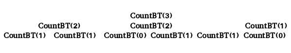

# 计算高度为 h 的平衡二叉树

> 原文:[https://www . geesforgeks . org/count-balanced-binary-trees-height-h/](https://www.geeksforgeeks.org/count-balanced-binary-trees-height-h/)

给定高度 h，计算并返回高度为 h 的平衡二叉树的最大可能数量。平衡二叉树是这样一种树，其中对于每个节点，左右子树的高度之差不超过 1。
**例:**

```
Input : h = 3
Output : 15

Input : h = 4
Output : 315
```

以下是高度为 3 的平衡二叉树。


树高，h = 1 +最大值(左高，右高)

由于左右子树的高度差不超过一，左右部分的可能高度可以是以下之一:

1.  (h-1)、(h-2)
2.  (h-2)，(h-1)
3.  (h-1)，(h-1)

```
count(h) = count(h-1) * count(h-2) + 
           count(h-2) * count(h-1) + 
           count(h-1) * count(h-1)
        = 2 * count(h-1) * count(h-2) +  
          count(h-1) * count(h-1)
       = count(h-1) * (2*count(h - 2) + 
                          count(h - 1))
```

因此，我们可以看到问题具有最优子结构性质。
一个**递归函数**计算高度为 h 的平衡二叉树的个数为:

```
int countBT(int h)
{
    // One tree is possible with height 0 or 1
    if (h == 0 || h == 1)
        return 1;
    return countBT(h-1) * (2 *countBT(h-2) +
                              countBT(h-1));
}
```

这种递归方法的时间复杂度将是指数级的。h = 3 问题的递归树看起来像:



我们可以看到，子问题是反复解决的。因此，我们在计算结果时会存储它们。
一种高效的动态规划方法如下:
以下是上述方法的实现:

## C++

```
// C++ program to count number of balanced
// binary trees of height h.
#include <bits/stdc++.h>
#define mod 1000000007
using namespace std;

long long int countBT(int h) {

    long long int dp[h + 1];
    //base cases
    dp[0] = dp[1] = 1;
    for(int i = 2; i <= h; i++) {
        dp[i] = (dp[i - 1] * ((2 * dp [i - 2])%mod + dp[i - 1])%mod) % mod;
    }
    return dp[h];
}

// Driver program
int main()
{
    int h = 3;
    cout << "No. of balanced binary trees"
            " of height h is: "
         << countBT(h) << endl;
}
```

## Java 语言(一种计算机语言，尤用于创建网站)

```
// Java program to count number of balanced
// binary trees of height h.
class GFG {

    static final int MOD = 1000000007;

    public static long countBT(int h) {
        long[] dp = new long[h + 1];

        // base cases
        dp[0] = 1;
        dp[1] = 1;

        for(int i = 2; i <= h; ++i)
            dp[i] = (dp[i - 1] * ((2 * dp [i - 2])% MOD + dp[i - 1]) % MOD) % MOD;

            return dp[h];
    }

    // Driver program
    public static void main (String[] args) {
        int h = 3;
        System.out.println("No. of balanced binary trees of height "+h+" is: "+countBT(h));
    }
}
/*
This code is contributed by
Brij Raj Kishore
*/
```

## 蟒蛇 3

```
# Python3 program to count number of balanced
# binary trees of height h.

def countBT(h) :
    MOD = 1000000007
    #initialize list
    dp = [0 for i in range(h + 1)]

    #base cases
    dp[0] = 1
    dp[1] = 1

    for i in range(2, h + 1) :
        dp[i] = (dp[i - 1] * ((2 * dp [i - 2])%MOD + dp[i - 1])%MOD) % MOD

    return dp[h]

#Driver program
h = 3
print("No. of balanced binary trees of height "+str(h)+" is: "+str(countBT(h)))

# This code is contributed by
# Brij Raj Kishore
```

## C#

```
// C# program to count number of balanced
// binary trees of height h.

using System;
class GFG {

    static int MOD = 1000000007;

    public static long countBT(int h) {
        long[] dp = new long[h + 1];

        // base cases
        dp[0] = 1;
        dp[1] = 1;

        for(int i = 2; i <= h; ++i)
            dp[i] = (dp[i - 1] * ((2 * dp [i - 2])% MOD + dp[i - 1]) % MOD) % MOD;

            return dp[h];
    }

    // Driver program
    static void Main () {
        int h = 3;
        Console.WriteLine("No. of balanced binary trees of height "+h+" is: "+countBT(h));
    }
    // This code is contributed by Ryuga
}
```

## 服务器端编程语言（Professional Hypertext Preprocessor 的缩写）

```
<?php
// PHP program to count
// number of balanced

$mod =1000000007;

function countBT($h)
{
    global $mod;

    // base cases
    $dp[0] = $dp[1] = 1;
    for($i = 2; $i <= $h; $i++)
    {
        $dp[$i] = ($dp[$i - 1] *
                  ((2 * $dp [$i - 2]) %
                  $mod + $dp[$i - 1]) %
                          $mod) % $mod;
    }
    return $dp[$h];
}

// Driver Code
$h = 3;
echo "No. of balanced binary trees",
                " of height h is: ",
                    countBT($h) ,"\n";

// This code is contributed by aj_36
?>
```

## java 描述语言

```
<script>
    // Javascript program to count number of balanced binary trees of height h.

    let MOD = 1000000007;

    function countBT(h) {
        let dp = new Array(h + 1);
        dp.fill(0);

        // base cases
        dp[0] = 1;
        dp[1] = 1;

        for(let i = 2; i <= h; ++i)
            dp[i] = (dp[i - 1] * ((2 * dp [i - 2])% MOD + dp[i - 1]) % MOD) % MOD;

            return dp[h];
    }

    let h = 3;
      document.write("No. of balanced binary trees of height h is: "+countBT(h));

</script>
```

**输出:**

```
No of balanced binary trees of height h is: 15
```

本文由**阿迪提·夏尔马**供稿。如果你喜欢 GeeksforGeeks 并想投稿，你也可以使用[contribute.geeksforgeeks.org](http://www.contribute.geeksforgeeks.org)写一篇文章或者把你的文章邮寄到 contribute@geeksforgeeks.org。看到你的文章出现在极客博客主页上，帮助其他极客。
如果你发现任何不正确的地方，或者你想分享更多关于上面讨论的话题的信息，请写评论。