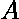
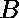

# 计算两个数的公共质因数

> 原文:[https://www . geesforgeks . org/count-common-prime-factors-of-two-numbers/](https://www.geeksforgeeks.org/count-common-prime-factors-of-two-numbers/)

给定两个整数和，任务是找出因子为素数的两个数的公共因子的个数。
**例:**

> **输入:** A = 6，B = 12
> **输出:** 2
> 2 和 3 是 6 和 12
> **的唯一公共质因数输入:** A = 4，B = 8
> **输出:** 1

**天真方法:** [从 **1** 迭代](https://www.geeksforgeeks.org/loops-in-c/)到 **min(A，B)** 并检查 **i** 是否是素数以及 **A** 和 **B** 的因子，如果是，则递增计数器。
**高效方法**是做以下几点:

1.  求给定数的[最大公约数](https://www.geeksforgeeks.org/c-program-find-gcd-hcf-two-numbers/) (gcd)。
2.  [找到 GCD 的质因数](https://www.geeksforgeeks.org/print-all-prime-factors-of-a-given-number/)。

以下是上述方法的实现:

## C++

```
// CPP program to count common prime factors
// of a and b.
#include <bits/stdc++.h>
using namespace std;

// A function to count all prime factors of
// a given number x
int countPrimeFactors(int x)
{
    int res = 0;
    if (x % 2 == 0) {
        res++;

        // Print the number of 2s that divide x
        while (x % 2 == 0)
            x = x / 2;
    }

    // x must be odd at this point.  So we
    // can skip one element (Note i = i +2)
    for (int i = 3; i <= sqrt(x); i = i + 2) {
        if (x % i == 0) {

            // While i divides x, print i and
            // divide x
            res++;
            while (x % i == 0)
                x = x / i;
        }
    }

    // This condition is to handle the case
    // when x is a prime number greater than 2
    if (x > 2)
        res++;
    return res;
}

// Count of common prime factors
int countCommonPrimeFactors(int a, int b)
{
    // Get the GCD of the given numbers
    int gcd = __gcd(a, b);

    // Count prime factors in GCD
    return countPrimeFactors(gcd);
}

// Driver code
int main()
{
    int a = 6, b = 12;
    cout << countCommonPrimeFactors(a, b);
    return 0;
}
```

## Java 语言(一种计算机语言，尤用于创建网站)

```
// Java  program to count common prime factors
 // of a and b.

import java.io.*;

class GFG {
    // Recursive function to return gcd of a and b
    static int __gcd(int a, int b)
    {
        // Everything divides 0 
        if (a == 0)
          return b;
        if (b == 0)
          return a;

        // base case
        if (a == b)
            return a;

        // a is greater
        if (a > b)
            return __gcd(a-b, b);
        return __gcd(a, b-a);
    }
// A function to count all prime factors of
// a given number x
 static int countPrimeFactors(int x)
{
    int res = 0;
    if (x % 2 == 0) {
        res++;

        // Print the number of 2s that divide x
        while (x % 2 == 0)
            x = x / 2;
    }

    // x must be odd at this point. So we
    // can skip one element (Note i = i +2)
    for (int i = 3; i <= Math.sqrt(x); i = i + 2) {
        if (x % i == 0) {

            // While i divides x, print i and
            // divide x
            res++;
            while (x % i == 0)
                x = x / i;
        }
    }

    // This condition is to handle the case
    // when x is a prime number greater than 2
    if (x > 2)
        res++;
    return res;
}

// Count of common prime factors
static int countCommonPrimeFactors(int a, int b)
{
    // Get the GCD of the given numbers
    int gcd = __gcd(a, b);

    // Count prime factors in GCD
    return countPrimeFactors(gcd);
}

// Driver code

    public static void main (String[] args) {
    int a = 6, b = 12;
    System.out.println(countCommonPrimeFactors(a, b));
    }
}
// This code is contributed by inder_verma..
```

## 蟒蛇 3

```
# Python 3 program to count common prime
# factors of a and b.
from math import sqrt,gcd

# A function to count all prime
# factors of a given number x
def countPrimeFactors(x):
    res = 0
    if (x % 2 == 0):
        res += 1

        # Print the number of 2s that divide x
        while (x % 2 == 0):
            x = x / 2

    # x must be odd at this point. So we
    # can skip one element (Note i = i +2)
    k = int(sqrt(x)) + 1
    for i in range(3, k, 2):
        if (x % i == 0):

            # While i divides x, print i
            # and divide x
            res += 1
            while (x % i == 0):
                x = x / i

    # This condition is to handle the
    # case when x is a prime number
    # greater than 2
    if (x > 2):
        res += 1
    return res

# Count of common prime factors
def countCommonPrimeFactors(a, b):

    # Get the GCD of the given numbers
    gcd__ = gcd(a, b)

    # Count prime factors in GCD
    return countPrimeFactors(gcd__)

# Driver code
if __name__ == '__main__':
    a = 6
    b = 12
    print(countCommonPrimeFactors(a, b))

# This code is contributed by
# Surendra_Gangwar
```

## C#

```
// C# program to count common prime factors
// of a and b.

using System ;

class GFG {
    // Recursive function to return gcd of a and b
    static int __gcd(int a, int b)
    {
        // Everything divides 0
        if (a == 0)
        return b;
        if (b == 0)
        return a;

        // base case
        if (a == b)
            return a;

        // a is greater
        if (a > b)
            return __gcd(a-b, b);
        return __gcd(a, b-a);
    }
    // A function to count all prime factors of
    // a given number x
    static int countPrimeFactors(int x)
    {
        int res = 0;
        if (x % 2 == 0) {
            res++;

            // Print the number of 2s that divide x
            while (x % 2 == 0)
                x = x / 2;
        }

        // x must be odd at this point. So we
        // can skip one element (Note i = i +2)
        for (int i = 3; i <= Math.Sqrt(x); i = i + 2) {
            if (x % i == 0) {

                // While i divides x, print i and
                // divide x
                res++;
                while (x % i == 0)
                    x = x / i;
            }
        }

        // This condition is to handle the case
        // when x is a prime number greater than 2
        if (x > 2)
            res++;
        return res;
    }

    // Count of common prime factors
    static int countCommonPrimeFactors(int a, int b)
    {
        // Get the GCD of the given numbers
        int gcd = __gcd(a, b);

        // Count prime factors in GCD
        return countPrimeFactors(gcd);
    }

    // Driver code
    public static void Main() {
    int a = 6, b = 12;

    Console.WriteLine(countCommonPrimeFactors(a, b));
    }
    // This code is contributed by Ryuga
}
```

## 服务器端编程语言（Professional Hypertext Preprocessor 的缩写）

```
<?php
// PHP program to count common
// prime factors of a and b.

// Recursive function to return
// gcd of a and b
function __gcd($a, $b)
{
    // Everything divides 0
    if ($a == 0)
        return $b;
    if ($b == 0)
        return $a;

    // base case
    if ($a == $b)
        return $a;

    // a is greater
    if ($a > $b)
        return __gcd(($a - $b), $b);
    return __gcd($a, ($b - $a));
}

// A function to count all prime
// factors of a given number x
function countPrimeFactors($x)
{
    $res = 0;
    if ($x % 2 == 0)
    {
        $res++;

        // Print the number of 2s that
        // divide x
        while ($x % 2 == 0)
            $x = $x / 2;
    }

    // x must be odd at this point. So we
    // can skip one element (Note i = i +2)
    for ($i = 3; $i <= sqrt($x); $i = $i + 2)
    {
        if ($x % $i == 0)
        {

            // While i divides x, print i
            // and divide x
            $res++;
            while ($x % $i == 0)
                $x = $x / $i;
        }
    }

    // This condition is to handle the case
    // when x is a prime number greater than 2
    if ($x > 2)
        $res++;
    return $res;
}

// Count of common prime factors
function countCommonPrimeFactors($a, $b)
{
    // Get the GCD of the given numbers
    $gcd = __gcd($a, $b);

    // Count prime factors in GCD
    return countPrimeFactors($gcd);
}

// Driver code
$a = 6;
$b = 12;

echo (countCommonPrimeFactors($a, $b));

// This code is contributed by akt_mit..
?>
```

## java 描述语言

```
<script>

    // Javascript program to count
    // common prime factors of a and b.

    // Recursive function to return
    // gcd of a and b
    function __gcd(a, b)
    {
        // Everything divides 0
        if (a == 0)
            return b;
        if (b == 0)
            return a;

        // base case
        if (a == b)
            return a;

        // a is greater
        if (a > b)
            return __gcd(a-b, b);
        return __gcd(a, b-a);
    }
    // A function to count all prime factors of
    // a given number x
    function countPrimeFactors(x)
    {
        let res = 0;
        if (x % 2 == 0) {
            res++;

            // Print the number of 2s that divide x
            while (x % 2 == 0)
                x = parseInt(x / 2, 10);
        }

        // x must be odd at this point. So we
        // can skip one element (Note i = i +2)
        for (let i = 3; i <= Math.sqrt(x); i = i + 2)
        {
            if (x % i == 0) {

                // While i divides x, print i and
                // divide x
                res++;
                while (x % i == 0)
                    x = parseInt(x / i, 10);
            }
        }

        // This condition is to handle the case
        // when x is a prime number greater than 2
        if (x > 2)
            res++;
        return res;
    }

    // Count of common prime factors
    function countCommonPrimeFactors(a, b)
    {
        // Get the GCD of the given numbers
        let gcd = __gcd(a, b);

        // Count prime factors in GCD
        return countPrimeFactors(gcd);
    }

    let a = 6, b = 12;

    document.write(countCommonPrimeFactors(a, b));

</script>
```

**Output:** 

```
2
```

如果有多个计算公约数的查询，我们可以使用[质因数分解进一步优化上面的代码，使用筛子 O(log n)进行多个查询](https://www.geeksforgeeks.org/prime-factorization-using-sieve-olog-n-multiple-queries/)