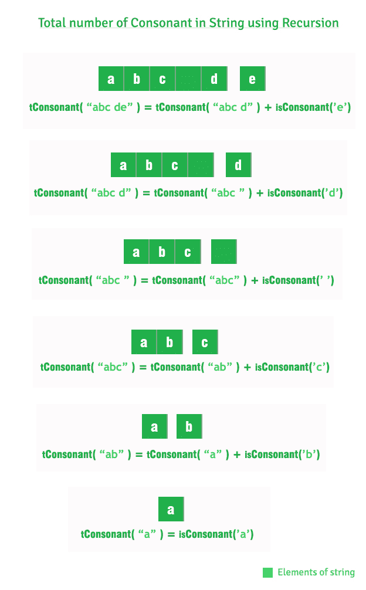

# 计算字符串中的辅音(迭代和递归方法)

> 原文:[https://www . geesforgeks . org/count-辅音-字符串-迭代-递归-方法/](https://www.geeksforgeeks.org/count-consonants-string-iterative-recursive-methods/)

给定一个字符串，计算其中辅音的总数。辅音是英语字母字符，不是元音(a、e、I、o 和 u)。常数的例子有 b，c，d，f，g，..

**示例:**

```
Input : abc de
Output : 3
There are three consonants b, c and d.

Input : geeksforgeeks portal
Output : 12
```

**1。迭代方法**

## C++

```
// Iterative CPP program to count total number
// of consonants
#include <iostream>
using namespace std;

// Function to check for consonant
bool isConsonant(char ch)
{
    // To handle lower case
    ch = toupper(ch);

    return !(ch == 'A' || ch == 'E' ||
            ch == 'I' || ch == 'O' ||
            ch == 'U') && ch >= 65 && ch <= 90;
}

int totalConsonants(string str)
{
    int count = 0;
    for (int i = 0; i < str.length(); i++)

        // To check is character is Consonant
        if (isConsonant(str[i]))
            ++count;
    return count;
}

// Driver code
int main()
{
    string str = "abc de";
    cout << totalConsonants(str);
    return 0;
}
```

## Java 语言(一种计算机语言，尤用于创建网站)

```
// Iterative Java program
// to count total number
// of consonants

import java.io.*;

class GFG {

    // Function to check for consonant
    static boolean isConsonant(char ch)
    {
        // To handle lower case
        ch = Character.toUpperCase(ch);

        return !(ch == 'A' || ch == 'E' ||
                ch == 'I' || ch == 'O' ||
                ch == 'U') && ch >= 65 && ch <= 90;
    }

    static int totalConsonants(String str)
    {
        int count = 0;
        for (int i = 0; i < str.length(); i++)

            // To check is character is Consonant
            if (isConsonant(str.charAt(i)))
                ++count;
        return count;
    }

    // Driver code
    public static void main(String args[])
    {
        String str = "abc de";
        System.out.println( totalConsonants(str));
    }
}

// This code is contributed by Nikita Tiwari.
```

## 蟒蛇 3

```
# Iterative Python3 program to count
# total number of consonants

# Function to check for consonant
def isConsonant(ch):

    # To handle lower case
    ch = ch.upper()

    return not (ch == 'A' or ch == 'E' or
                ch == 'I' or ch == 'O' or
                ch == 'U') and ord(ch) >= 65 and ord(ch) <= 90

def totalConsonants(string):

    count = 0

    for i in range(len(string)):

        # To check is character is Consonant
        if (isConsonant(string[i])):
            count += 1

    return count

# Driver code
string = "abc de"
print(totalConsonants(string))

# This code id contributed by Ansu Kumari.
```

## C#

```
// Iterative C# program to count
// total number of consonants
using System;

class GFG {

    // Function to check for consonant
    static bool isConsonant(char ch)
    {
        // To handle lower case
        ch = Char.ToUpper(ch);

        return !(ch == 'A' || ch == 'E' ||
                 ch == 'I' || ch == 'O' ||
                 ch == 'U') && ch >= 65 && ch <= 90;
    }

    static int totalConsonants(String str)
    {
        int count = 0;
        for (int i = 0; i < str.Length; i++)

            // To check is character is Consonant
            if (isConsonant(str[i]))
                ++count;
        return count;
    }

    // Driver code
    public static void Main()
    {
        String str = "abc de";
        Console.Write( totalConsonants(str));
    }
}

// This code is contributed by nitin mittal.
```

## 服务器端编程语言（Professional Hypertext Preprocessor 的缩写）

```
<?php
// Iterative PHP program to count total number
// of consonants

// Function to check for consonant
function isConsonant($ch)
{
    // To handle lower case
    $ch = strtoupper($ch);

    return !($ch == 'A' || $ch == 'E' ||
            $ch == 'I' || $ch == 'O' ||
            $ch == 'U') && ord($ch) >= 65 && ord($ch) <= 90;
}

function totalConsonants($str)
{
    $count = 0;
    for ($i = 0; $i < strlen($str); $i++)

        // To check is character is Consonant
        if (isConsonant($str[$i]))
            ++$count;
    return $count;
}

// Driver code

$str = "abc de";
echo totalConsonants($str);
return 0;
 // This code is contributed by Ita_c.
?>
```

## java 描述语言

```
<script>
      // Iterative JavaScript program to count total number
      // of consonants

      // Function to check for consonant
      function isConsonant(ch)
      {
        // To handle lower case
        ch = ch.toUpperCase();

        console.log(ch);

        return (
          !(ch == "A" || ch == "E" || ch == "I" || ch == "O" || ch == "U") &&
          ch.match(/[A-Z]/i)
        );
      }

      function totalConsonants(str) {
        var count = 0;
        for (var i = 0; i < str.length; i++)
          // To check is character is Consonant
          if (isConsonant(str[i])) ++count;
        return count;
      }

      // Driver code
      var str = "abc de";
      document.write(totalConsonants(str));

      // This code is contributed by rdtank.
    </script>
```

**输出:**

```
3
```

**时间复杂度:** O(n)，其中 n 为字符串的长度

**辅助空间:** O(1)

**2。递归方法**

## C++

```
// Recursive CPP program to count total number
// of consonants
#include <iostream>
using namespace std;

// Function to check for consonant
bool isConsonant(char ch)
{
    // To handle lower case
    ch = toupper(ch);

    return !(ch == 'A' || ch == 'E' ||
            ch == 'I' || ch == 'O' ||
            ch == 'U') && ch >= 65 && ch <= 90;
}

// to count total number of consonants from
// 0 to n-1
int totalConsonants(string str, int n)
{
    if (n == 1)
        return isConsonant(str[0]);

    return totalConsonants(str, n - 1) +
           isConsonant(str[n-1]);
}

// Driver code
int main()
{
    string str = "abc de";
    cout << totalConsonants(str, str.length());
    return 0;
}
```

## Java 语言(一种计算机语言，尤用于创建网站)

```
// Recursive Java program to count
// total number of consonants
import java.util.*;
import java.lang.*;

class GFG
{

// Function to check for consonant
static boolean isConsonant(char ch)
{
    // To handle lower case
    ch = Character.toUpperCase(ch);

    return (ch == 'A' || ch == 'E' ||
            ch == 'I' || ch == 'O' ||
            ch == 'U')== false && ch >= 65 && ch <= 90;
}

// to count total number
// of consonants from  0 to n-1
static int totalConsonants(String str, int n)
{
    if (n == 1)
    {
        if(isConsonant(str.charAt(0)))
            return 1;
        else
            return 0;
    }

    if(isConsonant(str.charAt(n - 1)))
        return totalConsonants(str, n - 1) + 1;
    else
        return totalConsonants(str, n - 1);
}

// Driver code
public static void main(String args[])
{
    String str = "abc de";
    System.out.println(totalConsonants(str, str.length()));
}
}

// This code is contributed by
// Surendra_Gangwar
```

## 蟒蛇 3

```
# Recursive Python3 program to count
# total number of consonants

# Function to check for consonant
def isConsonant(ch):

    # To handle lower case
    ch = ch.upper()

    return not (ch == 'A' or ch == 'E' or
                ch == 'I' or ch == 'O' or
                ch == 'U') and ord(ch) >= 65 and ord(ch) <= 90

# To count total number of 
# consonants from 0 to n-1
def totalConsonants(string, n):

    if n == 1:
        return isConsonant(string[0])

    return totalConsonants(string, n - 1) + isConsonant(string[n-1])

# Driver code
string = "abc de"
print(totalConsonants(string, len(string)))

# This code is contributed by Ansu Kuamri.
```

## C#

```
// Recursive C# program to count
// total number of consonants
using System;

class GFG
{

// Function to check for consonant
static Boolean isConsonant(char ch)
{
    // To handle lower case
    ch = char.ToUpper(ch);

    return (ch == 'A' || ch == 'E' ||
            ch == 'I' || ch == 'O' ||
            ch == 'U') == false &&
            ch >= 65 && ch <= 90;
}

// to count total number
// of consonants from 0 to n-1
static int totalConsonants(String str, int n)
{
    if (n == 1)
    {
        if(isConsonant(str[0]))
            return 1;
        else
            return 0;
    }

    if(isConsonant(str[n - 1]))
        return totalConsonants(str, n - 1) + 1;
    else
        return totalConsonants(str, n - 1);
}

// Driver code
public static void Main(String []args)
{
    String str = "abc de";
    Console.WriteLine(totalConsonants(str, str.Length));
}
}

// This code contributed by Rajput-Ji
```

## java 描述语言

```
<script>

// Recursive Javascript program to
// count total number of consonants

// Function to check for consonant
function isConsonant(ch)
{

    // To handle lower case
    ch = ch.toUpperCase();

    return (!(ch == 'A' || ch == 'E' ||
              ch == 'I' || ch == 'O' ||
              ch == 'U') && ch.charCodeAt(0) >= 65 &&
                            ch.charCodeAt(0) <= 90) ;
}

// To count total number of consonants from
// 0 to n-1
function totalConsonants(str, n)
{
    if (n == 1)
        return isConsonant(str[0]);

    return totalConsonants(str, n - 1) +
                isConsonant(str[n - 1]);
}

// Driver code
var str = "abc de";

document.write(totalConsonants(str,str.length));

// This code is contributed by jana_sayantan

</script>
```

**输出:**

```
3
```

**时间复杂度:** O(n)，其中 n 为字符串的长度

**辅助空间:** O(1)

**递归方法说明:**

