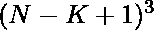

# 计数刻在 N 号立方体上的 K 号立方体

> 原文:[https://www . geesforgeks . org/count-cubes-of-size-k-in-a-cube-size-n/](https://www.geeksforgeeks.org/count-cubes-of-size-k-inscribed-in-a-cube-of-size-n/)

给定两个整数 **N** 和 **K** ，任务是找出大小为 **K** 的立方体中可以包含的大小为 N 的立方体的数量

**示例:**

> **输入:** N = 2，K = 1
> **输出:** 8
> **说明:**
> 有 8 个 1 号的立方体可以画在 2 号更大的立方体里面。
> 
> 
> 
> **输入:** N = 5，K = 2
> **输出:** 64
> **说明:**
> 在更大的 5 号立方体里面可以画出 64 个 2 号立方体。

**进场:**解决问题的关键观察是 **N** 大小的立方体内部的立方体数量为**(N<sup>2</sup>*(N+1)<sup>2</sup>)/4**。因此，N 号立方体内部的 **K** 号立方体为:

> 

下面是上述方法的实现:

## C++

```
// C++ implementation of the
// above approach

#include <bits/stdc++.h>
using namespace std;

// Function to find the number
// of the cubes of the size K
int No_of_cubes(int N, int K)
{
    int No = 0;

    // Stores the number of cubes
    No = (N - K + 1);

    // Stores the number of cubes
    // of size k
    No = pow(No, 3);
    return No;
}

// Driver Code
int main()
{
    // Size of the bigger cube
    int N = 5;

    // Size of the smaller cube
    int K = 2;

    cout << No_of_cubes(N, K);
    return 0;
}
```

## Java 语言(一种计算机语言，尤用于创建网站)

```
// Java implementation of the
// above approach
class GFG{

// Function to find the number
// of the cubes of the size K
static int No_of_cubes(int N,
                       int K)
{
  int No = 0;

  // Stores the number of cubes
  No = (N - K + 1);

  // Stores the number of cubes
  // of size k
  No = (int) Math.pow(No, 3);
  return No;
}

// Driver Code
public static void main(String[] args)
{
  // Size of the bigger cube
  int N = 5;

  // Size of the smaller cube
  int K = 2;

  System.out.print(No_of_cubes(N, K));
}
}

// This code is contributed by Princi Singh
```

## 蟒蛇 3

```
# Python3 implementation of the
# above approach

# Function to find the number
# of the cubes of the size K
def No_of_cubes(N, K):

    No = 0

    # Stores the number of cubes
    No = (N - K + 1)

    # Stores the number of cubes
    # of size k
    No = pow(No, 3)
    return No

# Driver Code

# Size of the bigger cube
N = 5

# Size of the smaller cube
K = 2

print(No_of_cubes(N, K))

# This code is contributed by sanjoy_62
```

## C#

```
// C# implementation of the
// above approach
using System;

class GFG{

// Function to find the number
// of the cubes of the size K
static int No_of_cubes(int N, int K)
{
    int No = 0;

    // Stores the number of cubes
    No = (N - K + 1);

    // Stores the number of cubes
    // of size k
    No = (int)Math.Pow(No, 3);
    return No;
}

// Driver Code
public static void Main()
{

    // Size of the bigger cube
    int N = 5;

    // Size of the smaller cube
    int K = 2;

    Console.Write(No_of_cubes(N, K));
}
}

// This code is contributed by sanjoy_62
```

## java 描述语言

```
<script>

// JavaScript program for
// the above approach

// Function to find the number
// of the cubes of the size K
function No_of_cubes(N, K)
{
  let No = 0;

  // Stores the number of cubes
  No = (N - K + 1);

  // Stores the number of cubes
  // of size k
  No = Math.pow(No, 3);
  return No;
}

// Driver code

  // Size of the bigger cube
  let N = 5;

  // Size of the smaller cube
  let K = 2;
  document.write(No_of_cubes(N, K));

  // This code is contributed by splevel62.
</script>
```

**Output:** 

```
64
```

***时间复杂度:**O(1)*
T5**辅助空间:** O(1)