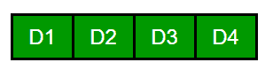

# 以 0 为数字计算 d 位正整数

> 原文:[https://www . geeksforgeeks . org/count-d-digit-正整数-以-0 作为数字/](https://www.geeksforgeeks.org/count-d-digit-positive-integers-with-0-as-a-digit/)

给定一个数字 **d** ，代表正整数的位数。找出至少有一个零的正整数(正好由 d 个数字组成)的总数。
例子:

```
Input : d = 1
Output : 0
There's no natural number of 1 digit that
contains a zero.

Input : d = 2
Output : 9
The numbers are, 10, 20, 30, 40, 50, 60, 
                 70, 80 and 90.
```

## [我们强烈建议您点击此处进行练习，然后再进入解决方案。](https://practice.geeksforgeeks.org/problems/count-zero3710/1)

一个简单的解决方案是遍历所有的 d 位正数。对于每个数字，遍历其位数，如果有 0 位数，递增计数(类似于[这个](https://www.geeksforgeeks.org/count-numbers-0-digit/))。
以下是一些观察结果:

1.  正好有 d 位数。
2.  最高有效位的数字不能是零(不允许前导零)。
3.  除了最高有效位之外，所有其他位置都可以包含零。



因此，考虑到以上几点，让我们找到具有 d 位数的数字的总数:

```
We can place any of {1, 2, ... 9} in D1
Hence D1 can be filled in 9 ways.

Apart from D1 all the other places can be  10 ways. 
(we can place 0 as well)
Hence the total numbers having d digits can be given as: 
Total =  9*10<sup>d-1</sup>

Now, let's find the numbers having d digits, that
don't contain zero at any place. 
In this case, all the places can be filled in 9 ways.
Hence count of such numbers is given by:
Non_Zero = 9<sup>d</sup>

Now the count of numbers having at least one zero 
can be obtained by subtracting Non_Zero from Total.
Hence Answer would be given by:
9*(10<sup>d-1 - 9d-1)</sup> 
```

下面是同样的程序。

## C++

```
//C++ program to find the count of positive integer of a
// given number of digits that contain atleast one zero
#include<bits/stdc++.h>
using namespace std;

// Returns count of 'd' digit integers have 0 as a digit
int findCount(int d)
{
    return 9*(pow(10,d-1) - pow(9,d-1));
}

// Driver Code
int main()
{
    int d = 1;
    cout << findCount(d) << endl;

    d = 2;
    cout << findCount(d) << endl;

    d = 4;
    cout << findCount(d) << endl;
    return 0;
}
```

## Java 语言(一种计算机语言，尤用于创建网站)

```
// Java program to find the count
// of positive integer of a
// given number of digits
// that contain atleast one zero
import java.io.*;

class GFG {

    // Returns count of 'd' digit
    // integers have 0 as a digit
    static int findCount(int d)
    {
        return 9 * ((int)(Math.pow(10, d - 1))
                 - (int)(Math.pow(9, d - 1)));
    }

    // Driver Code
    public static void main(String args[])
    {
        int d = 1;
        System.out.println(findCount(d));

        d = 2;
        System.out.println(findCount(d));

        d = 4;
        System.out.println(findCount(d));

    }
}

// This code is contributed by Nikita Tiwari.
```

## 蟒蛇 3

```
# Python 3 program to find the
# count of positive integer of a
# given number of digits that
# contain atleast one zero
import math

# Returns count of 'd' digit
# integers have 0 as a digit
def findCount(d) :
    return 9*((int)(math.pow(10,d-1)) - (int)(math.pow(9,d-1)));

# Driver Code
d = 1
print(findCount(d))

d = 2
print(findCount(d))

d = 4
print(findCount(d))

# This code is contributed by Nikita Tiwari.
```

## C#

```
// C# program to find the count
// of positive integer of a
// given number of digits
// that contain atleast one zero.
using System;

class GFG {

    // Returns count of 'd' digit
    // integers have 0 as a digit
    static int findCount(int d)
    {
        return 9 * ((int)(Math.Pow(10, d - 1))
                 - (int)(Math.Pow(9, d - 1)));
    }

    // Driver Code
    public static void Main()
    {
        int d = 1;
        Console.WriteLine(findCount(d));

        d = 2;
        Console.WriteLine(findCount(d));

        d = 4;
        Console.WriteLine(findCount(d));

    }
}

// This code is contributed by nitin mittal.
```

## 服务器端编程语言（Professional Hypertext Preprocessor 的缩写）

```
<?php
// PHP program to find the count
// of positive integer of a given
// number of digits that contain
// atleast one zero

// Returns count of 'd' digit
// integers have 0 as a digit
function findCount($d)
{
    return 9 * (pow(10, $d - 1) -
                pow(9, $d - 1));
}

// Driver Code
{
    $d = 1;
    echo findCount($d),"\n";

    $d = 2;
    echo findCount($d),"\n";

    $d = 4;
    echo findCount($d), "\n";
    return 0;
}

// This code is contributed by nitin mittal
?>
```

## java 描述语言

```
<script>

// JavaScript program to find the count
// of positive integer of a
// given number of digits
// that contain atleast one zero

    // Returns count of 'd' digit
    // integers have 0 as a digit
    function findCount(d)
    {
        return 9 * ((Math.pow(10, d - 1))
                 - (Math.pow(9, d - 1)));
    }

// Driver Code

        let d = 1;
        document.write(findCount(d) + "<br/>");

        d = 2;
        document.write(findCount(d) + "<br/>");

        d = 4;
        document.write(findCount(d) + "<br/>");   

    // This code is contributed by target_2.
</script>
```

输出:

```
0
9
2439
```

本文由[阿舒托什·库马尔](https://www.linkedin.com/in/ashutosh-kumar-9527a7105?trk=nav_responsive_tab_profile)供稿。如果你发现任何不正确的地方，或者你想分享更多关于上面讨论的话题的信息，请写评论。