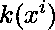

# 将第一个数组的每个元素与第二个数组相加后，计算不同的元素

> 原文:[https://www . geesforgeks . org/count-distinct-elements-在将第一个数组的每个元素与第二个数组相加之后/](https://www.geeksforgeeks.org/count-distinct-elements-after-adding-each-element-of-first-array-with-second-array/)

给定两个[数组](https://www.geeksforgeeks.org/introduction-to-arrays/) **arr1[]** 和 **arr2[]** 。我们可以通过将数组 **arr1[]** 的每个元素添加到每个元素 **arr2[]** 来生成另一个数组 **arr3[]** 。任务是找到数组 **arr3[]** 中不同元素的计数。

**示例:**

> **输入:** Arr1[] = {1，2}，Arr2[] = {3，4}，MAX = 4
> **输出:**
> 4->1
> 5->2
> 6->1
> **说明:**
> 这里第三个数组将是 Arr3[] = {1+3，1+4，2+3，2+4} = {4，5，5，6}
> 
> **输入:** Arr1[] = {1，2}，Arr2[] = {1，2，1}，MAX = 2
> **输出:**
> 2->2
> 3->3
> 4->1
> T9】说明:
> 这里第三个数组是 Arr3[] = {1+1，1+2，1+1，2+1，2+2，2+1} = {2，2+1}

**天真方法:**天真方法是从给定的两个数组中找到所有可能对的和，并将该和插入数组 **arr3[]** 。打印数组所有元素的[频率](https://www.geeksforgeeks.org/counting-frequencies-of-array-elements/) **arr3[]** 。

下面是上述方法的实现:

## C++

```
// C++ program for the above approach
#include <bits/stdc++.h>
using namespace std;

// Function to find Occurrence of each
// element from 1 to 2*MAX
void findCount(vector<int>& Arr1,
               vector<int>& Arr2)
{
    // Initialise MAX
    int MAX = max(*max_element(Arr1.begin(),
                               Arr1.end()),
                  *max_element(Arr2.begin(),
                               Arr2.end()));

    // Count vector to store count of
    // each element from 1 to 2*MAX
    vector<int> Count(2 * MAX + 1, 0);

    // Size of Arr1 and Arr2
    int n = Arr1.size(), m = Arr2.size();

    // Find the elements of arr3[] and
    // increase count of element by 1
    for (int i = 0; i < n; i++) {

        for (int j = 0; j < m; j++) {

            int element = Arr1[i] + Arr2[j];

            Count[element]++;
        }
    }

    // Print the result
    for (int i = 1; i <= 2 * MAX; i++) {

        if (Count[i] > 0) {
            cout << i << "->"
                 << Count[i] << endl;
        }
    }
}

// Driver Code
int main()
{
    // Given arrays arr1[] and arr2[]
    vector<int> arr1 = { 1, 2 };
    vector<int> arr2 = { 1, 2, 1 };

    // Function Call
    findCount(arr1, arr2);
}
```

## Java 语言(一种计算机语言，尤用于创建网站)

```
// Java program for the above approach
import java.util.*;

class GFG{

// Function to find Occurrence of each
// element from 1 to 2*MAX
static void findCount(int[] Arr1, int[]Arr2)
{

    // Initialise MAX
    int MAX = Math.max(Arrays.stream(Arr1).max().getAsInt(),
                       Arrays.stream(Arr2).max().getAsInt());

    // Count vector to store count of
    // each element from 1 to 2*MAX
    int[] Count = new int[2 * MAX + 1];

    // Size of Arr1 and Arr2
    int n = Arr1.length, m = Arr2.length;

    // Find the elements of arr3[] and
    // increase count of element by 1
    for(int i = 0; i < n; i++)
    {
        for(int j = 0; j < m; j++)
        {
            int element = Arr1[i] + Arr2[j];

            Count[element]++;
        }
    }

    // Print the result
    for(int i = 1; i <= 2 * MAX; i++)
    {
        if (Count[i] > 0)
        {
            System.out.print(i + "->" +
                      Count[i] + "\n");
        }
    }
}

// Driver Code
public static void main(String[] args)
{

    // Given arrays arr1[] and arr2[]
    int[] arr1 = { 1, 2 };
    int[] arr2 = { 1, 2, 1 };

    // Function call
    findCount(arr1, arr2);
}
}

// This code is contributed by sapnasingh4991
```

## 蟒蛇 3

```
# Python3 program for the above approach

# Function to find Occurrence of each
# element from 1 to 2*MAX
def findCount(Arr1, Arr2):

    # Initialise MAX
    MAX = max(max(Arr1), max(Arr2));

    # Count vector to store count of
    # each element from 1 to 2*MAX
    #Count = new int[2 * MAX + 1];
    Count = [0 for i in range(2 * MAX + 1)]

    # Size of Arr1 and Arr2
    n = len(Arr1);
    m = len(Arr2);

    # Find the elements of arr3 and
    # increase count of element by 1
    for i in range(n):
        for j in range(m):
            element = Arr1[i] + Arr2[j];

            Count[element]+=1;

    # Print the result
    for i in range(1,2*MAX+1):
        if (Count[i] > 0):
            print(i , "->" , Count[i]);

# Driver Code
if __name__ == '__main__':

    # Given arrays arr1 and arr2
    arr1 = [1, 2 ];
    arr2 = [ 1, 2, 1 ];

    # Function call
    findCount(arr1, arr2);

# This code is contributed by Rohit_ranjan
```

## C#

```
// C# program for the above approach
using System;
using System.Linq;

class GFG{

// Function to find Occurrence of each
// element from 1 to 2*MAX
static void findCount(int[] Arr1, int[]Arr2)
{

    // Initialise MAX
    int MAX = Math.Max(Arr1.Max(), Arr2.Max());

    // Count vector to store count of
    // each element from 1 to 2*MAX
    int[] Count = new int[2 * MAX + 1];

    // Size of Arr1 and Arr2
    int n = Arr1.Length, m = Arr2.Length;

    // Find the elements of arr3[] and
    // increase count of element by 1
    for(int i = 0; i < n; i++)
    {
        for(int j = 0; j < m; j++)
        {
            int element = Arr1[i] + Arr2[j];
            Count[element]++;
        }
    }

    // Print the result
    for(int i = 1; i <= 2 * MAX; i++)
    {
        if (Count[i] > 0)
        {
            Console.Write(i + "->" +
                   Count[i] + "\n");
        }
    }
}

// Driver Code
public static void Main(String[] args)
{

    // Given arrays arr1[] and arr2[]
    int[] arr1 = { 1, 2 };
    int[] arr2 = { 1, 2, 1 };

    // Function call
    findCount(arr1, arr2);
}
}

// This code is contributed by Princi Singh
```

## java 描述语言

```
<script>
// JavaScript program for the above approach

// Function to find Occurrence of each
// element from 1 to 2*MAX
function findCount(Arr1, Arr2)
{

    // Initialise MAX
    let MAX = Math.max(Math.max(...Arr1),
                       Math.max(...Arr2));

    // Count vector to store count of
    // each element from 1 to 2*MAX
    let Count = Array.from({length: 2 * MAX + 1}, (_, i) => 0);

    // Size of Arr1 and Arr2
    let n = Arr1.length, m = Arr2.length;

    // Find the elements of arr3[] and
    // increase count of element by 1
    for(let i = 0; i < n; i++)
    {
        for(let j = 0; j < m; j++)
        {
            let element = Arr1[i] + Arr2[j];

            Count[element]++;
        }
    }

    // Prlet the result
    for(let i = 1; i <= 2 * MAX; i++)
    {
        if (Count[i] > 0)
        {
            document.write(i + "->" +
                      Count[i] + "<br/>");
        }
    }
}

// Driver Code

    // Given arrays arr1[] and arr2[]
    let arr1 = [ 1, 2 ];
    let arr2 = [ 1, 2, 1 ];

    // Function call
    findCount(arr1, arr2);

</script>
```

**Output:** 

```
2->2
3->3
4->1
```

***时间复杂度:**O(N<sup>2</sup>)*
***空间复杂度:** O(N)*

**高效求解:**借助 [FFT(快速傅里叶变换)](https://www.geeksforgeeks.org/fast-fourier-transformation-poynomial-multiplication/)可以高效完成给定任务。以下是步骤:

1.  考虑示例 **Arr1[] = {1，2}** 和 **Arr2[] = {1，2，1}** 。设计数为频率阵列，即计数[i]代表合成阵列中 I 的频率。
2.  当 Arr1[i]加到 Arr2[j]时，我们增加 Count[s]，其中 s = Arr1[i]+Arr2[j]。这类似于乘幂多项式。
3.  设 A(x)是 Arr1[]表示的多项式。Arr1 的元素代表 x 的幂，它们在 Arr1 中的计数是多项式中具有该幂的系数项。
4.  对于每个项，x 的幂表示结果元素，系数表示其计数。
5.  如果期限为
6.  然后计数[i] = k，这里计数和 P(x)相同。
7.  为了计算 P(x)的值，我们可以简单地将 A(x)和 B(x)相乘。

多项式乘法的朴素方法取 O(N <sup>2</sup> )。为了使乘法更快，我们可以使用[快速傅立叶变换](https://www.geeksforgeeks.org/fast-fourier-transformation-poynomial-multiplication/)。

下面是上述方法的实现:

## C++

```
// C++ program for the above approach
#include <bits/stdc++.h>
using namespace std;
using cd = complex<double>;

// Value of PI need in FFT
const double PI = acos(-1);

// Function to implement the FFT
void fft(vector<cd>& a, bool invert)
{
    int n = a.size();
    if (n == 1)
        return;

    vector<cd> a0(n / 2), a1(n / 2);
    for (int i = 0; 2 * i < n; i++) {
        a0[i] = a[2 * i];
        a1[i] = a[2 * i + 1];
    }

    // Recursively find fft
    fft(a0, invert);
    fft(a1, invert);

    double ang = 2 * PI / n * (invert ? -1 : 1);

    cd w(1), wn(cos(ang), sin(ang));

    for (int i = 0; 2 * i < n; i++) {
        a[i] = a0[i] + w * a1[i];
        a[i + n / 2] = a0[i] - w * a1[i];
        if (invert) {
            a[i] /= 2;
            a[i + n / 2] /= 2;
        }
        w *= wn;
    }
}

// Function to multiply two polynomials
// A(x) and B(x) using FFT
vector<int> multiply(vector<int> const& a,
                     vector<int> const& b)
{
    vector<cd> fa(a.begin(), a.end()),
        fb(b.begin(), b.end());

    int n = 1;

    while (n < a.size() + b.size()) {
        n <<= 1;
    }

    // Resize fa and fb
    fa.resize(n);
    fb.resize(n);

    // Assign initially false
    fft(fa, false);
    fft(fb, false);

    for (int i = 0; i < n; i++)
        fa[i] *= fb[i];

    fft(fa, true);

    // To store the result
    vector<int> result(n);

    for (int i = 0; i < n; i++)
        result[i] = round(fa[i].real());

    // Return result
    return result;
}

// Function to find the Count of each
// element from 1 to 2*MAX
void findCount(vector<int>& Arr1,
               vector<int>& Arr2)
{
    // Initialise MAX
    int MAX = max(*max_element(Arr1.begin(),
                               Arr1.end()),
                  *max_element(Arr2.begin(),
                               Arr2.end()));

    int n = Arr1.size();
    int m = Arr2.size();

    // vector for Polynomial A(x) from Arr1
    vector<int> A(MAX + 1);

    for (int i = 0; i < n; i++) {
        A[Arr1[i]]++;
    }

    // Vector for Polynomial B(x) from Arr2
    vector<int> B(MAX + 1);

    for (int i = 0; i < m; i++) {
        B[Arr2[i]]++;
    }

    // Vector to store the result of
    // multiplication of A(x) and B(x)
    vector<int> P;

    // Multiplying Arr1 and Arr2 and
    // storing in P is same as Count
    P = multiply(A, B);

    // Print the result
    for (int i = 1; i <= 2 * MAX; i++) {
        if (P[i] > 0) {
            cout << i << "->"
                 << P[i] << endl;
        }
    }

    cout << '\n';
}

// Driver Code
int main()
{
    // Given arrays arr1[] and arr2[]
    vector<int> arr1 = { 1, 2 };
    vector<int> arr2 = { 1, 2, 1 };

    // Function Call
    findCount(arr1, arr2);
}
```

**Output:** 

```
2->2
3->3
4->1
```

***时间复杂度:** O(N*log N)*
***辅助空间:** O(N)*