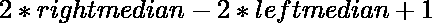

# 使用给定的元素范围计算一个数组可能的不同中值

> 原文:[https://www . geeksforgeeks . org/count-distinct-中位数-可能的数组使用给定的元素范围/](https://www.geeksforgeeks.org/count-distinct-median-possible-for-an-array-using-given-ranges-of-elements/)

给定一个表示数组元素范围的数组对 **arr[]** ，任务是使用这些范围计算每个可能数组的不同中值。

**示例:**

> **输入:** arr[] = {{1，2}，{2，3}}
> **输出:** 3
> **解释:**
> = >如果 x1 = 1 且 x2 = 2，中位数为 1.5
> = >如果 x1 = 1 且 x2 = 3，中位数为 2
> = >如果 x1 = 2 且 x2 = 2，中位数为 2
> = >如果 x1 = 2 且 x2 = 3
> 
> **输入:** arr[] = {{100，100}，{10，10000}，{1，10<sup>9</sup>}
> T5】输出: 9991

**天真方法:**一个简单的解决方案是尝试数组的所有可能值，找到所有这些元素的中值，并计算数组的不同中值。
**时间复杂度:**


，其中 K 是范围的可能值。

**高效方法:**思想是找到数组元素的起始范围和结束范围的中值，然后这个中值的差将表示每个可能数组的不同中值。以下是该方法的示例:

*   将所有起始范围值存储在一个数组中。
    *   对数组的起始范围进行排序，找到数组的中值。
    *   对于奇数长度的数组–中值= A[n/2]
    *   对于偶数长度的数组–中值=

![\frac{A[n/2] + A[n/2 - 1]}{2}](img/bd17b5f2ae1eb78bd6a6cd2080681153.png "Rendered by QuickLaTeX.com")

*   将所有结束范围值存储在一个数组中。
    *   对结束范围的数组进行排序，并找到数组的中值
    *   对于奇数长度的数组，中值= B[n/2]
    *   对于**偶数 N** ，中位数=

![\frac{B[n/2] + B[n/2 - 1]}{2}](img/198aa8965c6726eb339c54482af7ca6b.png "Rendered by QuickLaTeX.com")

*   当数组的长度为奇数时，则所有的整数值在起始范围中位数到结束范围中位数的范围内相差 1。
    *   因此，不同中位数的计数将是起始范围的中位数和结束范围的中位数之差。
*   当数组的长度为偶数时，所有的整数值相差 0.5，在起始范围中位数到结束范围中位数的范围内。
    *   范围[l，r]中相差 0.5 的所有值与范围[2 * l，2 * r]中相差 1 的所有值相同
    *   因此，不同中位数的计数为



下面是上述方法的实现:

## C++

```
// C++ implementation to Count the
// number of distinct medians of an array
// where each array elements
// are given by a range

#include <bits/stdc++.h>
using namespace std;
#define int long long int

// Function to Count the
// number of distinct medians of an array
// where each array elements
// are given by a range
void solve(int n,
   const vector<pair<int, int> >& vec)
{
    vector<int> a, b;

    // Loop to store the starting
    // and end range in the array
    for (auto pr : vec) {
        a.push_back(pr.first);
        b.push_back(pr.second);
    }

    sort(a.begin(), a.end());
    sort(b.begin(), b.end());

    int left, right, ans;

    // Condition to check if the
    // length of the array is odd
    if ((n & 1)) {
        left = a[n / 2];
        right = b[n / 2];
        ans = right - left + 1;
    }
    else {
        left = (a[n / 2] + a[n / 2 - 1]);
        right = (b[n / 2] + b[n / 2 - 1]);
        ans = right - left + 1;
    }

    cout << ans << endl;
}

// Driver Code
signed main()
{

    int N = 3;
    vector<pair<int, int> > vec =
         { { 100, 100 }, { 10, 10000 },
                    { 1, 1000000000 } };

    // Function Call
    solve(N, vec);

    return 0;
}
```

## Java 语言(一种计算机语言，尤用于创建网站)

```
// Java implementation to count the
// number of distinct medians of an
// array where each array elements
// are given by a range
import java.util.*;
import java.awt.*;

class GFG{

// Function to count the number
// of distinct medians of an array
// where each array elements are
// given by a range
static void solve(int n, ArrayList<Point> vec)
{
    ArrayList<Integer> a = new ArrayList<>();
    ArrayList<Integer> b = new ArrayList<>();

    // Loop to store the starting
    // and end range in the array
    for(Point pr : vec)
    {
        a.add(pr.x);
        b.add(pr.y);
    }

    Collections.sort(a);
    Collections.sort(b);

    int left, right, ans;

    // Condition to check if the
    // length of the array is odd
    if ((n & 1) != 0)
    {
        left = a.get(n / 2);
        right = b.get(n / 2);
        ans = right - left + 1;
    }
    else
    {
        left = (a.get(n / 2) +
                a.get(n / 2 - 1));
        right = (b.get(n / 2) +
                 b.get(n / 2 - 1));
        ans = right - left + 1;
    }
    System.out.println(ans);
}

// Driver Code
public static void main(String[] args)
{
    int N = 3;

    ArrayList<Point> vec = new ArrayList<>();
    vec.add(new Point(100, 100));
    vec.add(new Point(10, 10000));
    vec.add(new Point(1, 1000000000));

    // Function call
    solve(N, vec);
}
}

// This code is contributed by jrishabh99
```

## 蟒蛇 3

```
# Python3 implementation to count the
# number of distinct medians of an array
# where each array elements
# are given by a range

# Function to count the number of 
# distinct medians of an array
# where each array elements
# are given by a range
def solve(n, vec):

    a = []
    b = []

    # Loop to store the starting
    # and end range in the array
    for pr in vec :
        a.append(pr[0])
        b.append(pr[1])

    a.sort()
    b.sort()

    # Condition to check if the
    # length of the array is odd
    if ((n & 1)):
        left = a[n // 2]
        right = b[n // 2]
        ans = right - left + 1

    else:
        left = (a[n // 2] + a[n // 2 - 1])
        right = (b[n // 2] + b[n // 2 - 1])
        ans = right - left + 1

    print(ans)

# Driver Code
if __name__ == "__main__":

    N = 3
    vec = [ (100, 100), (10, 10000),
            (1, 1000000000) ]

    # Function Call
    solve(N, vec)

# This code is contributed by chitranayal
```

## C#

```
// C# implementation to count the 
// number of distinct medians of
// an array where each array elements 
// are given by a range
using System;
using System.Collections;
using System.Collections.Generic;

public class Point
{
    public int x, y;

    public Point(int xx, int yy)
    {
        x = xx;
        y = yy;
    }
}

class GFG{

// Function to count the number
// of distinct medians of an array
// where each array elements are
// given by a range
static void solve(int n, ArrayList vec)
{
    ArrayList a = new ArrayList();
    ArrayList b = new ArrayList();

    // Loop to store the starting
    // and end range in the array
    foreach(Point pr in vec)
    {
        a.Add(pr.x);
        b.Add(pr.y);
    }
    a.Sort();
    b.Sort();

    int left, right, ans;

    // Condition to check if the
    // length of the array is odd
    if ((n & 1) != 0)
    {
        left = (int)a[n / 2];
        right = (int)b[n / 2];
        ans = right - left + 1;
    }
    else
    {
        left = ((int)a[n / 2] +
                (int)a[n / 2 - 1]);
        right = ((int)b[n / 2] +
                 (int)b[n / 2 - 1]);
        ans = right - left + 1;
    }
    Console.WriteLine(ans);
}

// Driver code   
static public void Main()
{
    int N = 3;

    ArrayList vec = new ArrayList();
    vec.Add(new Point(100, 100));
    vec.Add(new Point(10, 10000));
    vec.Add(new Point(1, 1000000000));

    // Function call
    solve(N, vec);
}
}

// This code is contributed by offbeat
```

## java 描述语言

```
<script>
// Javascript implementation to count the
// number of distinct medians of an
// array where each array elements
// are given by a range

// Function to count the number
// of distinct medians of an array
// where each array elements are
// given by a range
function solve(n,vec)
{
    let a = [];
    let b = [];

    // Loop to store the starting
    // and end range in the array
    for(let pr=0;pr<vec.length;pr++)
    {
        a.push(vec[pr][0]);
        b.push(vec[pr][1]);
    }

    a.sort(function(c,d){return c-d;});
    b.sort(function(c,d){return c-d;});

    let left, right, ans;

    // Condition to check if the
    // length of the array is odd
    if ((n & 1) != 0)
    {
        left = a[Math.floor(n / 2)];
        right = b[Math.floor(n / 2)];
        ans = right - left + 1;
    }
    else
    {
        left = (a[Math.floor(n / 2)] +
                a[Math.floor(n / 2) - 1]);
        right = (b[Math.floor(n / 2)] +
                 b[Math.floor(n / 2) - 1]);
        ans = right - left + 1;
    }
    document.write(ans);
}

// Driver Code
let N = 3;
let vec=[];
vec.push([100,100]);
vec.push([10, 10000]);
vec.push([1, 1000000000]);

// Function call
solve(N, vec);

// This code is contributed by avanitrachhadiya2155
</script>
```

**Output:** 

```
9991
```