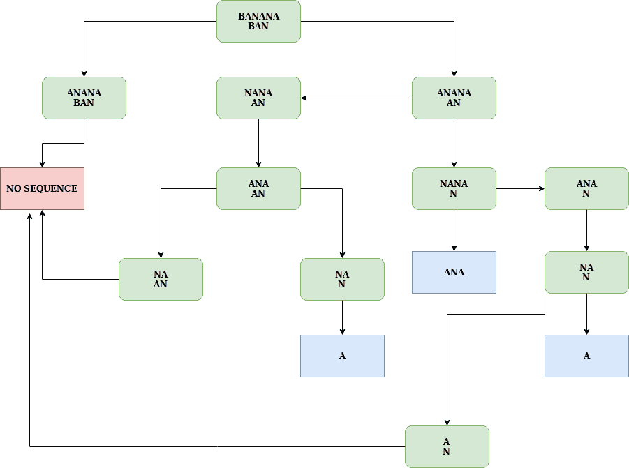

# 将不同的事件计为一个子序列

> 原文:[https://www . geesforgeks . org/count-distinct-occurs-as-a-subsequence/](https://www.geeksforgeeks.org/count-distinct-occurrences-as-a-subsequence/)

给定两个字符串 S 和 T，求 T 作为子序列在 S 中不同出现的次数。
**例:**

```
Input: S = banana, T = ban
Output: 3
Explanation: T appears in S as below three subsequences.
[ban], [ba  n], [b   an]

Input: S = geeksforgeeks, T = ge
Output: 6
Explanation: T appears in S as below three subsequences.
[ge], [     ge], [g e], [g    e] [g     e]
and [     g e]      
```

**方法:**创建一个递归函数，使其返回与 *T* 匹配的 *S* 的子序列的计数。这里 m 是 T 的长度，n 是 s 的长度，这个问题可以递归定义如下。

1.  给定字符串 *T* 是一个空字符串，返回 1 作为空字符串可以是所有的子序列。
2.  给定字符串 *S* 是空字符串，返回 0，因为没有字符串可以是空字符串的子序列。
3.  如果 *S* 和 *T* 的最后一个字符不匹配，那么去掉 *S* 的最后一个字符，再次调用递归函数。因为 S 的最后一个字符不能是子序列的一部分，或者删除它并检查其他字符。
4.  如果 *S* 的最后一个字符匹配，那么有两种可能，第一种可能是子序列，其中 *S* 的最后一个字符是它的一部分，第二种可能是它不是子序列的一部分。因此所需的值将是两者的总和。调用递归函数一次，去掉两个字符串的最后一个字符，再调用一次，只去掉 *S* 的最后一个字符。



**蓝色圆形矩形代表接受状态或有子序列，红色圆形矩形代表不能形成子序列。**
由于上述递归结果中存在重叠子问题，因此可以应用动态规划方法来解决上述问题。将子问题存储在 [Hashmap](https://www.geeksforgeeks.org/java-util-hashmap-in-java/) 或数组中，并在再次调用该函数时返回值。
**算法:**

1.  创建一个 2D 数组*mat【m+1】【n+1】*，其中 m 是字符串 T 的长度，n 是字符串 S 的长度..I)和子串 T(1..j)所以 mat[m][n]包含我们的解决方案。

2.  用全 0 初始化第一列。空字符串不能有另一个字符串作为 suhsequence
3.  用全 1 初始化第一行。空字符串是所有字符串的子序列。
4.  自下而上填充矩阵，即先计算当前字符串的所有子问题。
5.  从头到尾遍历字符串 *T* 。(柜台是*我*
6.  对于外环的每次迭代，从头到尾遍历字符串 *S* 。(柜台是 *j*
7.  如果字符串 *T* 的第 i 索引处的字符与字符串 *S* 的第 j 字符匹配，则考虑两种情况获得该值。首先是 S 中没有最后一个字符的所有子串，其次是两者都没有最后一个字符的子串，即 *mat[i+1][j] + mat[i][j]* 。
8.  否则，即使删除 *S* 的第 *j* 个字符，即 mat[i+1][j]，该值也将相同
9.  打印 *mat[m-1][n-1]* 的值作为答案。

## C++

```
/* C/C++ program to count number of times S appears
   as a subsequence in T */
#include <bits/stdc++.h>
using namespace std;

int findSubsequenceCount(string S, string T)
{
    int m = T.length(), n = S.length();

    // T can't appear as a subsequence in S
    if (m > n)
        return 0;

    // mat[i][j] stores the count of occurrences of
    // T(1..i) in S(1..j).
    int mat[m + 1][n + 1];

    // Initializing first column with all 0s. An empty
    // string can't have another string as suhsequence
    for (int i = 1; i <= m; i++)
        mat[i][0] = 0;

    // Initializing first row with all 1s. An empty
    // string is subsequence of all.
    for (int j = 0; j <= n; j++)
        mat[0][j] = 1;

    // Fill mat[][] in bottom up manner
    for (int i = 1; i <= m; i++) {
        for (int j = 1; j <= n; j++) {

            // If last characters don't match, then value
            // is same as the value without last character
            // in S.
            if (T[i - 1] != S[j - 1])
                mat[i][j] = mat[i][j - 1];

            // Else value is obtained considering two cases.
            // a) All substrings without last character in S
            // b) All substrings without last characters in
            // both.
            else
                mat[i][j] = mat[i][j - 1] + mat[i - 1][j - 1];
        }
    }

    /* uncomment this to print matrix mat
    for (int i = 1; i <= m; i++, cout << endl)
        for (int j = 1; j <= n; j++)
            cout << mat[i][j] << " ";  */
    return mat[m][n];
}

// Driver code to check above method
int main()
{
    string T = "ge";
    string S = "geeksforgeeks";
    cout << findSubsequenceCount(S, T) << endl;
    return 0;
}
```

## Java 语言(一种计算机语言，尤用于创建网站)

```
// Java program to count number of times
// S appears as a subsequence in T
import java.io.*;

class GFG {
    static int findSubsequenceCount(String S, String T)
    {
        int m = T.length();
        int n = S.length();

        // T can't appear as a subsequence in S
        if (m > n)
            return 0;

        // mat[i][j] stores the count of
        // occurrences of T(1..i) in S(1..j).
        int mat[][] = new int[m + 1][n + 1];

        // Initializing first column with
        // all 0s. An emptystring can't have
        // another string as suhsequence
        for (int i = 1; i <= m; i++)
            mat[i][0] = 0;

        // Initializing first row with all 1s.
        // An empty string is subsequence of all.
        for (int j = 0; j <= n; j++)
            mat[0][j] = 1;

        // Fill mat[][] in bottom up manner
        for (int i = 1; i <= m; i++) {
            for (int j = 1; j <= n; j++) {
                // If last characters don't match,
                // then value is same as the value
                // without last character in S.
                if (T.charAt(i - 1) != S.charAt(j - 1))
                    mat[i][j] = mat[i][j - 1];

                // Else value is obtained considering two cases.
                // a) All substrings without last character in S
                // b) All substrings without last characters in
                // both.
                else
                    mat[i][j] = mat[i][j - 1] + mat[i - 1][j - 1];
            }
        }

        /* uncomment this to print matrix mat
        for (int i = 1; i <= m; i++, cout << endl)
            for (int j = 1; j <= n; j++)
                System.out.println ( mat[i][j] +" "); */
        return mat[m][n];
    }

    // Driver code to check above method
    public static void main(String[] args)
    {
        String T = "ge";
        String S = "geeksforgeeks";
        System.out.println(findSubsequenceCount(S, T));
    }
}
// This code is contributed by vt_m
```

## 蟒蛇 3

```
# Python3 program to count number of times
# S appears as a subsequence in T
def findSubsequenceCount(S, T):

    m = len(T)
    n = len(S)

    # T can't appear as a subsequence in S
    if m > n:
        return 0

    # mat[i][j] stores the count of
    # occurrences of T(1..i) in S(1..j).
    mat = [[0 for _ in range(n + 1)]
              for __ in range(m + 1)]

    # Initializing first column with all 0s. x
    # An empty string can't have another
    # string as suhsequence
    for i in range(1, m + 1):
        mat[i][0] = 0

    # Initializing first row with all 1s.
    # An empty string is subsequence of all.
    for j in range(n + 1):
        mat[0][j] = 1

    # Fill mat[][] in bottom up manner
    for i in range(1, m + 1):
        for j in range(1, n + 1):

            # If last characters don't match,
            # then value is same as the value
            # without last character in S.
            if T[i - 1] != S[j - 1]:
                mat[i][j] = mat[i][j - 1]

            # Else value is obtained considering two cases.
            # a) All substrings without last character in S
            # b) All substrings without last characters in
            # both.
            else:
                mat[i][j] = (mat[i][j - 1] +
                             mat[i - 1][j - 1])

    return mat[m][n]

# Driver Code
if __name__ == "__main__":
    T = "ge"
    S = "geeksforgeeks"
    print(findSubsequenceCount(S, T))

# This code is contributed
# by vibhu4agarwal
```

## C#

```
// C# program to count number of times
// S appears as a subsequence in T
using System;

class GFG {

    static int findSubsequenceCount(string S, string T)
    {
        int m = T.Length;
        int n = S.Length;

        // T can't appear as a subsequence in S
        if (m > n)
            return 0;

        // mat[i][j] stores the count of
        // occurrences of T(1..i) in S(1..j).
        int[, ] mat = new int[m + 1, n + 1];

        // Initializing first column with
        // all 0s. An emptystring can't have
        // another string as suhsequence
        for (int i = 1; i <= m; i++)
            mat[i, 0] = 0;

        // Initializing first row with all 1s.
        // An empty string is subsequence of all.
        for (int j = 0; j <= n; j++)
            mat[0, j] = 1;

        // Fill mat[][] in bottom up manner
        for (int i = 1; i <= m; i++) {

            for (int j = 1; j <= n; j++) {

                // If last characters don't match,
                // then value is same as the value
                // without last character in S.
                if (T[i - 1] != S[j - 1])
                    mat[i, j] = mat[i, j - 1];

                // Else value is obtained considering two cases.
                // a) All substrings without last character in S
                // b) All substrings without last characters in
                // both.
                else
                    mat[i, j] = mat[i, j - 1] + mat[i - 1, j - 1];
            }
        }

        /* uncomment this to print matrix mat
        for (int i = 1; i <= m; i++, cout << endl)
            for (int j = 1; j <= n; j++)
                System.out.println ( mat[i][j] +" "); */
        return mat[m, n];
    }

    // Driver code to check above method
    public static void Main()
    {
        string T = "ge";
        string S = "geeksforgeeks";
        Console.WriteLine(findSubsequenceCount(S, T));
    }
}

// This code is contributed by vt_m
```

## 服务器端编程语言（Professional Hypertext Preprocessor 的缩写）

```
<?php
// PHP program to count number of times
// S appears as a subsequence in T */

function findSubsequenceCount($S, $T)
{
    $m = strlen($T); $n = strlen($S);

    // T can't appear as a subsequence in S
    if ($m > $n)
        return 0;

    // mat[i][j] stores the count of
    // occurrences of T(1..i) in S(1..j).
    $mat = array(array());

    // Initializing first column with all 0s.
    // An empty string can't have another
    // string as suhsequence
    for ($i = 1; $i <= $m; $i++)
        $mat[$i][0] = 0;

    // Initializing first row with all 1s.
    // An empty string is subsequence of all.
    for ($j = 0; $j <= $n; $j++)
        $mat[0][$j] = 1;

    // Fill mat[][] in bottom up manner
    for ($i = 1; $i <= $m; $i++)
    {
        for ($j = 1; $j <= $n; $j++)
        {
            // If last characters don't match,
            // then value is same as the value
            // without last character in S.
            if ($T[$i - 1] != $S[$j - 1])
                $mat[$i][$j] = $mat[$i][$j - 1];

            // Else value is obtained considering two cases.
            // a) All substrings without last character in S
            // b) All substrings without last characters in
            // both.
            else
                $mat[$i][$j] = $mat[$i][$j - 1] +
                               $mat[$i - 1][$j - 1];
        }
    }

    /* uncomment this to print matrix mat
    for (int i = 1; i <= m; i++, cout << endl)
        for (int j = 1; j <= n; j++)
            cout << mat[i][j] << " "; */
    return $mat[$m][$n];
}

// Driver Code
$T = "ge";
$S = "geeksforgeeks";
echo findSubsequenceCount($S, $T) . "\n";

// This code is contributed
// by Akanksha Rai
```

## java 描述语言

```
<script>

    // JavaScript program to count number of times
    // S appears as a subsequence in T

    function findSubsequenceCount(S, T)
    {
        let m = T.length;
        let n = S.length;

        // T can't appear as a subsequence in S
        if (m > n)
            return 0;

        // mat[i][j] stores the count of
        // occurrences of T(1..i) in S(1..j).
        let mat = new Array(m + 1);
        for (let i = 0; i <= m; i++)
        {
            mat[i] = new Array(n + 1);
            for (let j = 0; j <= n; j++)
            {
                mat[i][j] = 0;
            }
        }

        // Initializing first column with
        // all 0s. An emptystring can't have
        // another string as suhsequence
        for (let i = 1; i <= m; i++)
            mat[i][0] = 0;

        // Initializing first row with all 1s.
        // An empty string is subsequence of all.
        for (let j = 0; j <= n; j++)
            mat[0][j] = 1;

        // Fill mat[][] in bottom up manner
        for (let i = 1; i <= m; i++) {
            for (let j = 1; j <= n; j++) {
                // If last characters don't match,
                // then value is same as the value
                // without last character in S.
                if (T[i - 1] != S[j - 1])
                    mat[i][j] = mat[i][j - 1];

                // Else value is obtained
                // considering two cases.
                // a) All substrings without
                // last character in S
                // b) All substrings without
                // last characters in
                // both.
                else
                    mat[i][j] = mat[i][j - 1] +
                    mat[i - 1][j - 1];
            }
        }

        /* uncomment this to print matrix mat
        for (int i = 1; i <= m; i++, cout << endl)
            for (int j = 1; j <= n; j++)
                System.out.println ( mat[i][j] +" "); */
        return mat[m][n];
    }

    let T = "ge";
    let S = "geeksforgeeks";
    document.write(findSubsequenceCount(S, T));

</script>
```

**输出:**

```
6
```

**复杂度分析:**

*   **时间复杂度:** O(m*n)。
    只需要遍历矩阵一次，因此时间复杂度为 O(m*n)
*   **辅助空间:** O(m*n)。
    需要 m*n 大小的矩阵，所以空间复杂度为 O(m*n)。
    *注:*由于 mat[i][j]只访问当前行和前一行的元素，我们只需使用两行就可以优化辅助空间，只需将空间从 m*n 减少到 2*n 即可。

本文由 **Utkarsh Trivedi** 供稿。如果你喜欢 GeeksforGeeks 并想投稿，你也可以使用[write.geeksforgeeks.org](http://www.write.geeksforgeeks.org)写一篇文章或者把你的文章邮寄到 review-team@geeksforgeeks.org。看到你的文章出现在极客博客主页上，帮助其他极客。
如果你发现任何不正确的地方，或者你想分享更多关于上面讨论的话题的信息，请写评论。