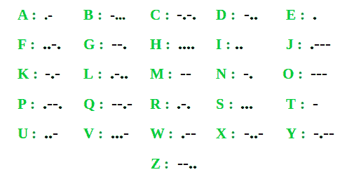

# 通过用莫尔斯电码替换每个字符来计数不同的字符串

> 原文:[https://www . geeksforgeeks . org/count-distinct-strings-可能通过用莫尔斯电码替换每个字符/](https://www.geeksforgeeks.org/count-distinct-strings-possible-by-replacing-each-character-by-its-morse-code/)

给定一个由[字符串](https://www.geeksforgeeks.org/string-data-structure/)**arr【】**组成的[数组](https://www.geeksforgeeks.org/array-data-structure/)，任务是通过用其[莫尔斯电码](https://www.geeksforgeeks.org/morse-code-implementation/)替换字符串的每个字符来计算从给定数组中可以生成的不同字符串的数量。以下是所有小写字母的莫尔斯电码:

[](https://media.geeksforgeeks.org/wp-content/cdn-uploads/20201030171241/morse-code.png)

**示例:**

> **输入:**arr[]=**{“gig”、“zeg”、“gin”、“MSN”}
> **输出:** 2
> **解释:**
> 将给定数组的字符串的每个字符替换为其莫尔斯电码:
> gig =“–…–”
> zeg =“–…–”
> gin = "–……-"
> MSN =“–…-”
> 字符串“gig”和“zeg”的莫尔斯电码相等。
> 字符串“gin”和“msn”的莫尔斯电码相等。
> 因此，通过将字符替换为莫尔斯电码，给定字符串的不同元素的总数等于 2。** 
> 
>  ****输入:** arr[] = {“极客”，“为”，“极客”}
> **输出:** 2**

****方法:**按照以下步骤解决问题:**

*   **初始化一个[数组](https://www.geeksforgeeks.org/vector-in-cpp-stl/)，比如说**morseCode【】**来存储所有小写字符的莫尔斯电码。**
*   **创建一个[集合](https://www.geeksforgeeks.org/set-in-cpp-stl/)，比如 **st** ，通过将每个字符替换为莫尔斯电码来存储数组的不同元素。**
*   **[遍历数组](https://www.geeksforgeeks.org/c-program-to-traverse-an-array/)，将数组字符串的[莫尔斯码插入 **st** 。](https://www.geeksforgeeks.org/morse-code-implementation/)**
*   **最后，打印 **st** 中存在的元素计数。**

**下面是上述方法的实现。**

## **C++**

```
// C++ program to implement
// the above approach

#include <bits/stdc++.h>
using namespace std;

// Function to count unique array elements
// by replacing each character by its Morse code
int uniqueMorseRep(vector<string>& arr)
{

    // Stores Morse code of all
    // lowercase characters
    vector<string> morseCode
        = {
            ".-", "-...", "-.-.",
            "-..", ".", "..-.", "--.",
            "....", "..", ".---", "-.-",
            ".-..", "--", "-.", "---",
            ".--.", "--.-", ".-.", "...",
            "-", "..-", "...-", ".--",
            "-..-", "-.--", "--.."
          };

    // Stores distinct elements of string by
    // replacing each character by Morse code
    set<string> st;

    // Stores length of arr[] array
    int N = arr.size();

    // Traverse the array
    for (int i = 0; i < N; i++) {

        // Stores the Morse code
        // of arr[i]
        string temp = "";

        // Stores length of
        // current string
        int M = arr[i].length();

        for (int j = 0; j < M; j++) {

            // Update temp
            temp += morseCode[arr[i][j] - 'a'];
        }

        // Insert temp into st
        st.insert(temp);
    }

    // Return count of elements
    // in the set
    return st.size();
}

// Driver code
int main()
{
    vector<string> arr = { "gig", "zeg",
                           "gin", "msn" };
    cout << uniqueMorseRep(arr) << endl;
}
```

## **Java 语言(一种计算机语言，尤用于创建网站)**

```
// Java program to implement
// the above approach
import java.util.*;
class GFG{

// Function to count unique
// array elements by replacing
// each character by its Morse code
static int uniqueMorseRep(String[] arr)
{
  // Stores Morse code of all
  // lowercase characters
  String []morseCode = {".-", "-...", "-.-.",
                        "-..", ".", "..-.", "--.",
                        "....", "..", ".---", "-.-",
                        ".-..", "--", "-.", "---",
                        ".--.", "--.-", ".-.", "...",
                        "-", "..-", "...-", ".--",
                        "-..-", "-.--", "--.."};

  // Stores distinct elements of
  // String by replacing each
  // character by Morse code
  HashSet<String> st = new HashSet<>();

  // Stores length of arr[] array
  int N = arr.length;

  // Traverse the array
  for (int i = 0; i < N; i++)
  {
    // Stores the Morse code
    // of arr[i]
    String temp = "";

    // Stores length of
    // current String
    int M = arr[i].length();

    for (int j = 0; j < M; j++)
    {
      // Update temp
      temp += morseCode[arr[i].charAt(j) - 'a'];
    }

    // Insert temp into st
    st.add(temp);
  }

  // Return count of elements
  // in the set
  return st.size();
}

// Driver code
public static void main(String[] args)
{
  String[] arr = {"gig", "zeg",
                  "gin", "msn"};
  System.out.print(uniqueMorseRep(arr) + "\n");
}
}

// This code is contributed by Amit Katiyar
```

## **蟒蛇 3**

```
# Python3 program to implement
# the above approach

# Function to count unique
# array elements by replacing
# each character by its Morse
# code
def uniqueMorseRep(arr):

    # Stores Morse code of
    # all lowercase characters
    morseCode = [".-", "-...", "-.-.",
                 "-..", ".", "..-.",
                 "--.", "....", "..",
                 ".---", "-.-", ".-..",
                 "--", "-.", "---", ".--.",
                 "--.-", ".-.", "...", "-",
                 "..-", "...-", ".--", "-..-",
                 "-.--", "--.."];

    # Stores distinct elements of
    # String by replacing each
    # character by Morse code
    st = set();

    # Stores length of arr array
    N = len(arr);

    # Traverse the array
    for i in range(N):

        # Stores the Morse code
        # of arr[i]
        temp = "";

        # Stores length of
        # current String
        M = len(arr[i]);

        for j in range(M):

            # Update temp
            temp += morseCode[ord(arr[i][j]) -
                              ord('a')];

        # Insert temp into st
        st.add(temp);

    # Return count of elements
    # in the set
    return len(st);

# Driver code
if __name__ == '__main__':

    arr = ["gig", "zeg",
           "gin", "msn"];
    print(uniqueMorseRep(arr) , "");

# This code is contributed by 29AjayKumar
```

## **C#**

```
// C# program to implement
// the above approach
using System;
using System.Collections.Generic;
class GFG{

// Function to count unique
// array elements by replacing
// each character by its Morse code
static int uniqueMorseRep(String[] arr)
{
  // Stores Morse code of all
  // lowercase characters
  String []morseCode = {".-", "-...", "-.-.",
                        "-..", ".", "..-.", "--.",
                        "....", "..", ".---", "-.-",
                        ".-..", "--", "-.", "---",
                        ".--.", "--.-", ".-.", "...",
                        "-", "..-", "...-", ".--",
                        "-..-", "-.--", "--.."};

  // Stores distinct elements of
  // String by replacing each
  // character by Morse code
  HashSet<String> st = new HashSet<String>();

  // Stores length of []arr array
  int N = arr.Length;

  // Traverse the array
  for (int i = 0; i < N; i++)
  {
    // Stores the Morse code
    // of arr[i]
    String temp = "";

    // Stores length of
    // current String
    int M = arr[i].Length;

    for (int j = 0; j < M; j++)
    {
      // Update temp
      temp += morseCode[arr[i][j] - 'a'];
    }

    // Insert temp into st
    st.Add(temp);
  }

  // Return count of elements
  // in the set
  return st.Count;
}

// Driver code
public static void Main(String[] args)
{
  String[] arr = {"gig", "zeg",
                  "gin", "msn"};
  Console.Write(uniqueMorseRep(arr) + "\n");
}
}

// This code is contributed by gauravrajput1
```

## **java 描述语言**

```
<script>

// Javascript program to implement
// the above approach

// Function to count unique array elements
// by replacing each character by its Morse code
function uniqueMorseRep(arr)
{

    // Stores Morse code of all
    // lowercase characters
    var morseCode
        = [
            ".-", "-...", "-.-.",
            "-..", ".", "..-.", "--.",
            "....", "..", ".---", "-.-",
            ".-..", "--", "-.", "---",
            ".--.", "--.-", ".-.", "...",
            "-", "..-", "...-", ".--",
            "-..-", "-.--", "--.."];

    // Stores distinct elements of string by
    // replacing each character by Morse code
    var st = new Set();

    // Stores length of arr[] array
    var N = arr.length;

    // Traverse the array
    for (var i = 0; i < N; i++) {

        // Stores the Morse code
        // of arr[i]
        var temp = "";

        // Stores length of
        // current string
        var M = arr[i].length;

        for (var j = 0; j < M; j++) {

            // Update temp
            temp += morseCode[arr[i][j].charCodeAt(0) - 'a'.charCodeAt(0)];
        }

        // Insert temp into st
        st.add(temp);
    }

    // Return count of elements
    // in the set
    return st.size;
}

// Driver code
var arr = ["gig", "zeg",
                       "gin", "msn"];
document.write( uniqueMorseRep(arr));

</script>
```

****Output:** 

```
2
```** 

*****时间复杂度:** O(N×M)* ，其中 N 是数组的大小，M 是一个字的长度。
***辅助空间:** O(N)***