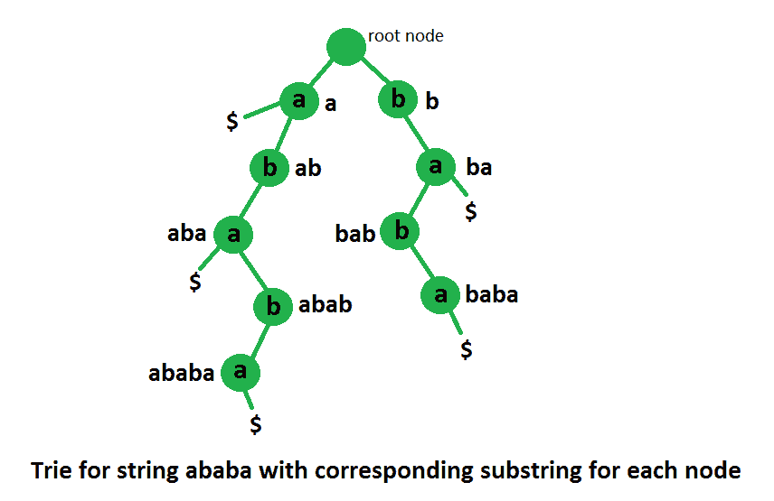

# 使用后缀 Trie 对字符串的不同子字符串进行计数

> 原文:[https://www . geesforgeks . org/count-distinct-substrings-string-using-后缀-trie/](https://www.geeksforgeeks.org/count-distinct-substrings-string-using-suffix-trie/)

给定一个长度为 n 个小写字母字符的字符串，我们需要计算这个字符串的不同子字符串的总数。
示例:

```
Input  : str = “ababa”
Output : 10
Total number of distinct substring are 10, which are,
"", "a", "b", "ab", "ba", "aba", "bab", "abab", "baba"
and "ababa"

```

这个想法是为给定字符串的所有后缀创建一个 [Trie。一旦 Trie 被压缩，我们的答案就是构造的 Trie 中的节点总数。例如下图代表了“亚的斯亚贝巴”所有后缀的 Trie。节点总数是 10，这是我们的答案。](https://www.geeksforgeeks.org/pattern-searching-using-trie-suffixes/)

 [](https://media.geeksforgeeks.org/wp-content/uploads/trieWithSubstring.png)

**这是如何工作的？**

*   一个 [Trie](https://www.geeksforgeeks.org/trie-insert-and-search/) 的每个根到节点路径代表 Trie 中出现的单词的前缀。在这里，我们单词是后缀。所以每个节点代表一个后缀前缀。
*   字符串“str”的每个子串都是后缀“str”的前缀。

以下是基于上述思想的实现。

## C++

```
// A C++ program to find the count of distinct substring
// of a string using trie data structure
#include <bits/stdc++.h>
#define MAX_CHAR 26
using namespace std;

// A Suffix Trie (A Trie of all suffixes) Node
class SuffixTrieNode
{
public:
    SuffixTrieNode *children[MAX_CHAR];
    SuffixTrieNode() // Constructor
    {
        // Initialize all child pointers as NULL
        for (int i = 0; i < MAX_CHAR; i++)
          children[i] = NULL;
    }

    // A recursive function to insert a suffix of the s
    // in subtree rooted with this node
    void insertSuffix(string suffix);
};

// A Trie of all suffixes
class SuffixTrie
{
    SuffixTrieNode *root;
    int _countNodesInTrie(SuffixTrieNode *);
public:
    // Constructor (Builds a trie of suffies of the given text)
    SuffixTrie(string s)
    {
        root = new SuffixTrieNode();

        // Consider all suffixes of given string and insert
        // them into the Suffix Trie using recursive function
        // insertSuffix() in SuffixTrieNode class
        for (int i = 0; i < s.length(); i++)
            root->insertSuffix(s.substr(i));
    }

    //  method to count total nodes in suffix trie
    int countNodesInTrie() { return _countNodesInTrie(root); }
};

// A recursive function to insert a suffix of the s in
// subtree rooted with this node
void SuffixTrieNode::insertSuffix(string s)
{
    // If string has more characters
    if (s.length() > 0)
    {
        // Find the first character and convert it
        // into 0-25 range.
        char cIndex = s.at(0) - 'a';

        // If there is no edge for this character,
        // add a new edge
        if (children[cIndex] == NULL)
            children[cIndex] = new SuffixTrieNode();

        // Recur for next suffix
        children[cIndex]->insertSuffix(s.substr(1));
    }
}

// A recursive function to count nodes in trie
int SuffixTrie::_countNodesInTrie(SuffixTrieNode* node)
{
    // If all characters of pattern have been processed,
    if (node == NULL)
        return 0;

    int count = 0;
    for (int i = 0; i < MAX_CHAR; i++)
    {
        // if children is not NULL then find count
        // of all nodes in this subtrie
        if (node->children[i] != NULL)
            count += _countNodesInTrie(node->children[i]);
    }

    // return count of nodes of subtrie and plus
    // 1 because of node's own count
    return (1 + count);
}

// Returns count of distinct substrings of str
int countDistinctSubstring(string str)
{
    // Construct a Trie of all suffixes
    SuffixTrie sTrie(str);

    // Return count of nodes in Trie of Suffixes
    return sTrie.countNodesInTrie();
}

// Driver program to test above function
int main()
{
    string str = "ababa";
    cout << "Count of distinct substrings is "
         << countDistinctSubstring(str);
    return 0;
}
```

## Java 语言(一种计算机语言，尤用于创建网站)

```
// A Java program to find the count of distinct substring
// of a string using trie data structure
public class Suffix 
{
    // A Suffix Trie (A Trie of all suffixes) Node
    static class SuffixTrieNode
    {
        static final int MAX_CHAR = 26;
        SuffixTrieNode[] children = new SuffixTrieNode[MAX_CHAR];

        SuffixTrieNode() // Constructor
        {
            // Initialize all child pointers as NULL
            for (int i = 0; i < MAX_CHAR; i++)
                children[i] = null;
        }

        // A recursive function to insert a suffix of the s in
        // subtree rooted with this node
        void insertSuffix(String s) 
        {
            // If string has more characters
            if (s.length() > 0) 
            {
                // Find the first character and convert it
                // into 0-25 range.
                char cIndex = (char) (s.charAt(0) - 'a');

                // If there is no edge for this character,
                // add a new edge
                if (children[cIndex] == null)
                    children[cIndex] = new SuffixTrieNode();

                // Recur for next suffix
                children[cIndex].insertSuffix(s.substring(1));
                }
        }
    }

    // A Trie of all suffixes
    static class Suffix_trie 
    {
        static final int MAX_CHAR = 26;
        SuffixTrieNode root;

        // Constructor (Builds a trie of suffies of the given text)
        Suffix_trie(String s) {
            root = new SuffixTrieNode();

            // Consider all suffixes of given string and insert
            // them into the Suffix Trie using recursive function
            // insertSuffix() in SuffixTrieNode class
            for (int i = 0; i < s.length(); i++)
                root.insertSuffix(s.substring(i));
        }

        // A recursive function to count nodes in trie
        int _countNodesInTrie(SuffixTrieNode node) 
        {
            // If all characters of pattern have been processed,
            if (node == null)
                return 0;

            int count = 0;
            for (int i = 0; i < MAX_CHAR; i++) {

                // if children is not NULL then find count
                // of all nodes in this subtrie
                if (node.children[i] != null)
                    count += _countNodesInTrie(node.children[i]);
            }

            // return count of nodes of subtrie and plus
            // 1 because of node's own count
            return (1 + count);
        }

        // method to count total nodes in suffix trie
        int countNodesInTrie() 
        {
            return _countNodesInTrie(root);
        }

    } 

    // Returns count of distinct substrings of str
    static int countDistinctSubstring(String str)
    {
        // Construct a Trie of all suffixes
        Suffix_trie sTrie = new Suffix_trie(str);

        // Return count of nodes in Trie of Suffixes
        return sTrie.countNodesInTrie();
    }

    // Driver program to test above function
    public static void main(String args[]) 
    {
        String str = "ababa";
        System.out.println("Count of distinct substrings is "
                + countDistinctSubstring(str));

    }
}
// This code is contributed by Sumit Ghosh
```

## C#

```
// C# program to find the count of distinct substring
// of a string using trie data structure
using System;

public class Suffix 
{
    // A Suffix Trie (A Trie of all suffixes) Node
    public class SuffixTrieNode
    {
        static readonly int MAX_CHAR = 26;
        public SuffixTrieNode[] children = new SuffixTrieNode[MAX_CHAR];

        public SuffixTrieNode() // Constructor
        {
            // Initialize all child pointers as NULL
            for (int i = 0; i < MAX_CHAR; i++)
                children[i] = null;
        }

        // A recursive function to insert a suffix of the s in
        // subtree rooted with this node
        public void insertSuffix(String s) 
        {
            // If string has more characters
            if (s.Length > 0) 
            {
                // Find the first character and convert it
                // into 0-25 range.
                char cIndex = (char) (s[0] - 'a');

                // If there is no edge for this character,
                // add a new edge
                if (children[cIndex] == null)
                    children[cIndex] = new SuffixTrieNode();

                // Recur for next suffix
                children[cIndex].insertSuffix(s.Substring(1));
                }
        }
    }

    // A Trie of all suffixes
    public class Suffix_trie 
    {
        static readonly int MAX_CHAR = 26;
        public SuffixTrieNode root;

        // Constructor (Builds a trie of suffies of the given text)
        public Suffix_trie(String s) 
        {
            root = new SuffixTrieNode();

            // Consider all suffixes of given string and insert
            // them into the Suffix Trie using recursive function
            // insertSuffix() in SuffixTrieNode class
            for (int i = 0; i < s.Length; i++)
                root.insertSuffix(s.Substring(i));
        }

        // A recursive function to count nodes in trie
        public int _countNodesInTrie(SuffixTrieNode node) 
        {
            // If all characters of pattern have been processed,
            if (node == null)
                return 0;

            int count = 0;
            for (int i = 0; i < MAX_CHAR; i++) 
            {

                // if children is not NULL then find count
                // of all nodes in this subtrie
                if (node.children[i] != null)
                    count += _countNodesInTrie(node.children[i]);
            }

            // return count of nodes of subtrie and plus
            // 1 because of node's own count
            return (1 + count);
        }

        // method to count total nodes in suffix trie
        public int countNodesInTrie() 
        {
            return _countNodesInTrie(root);
        }

    } 

    // Returns count of distinct substrings of str
    static int countDistinctSubstring(String str)
    {
        // Construct a Trie of all suffixes
        Suffix_trie sTrie = new Suffix_trie(str);

        // Return count of nodes in Trie of Suffixes
        return sTrie.countNodesInTrie();
    }

    // Driver program to test above function
    public static void Main(String []args) 
    {
        String str = "ababa";
        Console.WriteLine("Count of distinct substrings is "
                + countDistinctSubstring(str));

    }
}

// This code contributed by Rajput-Ji
```

**Output:**

```
Count of distinct substrings is 10

```

我们将很快讨论这个问题的基于[后缀数组](https://www.geeksforgeeks.org/suffix-array-set-1-introduction/)和[后缀树](https://www.geeksforgeeks.org/pattern-searching-set-8-suffix-tree-introduction/)的方法。

本文由 **[乌卡什·特里维迪](https://in.linkedin.com/in/utkarsh-trivedi-253069a7)** 供稿。如果你喜欢 GeeksforGeeks 并想投稿，你也可以使用[contribute.geeksforgeeks.org](http://www.contribute.geeksforgeeks.org)写一篇文章或者把你的文章邮寄到 contribute@geeksforgeeks.org。看到你的文章出现在极客博客主页上，帮助其他极客。

如果你发现任何不正确的地方，或者你想分享更多关于上面讨论的话题的信息，请写评论。