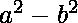
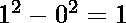
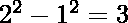
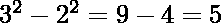
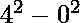
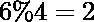
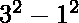
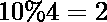

# 计算一个数组中可以表示为两个完美正方形之差的元素

> 原文:[https://www . geeksforgeeks . org/count-可以表示为两个完美正方形之差的数组元素/](https://www.geeksforgeeks.org/count-elements-in-an-array-that-can-be-represented-as-difference-of-two-perfect-squares/)

给定一个数组 **arr[]** ，任务是计算数组中可以用两个完美平方数之差的形式表示的元素个数。
**例:**

> **输入:** arr[] = {1，2，3}
> **输出:** 2
> **解释:**
> 有两个这样的元素可以表示为
> 两个数的平方之差–
> 元素 1–
> 元素 3–
> 因此，这样的元素计数为 2。
> **输入:** arr[] = {2，5，6}
> **输出:** 1
> **解释:**
> 这样的元素只有一个。即–
> 元素 5–
> 因此，该元素的计数为 1。

**方法:**问题中的关键观察点是可以表示为两个数的平方差的数，当除以 4 时，绝不会得到 2 作为余数。
**例如:**

> N = 4 => 
> N = 6 = >不能表示为
> N = 8 =>
> N = 10 =>不能表示为

因此，迭代数组并计算数组中此类元素的数量。
下面是上述方法的实现:

## C++

```
// C++ implementation to count the
// number of elements which can be
// represented as the difference
// of the two square

#include <bits/stdc++.h>

using namespace std;

// Function to count of such elements
// in the array which can be represented
// as the difference of the two squares
int count_num(int arr[], int n)
{
    // Initialize count
    int count = 0;

    // Loop to iterate
    // over the array
    for (int i = 0; i < n; i++)

        // Condition to check if the
        // number can be represented
        // as the difference of squares
        if ((arr[i] % 4) != 2)
            count++;

    cout << count;
    return 0;
}

// Driver code
int main()
{
    int arr[] = { 1, 2, 3 };
    int n = sizeof(arr) / sizeof(arr[0]);
    count_num(arr, n);
    return 0;
}
```

## Java 语言(一种计算机语言，尤用于创建网站)

```
// Java implementation to count the
// number of elements which can be
// represented as the difference
// of the two square
class GFG{

// Function to count of such elements
// in the array which can be represented
// as the difference of the two squares
static void count_num(int []arr, int n)
{

    // Initialize count
    int count = 0;

    // Loop to iterate
    // over the array
    for(int i = 0; i < n; i++)
    {

       // Condition to check if the
       // number can be represented
       // as the difference of squares
       if ((arr[i] % 4) != 2)
           count++;
    }
    System.out.println(count);
}

// Driver code
public static void main (String[] args)
{
    int arr[] = { 1, 2, 3 };
    int n = arr.length;

    count_num(arr, n);
}
}

// This code is contributed by AnkitRai01
```

## 蟒蛇 3

```
# Python3 implementation to count the
# number of elements in the array
# which can be represented as difference
# of the two elements

# Function to return the
# Count of required count
# of such elements
def count_num(arr, n):
    # Initialize count
    count = 0

    # Loop to iterate over the
    # array of elements
    for i in arr:

        # Condition to check if the
        # number can be represented
        # as the difference
        # of two squares
        if ((i % 4) != 2):
            count = count + 1

    return count

# Driver Code
if __name__ == "__main__":
    arr = [1, 2, 3]
    n = len(arr)

    # Function Call
    print(count_num(arr, n))
```

## C#

```
// C# implementation to count the
// number of elements which can be
// represented as the difference
// of the two square
using System;
class GFG{

// Function to count of such elements
// in the array which can be represented
// as the difference of the two squares
static void count_num(int []arr, int n)
{

    // Initialize count
    int count = 0;

    // Loop to iterate
    // over the array
    for(int i = 0; i < n; i++)
    {

        // Condition to check if the
        // number can be represented
        // as the difference of squares
        if ((arr[i] % 4) != 2)
            count++;
    }
    Console.WriteLine(count);
}

// Driver code
public static void Main(string[] args)
{
    int []arr = { 1, 2, 3 };
    int n = arr.Length;

    count_num(arr, n);
}
}

// This code is contributed by shivanisinghss2110
```

## java 描述语言

```
<script>

    // Javascript implementation to count the
    // number of elements which can be
    // represented as the difference
    // of the two square

    // Function to count of such elements
    // in the array which can be represented
    // as the difference of the two squares
    function count_num(arr, n)
    {
        // Initialize count
        let count = 0;

        // Loop to iterate
        // over the array
        for (let i = 0; i < n; i++)

            // Condition to check if the
            // number can be represented
            // as the difference of squares
            if ((arr[i] % 4) != 2)
                count++;

        document.write(count);
        return 0;
    }

    let arr = [ 1, 2, 3 ];
    let n = arr.length;
    count_num(arr, n);

</script>
```

**Output:** 

```
2
```