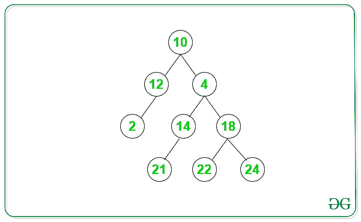
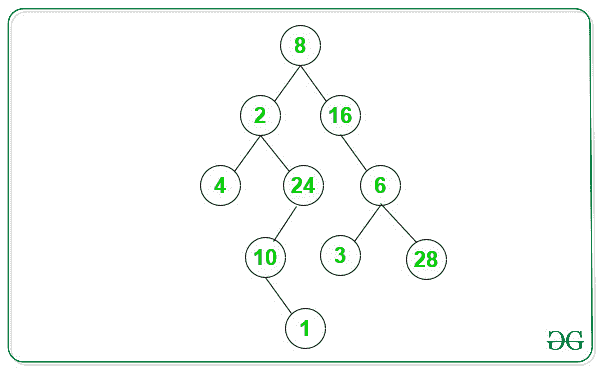

# 计算二叉树中的偶数路径

> 原文:[https://www . geesforgeks . org/count-二叉树中的偶数路径/](https://www.geeksforgeeks.org/count-even-paths-in-binary-tree/)

给定一棵[二叉树](https://www.geeksforgeeks.org/binary-tree-data-structure/)，任务是计算给定二叉树中偶数路径的数量。**偶数路径**是[根到叶路径](https://www.geeksforgeeks.org/given-a-binary-tree-print-all-root-to-leaf-paths/)仅包含所有偶数节点的路径。

**示例:**

> **输入:**下面是给定的二叉树:
> 
> 
> 
> **输出:** 3
> **说明:**
> 以上二叉树有 3 条偶数路径:
> 1。10- > 12- > 2
> 2。10- > 4- > 18- > 22
> 3。10- > 4- > 18- > 24
> 
> **输入:**下面是给定的二叉树:
> 
> 
> 
> **输出:** 2
> **说明:**
> 以上二叉树有 2 条偶数路径:
> 1。8- > 2- > 4
> 2。8- > 16- > 6- > 28

**天真方法:**想法是生成所有的[根到叶路径](https://www.geeksforgeeks.org/given-a-binary-tree-print-all-root-to-leaf-paths/)，并检查每个路径中的所有节点是否均匀。计算所有包含偶数节点的路径，并返回计数。上面的实现需要额外的空间来存储路径。

**高效方法:**想法是使用预排序[树遍历](https://www.geeksforgeeks.org/tree-traversals-inorder-preorder-and-postorder/)。在给定二叉树的[前序遍历](https://www.geeksforgeeks.org/tree-traversals-inorder-preorder-and-postorder/)期间，执行以下操作:

1.  如果节点的当前值为奇数或指针变为**空**，则返回计数。
2.  如果当前节点是叶节点，则将计数增加 1。
3.  用更新的计数递归调用左**和右**子树。****
4.  ****在所有递归调用之后，count 的值是给定二叉树的偶数路径数。****

****下面是上述方法的实现:****

## ****C++****

```
**// C++ program for the above approach
#include <bits/stdc++.h>
using namespace std;

// A Tree node
struct Node {
    int key;
    struct Node *left, *right;
};

// Utility function to create a new node
Node* newNode(int key)
{
    Node* temp = new Node;
    temp->key = key;
    temp->left = temp->right = NULL;
    return (temp);
}

// Utility function to count the even path
// in a given Binary tree
int evenPaths(struct Node* node, int count)
{

    // Base Condition, when node pointer
    // becomes null or node value is odd
    if (node == NULL || (node->key % 2 != 0)) {
        return count;
    }

    // Increment count when encounter leaf
    // node with all node value even
    if (!node->left && !node->right) {
        count++;
    }

    // Left recursive call, and save the
    // value of count
    count = evenPaths(node->left, count);

    // Right recursive call, and return
    // value of count
    return evenPaths(node->right, count);
}

// Function to count the even paths in a
// given Binary tree
int countEvenPaths(struct Node* node)
{

    // Function call with count = 0
    return evenPaths(node, 0);
}

// Driver Code
int main()
{

    // Tree
    Node* root = newNode(12);
    root->left = newNode(13);
    root->right = newNode(12);

    root->right->left = newNode(14);
    root->right->right = newNode(16);

    root->right->left->left = newNode(21);
    root->right->left->right = newNode(22);
    root->right->right->left = newNode(22);
    root->right->right->right = newNode(24);
    root->right->right->right->left = newNode(8);

    // Function call
    cout << countEvenPaths(root);
    return 0;
}**
```

## ****Java 语言(一种计算机语言，尤用于创建网站)****

```
**// Java program for the above approach
import java.util.*;
class GFG{

    // A Tree node
    static class Node {
        int key;
        Node left, right;
    };

    // Utility function to create a new node
    static Node newNode(int key)
    {
        Node temp = new Node();
        temp.key = key;
        temp.left = temp.right = null;
        return (temp);
    }

    // Utility function to count the even path
    // in a given Binary tree
    static int evenPaths(Node node, int count)
    {

        // Base Condition, when node pointer
        // becomes null or node value is odd
        if (node == null || (node.key % 2 != 0)) {
            return count;
        }

        // Increment count when encounter leaf
        // node with all node value even
        if (node.left == null && node.right == null) {
            count++;
        }

        // Left recursive call, and save the
        // value of count
        count = evenPaths(node.left, count);

        // Right recursive call, and return
        // value of count
        return evenPaths(node.right, count);
    }

    // Function to count the even paths in a
    // given Binary tree
    static int countEvenPaths(Node node)
    {

        // Function call with count = 0
        return evenPaths(node, 0);
    }

    // Driver Code
    public static void main(String args[])
    {

        // Tree
        Node root = newNode(12);
        root.left = newNode(13);
        root.right = newNode(12);

        root.right.left = newNode(14);
        root.right.right = newNode(16);

        root.right.left.left = newNode(21);
        root.right.left.right = newNode(22);
        root.right.right.left = newNode(22);
        root.right.right.right = newNode(24);
        root.right.right.right.left = newNode(8);

        // Function call
        System.out.println(countEvenPaths(root));

    }
}

// This code is contributed by AbhiThakur**
```

## ****蟒蛇 3****

```
**# Python3 program for the
# above approach

# A Tree node
class Node:

    def __init__(self, x):

        self.key = x
        self.left = None
        self.right = None

# Utility function to count
# the even path in a given
# Binary tree
def evenPaths(node, count):

    # Base Condition, when node
    # pointer becomes null or
    # node value is odd
    if (node == None or
       (node.key % 2 != 0)):
        return count

    # Increment count when
    # encounter leaf node
    # with all node value even
    if (not node.left and
        not node.right):
        count+=1

    # Left recursive call, and
    # save the value of count
    count = evenPaths(node.left,
                      count)

    # Right recursive call, and
    # return value of count
    return evenPaths(node.right,
                     count)

# Function to count the even
# paths in a given Binary tree
def countEvenPaths(node):

    # Function call with count = 0
    return evenPaths(node, 0)

# Driver Code
if __name__ == '__main__':

    #Tree
    root = Node(12)
    root.left = Node(13)
    root.right = Node(12)

    root.right.left = Node(14)
    root.right.right = Node(16)

    root.right.left.left = Node(21)
    root.right.left.right = Node(22)
    root.right.right.left = Node(22)
    root.right.right.right = Node(24)
    root.right.right.right.left = Node(8)

    #Function call
    print(countEvenPaths(root))

# This code is contributed by Mohit Kumar 29**
```

## ****C#****

```
**// C# program for the above approach
using System;

class GFG{

    // A Tree node
    class Node {
        public int key;
        public Node left, right;
    };

    // Utility function to create a new node
    static Node newNode(int key)
    {
        Node temp = new Node();
        temp.key = key;
        temp.left = temp.right = null;
        return (temp);
    }

    // Utility function to count the even path
    // in a given Binary tree
    static int evenPaths(Node node, int count)
    {

        // Base Condition, when node pointer
        // becomes null or node value is odd
        if (node == null || (node.key % 2 != 0)) {
            return count;
        }

        // Increment count when encounter leaf
        // node with all node value even
        if (node.left == null && node.right == null) {
            count++;
        }

        // Left recursive call, and save the
        // value of count
        count = evenPaths(node.left, count);

        // Right recursive call, and return
        // value of count
        return evenPaths(node.right, count);
    }

    // Function to count the even paths in a
    // given Binary tree
    static int countEvenPaths(Node node)
    {

        // Function call with count = 0
        return evenPaths(node, 0);
    }

    // Driver Code
    public static void Main(String []args)
    {

        // Tree
        Node root = newNode(12);
        root.left = newNode(13);
        root.right = newNode(12);

        root.right.left = newNode(14);
        root.right.right = newNode(16);

        root.right.left.left = newNode(21);
        root.right.left.right = newNode(22);
        root.right.right.left = newNode(22);
        root.right.right.right = newNode(24);
        root.right.right.right.left = newNode(8);

        // Function call
        Console.WriteLine(countEvenPaths(root));

    }
}

// This code is contributed by PrinciRaj1992**
```

## ****java 描述语言****

```
**<script>

// Javascript program for the above approach

// A Tree node
class Node
{

    // Utility function to create
    // a new node
    constructor(key)
    {
        this.key = key;
        this.left = this.right = null;
    }
}

// Utility function to count the even path
// in a given Binary tree
function evenPaths(node, count)
{

    // Base Condition, when node pointer
    // becomes null or node value is odd
    if (node == null || (node.key % 2 != 0))
    {
        return count;
    }

    // Increment count when encounter leaf
    // node with all node value even
    if (node.left == null && node.right == null)
    {
        count++;
    }

    // Left recursive call, and save the
    // value of count
    count = evenPaths(node.left, count);

    // Right recursive call, and return
    // value of count
    return evenPaths(node.right, count);
}

// Function to count the even paths in a
// given Binary tree
function countEvenPaths(node)
{

    // Function call with count = 0
    return evenPaths(node, 0);
}

// Driver Code
let root = new Node(12);
root.left = new Node(13);
root.right = new Node(12);

root.right.left = new Node(14);
root.right.right = new Node(16);

root.right.left.left = new Node(21);
root.right.left.right = new Node(22);
root.right.right.left = new Node(22);
root.right.right.right = new Node(24);
root.right.right.right.left = new Node(8);

// Function call
document.write(countEvenPaths(root));

// This code is contributed by unknown2108

</script>**
```

******Output:** 

```
3
```**** 

******时间复杂度:** O(N)，其中 N 是给定二叉树中的节点数。****