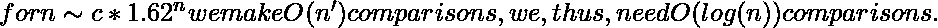

# 在 O(Log n)时间和 O(1)空间内计算给定范围内的斐波那契数

> 原文:[https://www . geesforgeks . org/count-Fibonacci-numbers-给定范围-log-time/](https://www.geeksforgeeks.org/count-fibonacci-numbers-given-range-log-time/)

给定一个范围，计算给定范围内的[斐波那契数](https://www.geeksforgeeks.org/program-for-nth-fibonacci-number/)。前几个斐波那契数是 0，1，1，2，3，5，8，13，21，34，55，89，141，..
T3】例:

```
Input: low = 10, high = 100
Output: 5
There are five Fibonacci numbers in given
range, the numbers are 13, 21, 34, 55 and 89.

Input: low = 10, high = 20
Output: 1
There is only one Fibonacci Number, 13.

Input: low = 0, high = 1
Output: 3
Fibonacci numbers are 0, 1 and 1
```

**我们强烈建议你尽量减少浏览器，先自己试试这个。**
A **蛮力解**是逐个找到所有斐波那契数并对给定范围内的所有斐波那契数进行计数
A**高效解**是利用 f<sub>n</sub>= f<sub>n-1</sub>+f<sub>n-2</sub>的简单斐波那契公式，利用前一个斐波那契数生成下一个。

## C++

```
// C++ program to count Fibonacci numbers in given range
#include <bits/stdc++.h>
using namespace std;

// Returns count of fibonacci numbers in [low, high]
int countFibs(int low, int high)
{
    // Initialize first three Fibonacci Numbers
    int f1 = 0, f2 = 1, f3 = 1;

    // Count fibonacci numbers in given range
    int result = 0;

    while (f1 <= high)
    {
        if (f1 >= low)
        result++;
        f1 = f2;
        f2 = f3;
        f3 = f1 + f2;
    }

    return result;
}

// Driver program
int main()
{
int low = 10, high = 100;
cout << "Count of Fibonacci Numbers is "
        << countFibs(low, high);
return 0;
}
```

## Java 语言(一种计算机语言，尤用于创建网站)

```
// Java program to count Fibonacci numbers in given range
import java.io.*;

class GFG {

    // Returns count of fibonacci numbers in [low, high]
    public static int countFibs(int low, int high)
    {
        // Initialize first three Fibonacci Numbers
        int f1 = 0, f2 = 1, f3 = 1;

        // Count fibonacci numbers in given range
        int result = 0;

        while (f1 <= high) {
            if (f1 >= low)
                result++;
            f1 = f2;
            f2 = f3;
            f3 = f1 + f2;
        }

        return result;
    }

    // Driver program
    public static void main(String[] args)
    {
        int low = 10, high = 100;
        System.out.println("Count of Fibonacci Numbers is "
                           + countFibs(low, high));
    }
}

// This code is contributed by RohitOberoi.
```

## 蟒蛇 3

```
# Python3 program to count Fibonacci
# numbers in given range

# Returns count of fibonacci
# numbers in [low, high]
def countFibs(low, high):

    # Initialize first three
    # Fibonacci Numbers
    f1, f2, f3 = 0, 1, 1

    # Count fibonacci numbers in
    # given range
    result = 0

    while (f1 <= high):
        if (f1 >= low):
            result += 1
        f1 = f2
        f2 = f3
        f3 = f1 + f2

    return result

# Driver Code
low, high = 10, 100
print("Count of Fibonacci Numbers is",
                 countFibs(low, high))

# This code is contributed
# by mohit kumar
```

## C#

```
// C# program to count Fibonacci
// numbers in given range
using System;

public class GFG
{

    // Returns count of fibonacci
    // numbers in [low, high]
    static int countFibs(int low,
                        int high)
    {

        // Initialize first three
        // Fibonacci Numbers
        int f1 = 0, f2 = 1, f3 = 1;

        // Count fibonacci numbers
        // in given range
        int result = 0;

        while (f1 <= high)
        {
            if (f1 >= low)
            result++;
            f1 = f2;
            f2 = f3;
            f3 = f1 + f2;
        }

        return result;
    }

    // Driver Code
    public static void Main(String []args)
    {
        int low = 10, high = 100;
        Console.WriteLine("Count of Fibonacci Numbers is "
                        + countFibs(low, high));
    }
}

// This code is contributed by Sam007.
```

## 服务器端编程语言（Professional Hypertext Preprocessor 的缩写）

```
<?php
// PHP program to count
// Fibonacci numbers in
// given range

// Returns count of fibonacci
// numbers in [low, high]
function countFibs($low, $high)
{
    // Initialize first
    // three Fibonacci Numbers
    $f1 = 0; $f2 = 1; $f3 = 1;

    // Count fibonacci
    // numbers in given range
    $result = 0;

    while ($f1 <= $high)
    {
        if ($f1 >= $low)
        $result++;
        $f1 = $f2;
        $f2 = $f3;
        $f3 = $f1 + $f2;
    }

    return $result;
}

// Driver Code
$low = 10; $high = 100;
echo "Count of Fibonacci Numbers is ",
               countFibs($low, $high);

// This code is contributed by nitin mittal.
?>
```

## java 描述语言

```
<script>

// JavaScript program to count Fibonacci
// numbers in given range

    // Returns count of fibonacci
    // numbers in [low, high]
    function countFibs(low, high)
    {

        // Initialize first three
        // Fibonacci Numbers
        let f1 = 0, f2 = 1, f3 = 1;

        // Count fibonacci numbers
        // in given range
        let result = 0;

        while (f1 <= high)
        {
            if (f1 >= low)
            result++;
            f1 = f2;
            f2 = f3;
            f3 = f1 + f2;
        }

        return result;
    }

// Driver program

        let low = 10, high = 100;
        document.write("Count of Fibonacci Numbers is "
                           + countFibs(low, high));

// This code is contributed by susmitakundugoaldanga.
</script>
```

**输出:**

```
Count of Fibonacci Numbers is 5
```

**时间复杂度分析:**
考虑到斐波那契数可以写成如下形式
![fib(n)=\left [ \frac {1}{\sqrt{5}}\left ( \frac {1+\sqrt{5}}{2} \right )^n \right ]\sim c*1.62^n     ](img/4d28d465b2b89951397774689d96672b.png "Rendered by QuickLaTeX.com")

所以斐波那契数的值呈指数增长。这意味着 while 循环呈指数增长，直到达到“高”。因此循环运行**0(Log(高))**次。
一种解决方案可以直接使用上述公式来计算斐波那契数，但这在实际中是不可行的(详见[本](https://www.geeksforgeeks.org/g-fact-18-2/))。
**辅助空间:** O(1)
本文由**苏汉书古普塔**供稿。如果您发现任何不正确的地方，请写评论，或者您想分享更多关于上面讨论的主题的信息