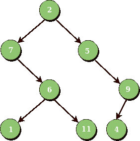

# 计算二叉树中的半个节点(迭代和递归)

> 原文:[https://www . geesforgeks . org/count-二叉树中的半节点-迭代递归/](https://www.geeksforgeeks.org/count-half-nodes-in-a-binary-tree-iterative-and-recursive/)

给定一棵二叉树，如何在不使用递归的情况下计算所有的半节点(只有一个子节点)？请注意，不能触摸树叶，因为它们的两个子代都为空。

```
Input : Root of below tree
```



```
Output : 3
Nodes 7, 5 and 9 are half nodes as one of 
their child is Null. So count of half nodes
in the above tree is 3
```

**迭代**
思路是利用层次顺序遍历高效解决这个问题。

```
1) Create an empty Queue Node and push root node to Queue.
2) Do following while nodeQeue is not empty.
   a) Pop an item from Queue and process it.
      a.1) If it is half node then increment count++.
   b) Push left child of popped item to Queue, if available.
   c) Push right child of popped item to Queue, if available.
```

下面是这个想法的实现。

## C++

```
// C++ program to count half nodes in a Binary Tree
#include <bits/stdc++.h>
using namespace std;

// A binary tree Node has data, pointer to left
// child and a pointer to right child
struct Node
{
    int data;
    struct Node* left, *right;
};

// Function to get the count of half Nodes in
// a binary tree
unsigned int gethalfCount(struct Node* node)
{
    // If tree is empty
    if (!node)
        return 0;

    int count = 0; // Initialize count of half nodes

    // Do level order traversal starting from root
    queue<Node *> q;
    q.push(node);
    while (!q.empty())
    {
        struct Node *temp = q.front();
        q.pop();

        if (!temp->left && temp->right ||
            temp->left && !temp->right)
            count++;

        if (temp->left != NULL)
            q.push(temp->left);
        if (temp->right != NULL)
            q.push(temp->right);
    }
    return count;
}

/* Helper function that allocates a new
   Node with the given data and NULL left
   and right pointers. */
struct Node* newNode(int data)
{
    struct Node* node = new Node;
    node->data = data;
    node->left = node->right = NULL;
    return (node);
}

// Driver program
int main(void)
{
    /* 2
     / \
    7     5
    \     \
     6     9
    / \ /
    1 11 4
    Let us create Binary Tree shown in
    above example */

    struct Node *root = newNode(2);
    root->left     = newNode(7);
    root->right     = newNode(5);
    root->left->right = newNode(6);
    root->left->right->left = newNode(1);
    root->left->right->right = newNode(11);
    root->right->right = newNode(9);
    root->right->right->left = newNode(4);

    cout << gethalfCount(root);

    return 0;
}
```

## Java 语言(一种计算机语言，尤用于创建网站)

```
// Java program to count half nodes in a Binary Tree
// using Iterative approach
import java.util.Queue;
import java.util.LinkedList;

// Class to represent Tree node
class Node
{
    int data;
    Node left, right;

    public Node(int item)
    {
        data = item;
        left = null;
        right = null;
    }
}

// Class to count half nodes of Tree
class BinaryTree
{

    Node root;

    /* Function to get the count of half Nodes in
    a binary tree*/
    int gethalfCount()
    {
        // If tree is empty
        if (root==null)
            return 0;

        // Do level order traversal starting from root
        Queue<Node> queue = new LinkedList<Node>();
        queue.add(root);

        int count=0; // Initialize count of half nodes
        while (!queue.isEmpty())
        {

            Node temp = queue.poll();
            if (temp.left!=null && temp.right==null ||
                temp.left==null && temp.right!=null)
                count++;

            // Enqueue left child
            if (temp.left != null)
                queue.add(temp.left);

            // Enqueue right child
            if (temp.right != null)
                queue.add(temp.right);
        }
        return count;
    }

    public static void main(String args[])
    {
        /* 2
          / \
        7     5
        \     \
        6     9
        / \ /
        1 11 4
        Let us create Binary Tree shown in
        above example */
        BinaryTree tree_level = new BinaryTree();
        tree_level.root = new Node(2);
        tree_level.root.left = new Node(7);
        tree_level.root.right = new Node(5);
        tree_level.root.left.right = new Node(6);
        tree_level.root.left.right.left = new Node(1);
        tree_level.root.left.right.right = new Node(11);
        tree_level.root.right.right = new Node(9);
        tree_level.root.right.right.left = new Node(4);

        System.out.println(tree_level.gethalfCount());

    }
}
```

## 蟒蛇 3

```
# Python program to count
# half nodes in a Binary Tree
# using iterative approach

# A node structure
class Node:

    # A utility function to create a new node
    def __init__(self ,key):
        self.data = key
        self.left = None
        self.right = None

# Iterative Method to count half nodes of binary tree
def gethalfCount(root):

    # Base Case
    if root is None:
        return 0

    # Create an empty queue for level order traversal
    queue = []

    # Enqueue Root and initialize count
    queue.append(root)

    count = 0 #initialize count for half nodes
    while(len(queue) > 0):

        node = queue.pop(0)

        # if it is half node then increment count
        if node.left is not None and node.right is None or node.left is None and node.right is not None:
            count = count+1

        #Enqueue left child
        if node.left is not None:
            queue.append(node.left)

        # Enqueue right child
        if node.right is not None:
            queue.append(node.right)

    return count

#Driver Program to test above function

root = Node(2)
root.left = Node(7)
root.right = Node(5)
root.left.right = Node(6)
root.left.right.left = Node(1)
root.left.right.right = Node(11)
root.right.right = Node(9)
root.right.right.left = Node(4)

print "%d" %(gethalfCount(root))
```

## C#

```
// C# program to count half nodes in a Binary Tree
// using Iterative approach
using System;
using System.Collections.Generic;

// Class to represent Tree node
public class Node
{
    public int data;
    public Node left, right;

    public Node(int item)
    {
        data = item;
        left = null;
        right = null;
    }
}

// Class to count half nodes of Tree
public class BinaryTree
{

    Node root;

    /* Function to get the count of half Nodes in
    a binary tree*/
    int gethalfCount()
    {
        // If tree is empty
        if (root == null)
            return 0;

        // Do level order traversal starting from root
        Queue<Node> queue = new Queue<Node>();
        queue.Enqueue(root);

        int count = 0; // Initialize count of half nodes
        while (queue.Count != 0)
        {

            Node temp = queue.Dequeue();
            if (temp.left != null && temp.right == null ||
                temp.left == null && temp.right != null)
                count++;

            // Enqueue left child
            if (temp.left != null)
                queue.Enqueue(temp.left);

            // Enqueue right child
            if (temp.right != null)
                queue.Enqueue(temp.right);
        }
        return count;
    }

    // Driver code
    public static void Main()
    {
        /* 2
        / \
        7 5
        \ \
        6 9
        / \ /
        1 11 4
        Let us create Binary Tree shown in
        above example */
        BinaryTree tree_level = new BinaryTree();
        tree_level.root = new Node(2);
        tree_level.root.left = new Node(7);
        tree_level.root.right = new Node(5);
        tree_level.root.left.right = new Node(6);
        tree_level.root.left.right.left = new Node(1);
        tree_level.root.left.right.right = new Node(11);
        tree_level.root.right.right = new Node(9);
        tree_level.root.right.right.left = new Node(4);

        Console.WriteLine(tree_level.gethalfCount());
    }
}

// This code contributed by Rajput-Ji
```

## java 描述语言

```
<script>

// Javascript program to count half nodes in a Binary Tree
// using Iterative approach

// Class to represent Tree node
class Node
{
    constructor(item)
    {
        this.data = item;
        this.left = null;
        this.right = null;
    }
}

// Class to count half nodes of Tree
var root;

/* Function to get the count of half Nodes in
a binary tree*/
function gethalfCount()
{

    // If tree is empty
    if (root == null)
        return 0;

    // Do level order traversal starting from root
    var queue = [];
    queue.push(root);
    var count = 0; // Initialize count of half nodes
    while (queue.length != 0)
    {
        var temp = queue.shift();
        if (temp.left != null && temp.right == null ||
            temp.left == null && temp.right != null)
            count++;

        // push left child
        if (temp.left != null)
            queue.push(temp.left);

        // push right child
        if (temp.right != null)
            queue.push(temp.right);
    }
    return count;
}

// Driver code
/* 2
/ \
7 5
\ \
6 9
/ \ /
1 11 4
Let us create Binary Tree shown in
above example */
root = new Node(2);
root.left = new Node(7);
root.right = new Node(5);
root.left.right = new Node(6);
root.left.right.left = new Node(1);
root.left.right.right = new Node(11);
root.right.right = new Node(9);
root.right.right.left = new Node(4);
document.write(gethalfCount());

// This code is contributed by famously.
</script>
```

输出:

```
 3
```

**时间复杂度:**O(n)
T3】辅助空间: O(n)
其中，n 是给定二叉树中的节点数

**递归**
思想是以后置顺序遍历树。如果当前节点是一半，我们将结果增加 1，并将左右子树的返回值相加。

## C++

```
// C++ program to count half nodes in a Binary Tree
#include <bits/stdc++.h>
using namespace std;

// A binary tree Node has data, pointer to left
// child and a pointer to right child
struct Node
{
    int data;
    struct Node* left, *right;
};

// Function to get the count of half Nodes in
// a binary tree
unsigned int gethalfCount(struct Node* root)
{
    if (root == NULL)
       return 0;

    int res = 0;
    if  ((root->left == NULL && root->right != NULL) ||
         (root->left != NULL && root->right == NULL))
       res++;

    res += (gethalfCount(root->left) + gethalfCount(root->right));
    return res;
}

/* Helper function that allocates a new
   Node with the given data and NULL left
   and right pointers. */
struct Node* newNode(int data)
{
    struct Node* node = new Node;
    node->data = data;
    node->left = node->right = NULL;
    return (node);
}

// Driver program
int main(void)
{
    /* 2
     / \
    7     5
    \     \
     6     9
    / \ /
    1 11 4
    Let us create Binary Tree shown in
    above example */

    struct Node *root = newNode(2);
    root->left     = newNode(7);
    root->right     = newNode(5);
    root->left->right = newNode(6);
    root->left->right->left = newNode(1);
    root->left->right->right = newNode(11);
    root->right->right = newNode(9);
    root->right->right->left = newNode(4);

    cout << gethalfCount(root);

    return 0;
}
```

## Java 语言(一种计算机语言，尤用于创建网站)

```
// Java program to count half nodes in a Binary Tree
import java.util.*;
class GfG {

// A binary tree Node has data, pointer to left
// child and a pointer to right child
static class Node
{
    int data;
    Node left, right;
}

// Function to get the count of half Nodes in
// a binary tree
static int gethalfCount(Node root)
{
    if (root == null)
    return 0;

    int res = 0;
    if ((root.left == null && root.right != null) ||
        (root.left != null && root.right == null))
    res++;

    res += (gethalfCount(root.left)
            + gethalfCount(root.right));
    return res;
}

/* Helper function that allocates a new
Node with the given data and NULL left
and right pointers. */
static Node newNode(int data)
{
    Node node = new Node();
    node.data = data;
    node.left = null;
    node.right = null;
    return (node);
}

// Driver program
public static void main(String[] args)
{
    /* 2
    / \
    7 5
    \ \
    6 9
    / \ /
    1 11 4
    Let us create Binary Tree shown in
    above example */

    Node root = newNode(2);
    root.left = newNode(7);
    root.right = newNode(5);
    root.left.right = newNode(6);
    root.left.right.left = newNode(1);
    root.left.right.right = newNode(11);
    root.right.right = newNode(9);
    root.right.right.left = newNode(4);

    System.out.println(gethalfCount(root));

}
}
```

## 计算机编程语言

```
# Python program to count half nodes in a binary tree

# A node structure
class newNode:
    def __init__(self, data):
        self.data = data
        self.left = self.right = None

# Function to get the count of half Nodes in a binary tree
def gethalfCount(root):
    if root == None:
        return 0
    res = 0
    if(root.left == None and root.right != None) or \
        (root.left != None and root.right == None):
        res += 1
    res += (gethalfCount(root.left) + \
            gethalfCount(root.right))
    return res

# Driver program
''' 2
    / \
    7     5
    \     \
    6     9
    / \ /
    1 11 4
    Let us create Binary Tree shown in
    above example '''

root = newNode(2)
root.left = newNode(7)
root.right = newNode(5)
root.left.right = newNode(6)
root.left.right.left = newNode(1)
root.left.right.right = newNode(11)
root.right.right = newNode(9)
root.right.right.left = newNode(4)
print(gethalfCount(root))

# This code is contributed by simranjenny84
```

## C#

```
// C# program to count half nodes in a Binary Tree
using System;

class GfG
{

    // A binary tree Node has data, pointer to left
    // child and a pointer to right child
    public class Node
    {
        public int data;
        public Node left, right;
    }

    // Function to get the count of half Nodes in
    // a binary tree
    static int gethalfCount(Node root)
    {
        if (root == null)
        return 0;

        int res = 0;
        if ((root.left == null && root.right != null) ||
            (root.left != null && root.right == null))
        res++;

        res += (gethalfCount(root.left)
                + gethalfCount(root.right));
        return res;
    }

    /* Helper function that allocates a new
    Node with the given data and NULL left
    and right pointers. */
    static Node newNode(int data)
    {
        Node node = new Node();
        node.data = data;
        node.left = null;
        node.right = null;
        return (node);
    }

    // Driver code
    public static void Main()
    {
        /* 2
        / \
        7 5
        \ \
        6 9
        / \ /
        1 11 4
        Let us create Binary Tree shown in
        above example */

        Node root = newNode(2);
        root.left = newNode(7);
        root.right = newNode(5);
        root.left.right = newNode(6);
        root.left.right.left = newNode(1);
        root.left.right.right = newNode(11);
        root.right.right = newNode(9);
        root.right.right.left = newNode(4);

        Console.WriteLine(gethalfCount(root));
    }
}

/* This code contributed by PrinciRaj1992 */
```

## java 描述语言

```
<script>

// Javascript program to count half
// nodes in a Binary Tree
class Node
{
    constructor(data)
    {
        this.left = null;
        this.right = null;
        this.data = data;
    }
}

// Function to get the count of half
// Nodes in a binary tree
function gethalfCount(root)
{
    if (root == null)
        return 0;

    let res = 0;

    if ((root.left == null && root.right != null) ||
        (root.left != null && root.right == null))
        res++;

    res += (gethalfCount(root.left) +
            gethalfCount(root.right));
    return res;
}

/* Helper function that allocates a new
Node with the given data and NULL left
and right pointers. */
function newNode(data)
{
    let node = new Node(data);
    return (node);
}

// Driver code
/*          2
        / \
        7  5
        \   \
         6    9
        / \  /
       1  11 4
Let us create Binary Tree shown in
above example */
let root = newNode(2);
root.left = newNode(7);
root.right = newNode(5);
root.left.right = newNode(6);
root.left.right.left = newNode(1);
root.left.right.right = newNode(11);
root.right.right = newNode(9);
root.right.right.left = newNode(4);

document.write(gethalfCount(root));

// This code is contributed by divyeshrabadiya07

</script>
```

**输出:**

```
3
```

**时间复杂度:**O(n)
T3】辅助空间: O(n)
其中，n 是给定二叉树中的节点数

**类似文章:**

*   [程序获取二叉树叶节点数](https://www.geeksforgeeks.org/write-a-c-program-to-get-count-of-leaf-nodes-in-a-binary-tree/)
*   [给定一棵二叉树，如何去掉所有的半节点？](https://www.geeksforgeeks.org/given-a-binary-tree-how-do-you-remove-all-the-half-nodes/)

本文由**Somesh Awasthi 先生**[T3】Rakesh KumarT5 投稿。如果你喜欢 GeeksforGeeks 并想投稿，你也可以使用](https://www.facebook.com/Rakesh2raj)[write.geeksforgeeks.org](https://write.geeksforgeeks.org)写一篇文章或者把你的文章邮寄到 review-team@geeksforgeeks.org。看到你的文章出现在极客博客主页上，帮助其他极客。
如果发现有不正确的地方，或者想分享更多关于上述话题的信息，请写评论。