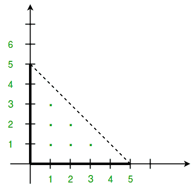

# 计算三角形内的积分点

> 原文:[https://www . geesforgeks . org/count-integral-points-in-a-triangle/](https://www.geeksforgeeks.org/count-integral-points-inside-a-triangle/)

给定 XY 平面上三个不共线的积分点，求这三个点构成的三角形内的积分点个数。(如果 XY 平面上的一个点的两个坐标都是积分，则称该点为积分/格点)。

**示例:**

```
Input: p = (0, 0), q = (0, 5) and r = (5,0) 

Output: 6

Explanation: The points (1,1) (1,2) (1,3) (2,1)
             (2,2) and (3,1) are the integral
             points inside the triangle.
```



我们可以使用[皮克定理](https://en.wikipedia.org/wiki/Pick's_theorem)，该定理指出以下等式对于简单多边形成立。

```
Pick's Theeorem:
 A = I + (B/2) -1

A ==> Area of Polygon
B ==> Number of integral points on edges of polygon
I ==> Number of integral points inside the polygon

Using the above formula, we can deduce,
I = (2A - B + 2) / 2 
```

我们可以使用下面的[鞋带公式](https://en.wikipedia.org/wiki/Shoelace_formula)找到 **A** (三角形的面积)。

```
A =  1/2 * abs(x1(y2 - y3) + x2(y3 - y1) + x3(y1 - y2)) 
```

**如何求 B(三角形边上的积分点数)？**
我们可以用下面的算法求出三角形任意两个顶点(V1、V2)之间的积分点数。

```
1\. If the edge formed by joining V1 and V2 is parallel 
   to the X-axis, then the number of integral points 
   between the vertices is : 
        abs(V1.x - V2.x) - 1

2\. Similarly, if edge is parallel to the Y-axis, then 
   the number of integral points in between is :
    abs(V1.y - V2.y) - 1

3\. Else, we can find the integral points between the
   vertices using below formula:
     GCD(abs(V1.x-V2.x), abs(V1.y-V2.y)) - 1
   The above formula is a well known fact and can be 
   verified using simple geometry. (Hint: Shift the 
   edge such that one of the vertex lies at the Origin.) 

Please refer below link for detailed explanation.
https://www.geeksforgeeks.org/number-integral-points-two-points/
```

下面是上述算法的实现。

## C++

```
// C++ program to find Integral points inside a triangle
#include<bits/stdc++.h>
using namespace std;

// Class to represent an Integral point on XY plane.
class Point
{
public:
    int x, y;
    Point(int a=0, int b=0):x(a),y(b) {}
};

//utility function to find GCD of two numbers
// GCD of a and b
int gcd(int a, int b)
{
    if (b == 0)
       return a;
    return gcd(b, a%b);
}

// Finds the no. of Integral points between
// two given points.
int getBoundaryCount(Point p,Point q)
{
    // Check if line parallel to axes
    if (p.x==q.x)
        return abs(p.y - q.y) - 1;
    if (p.y == q.y)
        return abs(p.x - q.x) - 1;

    return gcd(abs(p.x-q.x), abs(p.y-q.y)) - 1;
}

// Returns count of points inside the triangle
int getInternalCount(Point p, Point q, Point r)
{
    // 3 extra integer points for the vertices
    int BoundaryPoints = getBoundaryCount(p, q) +
                         getBoundaryCount(p, r) +
                         getBoundaryCount(q, r) + 3;

    // Calculate 2*A for the triangle
    int doubleArea = abs(p.x*(q.y - r.y) + q.x*(r.y - p.y)  +
                         r.x*(p.y - q.y));

    // Use Pick's theorem to calculate the no. of Interior points
    return (doubleArea - BoundaryPoints + 2)/2;
}

// driver function to check the program.
int main()
{
    Point p(0, 0);
    Point q(5, 0);
    Point r(0, 5);
    cout << "Number of integral points inside given triangle is "
         << getInternalCount(p, q, r);
    return 0;
}
```

## Java 语言(一种计算机语言，尤用于创建网站)

```
// Java program to find Integral points inside a triangle
// Class to represent an Integral point on XY plane.
class Point
{
    int x, y;

    public Point(int a, int b)
    {
        x = a;
        y = b;
    }
}

class GFG
{
    // utility function to find GCD of two numbers
    // GCD of a and b
    static int gcd(int a, int b)
    {
        if (b == 0)
            return a;
        return gcd(b, a % b);
    }

    // Finds the no. of Integral points between
    // two given points.
    static int getBoundaryCount(Point p, Point q)
    {
        // Check if line parallel to axes
        if (p.x == q.x)
            return Math.abs(p.y - q.y) - 1;

        if (p.y == q.y)
            return Math.abs(p.x - q.x) - 1;

        return gcd(Math.abs(p.x - q.x),
                   Math.abs(p.y - q.y)) - 1;
    }

    // Returns count of points inside the triangle
    static int getInternalCount(Point p, Point q, Point r)
    {

        // 3 extra integer points for the vertices
        int BoundaryPoints = getBoundaryCount(p, q) +
                             getBoundaryCount(p, r) +
                             getBoundaryCount(q, r) + 3;

        // Calculate 2*A for the triangle
        int doubleArea = Math.abs(p.x * (q.y - r.y) +
                                  q.x * (r.y - p.y) +
                                  r.x * (p.y - q.y));

        // Use Pick's theorem to calculate
        // the no. of Interior points
        return (doubleArea - BoundaryPoints + 2) / 2;
    }

    // Driver Code
    public static void main(String[] args)
    {
        Point p = new Point(0, 0);
        Point q = new Point(5, 0);
        Point r = new Point(0, 5);
        System.out.println("Number of integral points" +
                           " inside given triangle is " +
                              getInternalCount(p, q, r));
    }
}

// This code is contributed by Vivek Kumar Singh
```

## 蟒蛇 3

```
# Python3 program to find Integral
# points inside a triangle

# Class to represent an Integral
# point on XY plane.
class Point:

    def __init__(self, x, y):
        self.x = x
        self.y = y

# Utility function to find GCD of
# two numbers GCD of a and b
def gcd(a, b):

    if (b == 0):
        return a

    return gcd(b, a % b)

# Finds the no. of Integral points
# between two given points
def getBoundaryCount(p, q):

    # Check if line parallel to axes
    if (p.x == q.x):
        return abs(p.y - q.y) - 1
    if (p.y == q.y):
        return abs(p.x - q.x) - 1

    return gcd(abs(p.x - q.x),
               abs(p.y - q.y)) - 1

# Returns count of points inside the triangle
def getInternalCount(p, q, r):

    # 3 extra integer points for the vertices
    BoundaryPoints = (getBoundaryCount(p, q) +
                      getBoundaryCount(p, r) +
                      getBoundaryCount(q, r) + 3)

    # Calculate 2*A for the triangle
    doubleArea = abs(p.x * (q.y - r.y) +
                     q.x * (r.y - p.y) +
                     r.x * (p.y - q.y))

    # Use Pick's theorem to calculate
    # the no. of Interior points
    return (doubleArea - BoundaryPoints + 2) // 2

# Driver code
if __name__=="__main__":

    p = Point(0, 0)
    q = Point(5, 0)
    r = Point(0, 5)

    print("Number of integral points "
          "inside given triangle is ",
          getInternalCount(p, q, r))

# This code is contributed by rutvik_56
```

## C#

```
// C# program to find Integral points
// inside a triangle
using System;

// Class to represent an Integral point
// on XY plane.
public class Point
{
    public int x, y;

    public Point(int a, int b)
    {
        x = a;
        y = b;
    }
}

class GFG
{
    // utility function to find GCD of
    // two numbers a and b
    static int gcd(int a, int b)
    {
        if (b == 0)
            return a;
        return gcd(b, a % b);
    }

    // Finds the no. of Integral points between
    // two given points.
    static int getBoundaryCount(Point p, Point q)
    {
        // Check if line parallel to axes
        if (p.x == q.x)
            return Math.Abs(p.y - q.y) - 1;

        if (p.y == q.y)
            return Math.Abs(p.x - q.x) - 1;

        return gcd(Math.Abs(p.x - q.x),
                Math.Abs(p.y - q.y)) - 1;
    }

    // Returns count of points inside the triangle
    static int getInternalCount(Point p, Point q, Point r)
    {

        // 3 extra integer points for the vertices
        int BoundaryPoints = getBoundaryCount(p, q) +
                             getBoundaryCount(p, r) +
                              getBoundaryCount(q, r) + 3;

        // Calculate 2*A for the triangle
        int doubleArea = Math.Abs(p.x * (q.y - r.y) +
                                  q.x * (r.y - p.y) +
                                  r.x * (p.y - q.y));

        // Use Pick's theorem to calculate
        // the no. of Interior points
        return (doubleArea - BoundaryPoints + 2) / 2;
    }

    // Driver Code
    public static void Main(String[] args)
    {
        Point p = new Point(0, 0);
        Point q = new Point(5, 0);
        Point r = new Point(0, 5);
        Console.WriteLine("Number of integral points" +
                         " inside given triangle is " +
                            getInternalCount(p, q, r));
    }
}

// This code is contributed by 29AjayKumar
```

## java 描述语言

```
<script>

// JavaScript program to find Integral points inside a triangle
// Class to represent an Integral point on XY plane.

class Point
{
    constructor(a,b)
    {
        this.x=a;
        this.y=b;
    }
}

// utility function to find GCD of two numbers
    // GCD of a and b
function gcd(a,b)
{
    if (b == 0)
            return a;
        return gcd(b, a % b);
}

// Finds the no. of Integral points between
    // two given points.
function getBoundaryCount(p,q)
{
    // Check if line parallel to axes
        if (p.x == q.x)
            return Math.abs(p.y - q.y) - 1;

        if (p.y == q.y)
            return Math.abs(p.x - q.x) - 1;

        return gcd(Math.abs(p.x - q.x),
                   Math.abs(p.y - q.y)) - 1;
}

// Returns count of points inside the triangle
function getInternalCount(p,q,r)
{
    // 3 extra integer points for the vertices
        let BoundaryPoints = getBoundaryCount(p, q) +
                             getBoundaryCount(p, r) +
                             getBoundaryCount(q, r) + 3;

        // Calculate 2*A for the triangle
        let doubleArea = Math.abs(p.x * (q.y - r.y) +
                                  q.x * (r.y - p.y) +
                                  r.x * (p.y - q.y));

        // Use Pick's theorem to calculate
        // the no. of Interior points
        return (doubleArea - BoundaryPoints + 2) / 2;
}

// Driver Code
let p = new Point(0, 0);
let q = new Point(5, 0);
let r = new Point(0, 5);
document.write("Number of integral points" +
                           " inside given triangle is " +
                              getInternalCount(p, q, r));

// This code is contributed by rag2127

</script>
```

**输出:**

```
Number of integral points inside given triangle is 6
```

本文由**阿舒托什·库马尔**供稿。如果你喜欢极客博客并想投稿，你也可以写一篇文章并把你的文章邮寄到 review-team@geeksforgeeks.org。看到你的文章出现在极客博客主页上，帮助其他极客。
如发现任何不正确的地方，请写评论，或者您想分享更多关于上述话题的信息