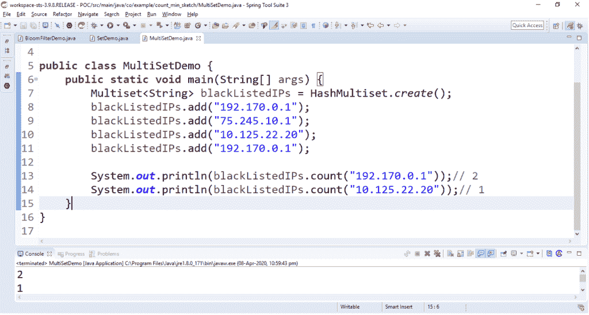
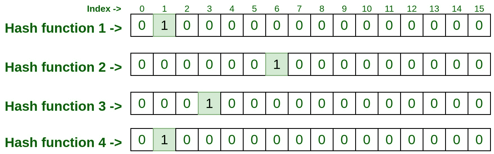
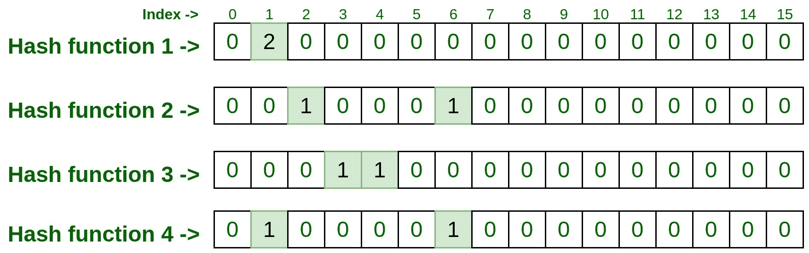
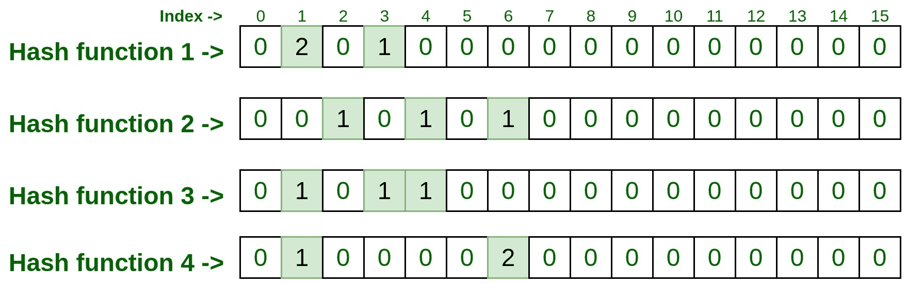
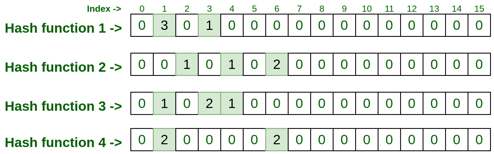
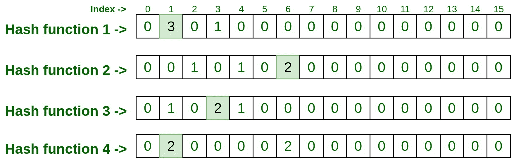
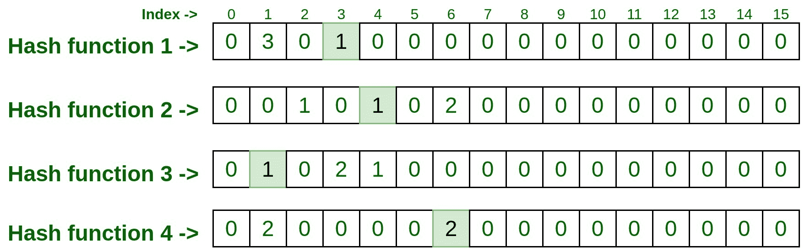
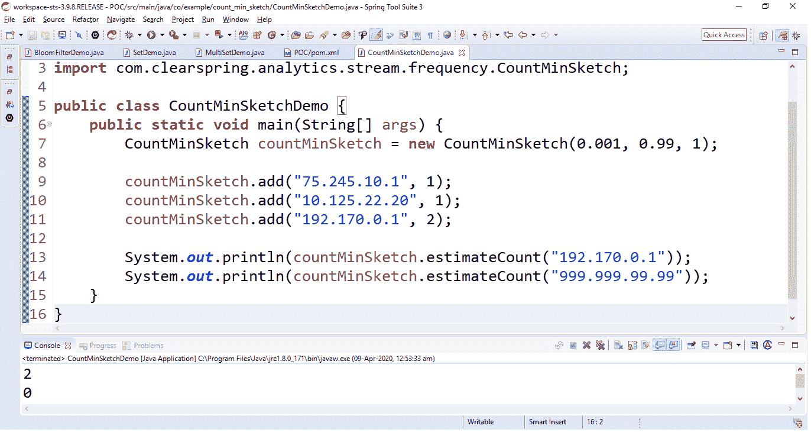

# Java 中的最小计数草图，带示例

> 原文:[https://www . geesforgeks . org/count-min-sketch-in-Java-with-examples/](https://www.geeksforgeeks.org/count-min-sketch-in-java-with-examples/)

**计数-最小草图**是一个**概率**[T5】数据结构](https://www.geeksforgeeks.org/data-structures/) 。最小计数草图是一种总结大量频率数据的简单技术。Count-min 草图算法讲述了如何记录事物的数量。即一个元素在集合中出现的次数。使用[哈希表](https://www.geeksforgeeks.org/hashtable-in-java/)或[映射](https://www.geeksforgeeks.org/map-interface-java-examples/)可以很容易地在 Java 中找到一个项目的计数。
**<u>尝试 MultiSet 作为 Count-min 草图的替代方案</u>**
让我们使用下面的源代码尝试使用 [MultiSet](https://www.geeksforgeeks.org/multiset-interface-guava-java/) 实现这个数据结构，并尝试找出这种方法的问题。

## Java 语言（一种计算机语言，尤用于创建网站）

```
// Java program to try MultiSet as an
// alternative to Count-min sketch

import com.google.common.collect.HashMultiset;
import com.google.common.collect.Multiset;

public class MultiSetDemo {
    public static void main(String[] args)
    {
        Multiset<String> blackListedIPs
            = HashMultiset.create();
        blackListedIPs.add("192.170.0.1");
        blackListedIPs.add("75.245.10.1");
        blackListedIPs.add("10.125.22.20");
        blackListedIPs.add("192.170.0.1");

        System.out.println(blackListedIPs
                               .count("192.170.0.1"));
        System.out.println(blackListedIPs
                               .count("10.125.22.20"));
    }
}
```

**输出:**



**<u>理解使用 multist</u>**
的问题现在让我们看看这种方法消耗的时间和空间。

```
----------------------------------------------
|Number of UUIDs          Insertion Time(ms)  |
----------------------------------------------
|10                         <25               |   
|100                        <25               |
|1, 000                      30               |
|10, 000                     257              |
|100, 000                    1200             |
|1, 000, 000                 4244             |
----------------------------------------------
```

我们来看看消耗的内存(空间):

```
----------------------------------------------
|Number of UUIDs            JVM heap used(MB) |
----------------------------------------------
|10                         <2                |   
|100                        <2                |
|1, 000                      3                |
|10, 000                     9                |
|100, 000                    39               |
|1, 000, 000                 234              |
-----------------------------------------------
```

我们很容易理解，随着数据的增长，上述方法会消耗大量内存和时间来处理数据。如果我们使用**计数-最小草图算法**，这可以得到优化。
**<u>什么是 Count-min 草图，它是如何工作的？</u>**
最小计数草图方法是由**格雷厄姆·科模式**和 **S .穆图克里希南**提出的。在 2011/12 出版的论文 [**中，用最小计数草图**](https://ieeexplore.ieee.org/document/6042851) 逼近数据。Count-min sketch 用于统计流数据上事件的频率。像**布隆过滤器**一样，Count-min 草图算法也适用于哈希代码。它使用多个散列函数将这些频率映射到矩阵上(这里考虑绘制一个[二维数组](https://www.geeksforgeeks.org/multidimensional-arrays-in-java/)或[矩阵](https://www.geeksforgeeks.org/matrix/))。
下面我们一步步来看看下面的例子。

1.  考虑下面具有 4 行 16 列的 2D 数组，行数也等于散列函数的数量。这意味着我们以四个散列函数为例。用零初始化/标记矩阵中的每个单元格。
    **注意:**想要的结果越准确，需要使用的哈希函数数量就越多。


2.  现在让我们给它添加一些元素。为此，我们必须用所有四个散列函数传递该元素，结果如下。

```
Input : 192.170.0.1 
```

```
hashFunction1(192.170.0.1): 1
hashFunction2(192.170.0.1): 6
hashFunction3(192.170.0.1): 3
hashFunction4(192.170.0.1): 1
```

1.  现在访问上面所有四个散列函数检索到的索引，并将它们标记为 1。



2.  同样，通过将第二个输入传递给所有四个散列函数来处理它。

```
Input : 75.245.10.1 
```

```
hashFunction1(75.245.10.1): 1
hashFunction2(75.245.10.1): 2
hashFunction3(75.245.10.1): 4
hashFunction4(75.245.10.1): 6
```

1.  现在，如果给定的索引已经被标记为 1，取这些索引并访问矩阵。这称为冲突，这意味着该行的索引已经被一些先前的输入标记，在这种情况下，只需将索引值增加 1。在我们的例子中，由于我们已经通过先前的输入将第 1 行的索引 1，即 hashFunction1()标记为 1，所以这次它将增加 1，现在这个单元格条目将是 2，但是对于其余行的索引，它将是 0，因为没有冲突。



2.  让我们处理下一个输入

```
Input : 10.125.22.20 
```

```
hashFunction1(10.125.22.20): 3
hashFunction2(10.125.22.20): 4
hashFunction3(10.125.22.20): 1
hashFunction4(10.125.22.20): 6
```

1.  让我们在矩阵上表示它，如果已经有条目存在，一定要记得将计数增加 1。



2.  同样处理下一个输入。

```
Input : 192.170.0.1 
```

```
hashFunction1(192.170.0.1): 1
hashFunction2(192.170.0.1): 6
hashFunction3(192.170.0.1): 3
hashFunction4(192.170.0.1): 1
```

1.  让我们来看看矩阵表示法。



现在让我们测试一些元素，看看它们出现了多少次。

```
Test Input #1: 192.170.0.1 
```

1.  将上述输入传递给所有四个散列函数，并获取散列函数生成的索引号。

```
hashFunction1(192.170.0.1): 1
hashFunction2(192.170.0.1): 6
hashFunction3(192.170.0.1): 3
hashFunction4(192.170.0.1): 1
```

1.  现在访问每个索引，记下该索引上的条目



1.  所以每个指数的最终条目是 **3，2，2，2** 。现在取这些条目中的最小计数，这就是结果。所以 min(3，2，2，2)是 2，这意味着上面的测试输入在上面的列表中被处理了两次。

```
Test Input #1: 10.125.22.20 
```

1.  将上述输入传递给所有四个散列函数，并获取散列函数生成的索引号。

```
hashFunction1(10.125.22.20): 3
hashFunction2(10.125.22.20): 4
hashFunction3(10.125.22.20): 1
hashFunction4(10.125.22.20): 6
```

1.  现在访问每个索引，记下该索引上的条目



1.  所以每个指数的最终条目是 **1，1，1，2** 。现在取这些条目中的最小计数，这就是结果。所以 min(1，1，1，2)是 1，这意味着上面的测试输入在上面的列表中只处理一次。

**<u>与 Count-min 草图相关的问题及其解决方案:</u>**
如果一个或多个元素获得相同的哈希值，然后它们都递增，会怎么样。因此，在这种情况下，该值会因为[哈希冲突](https://www.geeksforgeeks.org/hashing-set-1-introduction/)而增加。因此，有时(在极少数情况下)最小计数草图会因为散列函数而过度调节频率。所以我们取的散列函数越多，碰撞就越少。**我们取的散列函数越少，碰撞的概率就越大**。因此，它总是建议使用更多数量的散列函数。
**<u>最小计数草图的应用:</u>**

*   压缩传感
*   建立工作关系网
*   自然语言处理
*   流处理
*   频率跟踪
*   延伸:重量级人物
*   扩展:范围-查询

**<u>使用 Java 中的番石榴库实现 Count-min 草图:</u>**
我们可以使用番石榴提供的 Java 库实现 Count-min 草图。下面是分步实施:

1.  使用下面的 maven 依赖项。

## 可扩展标记语言

```
<dependency>
    <groupId>com.clearspring.analytics</groupId>
    <artifactId>stream</artifactId>
    <version>2.9.5</version>
</dependency>
```

2.  详细的 Java 代码如下:

## Java 语言(一种计算机语言，尤用于创建网站)

```
import com.clearspring.analytics
    .stream.frequency.CountMinSketch;

public class CountMinSketchDemo {
    public static void main(String[] args)
    {
        CountMinSketch countMinSketch
            = new CountMinSketch(
                // epsilon
                0.001,
                // delta
                0.99,
                // seed
                1);

        countMinSketch.add("75.245.10.1", 1);
        countMinSketch.add("10.125.22.20", 1);
        countMinSketch.add("192.170.0.1", 2);

        System.out.println(
            countMinSketch
                .estimateCount(
                    "192.170.0.1"));
        System.out.println(
            countMinSketch
                .estimateCount(
                    "999.999.99.99"));
    }
}
```



2.  上面的例子在构造函数中取了三个参数

```
- 0.001 = the epsilon i.e., error rate
- 0.99 = the delta i.e., confidence or accuracy rate
- 1 = the seed
```

2.  现在让我们来看看这种方法消耗的时间和空间。

```
-----------------------------------------------------------------------------
|Number of UUIDs | Multiset Insertion Time(ms)  | CMS Insertion Time(ms)    |
-----------------------------------------------------------------------------
|10                         <25                   35                        |   
|100                        <25                   30                        |
|1, 000                      30                   69                        |
|10, 000                     257                  246                       |
|100, 000                    1200                 970                       |
|1, 000, 000                 4244                 4419                      |
-----------------------------------------------------------------------------
```

2.  现在，让我们看看消耗的内存:

```
--------------------------------------------------------------------------
|Number of UUIDs | Multiset JVM heap used(MB) | CMS JVM heap used(MB)    | 
--------------------------------------------------------------------------
|10                         <2                   N/A                     |   
|100                        <2                   N/A                     |
|1, 000                      3                   N/A                     |
|10, 000                     9                   N/A                     |
|100, 000                    39                  N/A                     |
|1, 000, 000                 234                 N/A                     |
---------------------------------------------------------------------------
```

2.  **建议:**

```
-------------------------------------------------------------------------------------
|Epsilon  | Delta  | width/Row (hash functions)| Depth/column| CMS JVM heap used(MB) |
-------------------------------------------------------------------------------------
|0.1      |0.99    |         7                 | 20          |   0.009               |
|0.01     |0.999   |         10                | 100         |   0.02                |
|0.001    |0.9999  |         14                | 2000        |   0.2                 |
|0.0001   |0.99999 |         17                | 20000       |   2                   | 
--------------------------------------------------------------------------------------
```

**结论:**
我们观察到，在我们必须**以低内存消耗处理大数据集的情况下，Count-min 草图是一个不错的选择**。我们还看到，我们想要的结果越精确，散列函数的数量(行/宽度)就必须增加。