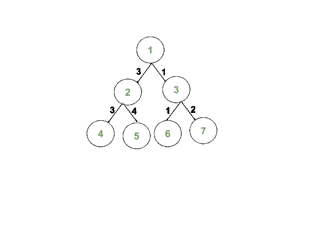

# 计算从根开始的路径中所有边的按位异或等于 K 的节点数

> 原文:[https://www . geesforgeks . org/count-nodes-with-bitwise-xor-of-in-the-path-from-root-equal-k/](https://www.geeksforgeeks.org/count-nodes-having-bitwise-xor-of-all-edges-in-their-path-from-the-root-equal-to-k/)

给定一个由 **N** 节点和两个整数 **R** 和 **K** 组成的[二叉树](https://www.geeksforgeeks.org/binary-tree-data-structure/)。树的每条边都有一个与之关联的正整数，以 **{u，v，w}** 的形式给出，其中边 **(u，v)** 有权重 **w** 。任务是计算从根 **R** 到 **S** 的路径中所有边的[按位异或](https://www.geeksforgeeks.org/bitwise-operators-in-c-cpp/)的节点数 **S** 等于 **K** 。

**示例:**

> **输入:** R = 1，K = 0，N = 7，边[][] = {{1，2，3}，{1，3，1}，{2，4，3}，{2，5，4}，{3，6，1}，{3，7，2}}
> **输出:** 2
> **解释:**
> 给定二叉树的表示:
> 
> 
> 
> 以下节点对连接它们的路径中的边进行按位异或运算，结果为 K = 0:
> 对 1: (1，4) = (3 ^ 3) = 0
> 对 2: (1，6) = (1 ^ 1) = 0
> 
> **输入:** R = 1，K = 0，N = 9，Edges[][] = {{1，2，3}，{1，3，2}，{2，4，3}，{2，5，4}，{3，6，1}，{3，7，2}，{6，8，3}，{6，9，7}}
> **输出:** 3
> **解释:**
> 给定二叉树的表示如下:
> 
> 
> 
> 以下节点对连接它们的路径中的边进行按位异或运算，结果为 K = 0:
> 对 1: (1，4) = (3 ^ 3) = 0
> 对 2: (1，8) = (2 ^ 1 ^ 3) = 0
> 对 3: (1，7) = (2 ^ 2) = 0

**方法:**使用[深度优先搜索](https://www.geeksforgeeks.org/depth-first-search-or-dfs-for-a-graph/)方法可以解决问题。按照以下步骤解决问题:

1.  初始化变量 **ans** 和 **xor** 与 **0** 来存储边对的数量和当前的 [xor](https://www.geeksforgeeks.org/calculate-xor-1-n/) 。
2.  [从给定的根顶点 **R** 开始，使用](https://www.geeksforgeeks.org/tree-traversals-inorder-preorder-and-postorder/)[深度优先搜索](https://www.geeksforgeeks.org/depth-first-search-or-dfs-for-a-graph/)遍历给定的树。
3.  对于每个节点 **u** ，访问其相邻节点。
4.  对于每条边 **{u，v}** ，如果**异或**等于 **K** ，则将 **ans** 增加 **1** 。否则，对于当前边沿 **{u，v，w}** ，更新 **xor** 为 **xor = (xor^w)** ，其中^为[位 XOR](https://www.geeksforgeeks.org/bitwise-operators-in-c-cpp/) 。
5.  遍历后，将计数器**和**中存储的值打印成对数。

下面是上述方法的实现:

## C++

```
// C++ program for the above approach
#include <bits/stdc++.h>
using namespace std;

// Initialize the adjacency list
// to represent the tree
vector<pair<int, int> > adj[100005];

// Marks visited / unvisited vertices
int visited[100005] = { 0 };

// Stores the required count of nodes
int ans = 0;

// DFS to visit each vertex
void dfs(int node, int xorr, int k)
{
    // Mark the current node
    // as visited
    visited[node] = 1;

    // Update the counter xor is K
    if (node != 1 && xorr == k)
        ans++;

    // Visit adjacent nodes
    for (auto x : adj[node]) {

        if (!visited[x.first]) {

            // Calculate Bitwise XOR of
            // edges in the path
            int xorr1 = xorr ^ x.second;

            // Recursive call to dfs function
            dfs(x.first, xorr1, k);
        }
    }
}

// Function to construct the tree and
// print required count of nodes
void countNodes(int N, int K, int R,
                vector<vector<int> > edges)
{

    // Add edges
    for (int i = 0; i < N - 1; i++) {
        int u = edges[i][0], v = edges[i][1],
            w = edges[i][2];
        adj[u].push_back({ v, w });
        adj[v].push_back({ u, w });
    }

    dfs(R, 0, K);

    // Print answer
    cout << ans << "\n";
}

// Driver Code
int main()
{
    // Given K and R
    int K = 0, R = 1;

    // Given edges
    vector<vector<int> > edges
        = { { 1, 2, 3 }, { 1, 3, 1 },
            { 2, 4, 3 }, { 2, 5, 4 },
            { 3, 6, 1 }, { 3, 7, 2 } };

    // Number of vertices
    int N = edges.size();

    // Function call
    countNodes(N, K, R, edges);

    return 0;
}
```

## Java 语言(一种计算机语言，尤用于创建网站)

```
// Java program for the
// above approach
import java.util.*;
class GFG{

static class pair
{
  int first, second;
  public pair(int first,
              int second) 
  {
    this.first = first;
    this.second = second;
  }   
}

// Initialize the adjacency list
// to represent the tree
static Vector<pair> []adj =
       new Vector[100005];

// Marks visited / unvisited
// vertices
static int visited[] =
       new int[100005];

// Stores the required
// count of nodes
static int ans = 0;

// DFS to visit each
// vertex
static void dfs(int node,
                int xorr,
                int k)
{
  // Mark the current node
  // as visited
  visited[node] = 1;

  // Update the counter
  // xor is K
  if (node != 1 &&
      xorr == k)
    ans++;

  // Visit adjacent nodes
  for (pair x : adj[node])
  {
    if (visited[x.first] != 1)
    {
      // Calculate Bitwise XOR of
      // edges in the path
      int xorr1 = xorr ^ x.second;

      // Recursive call to dfs
      // function
      dfs(x.first, xorr1, k);
    }
  }
}

// Function to construct the tree and
// print required count of nodes
static void countNodes(int N, int K,
                       int R, int[][] edges)
{
  // Add edges
  for (int i = 0; i < N - 1; i++)
  {
    int u = edges[i][0],
        v = edges[i][1],
    w = edges[i][2];
    adj[u].add(new pair(v, w ));
    adj[v].add(new pair(u, w ));
  }

  dfs(R, 0, K);

  // Print answer
  System.out.print(ans + "\n");
}

// Driver Code
public static void main(String[] args)
{
  // Given K and R
  int K = 0, R = 1;

  for (int i = 0; i < adj.length; i++)
    adj[i] = new Vector<pair>();
  // Given edges
  int[][] edges = {{1, 2, 3},
                   {1, 3, 1}, 
                   {2, 4, 3},
                   {2, 5, 4},
                   {3, 6, 1},
                   {3, 7, 2}};

  // Number of vertices
  int N = edges.length;

  // Function call
  countNodes(N, K, R, edges);
}
}

// This code is contributed by 29AjayKumar
```

## 蟒蛇 3

```
# Python3 program for the above approach

# Initialize the adjacency list
# to represent the tree
adj = [[] for i in range(100005)]

# Marks visited / unvisited vertices
visited = [0] * 100005

# Stores the required count of nodes
ans = 0

# DFS to visit each vertex
def dfs(node, xorr, k):

    global ans

    # Mark the current node
    # as visited
    visited[node] = 1

    # Update the counter xor is K
    if (node != 1 and xorr == k):
        ans += 1

    # Visit adjacent nodes
    for x in adj[node]:
        if (not visited[x[0]]):

            # Calculate Bitwise XOR of
            # edges in the path
            xorr1 = xorr ^ x[1]

            # Recursive call to dfs function
            dfs(x[0], xorr1, k)

# Function to construct the tree and
# prrequired count of nodes
def countNodes(N, K, R, edges):

    # Add edges
    for i in range(N - 1):
        u = edges[i][0]
        v = edges[i][1]
        w = edges[i][2]

        adj[u].append([v, w])
        adj[v].append([u, w])

    dfs(R, 0, K)

    # Print answer
    print(ans)

# Driver Code
if __name__ == '__main__':

    # Given K and R
    K = 0
    R = 1

    # Given edges
    edges = [ [ 1, 2, 3 ],[ 1, 3, 1 ],
              [ 2, 4, 3 ],[ 2, 5, 4 ],
              [ 3, 6, 1 ],[ 3, 7, 2 ] ]

    # Number of vertices
    N = len(edges)

    # Function call
    countNodes(N, K, R, edges)

# This code is contributed by mohit kumar 29
```

## C#

```
// C# program for the
// above approach
using System;
using System.Collections.Generic;
class GFG{

public class pair
{
  public int first,
             second;
  public pair(int first,
              int second) 
  {
    this.first = first;
    this.second = second;
  }   
}

// Initialize the adjacency list
// to represent the tree
static List<pair> []adj =
       new List<pair>[100005];

// Marks visited / unvisited
// vertices
static int []visited =
       new int[100005];

// Stores the required
// count of nodes
static int ans = 0;

// DFS to visit each
// vertex
static void dfs(int node,
                int xorr,
                int k)
{
  // Mark the current node
  // as visited
  visited[node] = 1;

  // Update the counter
  // xor is K
  if (node != 1 &&
      xorr == k)
    ans++;

  // Visit adjacent nodes
  foreach (pair x in adj[node])
  {
    if (visited[x.first] != 1)
    {
      // Calculate Bitwise XOR of
      // edges in the path
      int xorr1 = xorr ^ x.second;

      // Recursive call to dfs
      // function
      dfs(x.first, xorr1, k);
    }
  }
}

// Function to construct the tree and
// print required count of nodes
static void countNodes(int N, int K,
                       int R, int[,] edges)
{
  // Add edges
  for (int i = 0; i < N - 1; i++)
  {
    int u = edges[i,0];
     int   v = edges[i,1],
    w = edges[i,2];
    adj[u].Add(new pair(v, w ));
    adj[v].Add(new pair(u, w ));
  }

  dfs(R, 0, K);

  // Print answer
  Console.Write(ans + "\n");
}

// Driver Code
public static void Main(String[] args)
{
  // Given K and R
  int K = 0, R = 1;

  for (int i = 0; i < adj.Length; i++)
    adj[i] = new List<pair>();

  // Given edges
  int[,] edges = {{1, 2, 3},
                   {1, 3, 1}, 
                   {2, 4, 3},
                   {2, 5, 4},
                   {3, 6, 1},
                   {3, 7, 2}};

  // Number of vertices
  int N = edges.GetLength(0);

  // Function call
  countNodes(N, K, R, edges);
}
}

// This code is contributed by 29AjayKumar
```

## java 描述语言

```
<script>
// Javascript program for the above approach

// Initialize the adjacency list
// to represent the tree
let adj = [];
for (let i = 0; i < 100005; i++) {
    adj.push([])
}

// Marks visited / unvisited vertices
let visited = new Array(100005).fill(0);

// Stores the required count of nodes
let ans = 0;

// DFS to visit each vertex
function dfs(node, xorr, k) {
    // Mark the current node
    // as visited
    visited[node] = 1;

    // Update the counter xor is K
    if (node != 1 && xorr == k)
        ans++;

    // Visit adjacent nodes
    for (let x of adj[node]) {

        if (!visited[x[0]]) {

            // Calculate Bitwise XOR of
            // edges in the path
            let xorr1 = xorr ^ x[1];

            // Recursive call to dfs function
            dfs(x[0], xorr1, k);
        }
    }
}

// Function to construct the tree and
// print required count of nodes
function countNodes(N, K, R, edges) {

    // Add edges
    for (let i = 0; i < N - 1; i++) {
        let u = edges[i][0], v = edges[i][1],
            w = edges[i][2];
        adj[u].push([v, w]);
        adj[v].push([u, w]);
    }

    dfs(R, 0, K);

    // Print answer
    document.write(ans + "<br>");
}

// Driver Code

// Given K and R
let K = 0, R = 1;

// Given edges
let edges
    = [[1, 2, 3], [1, 3, 1],
       [2, 4, 3], [2, 5, 4],
       [3, 6, 1], [3, 7, 2]];

// Number of vertices
let N = edges.length;

// Function call
countNodes(N, K, R, edges);

// This code is contributed by _saurabh_jaiswal
</script>
```

**Output:** 

```
2
```

***时间复杂度:** O(N)其中 **N** 为节点数。*
***辅助空间:** O(N)*