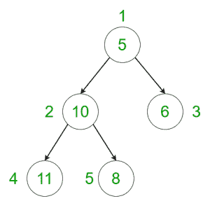
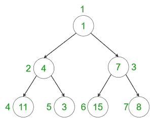

# 计算给定树中权重为斐波那契数的节点数

> 原文:[https://www . geesforgeks . org/count-给定树中的节点-其权重是斐波那契数/](https://www.geeksforgeeks.org/count-nodes-in-the-given-tree-whose-weight-is-a-fibonacci-number/)

给定一个包含所有节点权重的树，任务是计算权重为斐波那契数的节点数。
**例:**

> **输入:**
> 
> 
> 
> **输出:** 2
> **说明:**
> 权重为 5 和 8 的节点为斐波那契节点。
> **输入:**
> 
> 
> 
> **输出:** 3
> **说明:**
> 权重为 1、3、8 的节点为斐波那契节点。

**方法:**想法是在树上执行 [dfs](https://www.geeksforgeeks.org/depth-first-traversal-for-a-graph/) ，对于每个节点，检查权重是否是斐波那契数。

1.  使用[动态编程](https://www.geeksforgeeks.org/dynamic-programming/)生成包含所有[斐波那契数](https://www.geeksforgeeks.org/program-for-nth-fibonacci-number/)的[散列。](https://www.geeksforgeeks.org/hashing-set-1-introduction/)
2.  使用深度优先搜索遍历，遍历树的每个节点，并通过检查该元素是否出现在预计算的散列中来检查该节点是否是斐波那契数。
3.  最后，打印斐波那契节点的总数。

以下是上述方法的实现:

## C++

```
// C++ program to count the number of nodes
// in the tree whose weight is a
// Fibonacci number

#include <bits/stdc++.h>
using namespace std;

const int sz = 1e5;
int ans = 0;

vector<int> graph[100];
vector<int> weight(100);

// To store all fibonacci numbers
set<int> fib;

// Function to generate fibonacci numbers using
// Dynamic Programming and create hash table
// to check Fibonacci numbers
void fibonacci()
{
    // Inserting the first two Fibonacci numbers
    // in the hash
    int prev = 0, curr = 1, len = 2;
    fib.insert(prev);
    fib.insert(curr);

    // Computing the Fibonacci numbers until
    // the maximum number and storing them
    // in the hash
    while (len <= sz) {
        int temp = curr + prev;
        fib.insert(temp);
        prev = curr;
        curr = temp;
        len++;
    }
}

// Function to perform dfs
void dfs(int node, int parent)
{
    // Check if the weight of the node
    // is a Fibonacci number or not
    if (fib.find(weight[node]) != fib.end())
        ans += 1;

    // Performing DFS to iterate the
    // remaining nodes
    for (int to : graph[node]) {
        if (to == parent)
            continue;
        dfs(to, node);
    }
}

// Driver code
int main()
{
    // Weights of the node
    weight[1] = 5;
    weight[2] = 10;
    weight[3] = 11;
    weight[4] = 8;
    weight[5] = 6;

    // Edges of the tree
    graph[1].push_back(2);
    graph[2].push_back(3);
    graph[2].push_back(4);
    graph[1].push_back(5);

    // Generate fibonacci numbers
    fibonacci();

    // Call the dfs function to
    // traverse through the tree
    dfs(1, 1);

    cout << ans << endl;

    return 0;
}
```

## Java 语言(一种计算机语言，尤用于创建网站)

```
// Java program to count the number of nodes
// in the tree whose weight is a
// Fibonacci number
import java.util.*;

class GFG{

static int sz = (int) 1e5;
static int ans = 0;

static Vector<Integer> []graph = new Vector[100];
static int []weight = new int[100];

// To store all fibonacci numbers
static HashSet<Integer> fib = new HashSet<Integer>();

// Function to generate fibonacci numbers using
// Dynamic Programming and create hash table
// to check Fibonacci numbers
static void fibonacci()
{
    // Inserting the first two Fibonacci numbers
    // in the hash
    int prev = 0, curr = 1, len = 2;
    fib.add(prev);
    fib.add(curr);

    // Computing the Fibonacci numbers until
    // the maximum number and storing them
    // in the hash
    while (len <= sz) {
        int temp = curr + prev;
        fib.add(temp);
        prev = curr;
        curr = temp;
        len++;
    }
}

// Function to perform dfs
static void dfs(int node, int parent)
{
    // Check if the weight of the node
    // is a Fibonacci number or not
    if (fib.contains(weight[node]))
        ans += 1;

    // Performing DFS to iterate the
    // remaining nodes
    for (int to : graph[node]) {
        if (to == parent)
            continue;
        dfs(to, node);
    }
}

// Driver code
public static void main(String[] args)
{
    for(int i = 0; i < 100; i++) {
        graph[i] = new Vector<Integer>();
    }

    // Weights of the node
    weight[1] = 5;
    weight[2] = 10;
    weight[3] = 11;
    weight[4] = 8;
    weight[5] = 6;

    // Edges of the tree
    graph[1].add(2);
    graph[2].add(3);
    graph[2].add(4);
    graph[1].add(5);

    // Generate fibonacci numbers
    fibonacci();

    // Call the dfs function to
    // traverse through the tree
    dfs(1, 1);

    System.out.print(ans +"\n");

}
}

// This code is contributed by Rajput-Ji
```

## 蟒蛇 3

```
# Python 3 program to count the number of nodes
# in the tree whose weight is a
# Fibonacci number
sz = 1e5
ans = 0

graph = [[] for i in range(100)]
weight = [0 for i in range(100)]

# To store all fibonacci numbers
fib = set()

# Function to generate fibonacci numbers using
# Dynamic Programming and create hash table
# to check Fibonacci numbers
def fibonacci():

    # Inserting the first two Fibonacci numbers
    # in the hash
    prev = 0
    curr = 1
    len1 = 2
    fib.add(prev)
    fib.add(curr)

    # Computing the Fibonacci numbers until
    # the maximum number and storing them
    # in the hash
    while (len1 <= sz):
        temp = curr + prev
        fib.add(temp)
        prev = curr;
        curr = temp;
        len1 += 1

# Function to perform dfs
def dfs(node, parent):
    global ans

    # Check if the weight of the node
    # is a Fibonacci number or not
    if (weight[node] in fib):
        ans += 1

    # Performing DFS to iterate the
    # remaining nodes
    for to in graph[node]:
        if (to == parent):
            continue
        dfs(to, node)

# Driver code
if __name__ == '__main__':
    # Weights of the node
    weight[1] = 5
    weight[2] = 10
    weight[3] = 11
    weight[4] = 8
    weight[5] = 6

    # Edges of the tree
    graph[1].append(2)
    graph[2].append(3)
    graph[2].append(4)
    graph[1].append(5)

    # Generate fibonacci numbers
    fibonacci()

    # Call the dfs function to
    # traverse through the tree
    dfs(1, 1)

    print(ans)

# This code is contributed by Surendra_Gangwar
```

## C#

```
// C# program to count the number of nodes
// in the tree whose weight is a
// Fibonacci number
using System;
using System.Collections.Generic;

public class GFG{

static int sz = (int) 1e5;
static int ans = 0;

static List<int> []graph = new List<int>[100];
static int []weight = new int[100];

// To store all fibonacci numbers
static HashSet<int> fib = new HashSet<int>();

// Function to generate fibonacci numbers using
// Dynamic Programming and create hash table
// to check Fibonacci numbers
static void fibonacci()
{
    // Inserting the first two Fibonacci numbers
    // in the hash
    int prev = 0, curr = 1, len = 2;
    fib.Add(prev);
    fib.Add(curr);

    // Computing the Fibonacci numbers until
    // the maximum number and storing them
    // in the hash
    while (len <= sz) {
        int temp = curr + prev;
        fib.Add(temp);
        prev = curr;
        curr = temp;
        len++;
    }
}

// Function to perform dfs
static void dfs(int node, int parent)
{
    // Check if the weight of the node
    // is a Fibonacci number or not
    if (fib.Contains(weight[node]))
        ans += 1;

    // Performing DFS to iterate the
    // remaining nodes
    foreach (int to in graph[node]) {
        if (to == parent)
            continue;
        dfs(to, node);
    }
}

// Driver code
public static void Main(String[] args)
{
    for(int i = 0; i < 100; i++) {
        graph[i] = new List<int>();
    }

    // Weights of the node
    weight[1] = 5;
    weight[2] = 10;
    weight[3] = 11;
    weight[4] = 8;
    weight[5] = 6;

    // Edges of the tree
    graph[1].Add(2);
    graph[2].Add(3);
    graph[2].Add(4);
    graph[1].Add(5);

    // Generate fibonacci numbers
    fibonacci();

    // Call the dfs function to
    // traverse through the tree
    dfs(1, 1);

    Console.Write(ans +"\n");

}
}
// This code contributed by Rajput-Ji
```

## java 描述语言

```
<script>

// JavaScript program to count the number of nodes
// in the tree whose weight is a
// Fibonacci number

var sz = 1000000;
var ans = 0;

var graph = Array.from(Array(100), ()=>Array());
var weight = Array(100);

// To store all fibonacci numbers
var fib = new Set();

// Function to generate fibonacci numbers using
// Dynamic Programming and create hash table
// to check Fibonacci numbers
function fibonacci()
{
    // Inserting the first two Fibonacci numbers
    // in the hash
    var prev = 0, curr = 1, len = 2;
    fib.add(prev);
    fib.add(curr);

    // Computing the Fibonacci numbers until
    // the maximum number and storing them
    // in the hash
    while (len <= sz) {
        var temp = curr + prev;
        fib.add(temp);
        prev = curr;
        curr = temp;
        len++;
    }
}

// Function to perform dfs
function dfs(node, parent)
{
    // Check if the weight of the node
    // is a Fibonacci number or not
    if (fib.has(weight[node]))
        ans += 1;

    // Performing DFS to iterate the
    // remaining nodes
    for(var to of graph[node]) {
        if (to == parent)
            continue;
        dfs(to, node);
    }
}

// Driver code

// Weights of the node
weight[1] = 5;
weight[2] = 10;
weight[3] = 11;
weight[4] = 8;
weight[5] = 6;

// Edges of the tree
graph[1].push(2);
graph[2].push(3);
graph[2].push(4);
graph[1].push(5);

// Generate fibonacci numbers
fibonacci();

// Call the dfs function to
// traverse through the tree
dfs(1, 1);

document.write(ans +"<br>");

</script>
```

**Output:** 

```
2
```

**<u>复杂度分析:</u>**

*   **时间复杂度:** O(N)。
    在 dfs 中，树的每个节点都被处理一次，因此如果树中总共有 N 个节点，由于 dfs 而导致的复杂性是 O(N)。此外，为了处理每个节点，使用了斐波那契()函数，该函数的复杂度也是 O(N)，但是由于该函数只执行一次，因此它不会影响总的时间复杂度。因此，时间复杂度为 O(N)。
*   **辅助空间:** O(N)。
    额外空间用于斐波那契数列，所以空间复杂度为 O(N)。