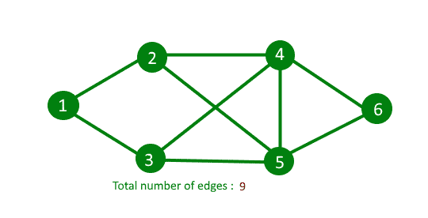

# 计算无向图的边数

> 原文:[https://www . geesforgeks . org/count-number-edges-undirected-graph/](https://www.geeksforgeeks.org/count-number-edges-undirected-graph/)

给定无向图的邻接表表示。写一个函数来计算无向图的边数。

预期时间复杂度:O(V)

**示例:**

```
Input : Adjacency list representation of
        below graph.  
Output : 9


```

想法基于握手引理。[握手引理](https://www.geeksforgeeks.org/handshaking-lemma-and-interesting-tree-properties/)是关于无向图的。在每个有限无向图中，奇数度的顶点数总是偶数。握手引理是度和公式的结果(有时也称为握手引理)

```
     
```

所以我们遍历所有顶点，计算它们的邻接列表的大小之和，最后返回 sum/2。以下执行上述想法

## C++

```
// C++ program to count number of edge in
// undirected graph
#include<bits/stdc++.h>
using namespace std;

// Adjacency list representation of graph
class Graph
{
    int V ;
    list < int > *adj;
public :
    Graph( int V )
    {
        this->V = V ;
        adj = new list<int>[V];
    }
    void addEdge ( int u, int v ) ;
    int countEdges () ;
};

// add edge to graph
void Graph :: addEdge ( int u, int v )
{
    adj[u].push_back(v);
    adj[v].push_back(u);
}

// Returns count of edge in undirected graph
int Graph :: countEdges()
{
    int sum = 0;

    //traverse all vertex
    for (int i = 0 ; i < V ; i++)

        // add all edge that are linked to the
        // current vertex
        sum += adj[i].size();

    // The count of edge is always even because in
    // undirected graph every edge is connected
    // twice between two vertices
    return sum/2;
}

// driver program to check above function
int main()
{
    int V = 9 ;
    Graph g(V);

    // making above uhown graph
    g.addEdge(0, 1 );
    g.addEdge(0, 7 );
    g.addEdge(1, 2 );
    g.addEdge(1, 7 );
    g.addEdge(2, 3 );
    g.addEdge(2, 8 );
    g.addEdge(2, 5 );
    g.addEdge(3, 4 );
    g.addEdge(3, 5 );
    g.addEdge(4, 5 );
    g.addEdge(5, 6 );
    g.addEdge(6, 7 );
    g.addEdge(6, 8 );
    g.addEdge(7, 8 );

    cout << g.countEdges() << endl;

    return 0;
}
```

## Java 语言(一种计算机语言，尤用于创建网站)

```
// Java program to count number of edge in 
// undirected graph
import java.io.*;
import java.util.*;

// Adjacency list representation of graph
class Graph 
{
    int V;
    Vector<Integer>[] adj;

    //@SuppressWarnings("unchecked")
    Graph(int V)
    {
        this.V = V;
        this.adj = new Vector[V];

        for (int i = 0; i < V; i++)
            adj[i] = new Vector<Integer>();
    }

    // add edge to graph
    void addEdge(int u, int v)
    {
        adj[u].add(v);
        adj[v].add(u);
    }

    // Returns count of edge in undirected graph
    int countEdges()
    {
        int sum = 0;

        // traverse all vertex
        for (int i = 0; i < V; i++)

            // add all edge that are linked to the
            // current vertex
            sum += adj[i].size();

        // The count of edge is always even because in
        // undirected graph every edge is connected
        // twice between two vertices
        return sum / 2;
    }
}

class GFG 
{

    // Driver Code
    public static void main(String[] args) throws IOException 
    {
        int V = 9;
        Graph g = new Graph(V);

        // making above uhown graph
        g.addEdge(0, 1);
        g.addEdge(0, 7);
        g.addEdge(1, 2);
        g.addEdge(1, 7);
        g.addEdge(2, 3);
        g.addEdge(2, 8);
        g.addEdge(2, 5);
        g.addEdge(3, 4);
        g.addEdge(3, 5);
        g.addEdge(4, 5);
        g.addEdge(5, 6);
        g.addEdge(6, 7);
        g.addEdge(6, 8);
        g.addEdge(7, 8);

        System.out.println(g.countEdges());
    }
}

// This code is contributed by
// sanjeev2552
```

## 蟒蛇 3

```
# Python3 program to count number of 
# edge in undirected graph 

# Adjacency list representation of graph 
class Graph:
    def __init__(self, V):
        self.V = V 
        self.adj = [[] for i in range(V)]

    # add edge to graph 
    def addEdge (self, u, v ):
        self.adj[u].append(v) 
        self.adj[v].append(u)

    # Returns count of edge in undirected graph 
    def countEdges(self):
        Sum = 0

        # traverse all vertex 
        for i in range(self.V):

            # add all edge that are linked 
            # to the current vertex 
            Sum += len(self.adj[i]) 

        # The count of edge is always even  
        # because in undirected graph every edge  
        # is connected twice between two vertices 
        return Sum // 2

# Driver Code
if __name__ == '__main__':

    V = 9
    g = Graph(V) 

    # making above uhown graph 
    g.addEdge(0, 1 ) 
    g.addEdge(0, 7 ) 
    g.addEdge(1, 2 ) 
    g.addEdge(1, 7 ) 
    g.addEdge(2, 3 ) 
    g.addEdge(2, 8 ) 
    g.addEdge(2, 5 ) 
    g.addEdge(3, 4 ) 
    g.addEdge(3, 5 ) 
    g.addEdge(4, 5 ) 
    g.addEdge(5, 6 ) 
    g.addEdge(6, 7 ) 
    g.addEdge(6, 8 ) 
    g.addEdge(7, 8 ) 

    print(g.countEdges())

# This code is contributed by PranchalK
```

## C#

```
// C# program to count number of edge in 
// undirected graph
using System;
using System.Collections.Generic;

// Adjacency list representation of graph
class Graph 
{
    public int V;
    public List<int>[] adj;
    public Graph(int V)
    {
        this.V = V;
        this.adj = new List<int>[V];

        for (int i = 0; i < V; i++)
            adj[i] = new List<int>();
    }

    // add edge to graph
    public void addEdge(int u, int v)
    {
        adj[u].Add(v);
        adj[v].Add(u);
    }

    // Returns count of edge in undirected graph
    public int countEdges()
    {
        int sum = 0;

        // traverse all vertex
        for (int i = 0; i < V; i++)

            // add all edge that are linked to the
            // current vertex
            sum += adj[i].Count;

        // The count of edge is always even because in
        // undirected graph every edge is connected
        // twice between two vertices
        return sum / 2;
    }
}

class GFG 
{

    // Driver Code
    public static void Main(String[] args)
    {
        int V = 9;
        Graph g = new Graph(V);

        // making above uhown graph
        g.addEdge(0, 1);
        g.addEdge(0, 7);
        g.addEdge(1, 2);
        g.addEdge(1, 7);
        g.addEdge(2, 3);
        g.addEdge(2, 8);
        g.addEdge(2, 5);
        g.addEdge(3, 4);
        g.addEdge(3, 5);
        g.addEdge(4, 5);
        g.addEdge(5, 6);
        g.addEdge(6, 7);
        g.addEdge(6, 8);
        g.addEdge(7, 8);

        Console.WriteLine(g.countEdges());
    }
}

// This code is contributed by PrinciRaj1992
```

**Output:**

```
14

```

**时间复杂度:** O(V)

本文由 **[尼尚·辛格](https://practice.geeksforgeeks.org/user-profile.php?user=_code)** 供稿。如果你喜欢 GeeksforGeeks 并想投稿，你也可以使用[contribute.geeksforgeeks.org](http://www.contribute.geeksforgeeks.org)写一篇文章或者把你的文章邮寄到 contribute@geeksforgeeks.org。看到你的文章出现在极客博客主页上，帮助其他极客。

如果你发现任何不正确的地方，或者你想分享更多关于上面讨论的话题的信息，请写评论。