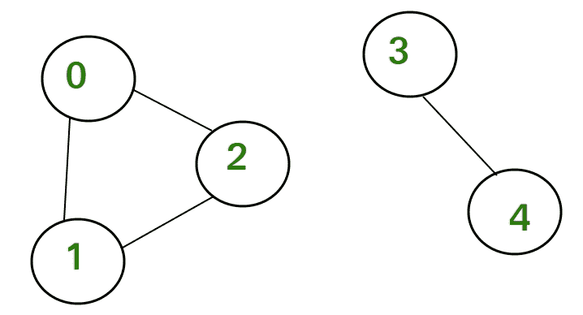

# 统计不可达节点的数量

> 原文:[https://www . geesforgeks . org/count-number-不可达-nodes/](https://www.geeksforgeeks.org/count-number-non-reachable-nodes/)

给定一个无向图和一组顶点，我们必须使用深度优先搜索来计算来自给定头节点的不可达节点的数量。

考虑下面有两个断开组件的无向图:



在这个图中，如果我们认为 0 是头节点，那么节点 0、1 和 2 是可达的。我们将所有可到达的节点标记为已访问。所有那些没有被标记为被访问的节点，即节点 3 和 4 是不可到达的节点。因此他们的计数是 2。

**示例:**

```
Input :   5
          0 1
          0 2
          1 2
          3 4
Output : 2
```

为此，我们可以使用 BFS 或 DFS。在下面的实现中，使用了 DFS。我们从给定的来源进行 DFS。由于给定的图是无向的，属于断开组件的所有顶点都是不可达的节点。为此，我们使用访问数组，该数组用于跟踪 DFS 中的非访问顶点。在 DFS 中，如果我们从头节点开始，它会将所有连接到头节点的节点标记为已访问。然后在遍历该图之后，我们统计从头部节点没有被标记为被访问的节点的数量。

## C++

```
// C++ program to count non-reachable nodes
// from a given source using DFS.
#include <iostream>
#include <list>
using namespace std;

// Graph class represents a directed graph
// using adjacency list representation
class Graph {
    int V; // No. of vertices

    // Pointer to an array containing
    // adjacency lists
    list<int>* adj;

    // A recursive function used by DFS
    void DFSUtil(int v, bool visited[]);

public:
    Graph(int V); // Constructor

    // function to add an edge to graph
    void addEdge(int v, int w);

    // DFS traversal of the vertices
    // reachable from v
    int countNotReach(int v);
};

Graph::Graph(int V)
{
    this->V = V;
    adj = new list<int>[V];
}

void Graph::addEdge(int v, int w)
{
    adj[v].push_back(w); // Add w to v’s list.
    adj[w].push_back(v); // Add v to w's list.
}

void Graph::DFSUtil(int v, bool visited[])
{
    // Mark the current node as visited and
    // print it
    visited[v] = true;

    // Recur for all the vertices adjacent
    // to this vertex
    list<int>::iterator i;
    for (i = adj[v].begin(); i != adj[v].end(); ++i)
        if (!visited[*i])
            DFSUtil(*i, visited);
}

// Returns count of not reachable nodes from
// vertex v.
// It uses recursive DFSUtil()
int Graph::countNotReach(int v)
{
    // Mark all the vertices as not visited
    bool* visited = new bool[V];
    for (int i = 0; i < V; i++)
        visited[i] = false;

    // Call the recursive helper function
    // to print DFS traversal
    DFSUtil(v, visited);

    // Return count of not visited nodes
    int count = 0;
    for (int i = 0; i < V; i++) {
        if (visited[i] == false)
            count++;
    }
    return count;
}

int main()
{
    // Create a graph given in the above diagram
    Graph g(8);
    g.addEdge(0, 1);
    g.addEdge(0, 2);
    g.addEdge(1, 2);
    g.addEdge(3, 4);
    g.addEdge(4, 5);
    g.addEdge(6, 7);

    cout << g.countNotReach(2);

    return 0;
}
```

## Java 语言(一种计算机语言，尤用于创建网站)

```
// Java program to count non-reachable nodes
// from a given source using DFS.
import java.util.*;

// Graph class represents a directed graph
// using adjacency list representation
@SuppressWarnings("unchecked")
class Graph{

// No. of vertices   
public int V;

// Pointer to an array containing
// adjacency lists
public ArrayList []adj;

public Graph(int V)
{
    this.V = V;
    adj = new ArrayList[V];
    for(int i = 0; i < V; i++)
    {
        adj[i] = new ArrayList();
    }
}

void addEdge(int v, int w)
{

    // add w to v’s list.
    adj[v].add(w);

    // add v to w's list.
    adj[w].add(v);
}

void DFSUtil(int v, boolean []visited)
{

    // Mark the current node as visited and
    // print it
    visited[v] = true;

    // Recur for all the vertices adjacent
    // to this vertex
    for(int i : (ArrayList<Integer>)adj[v])
    {
        if (!visited[i])
            DFSUtil(i, visited);
    }
}

// Returns count of not reachable nodes from
// vertex v.
// It uses recursive DFSUtil()
int countNotReach(int v)
{

    // Mark all the vertices as not visited
    boolean []visited = new boolean[V];

    for(int i = 0; i < V; i++)
        visited[i] = false;

    // Call the recursive helper function
    // to print DFS traversal
    DFSUtil(v, visited);

    // Return count of not visited nodes
    int count = 0;
    for(int i = 0; i < V; i++)
    {
        if (visited[i] == false)
            count++;
    }
    return count;
}

// Driver Code
public static void main(String []args)
{

    // Create a graph given in the above diagram
    Graph g = new Graph(8);
    g.addEdge(0, 1);
    g.addEdge(0, 2);
    g.addEdge(1, 2);
    g.addEdge(3, 4);
    g.addEdge(4, 5);
    g.addEdge(6, 7);

    System.out.print(g.countNotReach(2));
}
}

// This code is contributed by Pratham76
```

## 蟒蛇 3

```
# Python3 program to count non-reachable
# nodes from a given source using DFS.

# Graph class represents a directed graph
# using adjacency list representation
class Graph:
    def __init__(self, V):
        self.V = V
        self.adj = [[] for i in range(V)]

    def addEdge(self, v, w):
        self.adj[v].append(w) # Add w to v’s list.
        self.adj[w].append(v) # Add v to w's list.

    def DFSUtil(self, v, visited):

        # Mark the current node as
        # visited and print it
        visited[v] = True

        # Recur for all the vertices
        # adjacent to this vertex
        i = self.adj[v][0]
        for i in self.adj[v]:
            if (not visited[i]):
                self.DFSUtil(i, visited)

    # Returns count of not reachable
    # nodes from vertex v.
    # It uses recursive DFSUtil()
    def countNotReach(self, v):

        # Mark all the vertices as not visited
        visited = [False] * self.V

        # Call the recursive helper
        # function to prDFS traversal
        self.DFSUtil(v, visited)

        # Return count of not visited nodes
        count = 0
        for i in range(self.V):
            if (visited[i] == False):
                count += 1
        return count

# Driver Code
if __name__ == '__main__':

    # Create a graph given in the
    # above diagram
    g = Graph(8)
    g.addEdge(0, 1)
    g.addEdge(0, 2)
    g.addEdge(1, 2)
    g.addEdge(3, 4)
    g.addEdge(4, 5)
    g.addEdge(6, 7)

    print(g.countNotReach(2))

# This code is contributed by PranchalK
```

## C#

```
// C# program to count non-reachable nodes
// from a given source using DFS.
using System;
using System.Collections;
using System.Collections.Generic;

// Graph class represents a directed graph
// using adjacency list representation
class Graph{

// No. of vertices   
public int V;

// Pointer to an array containing
// adjacency lists
public ArrayList []adj;

public Graph(int V)
{
    this.V = V;
    adj = new ArrayList[V];
    for(int i = 0; i < V; i++)
    {
        adj[i] = new ArrayList();
    }
}

void addEdge(int v, int w)
{

    // Add w to v’s list.
    adj[v].Add(w);

    // Add v to w's list.
    adj[w].Add(v);
}

void DFSUtil(int v, bool []visited)
{

    // Mark the current node as visited and
    // print it
    visited[v] = true;

    // Recur for all the vertices adjacent
    // to this vertex
    foreach(int i in (ArrayList)adj[v])
    {
        if (!visited[i])
            DFSUtil(i, visited);
    }
}

// Returns count of not reachable nodes from
// vertex v.
// It uses recursive DFSUtil()
int countNotReach(int v)
{

    // Mark all the vertices as not visited
    bool []visited = new bool[V];

    for(int i = 0; i < V; i++)
        visited[i] = false;

    // Call the recursive helper function
    // to print DFS traversal
    DFSUtil(v, visited);

    // Return count of not visited nodes
    int count = 0;
    for(int i = 0; i < V; i++)
    {
        if (visited[i] == false)
            count++;
    }
    return count;
}

// Driver Code
static void Main(string []args)
{

    // Create a graph given in the above diagram
    Graph g = new Graph(8);
    g.addEdge(0, 1);
    g.addEdge(0, 2);
    g.addEdge(1, 2);
    g.addEdge(3, 4);
    g.addEdge(4, 5);
    g.addEdge(6, 7);

    Console.Write(g.countNotReach(2));
}
}

// This code is contributed by rutvik_56
```

## java 描述语言

```
<script>
    // Javascript program to count non-reachable nodes
    // from a given source using DFS.

    // Graph class represents a directed graph
    // using adjacency list representation
    let V = 8;
    let adj = [];
    for(let i = 0; i < V; i++)
    {
      adj.push([]);
    }

    function addEdge(v, w)
    {

        // Add w to v’s list.
        adj[v].push(w);

        // Add v to w's list.
        adj[w].push(v);
    }

    function DFSUtil(v, visited)
    {

        // Mark the current node as visited and
        // print it
        visited[v] = true;

        // Recur for all the vertices adjacent
        // to this vertex
        for(let i = 0; i < adj[v].length; i++)
        {
            if (!visited[adj[v][i]])
                DFSUtil(adj[v][i], visited);
        }
    }

    // Returns count of not reachable nodes from
    // vertex v.
    // It uses recursive DFSUtil()
    function countNotReach(v)
    {

        // Mark all the vertices as not visited
        let visited = new Array(V);

        for(let i = 0; i < V; i++)
            visited[i] = false;

        // Call the recursive helper function
        // to print DFS traversal
        DFSUtil(v, visited);

        // Return count of not visited nodes
        let count = 0;
        for(let i = 0; i < V; i++)
        {
            if (visited[i] == false)
                count++;
        }
        return count;
    }

    // Create a graph given in the above diagram
    addEdge(0, 1);
    addEdge(0, 2);
    addEdge(1, 2);
    addEdge(3, 4);
    addEdge(4, 5);
    addEdge(6, 7);

    document.write(countNotReach(2));

    // This code is contributed by suresh07.
</script>
```

**输出:**

```
 5
```