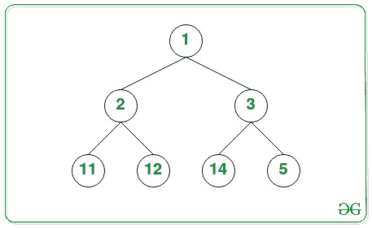
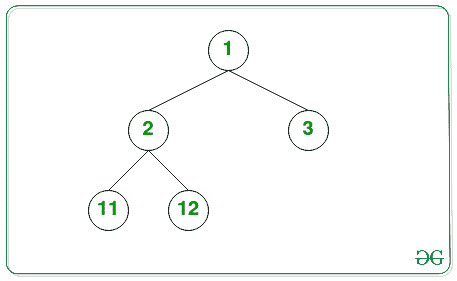

# 计算完整二叉树的节点数

> 原文:[https://www . geesforgeks . org/count-完整二叉树中的节点数/](https://www.geeksforgeeks.org/count-number-of-nodes-in-a-complete-binary-tree/)

给定由 **N** 节点组成的[完全二叉树](https://www.geeksforgeeks.org/binary-tree-set-3-types-of-binary-tree/)的根，任务是找到给定[二叉树](https://www.geeksforgeeks.org/binary-tree-data-structure/)中的节点总数。

**示例:**

> **输入:**
> 
> 
> 
> **输出:** 7
> 
> **输入:**
> 
> 
> 
> **输出:** 5

**朴素方法:**求解给定树的简单方法是对给定树执行 DFS 遍历，并统计其中的节点数。遍历后，打印获得的节点总数。

***时间复杂度:**O(N)*
T5**辅助空间:** O(1)

**有效方法:**上述方法还可以通过以下事实进行优化:

> 一个完整的二叉树总共有**(2<sup>h</sup>–1)**个节点。

按照这个逻辑，在第一种情况下，比较左[子树](https://www.geeksforgeeks.org/sub-tree-nodes-tree-using-dfs/)高度和右子树高度。如果它们相等，那就是一棵完整的树，那么答案将是**2^height–1**。否则，如果它们不相等，[递归调用左子树和右子树的](https://www.geeksforgeeks.org/recursion/)来计算节点数。按照以下步骤解决问题:

*   定义一个[函数](https://www.geeksforgeeks.org/functions-in-c/) **left_height(根)**，通过沿根的左侧方向遍历找到给定树的左侧[高度，并将其存储在一个变量中，比如 **leftHeight** 。](https://www.geeksforgeeks.org/write-a-c-program-to-find-the-maximum-depth-or-height-of-a-tree/)
*   定义一个函数 **right_height(根)**，通过沿根的正确方向遍历找到给定树的正确高度，并将其存储在一个变量中，比如 **rightHeight** 。
*   为当前根值找到给定树的左右高度，如果相等，则返回 **(2 <sup>高度</sup>–1)**的值作为节点的合成计数。
*   否则，递归调用左右子树的函数，并返回它们的**和+ 1** 作为结果节点数。

下面是上述方法的实现。

## C++

```
// C++ program for the above approach
#include <bits/stdc++.h>
using namespace std;

// Structure of a Tree Node
class node {
public:
    int data;
    node* left;
    node* right;
};

node* newNode(int data);

// Function to get the left height of
// the binary tree
int left_height(node* node)
{
    int ht = 0;
    while (node) {
        ht++;
        node = node->left;
    }

    // Return the left height obtained
    return ht;
}

// Function to get the right height
// of the binary tree
int right_height(node* node)
{
    int ht = 0;
    while (node) {
        ht++;
        node = node->right;
    }

    // Return the right height obtained
    return ht;
}

// Function to get the count of nodes
// in complete binary tree
int TotalNodes(node* root)
{

    // Base Case
    if (root == NULL)
        return 0;

    // Find the left height and the
    // right heights
    int lh = left_height(root);
    int rh = right_height(root);

    // If left and right heights are
    // equal return 2^height(1<<height) -1
    if (lh == rh)
        return (1 << lh) - 1;

    // Otherwise, recursive call
    return 1 + TotalNodes(root->left)
           + TotalNodes(root->right);
}

// Helper function to allocate a new node
// with the given data
node* newNode(int data)
{
    node* Node = new node();
    Node->data = data;
    Node->left = NULL;
    Node->right = NULL;
    return (Node);
}

// Driver Code
int main()
{
    node* root = newNode(1);
    root->left = newNode(2);
    root->right = newNode(3);
    root->left->left = newNode(4);
    root->left->right = newNode(5);
    root->right->left = newNode(9);
    root->right->right = newNode(8);
    root->left->left->left = newNode(6);
    root->left->left->right = newNode(7);

    cout << TotalNodes(root);

    return 0;
}
```

## Java 语言(一种计算机语言，尤用于创建网站)

```
// Java program for the above approach
import java.util.*;

class GFG{

// Structure of a Tree Node
static class node {

    int data;
    node left;
    node right;
};

// Function to get the left height of
// the binary tree
static int left_height(node node)
{
    int ht = 0;
    while (node!=null) {
        ht++;
        node = node.left;
    }

    // Return the left height obtained
    return ht;
}

// Function to get the right height
// of the binary tree
static int right_height(node node)
{
    int ht = 0;
    while (node!=null) {
        ht++;
        node = node.right;
    }

    // Return the right height obtained
    return ht;
}

// Function to get the count of nodes
// in complete binary tree
static int TotalNodes(node root)
{

    // Base Case
    if (root == null)
        return 0;

    // Find the left height and the
    // right heights
    int lh = left_height(root);
    int rh = right_height(root);

    // If left and right heights are
    // equal return 2^height(1<<height) -1
    if (lh == rh)
        return (1 << lh) - 1;

    // Otherwise, recursive call
    return 1 + TotalNodes(root.left)
           + TotalNodes(root.right);
}

// Helper function to allocate a new node
// with the given data
static node newNode(int data)
{
    node Node = new node();
    Node.data = data;
    Node.left = null;
    Node.right = null;
    return (Node);
}

// Driver Code
public static void main(String[] args)
{
    node root = newNode(1);
    root.left = newNode(2);
    root.right = newNode(3);
    root.left.left = newNode(4);
    root.left.right = newNode(5);
    root.right.left = newNode(9);
    root.right.right = newNode(8);
    root.left.left.left = newNode(6);
    root.left.left.right = newNode(7);

    System.out.print(TotalNodes(root));

}
}

// This code is contributed by shikhasingrajput
```

## 蟒蛇 3

```
# Python program for the above approach

# Structure of a Tree Node
class node:
    def __init__(self, key):
        self.left = None
        self.right = None
        self.val = key

# Function to get the left height of
# the binary tree
def left_height(node):
    ht = 0
    while(node):
        ht += 1
        node = node.left

     # Return the left height obtained
    return ht

# Function to get the right height
# of the binary tree
def right_height(node):
    ht = 0
    while(node):
        ht += 1
        node = node.right

    # Return the right height obtained
    return ht

# Function to get the count of nodes
# in complete binary tree
def TotalNodes(root):

  # Base case
    if(root == None):
        return 0

     # Find the left height and the
    # right heights
    lh = left_height(root)
    rh = right_height(root)

     # If left and right heights are
    # equal return 2^height(1<<height) -1
    if(lh == rh):
        return (1 << lh) - 1

     # Otherwise, recursive call
    return 1 + TotalNodes(root.left) + TotalNodes(root.right)

# Driver code
root = node(1)
root.left = node(2)
root.right = node(3)
root.left.left = node(4)
root.left.right = node(5)
root.right.left = node(9)
root.right.right = node(8)
root.left.left.left = node(6)
root.left.left.right = node(7)

print(TotalNodes(root))

# This code is contributed by parthmanchanda81
```

## C#

```
// C# program for the above approach
using System;

public class GFG{

// Structure of a Tree Node
class node {

    public int data;
    public node left;
    public node right;
};

// Function to get the left height of
// the binary tree
static int left_height(node node)
{
    int ht = 0;
    while (node != null) {
        ht++;
        node = node.left;
    }

    // Return the left height obtained
    return ht;
}

// Function to get the right height
// of the binary tree
static int right_height(node node)
{
    int ht = 0;
    while (node != null) {
        ht++;
        node = node.right;
    }

    // Return the right height obtained
    return ht;
}

// Function to get the count of nodes
// in complete binary tree
static int TotalNodes(node root)
{

    // Base Case
    if (root == null)
        return 0;

    // Find the left height and the
    // right heights
    int lh = left_height(root);
    int rh = right_height(root);

    // If left and right heights are
    // equal return 2^height(1<<height) -1
    if (lh == rh)
        return (1 << lh) - 1;

    // Otherwise, recursive call
    return 1 + TotalNodes(root.left)
           + TotalNodes(root.right);
}

// Helper function to allocate a new node
// with the given data
static node newNode(int data)
{
    node Node = new node();
    Node.data = data;
    Node.left = null;
    Node.right = null;
    return (Node);
}

// Driver Code
public static void Main(String[] args)
{
    node root = newNode(1);
    root.left = newNode(2);
    root.right = newNode(3);
    root.left.left = newNode(4);
    root.left.right = newNode(5);
    root.right.left = newNode(9);
    root.right.right = newNode(8);
    root.left.left.left = newNode(6);
    root.left.left.right = newNode(7);

    Console.Write(TotalNodes(root));
}
}

// This code is contributed by shikhasingrajput
```

## java 描述语言

```
<script>
        // JavaScript Program to implement
        // the above approach

        // Structure of a Tree Node
        class Node {
            constructor(data) {
                this.data = data;
                this.left = null;
                this.right = null;
            }
        };

        // Function to get the left height of
        // the binary tree
        function left_height(node) {
            let ht = 0;
            while (node) {
                ht++;
                node = node.left;
            }

            // Return the left height obtained
            return ht;
        }

        // Function to get the right height
        // of the binary tree
        function right_height(node) {
            let ht = 0;
            while (node) {
                ht++;
                node = node.right;
            }

            // Return the right height obtained
            return ht;
        }

        // Function to get the count of nodes
        // in complete binary tree
        function TotalNodes(root) {

            // Base Case
            if (root == null)
                return 0;

            // Find the left height and the
            // right heights
            let lh = left_height(root);
            let rh = right_height(root);

            // If left and right heights are
            // equal return 2^height(1<<height) -1
            if (lh == rh)
                return (1 << lh) - 1;

            // Otherwise, recursive call
            return 1 + TotalNodes(root.left)
                + TotalNodes(root.right);
        }

        // Helper function to allocate a new node
        // with the given data

        // Driver Code
        let root = new Node(1);
        root.left = new Node(2);
        root.right = new Node(3);
        root.left.left = new Node(4);
        root.left.right = new Node(5);
        root.right.left = new Node(9);
        root.right.right = new Node(8);
        root.left.left.left = new Node(6);
        root.left.left.right = new Node(7);

        document.write(TotalNodes(root));

     // This code is contributed by Potta Lokesh
    </script>
```

**Output:** 

```
9
```

***时间复杂度:**O((log N)<sup>2</sup>)*
***辅助空间:** O(1)*