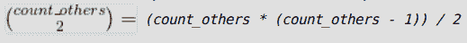

# 计算对(I，j)的数量，使得 arr[I]* arr[j]>arr[I]+arr[j]

> 原文:[https://www . geesforgeks . org/count-对数-I-j-so-arri-arrj-arri-arrj/](https://www.geeksforgeeks.org/count-number-of-pairs-i-j-such-that-arri-arrj-arri-arrj/)

给定一个非负整数的数组 **arr[]** ，任务是对指数对 **(i，j** 进行计数，使得**arr[I]* arr[j]>arr[I]+arr[j]**，其中 **i < j** 。
**举例:**

> **输入:** arr[] = { 5，0，3，1，2 }
> **输出:** 3
> **输入:** arr[] = { 1，1，1 }
> **输出:** 0

**天真方法:**运行两个嵌套循环，检查每对循环是否满足条件。如果任一对满足条件，则更新**计数=计数+ 1** 并最终打印**计数**。
以下是上述方法的实现:

## C++

```
// C++ program to count pairs (i, j)
// such that arr[i] * arr[j] > arr[i] + arr[j]
#include <bits/stdc++.h>
using namespace std;

// Function to return the count of pairs
// such that arr[i] * arr[j] > arr[i] + arr[j]
long countPairs(int arr[], int n)
{
    long count = 0;
    for (int i = 0; i < n - 1; i++) {
        for (int j = i + 1; j < n; j++) {

            // If condition is satisfied
            if (arr[i] * arr[j] > arr[i] + arr[j])
                count++;
        }
    }
    return count;
}

// Driver code
int main()
{
    int arr[] = { 5, 0, 3, 1, 2 };
    int n = sizeof(arr) / sizeof(arr[0]);
    cout << countPairs(arr, n);
    return 0;
}
```

## Java 语言(一种计算机语言，尤用于创建网站)

```
// Java program to count pairs (i, j)
// such that arr[i] * arr[j] > arr[i] + arr[j]
import java.util.*;

class solution
{

// Function to return the count of pairs
// such that arr[i] * arr[j] > arr[i] + arr[j]
static long countPairs(int arr[], int n)
{
    long count = 0;
    for (int i = 0; i < n - 1; i++) {
        for (int j = i + 1; j < n; j++) {

            // If condition is satisfied
            if (arr[i] * arr[j] > arr[i] + arr[j])
                count++;
        }
    }
    return count;
}

// Driver code
public static void main(String args[])
{
    int arr[] = { 5, 0, 3, 1, 2 };
    int n = arr.length;
    System.out.println(countPairs(arr, n));

}
}

// This code is contributed by
// Surendra_Gangwar
```

## 蟒蛇 3

```
# Python3 program to count pairs(i,j)
# such that arr[i]*arr[j]>arr[i]+arr[j]
import math as mt

# function to return the count of pairs
# such that arr[i]*arr[j]>arr[i]+arr[j]
def countPairs(arr, n):
    count = 0

    for i in range(n):
        for j in range(i + 1, n):

            # if condition is satisified
            if arr[i] * arr[j] > arr[i] + arr[j]:
                count += 1

    return count

# Driver code
arr = [5, 0, 3, 1, 2]
n = len(arr)

print(countPairs(arr, n))

# This code is contributed
# by Mohit Kumar 29
```

## C#

```
// C# program to count pairs (i, j)
// such that arr[i] * arr[j] > arr[i] + arr[j]

using System;

public class GFG{

// Function to return the count of pairs
// such that arr[i] * arr[j] > arr[i] + arr[j]
static long countPairs(int []arr, int n)
{
    long count = 0;
    for (int i = 0; i < n - 1; i++) {
        for (int j = i + 1; j < n; j++) {

            // If condition is satisfied
            if (arr[i] * arr[j] > arr[i] + arr[j])
                count++;
        }
    }
    return count;
}

// Driver code
    static public void Main (){
    int []arr = { 5, 0, 3, 1, 2 };
    int n = arr.Length;
    Console.WriteLine (countPairs(arr, n));
    }
}
```

## 服务器端编程语言（Professional Hypertext Preprocessor 的缩写）

```
<?php
// PHP program to count pairs (i, j)
// such that arr[i] * arr[j] > arr[i] + arr[j]

// Function to return the count of pairs
// such that arr[i] * arr[j] > arr[i] + arr[j]
function countPairs($arr, $n)
{
    $count = 0;
    for ($i = 0; $i < $n - 1; $i++)
    {
        for ($j = $i + 1; $j < $n; $j++)
        {

            // If condition is satisfied
            if ($arr[$i] *
                $arr[$j] > $arr[$i] +
                           $arr[$j])
                $count++;
        }
    }
    return $count;
}

// Driver code
$arr = array( 5, 0, 3, 1, 2 );
$n = sizeof($arr) ;

echo countPairs($arr, $n);

// This code is contributed by Ryuga
?>
```

## java 描述语言

```
<script>

    // JavaScript program to count pairs (i, j)
    // such that arr[i] * arr[j] > arr[i] + arr[j]

    // Function to return the count of pairs
    // such that arr[i] * arr[j] > arr[i] + arr[j]
    function countPairs(arr, n)
    {
        let count = 0;
        for (let i = 0; i < n - 1; i++) {
            for (let j = i + 1; j < n; j++) {

                // If condition is satisfied
                if (arr[i] * arr[j] > arr[i] + arr[j])
                    count++;
            }
        }
        return count;
    }

    let arr = [ 5, 0, 3, 1, 2 ];
    let n = arr.length;
    document.write(countPairs(arr, n));

</script>
```

**Output:** 

```
3
```

**有效方法:**考虑以下情况:

> **1) arr[i] = 0 或 arr[i] = 1 且 arr[j] =任何元素**
> 在这种情况下，arr[j] * arr[i]将始终小于 arr[i] + arr[j]。
> 因此我们可以丢弃所有有一个元素为 0 或 1 的对。
> **2) arr[i] = 2 且 arr[j] < = 2**
> 在这种情况下，arr[j] * arr[i]将总是小于或等于 arr[i] + arr[j]。
> 因此我们可以再次丢弃所有这样的配对。
> **3) arr[i] = 2 和 arr[j] > 2**
> 这种情况将产生有效的对。如果 count_2 是“2”的计数，count_others
> 是大于 2 的元素计数，
> 则对的数量将是 *count_2 * count_others* 。
> **4) arr[i] > 2 和 arr[j] > 2**
> 这种情况也会产生有效对。让 count_others 为大于 2 的元素数
> ，那么这些 *count_others* 元素
> 中的每两个元素将形成一个有效的对。因此对的数量将是
> 
> 
> 
> 因此，**总计数=(count _ 2 * count _ others)+(count _ others *(count _ others–1))/2**。

以下是上述方法的实现:

## C++

```
// C++ program to count pairs (i, j)
// such that arr[i] * arr[j] > arr[i] + arr[j]
#include <bits/stdc++.h>
using namespace std;

// Function to return the count of pairs
// such that arr[i] * arr[j] > arr[i] + arr[j]
long countPairs(const int* arr, int n)
{
    int count_2 = 0, count_others = 0;
    for (int i = 0; i < n; i++) {
        if (arr[i] == 2)
            count_2++;
        else if (arr[i] > 2)
            count_others++;
    }
    long ans
        = 1L * count_2 * count_others
          + (1L * count_others * (count_others - 1)) / 2;
    return ans;
}

// Driver code
int main()
{
    int arr[] = { 5, 0, 3, 1, 2 };
    int n = sizeof(arr) / sizeof(arr[0]);
    cout << countPairs(arr, n);
    return 0;
}
```

## Java 语言(一种计算机语言，尤用于创建网站)

```
// Java program to count pairs (i, j)
// such that arr[i] * arr[j] > arr[i] + arr[j]

class GFG
{
    // Function to return the count of pairs
    // such that arr[i] * arr[j] > arr[i] + arr[j]
    static long countPairs(int[] arr, int n)
    {
        int count_2 = 0, count_others = 0;
        for (int i = 0; i < n; i++)
        {
            if (arr[i] == 2)
            {
                count_2++;
            }
            else if (arr[i] > 2)
            {
                count_others++;
            }
        }

        long ans = 1L * count_2 * count_others +
                (1L * count_others * (count_others - 1)) / 2;
        return ans;
    }

    // Driver code
    public static void main(String[] args)
    {
        int arr[] = {5, 0, 3, 1, 2};
        int n = arr.length;
        System.out.println(countPairs(arr, n));
    }
}

// This code is contributed by
// 29AjayKumar
```

## 蟒蛇 3

```
# Python3 program to count pairs(i,j)
# such that arr[i]*arr[j]>arr[i]+arr[j]
import math as mt

# function to return the count of pairs
# such that arr[i]*arr[j]>arr[i]+arr[j]
def countPairs(arr, n):
    count_2, count_others = 0, 0

    for i in range(n):
        if arr[i] == 2:
            count_2 += 1
        elif arr[i] > 2:
            count_others += 1
    ans = (count_2 * count_others +
          (count_others *
          (count_others - 1)) // 2)
    return ans

# Driver code
arr = [5, 0, 3, 1, 2]
n = len(arr)

print(countPairs(arr, n))

# This code is contributed
# by Mohit Kumar
```

## C#

```
// C# program to count pairs (i, j) such
// that arr[i] * arr[j] > arr[i] + arr[j]
using System;

class GFG
{
    // Function to return the count of pairs
    // such that arr[i] * arr[j] > arr[i] + arr[j]
    static long countPairs(int[] arr, int n)
    {
        int count_2 = 0, count_others = 0;
        for (int i = 0; i < n; i++)
        {
            if (arr[i] == 2)
            {
                count_2++;
            }
            else if (arr[i] > 2)
            {
                count_others++;
            }
        }

        long ans = 1L * count_2 * count_others +
                  (1L * count_others *
                       (count_others - 1)) / 2;
        return ans;
    }

    // Driver code
    public static void Main()
    {
        int[] arr = {5, 0, 3, 1, 2};
        int n = arr.Length;
        Console.WriteLine(countPairs(arr, n));
    }
}

// This code is contributed by
// Mukul Singh
```

## 服务器端编程语言（Professional Hypertext Preprocessor 的缩写）

```
<?php
// PHP program to count pairs (i, j) such
// that arr[i] * arr[j] > arr[i] + arr[j]

// Function to return the count of pairs
// such that arr[i] * arr[j] > arr[i] + arr[j]
function countPairs($arr, $n)
{
    $count_2 = 0; $count_others = 0;
    for ($i = 0; $i < $n; $i++)
    {
        if ($arr[$i] == 2)
            $count_2++;
        else if ($arr[$i] > 2)
            $count_others++;
    }
    $ans = $count_2 * $count_others +
                     ($count_others *
                     ($count_others - 1)) / 2;
    return $ans;
}

// Driver code
$arr = array( 5, 0, 3, 1, 2 );
$n = sizeof($arr);
echo countPairs($arr, $n);

// This code is contributed
// by Akanksha Rai
?>
```

## java 描述语言

```
<script>

    // JavaScript program to count pairs (i, j) such
    // that arr[i] * arr[j] > arr[i] + arr[j]

    // Function to return the count of pairs
    // such that arr[i] * arr[j] > arr[i] + arr[j]
    function countPairs(arr, n)
    {
        let count_2 = 0, count_others = 0;
        for (let i = 0; i < n; i++)
        {
            if (arr[i] == 2)
            {
                count_2++;
            }
            else if (arr[i] > 2)
            {
                count_others++;
            }
        }

        let ans = count_2 * count_others +
        (count_others * (count_others - 1)) / 2;
        return ans;
    }

    let arr = [5, 0, 3, 1, 2];
    let n = arr.length;
    document.write(countPairs(arr, n));

</script>
```

**Output:** 

```
3
```

**时间复杂度:**O(N)
T3】辅助空间: O(1)