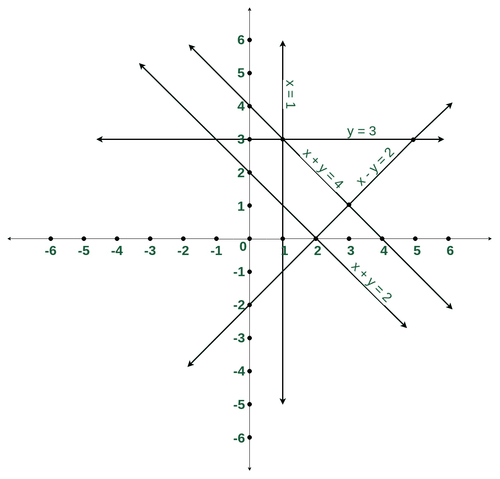
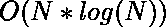

# 计算在一点相交的线对的数量

> 原文:[https://www . geeksforgeeks . org/count-线对数-一点相交/](https://www.geeksforgeeks.org/count-number-of-pairs-of-lines-intersecting-at-a-point/)

给定 N 条线的形式为 a*x + b*y = c (a>0 或 a==0 & b>0)。求在一点相交的线对的数量。

**示例:**

> **输入:**N = 5
> x+y = 2
> x+y = 4
> x = 1
> x–y = 2
> y = 3
> **输出:** 9
> [](https://media.geeksforgeeks.org/wp-content/cdn-uploads/20190814131132/Count-number-of-pairs-of-intersecting-lines.jpg)
> 
> **输入:**N = 2
> x+2y = 2
> x+2y = 4
> T5】输出: 0

**进场:**

*   平行线永远不会相交，因此需要一种方法来排除每条线的平行线。
*   直线的斜率可以表示成对(a，b)。构建一个以键为斜率，以值为集合，以 c 为条目的地图，这样它就有了平行线的记录。
*   遍历这些线，将它们添加到地图中，并维护一个变量 **Tot** ，该变量计算到目前为止的线的总数。
*   现在，对于每一行，更新 **Tot** 变量，然后将 **Tot** 添加到答案中，并减去该行(包括其本身)的平行线数量。

下面是上述方法的实现:

```
// C++ implementation to calculate
// pair of intersecting lines

#include <bits/stdc++.h>
using namespace std;

// Function to return the number 
// of intersecting pair of lines
void numberOfPairs(int a[],int b[],int c[],int N){

    int count = 0, Tot = 0;

    // Construct a map of slope and 
    // corresponding c value
    map<pair<int, int>, set<int> > LineMap;

    // iterate over each line
    for (int i = 0; i < N; i++) {

        // Slope can be represented
        // as pair(a, b)
        pair<int, int> Slope =
                     make_pair(a[i], b[i]);

        // Checking if the line does 
        // not already exist
        if (!LineMap[Slope].count(c[i])){
            // maintaining a count
            // of total lines
            Tot++;
            LineMap[Slope].insert(c[i]);

            // subtracting the count of
            // parallel lines including itself
            count += Tot - 
                    LineMap[Slope].size();
        }
    }

    cout << count << endl;
}

// Driver code
int main()
{
    // A line can be represented as ax+by=c
    // such  that (a>0 || (a==0 & b>0) ) 
    // a and b are  already in there lowest
    // form i.e gcd(a, b)=1
    int N = 5;
    int a[] = { 1, 1, 1, 1, 0 };
    int b[] = { 1, 1, 0, -1, 1 };
    int c[] = { 2, 4, 1, 2, 3 };

    numberOfPairs(a,b,c,N);

    return 0;
}
```

**Output:**

```
9

```

**时间复杂度:** 