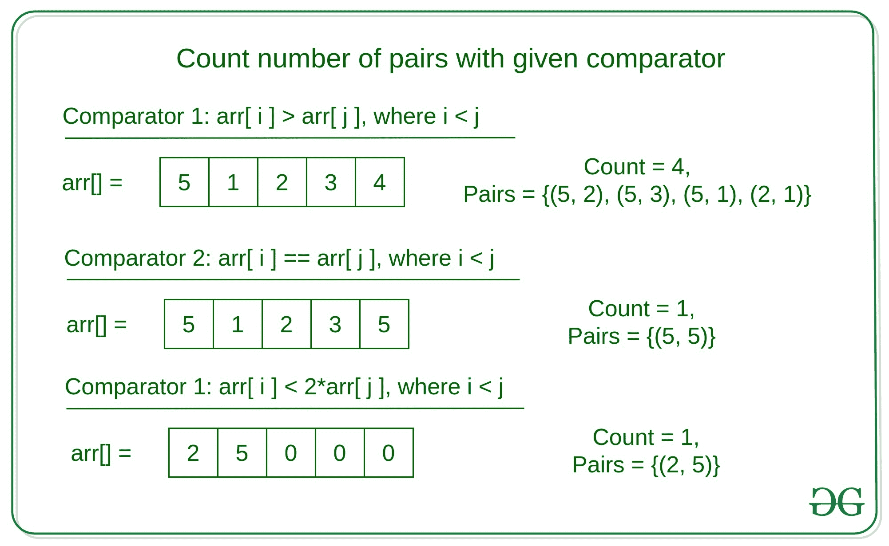

# 用给定的比较器

计算对的数量

> 原文:[https://www . geesforgeks . org/count-给定比较器的配对数/](https://www.geeksforgeeks.org/count-number-of-pairs-with-the-given-comparator/)

给定一个数组 **arr[]** ，任务是用任何自定义比较器计算每个元素右边的对(arr[i]，arr[j])的数量。

比较器可以是任何类型，下面给出了其中一些–

```
arr[i] > arr[j],    where i < j
arr[i] < arr[j],    where i  2 * arr[j], where i < j
```

**示例:**

> **输入:** arr[] = {5，4，3，2，1}，comp = arr[i] > arr[j]
> **输出:** 10
> **解释:**
> 有 10 个这样的对，其中右元素小于左元素–
> {(5，4)，(5，3)，(5，2)，(5，1)，(4，3)，(4，2)，(4，1)，(3，(2)，(3，1)，(3)，(3，1)
> 
> **输入:** arr[] = {3，4，3}，comp = arr[i] == arr[j]
> **输出:** 1
> **解释:**
> 只有一个这样的对，使得元素相等。也就是(3，3)



**天真的解决方案:**迭代每对元素，使得 **i < j** 并检查每对自定义比较器是否为真。如果是，则增加计数。
**时间复杂度:** O(N <sup>2</sup> )

**高效方法:**想法是定制[合并排序](https://www.geeksforgeeks.org/merge-sort/)，在合并两个子数组时计算这样的对。每个阵列都有两种类型的计数，即–

*   **阵列间对:**存在于左子阵列本身的对。
*   **阵列内对:**出现在右子阵列中的对。

对于左子阵列，计数可以从下到上递归计算，而主要任务是计数阵列内对。

因此，此类配对总数可定义为–

```
Total Pairs = Inter-Array pairs in Left Sub-array +
      Inter-Array pairs in Right Sub-array +
      Intra-Array pairs from left to right sub-array 
```

下面是从左子阵列到右子阵列的阵列内对的图示–

*   **基本情况:**这个问题的基本情况是两个子阵列中只有一个元素，我们想要检查阵列内对。然后，检查这两个元素是否形成一个这样的对，然后增加计数，并将较小的元素放在其位置上。

```
if start1 == end1 and start2 == end2:
    if compare(arr, start1, start2):
        c += 1
```

*   **递归情况:**这个问题可以根据比较器函数分为三种类型–
    1.  当对之间的比较运算符大于或等于时。
    2.  当对之间的比较运算符小于或等于时。
    3.  当对之间的比较运算符等于。

因此，这三种情况都可以针对这种对单独计算。

*   **情况 1:** 如果大于或等于，如果我们找到任何这样的对，那么该子阵列右边的所有元素也将与当前元素形成对。因此这种对的计数增加左子阵列中剩余的元素数量。

```
if compare(arr, start1, start2):
    count += end1 - start1 + 1
```

*   **情况 2:** 如果小于或等于，如果我们找到任何这样的对，那么该子阵列右侧的所有元素也将与当前元素形成对。因此这种对的计数增加了右子阵列中剩余的元素数量。

```
if compare(arr, start1, start2):
    count += end2 - start2 + 1
```

*   **情况 3:** 在情况等于的情况下，如果我们找到任何这样的对，那么我们试图借助于 [while 循环](https://www.geeksforgeeks.org/loops-in-c-and-cpp/)在左子阵列中找到所有这样的对。在每个这样的可能对中，将计数增加 1。

```
if compare(arr, start1, start2):
    while compare(arr, start1, start2):
        count += 1
        start1 += 1
```

*   最后，合并两个子阵列，就像在[合并排序](https://www.geeksforgeeks.org/merge-sort/)中一样。

**以下是上述方法的实现:**

## C++

```
// C++ implementation to find the
// elements on the right with the given
// custom comparator

#include <bits/stdc++.h>

using namespace std;

// comparator to check
// if two elements are equal
bool compare(int arr[], int s1, int s2){
    if (arr[s1] > arr[s2]){
        return true;
    }
    else{
        return false;
    }
}

// Function to find the Intra-Array
// Count in the two subarrays
int findIntraArrayCount(int arr[], int s1,
       int e1, int s2, int e2, int g){

    // Base Case
    if (s1 == e1 && s2 == e2){
        int c = 0;
        if (compare(arr, s1, s2)){
            c += 1;
        }
        if (arr[s1] > arr[s2]){
            int temp = arr[s1];
            arr[s1] = arr[s2];
            arr[s2] = temp;
        }
        return c;
    }

    // Variable for keeping
    // the count of the pair
    int c = 0;
    int s = s1, e = e2, s3 = s1;
    int e3 = e1, s4 = s2, e4 = e2;

    while (s1 <= e1 && s2 <= e2){

        // Condition when we have to use the
        // Greater than comparator
        if (g == 1){
            if (compare(arr, s1, s2)){
                c += e1 - s1 + 1;
                s2 += 1;
            }
            else{
                s1 += 1;
            }
        }

        // Condition when we have to use the
        // Less than comparator
        else if (g == 0){
            if (compare(arr, s1, s2)){
                c += e2 - s2 + 1;
                s1 += 1;
            }
            else {
                s2 += 1;
            }
        }

        // Condition when we have to use the
        // Equal to Comparator
        else if (g == -1){
            if (compare(arr, s1, s2)){
                int c1 = 0;
                while (s1 <= e1 &&
                       compare(arr, s1, s2)){
                    c1 += 1;
                    s1 += 1;
                }
                s1 -= 1;
                int c2 = 0;
                while (s2 <= e2 &&
                       compare(arr, s1, s2)){
                    c2 += 1;
                    s2 += 1;
                }
                c += c1 * c2;
            }
            else {
                if (arr[s1] > arr[s2]){
                    s2 += 1;
                }
                else{
                    s1 += 1;
                }
            }
        }
    }
    s1 = s3; e1 = e3;
    s2 = s4; e2 = e4;

    // Array to store
    // the sorted subarray
    vector<int> aux;

    // Merge the two subarrays
    while (s1 <= e1 && s2 <= e2){
        if (arr[s1] <= arr[s2]){
            aux.push_back(arr[s1]);
            s1 += 1;
        }
        else{
            aux.push_back(arr[s2]);
            s2 += 1;
        }
    }

    // Copy subarray 1 elements
    while (s1 <= e1){
        aux.push_back(arr[s1]);
        s1 += 1;
    }

    // Copy subarray 2 elements
    while (s2 <= e2){
        aux.push_back(arr[s2]);
        s2 += 1;
    }

    // Update the original array
    for (int i = s; i <= e; i++){
        arr[i] = aux[i-s];
    }
    return c;
}

// Function to find such pairs with
// any custom comparator function
int findElementsOnRight(int arr[], int s,
                           int e, int g){
    if (s >= e){
        return 0;
    }
    int mid = (s+e)/2;

    // Recursive call for inter-array
    // count of pairs in left subarrays
    int c1 = findElementsOnRight(
                      arr, s, mid, g);

    // Recursive call for inter-array
    // count of pairs in right sub-arrays
    int c2 = findElementsOnRight(
                   arr, mid + 1, e, g);

    // Call for intra-array pairs
    int c3 = findIntraArrayCount(
              arr, s, mid, mid+1, e, g);

    return c1 + c2 + c3;
}

// Driver code
int main()
{
    int arr[] = {4, 3, 2, 1};
    int g = 1;
    cout << findElementsOnRight(arr, 0, 3, g);
    return 0;
}
```

## Java 语言(一种计算机语言，尤用于创建网站)

```
// Java implementation to find the
// elements on the right with the given
// custom comparator

import java.io.*;
import java.lang.*;
import java.util.*;

class GFG {

    // comparator to check
    // if two elements are equal
    public static boolean compare(
          int[] arr, int s1, int s2){
        if (arr[s1] > arr[s2]){
            return true;
        }
        else{
            return false;
        }
    }

    // Function to find the Intra-Array
    // Count in the two subarrays
    public static int findIntraArrayCount(
        int[] arr, int s1, int e1, int s2,
                           int e2, int g){

        // Base Case
        if (s1 == e1 && s2 == e2){
            int c = 0;
            if (compare(arr, s1, s2)){
                c += 1;
            }
            if (arr[s1] > arr[s2]){
                int temp = arr[s1];
                arr[s1] = arr[s2];
                arr[s2] = temp;
            }
            return c;
        }

        // Variable for keeping
        // the count of the pair
        int c = 0;
        int s = s1, e = e2, s3 = s1;
        int e3 = e1, s4 = s2, e4 = e2;

        while (s1 <= e1 && s2 <= e2){

            // Condition when we have to use the
            // Greater than comparator
            if (g == 1){
                if (compare(arr, s1, s2)){
                    c += e1 - s1 + 1;
                    s2 += 1;
                }
                else{
                    s1 += 1;
                }
            }

            // Condition when we have to use the
            // Equal to Comparator
            else if (g == 0){
                if (compare(arr, s1, s2)){
                    c += e2 - s2 + 1;
                    s1 += 1;
                }
                else {
                    s2 += 1;
                }
            }

            // Condition when we have to use the
            // Equal to Comparator
            else if (g == -1){
                if (compare(arr, s1, s2)){
                    int c1 = 0;
                    while (s1 <= e1 &&
                         compare(arr, s1, s2)){
                        c1 += 1;
                        s1 += 1;
                    }
                    s1 -= 1;
                    int c2 = 0;
                    while (s2 <= e2 &&
                          compare(arr, s1, s2)){
                        c2 += 1;
                        s2 += 1;
                    }
                    c += c1 * c2;
                }
                else {
                    if (arr[s1] > arr[s2]){
                        s2 += 1;
                    }
                    else{
                        s1 += 1;
                    }
                }
            }
        }
        s1 = s3; e1 = e3;
        s2 = s4; e2 = e4;

        // Array to store
        // the sorted subarray
        ArrayList<Integer> aux =
                     new ArrayList<>();

        // Merge the two subarrays
        while (s1 <= e1 && s2 <= e2){
            if (arr[s1] <= arr[s2]){
                aux.add(arr[s1]);
                s1 += 1;
            }
            else{
                aux.add(arr[s2]);
                s2 += 1;
            }
        }

        // Copy subarray 1 elements
        while (s1 <= e1){
            aux.add(arr[s1]);
            s1 += 1;
        }

        // Copy subarray 2 elements
        while (s2 <= e2){
            aux.add(arr[s2]);
            s2 += 1;
        }

        // Update the original array
        for (int i = s; i <= e; i++){
            arr[i] = aux.get(i-s);
        }
        return c;
    }

    // Function to find such pairs with
    // any custom comparator function
    public static int findElementsOnRight(
        int[] arr, int s, int e, int g){
        if (s >= e){
            return 0;
        }
        int mid = (s+e)/2;

        // Recursive call for inter-array
        // count of pairs in left subarrays
        int c1 = findElementsOnRight(arr, s,
                                     mid, g);

        // Recursive call for inter-array
        // count of pairs in right sub-arrays
        int c2 = findElementsOnRight(arr, mid + 1,
                                         e, g);

        // Call for intra-array pairs
        int c3 = findIntraArrayCount(arr, s,
                            mid, mid+1, e, g);

        return c1 + c2 + c3;                                  
    }

    // Driver code
    public static void main (String[] args) {
        int[] arr = {4, 3, 2, 1};
        int g = 1;
        System.out.println(
            findElementsOnRight(arr, 0, 3, g));
    }
}
```

## 蟒蛇 3

```
# Python3 implementation to find the
# elements on the right with the given
# custom comparator

import random, math
from copy import deepcopy as dc

# comparator to check
# if two elements are equal
def compare(arr, s1, s2):
    if arr[s1] > arr[s2]:
        return True
    else:
        return False

# Function to find the Intra-Array
# Count in the two subarrays
def findIntraArrayCount(arr, s1, \
                e1, s2, e2, g):

    # Base Case
    if s1 == e1 and s2 == e2:
        c = 0
        if compare(arr, s1, s2):
            c += 1
        if arr[s1] > arr[s2]:
            arr[s1], arr[s2] = arr[s2], arr[s1]
        return c

    # Variable for keeping
    # the count of the pair
    c = 0

    # Total subarray length
    s = dc(s1); e = dc(e2)

    # length of subarray 1
    s3 = dc(s1); e3 = dc(e1)

    # length of subarray 2
    s4 = dc(s2); e4 = dc(e2)

    while s1 <= e1 and s2 <= e2:

        # Condition when we have to use the
        # Greater than comparator
        if g == 1:
            if compare(arr, s1, s2):
                c += e1 - s1 + 1
                s2 += 1
            else:
                s1 += 1

        # Condition when we have to use the
        # Less than comparator
        elif g == 0:
            if compare(arr, s1, s2):
                c += e2 - s2 + 1
                s1 += 1
            else:
                s2 += 1

        # Condition when we have to use the
        # Equal to Comparator
        elif g == -1:
            if compare(arr, s1, s2):
                c1 = 0
                while s1 <= e1 and\
                   compare(arr, s1, s2):
                    c1 += 1
                    s1 += 1
                s1 -= 1
                c2 = 0
                while s2 <= e2 and\
                    compare(arr, s1, s2):
                    c2 += 1
                    s2 += 1
                c += c1 * c2
            else:
                if arr[s1] > arr[s2]:
                    s2 += 1
                else:
                    s1 += 1

    s1 = dc(s3); e1 = dc(e3)

    s2 = dc(s4); e2 = dc(e4)

    # Array to store the sorted subarray
    aux = []

    # Merge the two subarrays
    while s1 <= e1 and s2 <= e2:
        if arr[s1] <= arr[s2]:
            aux.append(arr[s1])
            s1 += 1
        else:
            aux.append(arr[s2])
            s2 += 1

    # Copy subarray 1 elements
    while s1 <= e1:
        aux.append(arr[s1])
        s1 += 1

    # Copy subarray 2 elements
    while s2 <= e2:
        aux.append(arr[s2])
        s2 += 1

    # Update the original array
    for i in range(s, e + 1):
        arr[i] = aux[i-s]
    return c

# Function to find such pairs with
# any custom comparator function
def findElementsOnRight(arr, s, e, g):
    if s >= e:
        return 0
    mid = (s + e)//2

    # Recursive call for inter-array
    # count of pairs in left subarrays
    c1 = findElementsOnRight(arr, s, \
                            mid, g)

    # Recursive call for inter-array
    # count of pairs in right sub-arrays
    c2 = findElementsOnRight(arr, mid + 1, \
                                e, g)

    # Call for intra-array pairs
    c3 = findIntraArrayCount(arr, s, mid, \
                            mid + 1, e, g)
    return c1 + c2 + c3

# Driver Code
if __name__ == "__main__":
    arr = [4, 3, 2, 1]
    g = 1
    out = findElementsOnRight(arr, 0, \
                        len(arr)-1, g)
    print(out)
```

## C#

```
// C# implementation to find the 
// elements on the right with the
// given custom comparator 
using System;
using System.Collections.Generic;

class GFG{

// comparator to check 
// if two elements are equal 
public static bool compare(int[] arr, int s1,
                                      int s2)
{
    if (arr[s1] > arr[s2])
    {
        return true;
    }
    else
    {
        return false;
    }
}

// Function to find the Intra-Array 
// Count in the two subarrays 
public static int findIntraArrayCount(int[] arr, int s1,
                                      int e1, int s2, 
                                      int e2, int g)
{

    // Base Case
    if (s1 == e1 && s2 == e2)
    {
        int cc = 0;
        if (compare(arr, s1, s2))
        {
            cc += 1;
        }
        if (arr[s1] > arr[s2])
        {
            int temp = arr[s1];
            arr[s1] = arr[s2];
            arr[s2] = temp;
        }
        return cc;
    }

    // Variable for keeping 
    // the count of the pair
    int c = 0;
    int s = s1, e = e2, s3 = s1;
    int e3 = e1, s4 = s2, e4 = e2;

    while (s1 <= e1 && s2 <= e2)
    {

        // Condition when we have to use the 
        // Greater than comparator
        if (g == 1)
        {
            if (compare(arr, s1, s2))
            {
                c += e1 - s1 + 1;
                s2 += 1;
            }
            else
            {
                s1 += 1;
            }
        }

        // Condition when we have to use the 
        // Equal to Comparator 
        else if (g == 0)
        {
            if (compare(arr, s1, s2))
            {
                c += e2 - s2 + 1;
                s1 += 1;
            }
            else
            {
                s2 += 1;
            }
        }

        // Condition when we have to use the 
        // Equal to Comparator 
        else if (g == -1)
        {
            if (compare(arr, s1, s2))
            {
                int c1 = 0;
                while (s1 <= e1 && 
                       compare(arr, s1, s2))
                {
                    c1 += 1;
                    s1 += 1;
                }
                s1 -= 1;
                int c2 = 0;
                while (s2 <= e2 && 
                       compare(arr, s1, s2))
                {
                    c2 += 1;
                    s2 += 1;
                }
                c += c1 * c2;
            }
            else
            {
                if (arr[s1] > arr[s2])
                {
                    s2 += 1;
                }
                else
                {
                    s1 += 1;
                }
            }
        }
    }
    s1 = s3; e1 = e3;
    s2 = s4; e2 = e4;

    // Array to store 
    // the sorted subarray
    List<int> aux = new List<int>();

    // Merge the two subarrays
    while (s1 <= e1 && s2 <= e2)
    {
        if (arr[s1] <= arr[s2])
        {
            aux.Add(arr[s1]);
            s1 += 1;
        }
        else
        {
            aux.Add(arr[s2]);
            s2 += 1;
        }
    }

    // Copy subarray 1 elements 
    while (s1 <= e1)
    {
        aux.Add(arr[s1]);
        s1 += 1;
    }

    // Copy subarray 2 elements
    while (s2 <= e2)
    {
        aux.Add(arr[s2]);
        s2 += 1;
    }

    // Update the original array
    for(int i = s; i <= e; i++)
    {
        arr[i] = aux[i-s];
    }
    return c;
}

// Function to find such pairs with 
// any custom comparator function 
public static int findElementsOnRight(int[] arr, int s,
                                      int e, int g)
{
    if (s >= e)
    {
        return 0;
    }
    int mid = (s + e) / 2;

    // Recursive call for inter-array 
    // count of pairs in left subarrays
    int c1 = findElementsOnRight(arr, s, 
                                 mid, g);

    // Recursive call for inter-array 
    // count of pairs in right sub-arrays 
    int c2 = findElementsOnRight(arr, mid + 1, 
                                   e, g);

    // Call for intra-array pairs 
    int c3 = findIntraArrayCount(arr, s, mid,
                                 mid + 1, e, g);

    return c1 + c2 + c3;                                   
}

// Driver code
static public void Main()
{
    int[] arr = { 4, 3, 2, 1 };
    int g = 1;

    Console.WriteLine(findElementsOnRight(
        arr, 0, 3, g));
}
}

// This code is contributed by offbeat
```

## java 描述语言

```
<script>
// Javascript implementation to find the
// elements on the right with the given
// custom comparator

// comparator to check
// if two elements are equal
function compare(arr, s1, s2) {
    if (arr[s1] > arr[s2]) {
        return true;
    }
    else {
        return false;
    }
}

// Function to find the Intra-Array
// Count in the two subarrays
function findIntraArrayCount(arr, s1, e1, s2, e2, g) {

    // Base Case
    if (s1 == e1 && s2 == e2) {
        let c = 0;
        if (compare(arr, s1, s2)) {
            c += 1;
        }
        if (arr[s1] > arr[s2]) {
            let temp = arr[s1];
            arr[s1] = arr[s2];
            arr[s2] = temp;
        }
        return c;
    }

    // Variable for keeping
    // the count of the pair
    let c = 0;
    let s = s1, e = e2, s3 = s1;
    let e3 = e1, s4 = s2, e4 = e2;

    while (s1 <= e1 && s2 <= e2) {

        // Condition when we have to use the
        // Greater than comparator
        if (g == 1) {
            if (compare(arr, s1, s2)) {
                c += e1 - s1 + 1;
                s2 += 1;
            }
            else {
                s1 += 1;
            }
        }

        // Condition when we have to use the
        // Less than comparator
        else if (g == 0) {
            if (compare(arr, s1, s2)) {
                c += e2 - s2 + 1;
                s1 += 1;
            }
            else {
                s2 += 1;
            }
        }

        // Condition when we have to use the
        // Equal to Comparator
        else if (g == -1) {
            if (compare(arr, s1, s2)) {
                let c1 = 0;
                while (s1 <= e1 &&
                    compare(arr, s1, s2)) {
                    c1 += 1;
                    s1 += 1;
                }
                s1 -= 1;
                let c2 = 0;
                while (s2 <= e2 &&
                    compare(arr, s1, s2)) {
                    c2 += 1;
                    s2 += 1;
                }
                c += c1 * c2;
            }
            else {
                if (arr[s1] > arr[s2]) {
                    s2 += 1;
                }
                else {
                    s1 += 1;
                }
            }
        }
    }
    s1 = s3; e1 = e3;
    s2 = s4; e2 = e4;

    // Array to store
    // the sorted subarray
    let aux = new Array();

    // Merge the two subarrays
    while (s1 <= e1 && s2 <= e2) {
        if (arr[s1] <= arr[s2]) {
            aux.push(arr[s1]);
            s1 += 1;
        }
        else {
            aux.push(arr[s2]);
            s2 += 1;
        }
    }

    // Copy subarray 1 elements
    while (s1 <= e1) {
        aux.push(arr[s1]);
        s1 += 1;
    }

    // Copy subarray 2 elements
    while (s2 <= e2) {
        aux.push(arr[s2]);
        s2 += 1;
    }

    // Update the original array
    for (let i = s; i <= e; i++) {
        arr[i] = aux[i - s];
    }
    return c;
}

// Function to find such pairs with
// any custom comparator function
function findElementsOnRight(arr, s, e, g) {
    if (s >= e) {
        return 0;
    }
    let mid = Math.floor((s + e) / 2);

    // Recursive call for inter-array
    // count of pairs in left subarrays
    let c1 = findElementsOnRight(
        arr, s, mid, g);

    // Recursive call for inter-array
    // count of pairs in right sub-arrays
    let c2 = findElementsOnRight(
        arr, mid + 1, e, g);

    // Call for intra-array pairs
    let c3 = findIntraArrayCount(
        arr, s, mid, mid + 1, e, g);

    return c1 + c2 + c3;
}

// Driver code

let arr = [4, 3, 2, 1];
let g = 1;
document.write(findElementsOnRight(arr, 0, 3, g));

// This code is contributed by gfgking
</script>
```

**Output:** 

```
6
```

**时间复杂度:**上述方法耗时 O(N*logN)。
**辅助空间:** O(N)