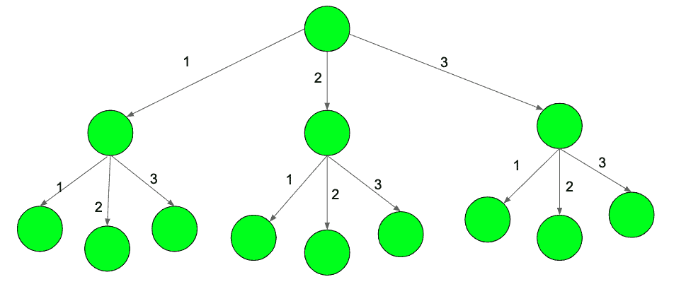

# 计算权重正好为 X 且至少有一条边的权重为 M 的路径数

> 原文:[https://www . geeksforgeeks . org/count-path-number-of-this-this-weight-is-x-and-至少有一个权重边缘-m/](https://www.geeksforgeeks.org/count-number-of-paths-whose-weight-is-exactly-x-and-has-at-least-one-edge-of-weight-m/)

给定一棵无限的树和三个数字 N，M 和 X，每个节点正好有 N 个子节点。每条边的权重为 1、2、3、4..n .任务是找出权值正好为 X 且权值最小为 M 的一条边的路径的个数。



上图显示了直到级别-3 和 N = 3 的树。

**示例:**

```
Input: N = 3, M = 2, X = 3
Output: 2
The path 1-2 and 2-1 in the image above 

Input:  N = 2, M = 1, X = 4
Output:  4 
```

**方法:**使用[动态规划](https://www.geeksforgeeks.org/dynamic-programming/)和[记忆](https://www.geeksforgeeks.org/memoization-1d-2d-and-3d/)可以解决问题。我们将使用自上而下的方法来解决这个问题。从根开始递归，sum 最初为 X，递归遍历所有可能的路径(从 1 到 N)。如果节点等于 M，那么第二个参数变为真，否则它保持上一次调用中传递的值不变。将该值存储在 DP[][]表中，以避免两次访问相同的状态。

下面是上述方法的实现。

## C++

```
// C++ program to count the number of paths
#include <bits/stdc++.h>
using namespace std;
#define max 4
#define c 2

// Function to find the number of paths
int countPaths(int sum, int get, int m, int n, int dp[])
{

    // If the summation is more than X
    if (sum < 0)
        return 0;

    // If exactly X weights have reached
    if (sum == 0)
        return get;

    // Already visited
    if (dp[sum][get] != -1)
        return dp[sum][get];

    // Count paths
    int res = 0;

    // Traverse in all paths
    for (int i = 1; i <= n; i++) {

        // If the edge weight is M
        if (i == m)
            res += countPaths(sum - i, 1, m, n, dp);
        else // Edge's weight is not M
            res += countPaths(sum - i, get, m, n, dp);
    }

    dp[sum][get] = res;

    return dp[sum][get];
}

// Driver Code
int main()
{
    int n = 3, m = 2, x = 3;

    int dp[max + 1];

    // Initialized the DP array with -1
    for (int i = 0; i <= max; i++)
        for (int j = 0; j < 2; j++)
            dp[i][j] = -1;

    // Function to count paths
    cout << countPaths(x, 0, m, n, dp);
}
```

## Java 语言(一种计算机语言，尤用于创建网站)

```
// Java program to count the number of paths

public class GFG{

    static int max = 4 ;
    static int  c = 2 ;

    // Function to find the number of paths
    static int countPaths(int sum, int get, int m, int n, int dp[][])
    {

        // If the summation is more than X
        if (sum < 0)
            return 0;

        // If exactly X weights have reached
        if (sum == 0)
            return get;

        // Already visited
        if (dp[sum][get] != -1)
            return dp[sum][get];

        // Count paths
        int res = 0;

        // Traverse in all paths
        for (int i = 1; i <= n; i++) {

            // If the edge weight is M
            if (i == m)
                res += countPaths(sum - i, 1, m, n, dp);
            else // Edge's weight is not M
                res += countPaths(sum - i, get, m, n, dp);
        }

        dp[sum][get] = res;

        return dp[sum][get];
    }

    // Driver Code
    public static void main(String []args)
    {
        int n = 3, m = 2, x = 3;

        int dp[][] = new int[max + 1][2];

        // Initialized the DP array with -1
        for (int i = 0; i <= max; i++)
            for (int j = 0; j < 2; j++)
                dp[i][j] = -1;

        // Function to count paths
        System.out.println(countPaths(x, 0, m, n, dp));
    }
    // This code is contributed by Ryuga
}
```

## 蟒蛇 3

```
# Python3 program to count the number of paths
Max = 4
c = 2

# Function to find the number of paths
def countPaths(Sum, get, m, n, dp):

    # If the Summation is more than X
    if (Sum < 0):
        return 0

    # If exactly X weights have reached
    if (Sum == 0):
        return get

    # Already visited
    if (dp[Sum][get] != -1):
        return dp[Sum][get]

    # Count paths
    res = 0

    # Traverse in all paths
    for i in range(1, n + 1):

        # If the edge weight is M
        if (i == m):
            res += countPaths(Sum - i, 1, m, n, dp)
        else: # Edge's weight is not M
            res += countPaths(Sum - i, get, m, n, dp)

    dp[Sum][get] = res

    return dp[Sum][get]

# Driver Code
n = 3
m = 2
x = 3
dp = [[-1 for i in range(2)]
          for i in range(Max + 1)]

# Initialized the DP array with -1
for i in range(Max + 1):
    for j in range(2):
        dp[i][j] = -1

# Function to count paths
print(countPaths(x, 0, m, n, dp))

# This code is contributed by Mohit kumar 29
```

## C#

```
// C# program to count the number of paths
using System;

class GFG
{
    static int max = 4 ;
    static int c = 2 ;

    // Function to find the number of paths
    static int countPaths(int sum, int get, int m,
                          int n, int[, ] dp)
    {

        // If the summation is more than X
        if (sum < 0)
            return 0;

        // If exactly X weights have reached
        if (sum == 0)
            return get;

        // Already visited
        if (dp[sum, get] != -1)
            return dp[sum, get];

        // Count paths
        int res = 0;

        // Traverse in all paths
        for (int i = 1; i <= n; i++)
        {

            // If the edge weight is M
            if (i == m)
                res += countPaths(sum - i, 1, m, n, dp);
            else // Edge's weight is not M
                res += countPaths(sum - i, get, m, n, dp);
        }

        dp[sum, get] = res;

        return dp[sum, get];
    }

    // Driver Code
    public static void Main()
    {
        int n = 3, m = 2, x = 3;

        int[,] dp = new int[max + 1, 2];

        // Initialized the DP array with -1
        for (int i = 0; i <= max; i++)
            for (int j = 0; j < 2; j++)
                dp[i, j] = -1;

        // Function to count paths
        Console.WriteLine(countPaths(x, 0, m, n, dp));
    }
}

// This code is contributed by Akanksha Rai
```

## 服务器端编程语言（Professional Hypertext Preprocessor 的缩写）

```
<?php

// PHP program to count the number of paths

$max = 4;
$c = 2;

// Function to find the number of paths
function countPaths($sum, $get, $m, $n, &$dp)
{
    global $max,$c;
    // If the summation is more than X
    if ($sum < 0)
        return 0;

    // If exactly X weights have reached
    if ($sum == 0)
        return $get;

    // Already visited
    if ($dp[$sum][$get] != -1)
        return $dp[$sum][$get];

    // Count paths
    $res = 0;

    // Traverse in all paths
    for ($i = 1; $i <= $n; $i++)
    {

        // If the edge weight is M
        if ($i == $m)
            $res += countPaths($sum - $i, 1, $m, $n, $dp);
        else // Edge's weight is not M
            $res += countPaths($sum - $i, $get, $m, $n, $dp);
    }

    $dp[$sum][$get] = $res;

    return $dp[$sum][$get];
}

// Driver Code

    $n = 3;
    $m = 2;
    $x = 3;

    $dp = array_fill(0,$max + 1,NULL);

    // Initialized the DP array with -1
    for ($i = 0; $i <= $max; $i++)
        for ($j = 0; $j < 2; $j++)
            $dp[$i][$j] = -1;

    // Function to count paths
    echo countPaths($x, 0, $m, $n, $dp);

    // This code is contributed by ChitraNayal
?>
```

## java 描述语言

```
<script>

// Javascript program to count the number of paths
let max = 4;
let c = 2;

// Function to find the number of paths
function countPaths(sum, get, m, n, dp)
{

    // If the summation is more than X
    if (sum < 0)
        return 0;

    // If exactly X weights have reached
    if (sum == 0)
        return get;

    // Already visited
    if (dp[sum][get] != -1)
        return dp[sum][get];

    // Count paths
    let res = 0;

    // Traverse in all paths
    for(let i = 1; i <= n; i++)
    {

        // If the edge weight is M
        if (i == m)
            res += countPaths(sum - i, 1,
                              m, n, dp);

        // Edge's weight is not M
        else
            res += countPaths(sum - i, get,
                              m, n, dp);
    }
    dp[sum][get] = res;

    return dp[sum][get];
}

// Driver Code
let  n = 3, m = 2, x = 3;
let dp = new Array(max + 1);

// Initialized the DP array with -1
for(let i = 0; i <= max; i++)
{
    dp[i] = new Array(2)
    for(let j = 0; j < 2; j++)
        dp[i][j] = -1;
}

// Function to count paths
document.write(countPaths(x, 0, m, n, dp));

// This code is contributed by avanitrachhadiya2155

</script>
```

**Output:** 

```
2
```