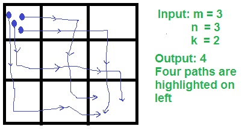

# 计算最多 k 圈的路径数

> 原文:[https://www . geesforgeks . org/count-带 k 圈的路径数/](https://www.geeksforgeeks.org/count-number-of-paths-with-k-turns/)

给定一个“m x n”矩阵，计算从左上方到达右下方的路径数，允许最大 k 圈。

**什么是转弯？**如果我们沿着行移动，现在沿着列移动，则一个移动被认为是转弯。或者我们沿着列移动，现在沿着行移动。

```
There are two possible scenarios when a turn can occur
at point (i, j):

Turns Right: (i-1, j)  ->  (i, j)  ->  (i, j+1)
                      Down        Right

Turns Down:  (i, j-1)  ->  (i, j)  ->  (i+1, j)
                     Right        Down
```

**示例:**

```
Input:  m = 3, n = 3, k = 2
Output: 4
See below diagram for four paths with 
maximum 2 turns.

Input:  m = 3, n = 3, k = 1
Output: 2 

```

[](https://media.geeksforgeeks.org/wp-content/cdn-uploads/pathswithkturns.png)

**我们强烈建议你尽量减少浏览器，先自己试试这个。**
这个问题可以用下面的递归公式递归计算。

```
countPaths(i, j, k): Count of paths to reach (i,j) from (0, 0)
countPathsDir(i, j, k, 0): Count of paths if we reach (i, j) 
                           along row. 
countPathsDir(i, j, k, 1): Count of paths if we reach (i, j) 
                           along column. 
The fourth parameter in countPathsDir() indicates direction.

Value of countPaths() can be written as:
countPaths(i, j, k) = countPathsDir(i, j, k, 0) + 
                      countPathsDir(i, j, k, 1) 

And value of  countPathsDir() can be recursively defined as:

// Base cases

// If current direction is along row
If (d == 0) 
  // Count paths for two cases
  // 1) We reach here through previous row.
  // 2) We reach here through previous column, so number of 
  //    turns k reduce by 1.
  countPathsDir(i, j, k, d) = countPathsUtil(i, j-1, k, d) +
                              countPathsUtil(i-1, j, k-1, !d);

// If current direction is along column
Else 
  // Similar to above
  countPathsDir(i, j, k, d) =  countPathsUtil(i-1, j, k, d) +
                               countPathsUtil(i, j-1, k-1, !d);

```

我们可以使用动态规划在多项式时间内解决这个问题。想法是使用一个 4 维表 dp[m][n][k][d]，其中 m 是行数，n 是列数，k 是允许的圈数，d 是方向。

下面是基于动态编程的实现。

## C++

```
// C++ program to count number of paths with maximum
// k turns allowed
#include<bits/stdc++.h>
using namespace std;
#define MAX 100

// table to store results of subproblems
int dp[MAX][MAX][MAX][2];

// Returns count of paths to reach (i, j) from (0, 0)
// using at-most k turns. d is current direction
// d = 0 indicates along row, d = 1 indicates along
// column.
int countPathsUtil(int i, int j, int k, int d)
{
    // If invalid row or column indexes
    if (i < 0 || j < 0)
        return 0;

    // If current cell is top left itself
    if (i == 0 && j == 0)
        return 1;

    // If 0 turns left
    if (k == 0)
    {
        // If direction is row, then we can reach here 
        // only if direction is row and row is 0.
        if (d == 0 && i == 0) return 1;

        // If direction is column, then we can reach here 
        // only if direction is column and column is 0.
        if (d == 1 && j == 0) return 1;

        return 0;
    }

    // If this subproblem is already evaluated
    if (dp[i][j][k][d] != -1)
        return dp[i][j][k][d];

    // If current direction is row, then count paths for two cases
    // 1) We reach here through previous row.
    // 2) We reach here through previous column, so number of 
    //    turns k reduce by 1.
    if (d == 0)
      return dp[i][j][k][d] = countPathsUtil(i, j-1, k, d) +
                              countPathsUtil(i-1, j, k-1, !d);

    // Similar to above if direction is column
    return dp[i][j][k][d] =  countPathsUtil(i-1, j, k, d) +
                             countPathsUtil(i, j-1, k-1, !d);
}

// This function mainly initializes 'dp' array as -1 and calls
// countPathsUtil()
int countPaths(int i, int j, int k)
{
    // If (0, 0) is target itself
    if (i == 0 && j == 0)
          return 1;

    // Initialize 'dp' array
    memset(dp, -1, sizeof dp);

    // Recur for two cases: moving along row and along column
    return countPathsUtil(i-1, j, k, 1) +  // Moving along row
           countPathsUtil(i, j-1, k, 0); // Moving along column
}

// Driver program
int main()
{
    int m = 3, n = 3, k = 2;
    cout << "Number of paths is "
         << countPaths(m-1, n-1, k) << endl;
    return 0;
}
```

## Java 语言(一种计算机语言，尤用于创建网站)

```
// Java program to count number of paths 
// with maximum k turns allowed 
import java.util.*;
class GFG
{
static int MAX = 100;

// table to store results of subproblems 
static int [][][][]dp = new int[MAX][MAX][MAX][2]; 

// Returns count of paths to reach (i, j) from (0, 0) 
// using at-most k turns. d is current direction 
// d = 0 indicates along row, d = 1 indicates along 
// column. 
static int countPathsUtil(int i, int j, int k, int d) 
{ 
    // If invalid row or column indexes 
    if (i < 0 || j < 0) 
        return 0; 

    // If current cell is top left itself 
    if (i == 0 && j == 0) 
        return 1; 

    // If 0 turns left 
    if (k == 0) 
    { 
        // If direction is row, then we can reach here 
        // only if direction is row and row is 0. 
        if (d == 0 && i == 0) return 1; 

        // If direction is column, then we can reach here 
        // only if direction is column and column is 0. 
        if (d == 1 && j == 0) return 1; 

        return 0; 
    } 

    // If this subproblem is already evaluated 
    if (dp[i][j][k][d] != -1) 
        return dp[i][j][k][d]; 

    // If current direction is row, 
    // then count paths for two cases 
    // 1) We reach here through previous row. 
    // 2) We reach here through previous column, 
    // so number of turns k reduce by 1. 
    if (d == 0) 
    return dp[i][j][k][d] = countPathsUtil(i, j - 1, k, d) + 
                            countPathsUtil(i - 1, j, k - 1, d == 1 ? 0 : 1); 

    // Similar to above if direction is column 
    return dp[i][j][k][d] = countPathsUtil(i - 1, j, k, d) + 
                            countPathsUtil(i, j - 1, k - 1, d == 1 ? 0 : 1); 
} 

// This function mainly initializes 'dp' array 
// as -1 and calls countPathsUtil() 
static int countPaths(int i, int j, int k) 
{ 
    // If (0, 0) is target itself 
    if (i == 0 && j == 0) 
        return 1; 

    // Initialize 'dp' array 
    for(int p = 0; p < MAX; p++)
    {
        for(int q = 0; q < MAX; q++)
        {
            for(int r = 0; r < MAX; r++)
                for(int s = 0; s < 2; s++)
                    dp[p][q][r][s] = -1;
        }
    }

    // Recur for two cases: moving along row and along column 
    return countPathsUtil(i - 1, j, k, 1) + // Moving along row 
        countPathsUtil(i, j - 1, k, 0); // Moving along column 
} 

// Driver Code
public static void main(String[] args)
{
    int m = 3, n = 3, k = 2; 
    System.out.println("Number of paths is " + 
                 countPaths(m - 1, n - 1, k)); 
}
}

// This code is contributed by Princi Singh
```

## 蟒蛇 3

```
# Python3 program to count number of paths 
# with maximum k turns allowed
MAX = 100

# table to store results of subproblems
dp = [[[[-1 for col in range(2)]
            for col in range(MAX)] 
            for row in range(MAX)] 
            for row in range(MAX)]

# Returns count of paths to reach 
# (i, j) from (0, 0) using at-most k turns. 
# d is current direction, d = 0 indicates 
# along row, d = 1 indicates along column.
def countPathsUtil(i, j, k, d):

    # If invalid row or column indexes
    if (i < 0 or j < 0):
        return 0

    # If current cell is top left itself
    if (i == 0 and j == 0):
        return 1

    # If 0 turns left
    if (k == 0):

        # If direction is row, then we can reach here 
        # only if direction is row and row is 0.
        if (d == 0 and i == 0):
            return 1

        # If direction is column, then we can reach here 
        # only if direction is column and column is 0.
        if (d == 1 and j == 0):
            return 1

        return 0

    # If this subproblem is already evaluated
    if (dp[i][j][k][d] != -1):
        return dp[i][j][k][d]

    # If current direction is row, 
    # then count paths for two cases
    # 1) We reach here through previous row.
    # 2) We reach here through previous column, 
    # so number of turns k reduce by 1.
    if (d == 0):
        dp[i][j][k][d] = countPathsUtil(i, j - 1, k, d) + \
                         countPathsUtil(i - 1, j, k - 1, not d)
        return dp[i][j][k][d]

    # Similar to above if direction is column
    dp[i][j][k][d] = countPathsUtil(i - 1, j, k, d) + \
                     countPathsUtil(i, j - 1, k - 1, not d)
    return dp[i][j][k][d]

# This function mainly initializes 'dp' array 
# as -1 and calls countPathsUtil()
def countPaths(i, j, k):

    # If (0, 0) is target itself
    if (i == 0 and j == 0):
        return 1

    # Recur for two cases: moving along row
    # and along column
    return countPathsUtil(i - 1, j, k, 1) +\
           countPathsUtil(i, j - 1, k, 0)

# Driver Code
if __name__ == '__main__':
    m = 3
    n = 3
    k = 2
    print("Number of paths is", 
           countPaths(m - 1, n - 1, k))

# This code is contributed by Ashutosh450
```

## C#

```
// C# program to count number of paths 
// with maximum k turns allowed 
using System;

class GFG
{
static int MAX = 100;

// table to store to store results of subproblems 
static int [,,,]dp = new int[MAX, MAX, MAX, 2]; 

// Returns count of paths to reach (i, j) from (0, 0) 
// using at-most k turns. d is current direction 
// d = 0 indicates along row, d = 1 indicates along 
// column. 
static int countPathsUtil(int i, int j, int k, int d) 
{ 
    // If invalid row or column indexes 
    if (i < 0 || j < 0) 
        return 0; 

    // If current cell is top left itself 
    if (i == 0 && j == 0) 
        return 1; 

    // If 0 turns left 
    if (k == 0) 
    { 
        // If direction is row, then we can reach here 
        // only if direction is row and row is 0. 
        if (d == 0 && i == 0) return 1; 

        // If direction is column, then we can reach here 
        // only if direction is column and column is 0. 
        if (d == 1 && j == 0) return 1; 

        return 0; 
    } 

    // If this subproblem is already evaluated 
    if (dp[i, j, k, d] != -1) 
        return dp[i, j, k, d]; 

    // If current direction is row, 
    // then count paths for two cases 
    // 1) We reach here through previous row. 
    // 2) We reach here through previous column, 
    // so number of turns k reduce by 1. 
    if (d == 0) 
    return dp[i, j, k, d] = countPathsUtil(i, j - 1, k, d) + 
                            countPathsUtil(i - 1, j, k - 1,
                                            d == 1 ? 0 : 1); 

    // Similar to above if direction is column 
    return dp[i, j, k, d] = countPathsUtil(i - 1, j, k, d) + 
                            countPathsUtil(i, j - 1, k - 1, 
                                            d == 1 ? 0 : 1); 
} 

// This function mainly initializes 'dp' array 
// as -1 and calls countPathsUtil() 
static int countPaths(int i, int j, int k) 
{ 
    // If (0, 0) is target itself 
    if (i == 0 && j == 0) 
        return 1; 

    // Initialize 'dp' array 
    for(int p = 0; p < MAX; p++)
    {
        for(int q = 0; q < MAX; q++)
        {
            for(int r = 0; r < MAX; r++)
                for(int s = 0; s < 2; s++)
                    dp[p, q, r, s] = -1;
        }
    }

    // Recur for two cases: moving along row and along column 
    return countPathsUtil(i - 1, j, k, 1) + // Moving along row 
           countPathsUtil(i, j - 1, k, 0); // Moving along column 
} 

// Driver Code
public static void Main(String[] args)
{
    int m = 3, n = 3, k = 2; 
    Console.WriteLine("Number of paths is " + 
                countPaths(m - 1, n - 1, k)); 
}
}

// This code is contributed by PrinciRaj1992 
```

**输出:**

```
Number of paths is 4
```

上述解的时间复杂度为 O(m*n*k)

感谢 Gaurav Ahirwar 提出这个解决方案。

如果你发现任何不正确的地方，或者你想分享更多关于上面讨论的话题的信息，请写评论。