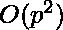
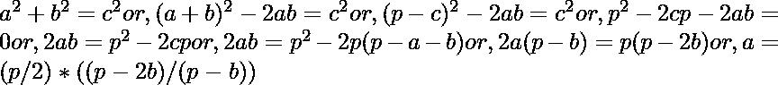

# 计算给定周长下可能的直角三角形数量

> 原文:[https://www . geesforgeks . org/count-给定周长的直角三角形的数量/](https://www.geeksforgeeks.org/count-number-of-right-triangles-possible-with-a-given-perimeter/)

给定周长 P，任务是找出周长等于 P 的直角三角形的可能数量
示例:

```
Input: P = 12
Output: number of right triangles = 1 
The only right angle possible is with sides 
hypotenuse = 5, perpendicular = 4 and base = 3\. 

Input: p = 840
Output: number of right triangles = 8
```

所以目标是找到满足方程 a + b + c = p 和 a<sup>2</sup>+b<sup>2</sup>= c<sup>2</sup>的解的数量。
A **天真的**方法是对 a(1 到 p/2)和 b(a+1 到 p/3)运行两个循环，然后使 c=p-a-b，如果计数增加 1。这需要时间。
一个**有效的**方法可以通过一些代数操作找到:

> 

自 a + c > b 或，p–b > b 或，b < p/2\. Thus iterating b from 1 to p/2, calculating a and storing only the whole number a would give all solutions for a given p. There are no right triangles are possible for odd p as right angle triangles follow the [勾股定理](https://www.geeksforgeeks.org/find-pythagorean-triplet-in-an-unsorted-array/)。使用配对列表存储 a 的值，并在最后返回计数。
以下是上述办法的实施情况。

## C++

```
// C++ program to find the number of
// right triangles with given perimeter
#include<bits/stdc++.h>
using namespace std;

// Function to return the count
int countTriangles(int p)
{
  // making a list to store (a, b) pairs
  vector<pair<int,int>> store;

  // no triangle if p is odd
  if (p % 2 != 0)
    return 0;
  else
  {
    int count = 1;

    for(int b = 1; b < p / 2; b++)
    {
      float a = (float)p / 2.0f * ((float)((float)p -
                                           2.0 * (float)b) /
                                   ((float)p - (float)b));

      int inta = (int)(a);

      if (a == inta)
      {
        // make (a, b) pair in sorted order
        pair<int,int> ab;

        if(inta<b)
        {
          ab = {inta, b};
        }
        else
        {
          ab = {b, inta};
        }

        // check to avoid duplicates
        if(find(store.begin(), store.end(), ab) == store.end())
        {
          count += 1;

          // store the new pair
          store.push_back(ab);
        }
      }

    }
    return count;
  }
}

// Driver Code
int main()
{
  int p = 840;
  cout << "number of right triangles = " << countTriangles(p);
  return 0;
}

// This code is contributed by rutvik_56.
```

## 蟒蛇 3

```
# python program to find the number of
# right triangles with given perimeter

# Function to return the count
def countTriangles(p):

    # making a list to store (a, b) pairs
    store =[]

    # no triangle if p is odd
    if p % 2 != 0 : return 0
    else :
        count = 0
        for b in range(1, p // 2):

            a = p / 2 * ((p - 2 * b) / (p - b))
            inta = int(a)
            if (a == inta ):

                # make (a, b) pair in sorted order
                ab = tuple(sorted((inta, b)))

                # check to avoid duplicates
                if ab not in store :
                    count += 1
                    # store the new pair
                    store.append(ab)
        return count

# Driver Code
p = 840
print("number of right triangles = "+str(countTriangles(p)))
```

**Output:** 

```
number of right triangles = 8
```

**时间复杂度:** O(P)