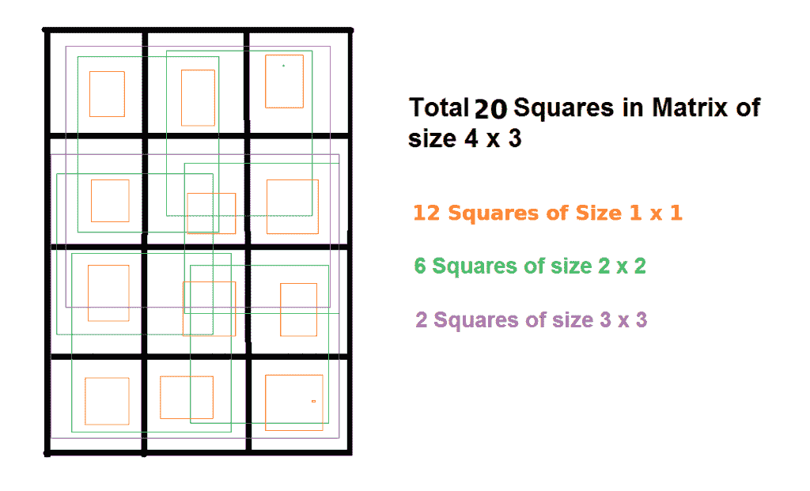

# 计算矩形中的方块数

> 原文:[https://www . geesforgeks . org/count-矩形中的方块数/](https://www.geeksforgeeks.org/count-number-of-squares-in-a-rectangle/)

给定一个 m×n 的矩形，里面有多少个正方形？

**示例:**

```
Input:  m = 2, n = 2
Output: 5
There are 4 squares of size 1x1 + 1 square of size 2x2.

Input: m = 4, n = 3
Output: 20
There are 12 squares of size 1x1 + 
          6 squares of size 2x2 + 
          2 squares of size 3x3.
```



**我们先来解决这个问题对于 m = n，即对于一个正方形:**
对于 m = n = 1，输出:1
对于 m = n = 2，输出:4 + 1【大小为 1×1 的 4 +大小为 2×2 的 1】
对于 m = n = 3， 输出:9 + 4 + 1 [尺寸 1×1 + 4 的 9 尺寸 2×2 + 1 尺寸 3×3 的 1]
对于 m = n = 4，输出 16 + 9 + 4 + 1 [尺寸 1×1 + 9 的 16 尺寸 2×2 + 4 尺寸 3×3 + 1 尺寸 4×4 的 1]
总的来说，好像是 n^2 + (n-1)^2 + … 1 = n(n+1)(2n+1)/6

**让我们在 m 可能不等于 n 时解决这个问题:**
让我们假设 m < = n

从上面的解释，我们知道 m×m 矩阵中的平方数是 m(m+1)(2m+1)/6

当我们增加一列时会发生什么，即 m x (m+1)矩阵中的方块数是多少？

当我们添加一列时，增加的方块数为 m + (m-1) + … + 3 + 2 + 1
【大小为 1×1 + (m-1)的 m 个方块大小为 2×2 + … + 1 的 m×m 个方块】
等于 m(m+1)/2

所以当我们加上(n-m)列时，增加的方块总数是(n-m)*m(m+1)/2。
所以方块总数为 m(m+1)(2m+1)/6 + (n-m)*m(m+1)/2。
用同样的逻辑我们可以证明当 n < = m。

所以，总的来说，

```
Total number of squares = m x (m+1) x (2m+1)/6 + (n-m) x m x (m+1)/2 

when n is larger dimension
```

利用上述矩形逻辑，我们还可以证明一个正方形中的正方形数是 n(n+1)(2n+1)/6

下面是上面公式的实现。

## C++

```
// C++ program to count squares
// in a rectangle of size m x n
#include<iostream>
using namespace std;

// Returns count of all squares
// in a rectangle of size m x n
int countSquares(int m, int n)
{
// If n is smaller, swap m and n
if (n < m)
    swap(m, n);

// Now n is greater dimension,
// apply formula
return m * (m + 1) * (2 * m + 1) /
     6 + (n - m) * m *(m + 1) / 2;
}

// Driver Code
int main()
{
int m = 4, n = 3;
cout << "Count of squares is "
     << countSquares(m, n);
}
```

## C

```
// C program to count squares
// in a rectangle of size m x n

#include <stdio.h>

// Returns count of all squares
// in a rectangle of size m x n
int countSquares(int m, int n)
{
  int temp;
// If n is smaller, swap m and n
  if (n < m)
  {
      temp=n;
      n=m;
      m=temp;
  }
  // Now n is greater dimension,
  // apply formula
  return m * (m + 1) * (2 * m + 1) /
      6 + (n - m) * m *(m + 1)/ 2;
}

// Driver Code
int main()
{
    int m = 4, n = 3;
    printf("Count of squares is %d",countSquares(m, n));
}

// This code is contributed by Hemant Jain.
```

## Java 语言(一种计算机语言，尤用于创建网站)

```
// Java program to count squares
// in a rectangle of size m x n

class GFG
{
    // Returns count of all squares
    // in a rectangle of size m x n
    static int countSquares(int m, int n)
    {
    // If n is smaller, swap m and n
    if (n < m)
    {
        // swap(m, n)
        int temp = m;
        m = n;
        n = temp;
    }

    // Now n is greater dimension,
    // apply formula
    return m * (m + 1) * (2 * m + 1) /
        6 + (n - m) * m * (m + 1) / 2;
    }

    // Driver Code
    public static void main(String[] args)
    {
        int m = 4, n = 3;
        System.out.println("Count of squares is " +
                            countSquares(m, n));
    }
}
```

## 蟒蛇 3

```
# Python3 program to count squares
# in a rectangle of size m x n

# Returns count of all squares
# in a rectangle of size m x n
def countSquares(m, n):

    # If n is smaller, swap m and n
    if(n < m):
        temp = m
        m = n
        n = temp

    # Now n is greater dimension,
    # apply formula
    return ((m * (m + 1) * (2 * m + 1) /
           6 + (n - m) * m * (m + 1) / 2))

# Driver Code
if __name__=='__main__':
    m = 4
    n = 3
    print("Count of squares is "
         ,countSquares(m, n))

# This code is contributed by mits.
```

## C#

```
// C# program to count squares in a rectangle
// of size m x n
using System;

class GFG {

    // Returns count of all squares in a
    // rectangle of size m x n
    static int countSquares(int m, int n)
    {
    // If n is smaller, swap m and n
    if (n < m)
    {
        // swap(m,n)
        int temp = m;
        m = n;
        n = temp;
    }

    // Now n is greater dimension, apply
    // formula
    return m * (m + 1) * (2 * m + 1) / 6 +
               (n - m) * m * (m + 1) / 2;
    }

    // Driver method
    public static void Main()
    {
        int m = 4, n = 3;

        Console.WriteLine("Count of squares is "
                          + countSquares(m, n));
    }
}

//This code is contributed by vt_m.
```

## 服务器端编程语言（Professional Hypertext Preprocessor 的缩写）

```
<?php
// PHP program to count squares
// in a rectangle of size m x n

// Returns count of all squares
// in a rectangle of size m x n
function countSquares($m, $n)
{
    // If n is smaller, swap m and n
    if ($n < $m)
        list($m, $n) = array($n, $m);

    // Now n is greater dimension,
    // apply formula
    return $m * ($m + 1) * (2 * $m + 1) /
       6 + ($n - $m) * $m * ($m + 1) / 2;
}

// Driver Code
$m = 4; $n = 3;
echo("Count of squares is " . countSquares($m, $n));

// This code is contributed by Ajit.
?>
```

## java 描述语言

```
<script>

// javascript program to count squares
// in a rectangle of size m x n

// Returns count of all squares
// in a rectangle of size m x n
function countSquares( m,  n)
{

// If n is smaller, swap m and n
if (n < m)
    [m, n] = [n, m];

// Now n is greater dimension,
// apply formula
return m * (m + 1) * (2 * m + 1) /
    6 + (n - m) * m *(m + 1) / 2;
}

// Driver Code
    let m = 4;
    let n = 3;
document.write("Count of squares is "+countSquares(n, m));

// This code is contributed by jana_sayantan.
</script>
```

**输出:**

```
Count of Squares is 20
```

**备选方案:**

1.  让我们取 m = 2，n = 3；
2.  边 1 的方块数为 6，因为有两种情况，一种是沿水平方向(2)的 1 个单位边的方块，另一种是沿垂直方向(3)的 1 个单位边的方块。给我们 2*3 = 6 个正方形。
3.  当边为 2 个单位时，一种情况将作为 2 个单位的边的正方形，仅沿水平方向的一个位置，第二种情况作为垂直方向的两个位置。所以，方块数=2
4.  所以我们可以推导出，大小为 1*1 的方块数是 m*n，大小为 2*2 的方块数是(n-1)(m-1)。像这样，大小为 n 的方块数将是 1*(m-n+1)。

方块总数的最终公式为 **n*(n+1)(3m-n+1)/6** 。

## C++

```
// C++ program to count squares
// in a rectangle of size m x n
#include <iostream>
using namespace std;

// Returns count of all squares
// in a rectangle of size m x n
int countSquares(int m, int n)
{

    // If n is smaller, swap m and n
    if (n < m) {
        int temp = m;
        m = n;
        n = temp;
    }

    // Now n is greater dimension,
    // apply formula
    return n * (n + 1) * (3 * m - n + 1) / 6;
}

// Driver Code
int main()
{
    int m = 4, n = 3;
    cout << "Count of squares is " << countSquares(m, n);
}

// This code is contributed by 29AjayKumar
```

## C

```
// C program to count squares
// in a rectangle of size m x n

#include <stdio.h>

// Returns count of all squares
// in a rectangle of size m x n
int countSquares(int m, int n)
{

    // If n is smaller, swap m and n
    if (n < m)
    {
        int temp = m;
        m = n;
        n = temp;
    }

    // Now n is greater dimension,
    // apply formula
    return n * (n + 1) * (3 * m - n + 1) / 6;
}

// Driver Code
int main()
{
    int m = 4, n = 3;
    printf("Count of squares is %d",countSquares(m, n));
}

// This code is contributed by Hemant Jain
```

## Java 语言(一种计算机语言，尤用于创建网站)

```
// Java program to count squares
// in a rectangle of size m x n
import java.util.*;

class GFG
{

    // Returns count of all squares
    // in a rectangle of size m x n
    static int countSquares(int m, int n)
    {

        // If n is smaller, swap m and n
        if (n < m)
        {
            int temp = m;
            m = n;
            n = temp;
        }

        // Now n is greater dimension,
        // apply formula
        return n * (n + 1) * (3 * m - n + 1) / 6;
    }

    // Driver Code
    public static void main(String[] args)
    {
        int m = 4;
        int n = 3;
        System.out.print("Count of squares is " +
                             countSquares(m, n));
    }
}

// This code is contributed by 29AjayKumar
```

## 蟒蛇 3

```
# Python3 program to count squares
# in a rectangle of size m x n

# Returns count of all squares
# in a rectangle of size m x n
def countSquares(m, n):

    # If n is smaller, swap m and n
    if(n < m):
        temp = m
        m = n
        n = temp

    # Now n is greater dimension,
    # apply formula
    return n * (n + 1) * (3 * m - n + 1) // 6

# Driver Code
if __name__=='__main__':
    m = 4
    n = 3
    print("Count of squares is",
           countSquares(m, n))

# This code is contributed by AnkitRai01
```

## C#

```
// C# program to count squares
// in a rectangle of size m x n
using System;

class GFG
{

    // Returns count of all squares
    // in a rectangle of size m x n
    static int countSquares(int m, int n)
    {

        // If n is smaller, swap m and n
        if (n < m)
        {
            int temp = m;
            m = n;
            n = temp;
        }

        // Now n is greater dimension,
        // apply formula
        return n * (n + 1) * (3 * m - n + 1) / 6;
    }

    // Driver Code
    public static void Main(String[] args)
    {
        int m = 4;
        int n = 3;
        Console.Write("Count of squares is " +
                          countSquares(m, n));
    }
}

// This code is contributed by Rajput-Ji
```

## java 描述语言

```
<script>

// Javascript program to count squares
// in a rectangle of size m x n

// Returns count of all squares
// in a rectangle of size m x n
function countSquares(m , n)
{

    // If n is smaller, swap m and n
    if (n < m)
    {
        var temp = m;
        m = n;
        n = temp;
    }

    // Now n is greater dimension,
    // apply formula
    return n * (n + 1) * (3 * m - n + 1) / 6;
}

// Driver Code
var m = 4;
var n = 3;

document.write("Count of squares is " +
               countSquares(m, n));

// This code is contributed by shikhasingrajput

</script>
```

**输出:**

```
Count of Squares is 20
```

感谢普拉纳夫提供这一替代解决方案。
如果发现有不正确的地方，或者想分享更多关于上述话题的信息，请写评论。